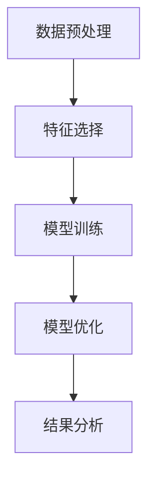
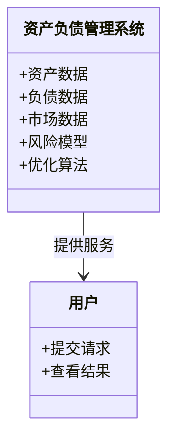
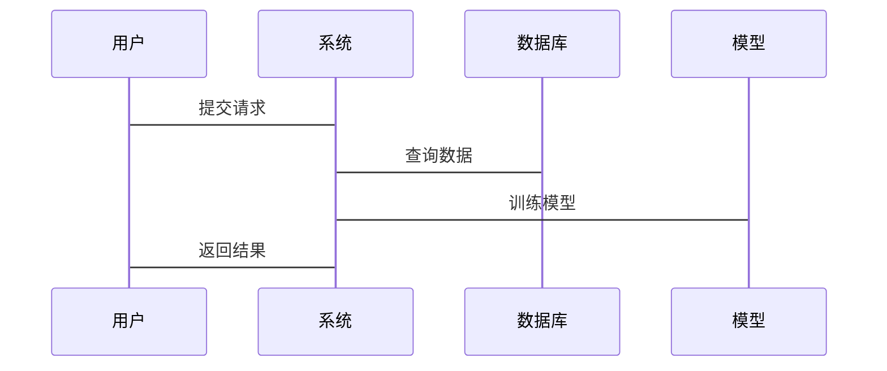

                 


# AI在资产负债管理优化中的应用

> 关键词：人工智能，资产负债管理，风险管理，机器学习，深度学习

> 摘要：本文探讨了人工智能（AI）在资产负债管理优化中的应用，分析了AI技术如何提升资产负债管理的效率和准确性。文章从AI的基本概念、在金融领域的应用背景、核心概念、算法原理、系统架构设计、项目实战以及最佳实践等方面展开，结合实际案例，详细阐述了AI在资产负债管理中的优势和实现方法。

---

# 第1章: AI与资产负债管理概述

## 1.1 资产负债管理的基本概念

### 1.1.1 资产负债管理的定义
资产负债管理是指通过对资产和负债的合理配置和管理，以实现企业或金融机构财务目标的过程。它包括资产的优化配置、负债的合理结构化，以及两者之间的动态平衡。

### 1.1.2 资产负债管理的核心目标
1. **风险控制**：通过合理配置资产和负债，降低企业的财务风险。
2. **资本优化**：在满足风险要求的前提下，最大化资本回报率。
3. **流动性管理**：确保企业在需要时能够获得足够的流动性。

### 1.1.3 资产负债管理的边界与外延
资产负债管理的边界包括企业的财务结构、资本运作、风险承受能力等。其外延涉及金融市场波动、宏观经济政策、企业战略目标等多个方面。

## 1.2 AI技术的基本概念

### 1.2.1 人工智能的定义
人工智能（AI）是指模拟人类智能的计算机系统，包括学习、推理、自适应等能力。

### 1.2.2 机器学习的核心原理
机器学习是一种通过数据训练模型，使其能够从数据中学习并做出预测或决策的技术。其核心在于通过数据优化模型参数，以实现对未知数据的准确预测。

### 1.2.3 深度学习的特征与优势
深度学习是一种基于人工神经网络的机器学习方法，其优势在于能够处理非结构化数据（如文本、图像等），并通过多层网络结构提取数据特征。

## 1.3 AI在资产负债管理中的应用背景

### 1.3.1 传统资产负债管理的局限性
1. **人工计算复杂**：传统资产负债管理依赖人工计算，效率低且容易出错。
2. **风险预测不足**：传统方法难以准确预测市场波动带来的风险。
3. **数据处理能力有限**：传统方法难以处理海量数据，导致决策不够精准。

### 1.3.2 AI技术如何解决资产负债管理问题
AI技术通过自动化数据处理、实时风险预测和智能决策优化，显著提升了资产负债管理的效率和准确性。

### 1.3.3 AI在金融领域的应用现状
目前，AI技术已经在金融领域的风险管理、投资决策、信用评估等方面得到了广泛应用，并取得了显著成效。

## 1.4 本章小结
本章介绍了资产负债管理的基本概念和AI技术的核心原理，分析了AI在资产负债管理中的应用背景及其优势。

---

# 第2章: AI与资产负债管理的核心概念

## 2.1 资产负债管理的核心要素

### 2.1.1 资产负债表的基本结构
资产负债表由资产、负债和所有者权益三部分组成，反映了企业在某一特定时期的财务状况。

### 2.1.2 资产负债管理的关键指标
1. **资本充足率**：衡量银行资本是否充足的指标。
2. **流动性比率**：衡量企业偿还短期债务的能力。
3. **杠杆率**：衡量企业负债与资本的比例。

### 2.1.3 资产负债管理的决策变量
1. **资产配置**：决定将多少资金投向不同资产类别。
2. **负债结构**：优化负债的期限、成本和风险。
3. **风险对冲**：通过衍生工具降低市场风险。

## 2.2 AI技术在资产负债管理中的应用原理

### 2.2.1 数据驱动的资产负债管理
AI技术通过收集和分析大量数据，为资产负债管理提供科学依据。

### 2.2.2 AI算法在风险评估中的应用
1. **违约概率预测**：使用机器学习模型预测客户违约概率。
2. **市场风险评估**：通过时间序列分析预测市场价格波动。

### 2.2.3 AI在资产负债优化中的数学模型
AI算法（如随机森林、神经网络）被用于构建优化模型，帮助企业在满足风险约束条件下实现资本回报最大化。

## 2.3 核心概念的对比分析

### 2.3.1 资产负债管理与传统财务管理的对比
| **维度**         | **资产负债管理**             | **传统财务管理**             |
|------------------|----------------------------|-----------------------------|
| 核心目标         | 优化资本结构，控制风险       | 企业整体财务规划             |
| 数据依赖         | 高度依赖实时市场数据         | 依赖历史财务数据             |
| 技术手段         | 使用AI和大数据分析技术       | 依赖手工计算和简单模型       |

### 2.3.2 AI技术与传统数据分析的对比
| **维度**         | **AI技术**                  | **传统数据分析**             |
|------------------|-----------------------------|-----------------------------|
| 数据处理能力     | 能够处理非结构化数据         | 主要处理结构化数据           |
| 模型复杂度       | 模型复杂，非线性关系         | 模型简单，线性关系为主       |
| 自适应能力       | 具备自适应学习能力           | 较难自适应变化               |

### 2.3.3 不同AI算法在资产负债管理中的适用性分析
| **算法类型**     | **适用场景**                |
|------------------|-----------------------------|
| 监督学习           | 预测违约概率、市场趋势       |
| 非监督学习         | 发现数据中的隐藏模式         |
| 强化学习           | 模拟最优投资策略             |

## 2.4 本章小结
本章分析了AI技术在资产负债管理中的核心概念，通过对比分析，明确了AI技术的优势及其在不同场景下的应用。

---

# 第3章: 基于机器学习的资产负债优化算法

## 3.1 机器学习在资产负债管理中的应用

### 3.1.1 监督学习在风险评估中的应用
监督学习通过训练数据预测客户违约概率，帮助金融机构进行信用评估。

### 3.1.2 非监督学习在资产配置中的应用
非监督学习用于发现市场中的隐藏模式，帮助优化资产配置。

### 3.1.3 强化学习在投资决策中的应用
强化学习通过模拟投资环境，训练模型做出最优投资决策。

## 3.2 基于机器学习的资产负债优化算法

### 3.2.1 算法原理
1. **数据预处理**：清洗和标准化数据。
2. **特征选择**：提取关键特征。
3. **模型训练**：使用机器学习算法训练模型。
4. **模型优化**：调整模型参数，提升预测精度。
5. **结果分析**：分析模型输出，优化资产负债结构。

### 3.2.2 算法实现步骤
1. 数据预处理：
   ```python
   # 数据清洗
   data = data.dropna()
   # 数据标准化
   from sklearn.preprocessing import StandardScaler
   scaler = StandardScaler()
   scaled_data = scaler.fit_transform(data)
   ```

2. 特征选择：
   ```python
   from sklearn.feature_selection import SelectKBest
   selector = SelectKBest(k=10)
   selected_features = selector.fit_transform(scaled_data, target)
   ```

3. 模型训练：
   ```python
   from sklearn.ensemble import RandomForestClassifier
   model = RandomForestClassifier()
   model.fit(selected_features, target)
   ```

4. 模型优化：
   ```python
   from sklearn.model_selection import GridSearchCV
   param_grid = {'n_estimators': [100, 200], 'max_depth': [None, 10]}
   grid_search = GridSearchCV(model, param_grid, cv=5)
   grid_search.fit(selected_features, target)
   best_model = grid_search.best_estimator_
   ```

5. 结果分析：
   ```python
   # 预测结果
   y_pred = best_model.predict(selected_features)
   # 模型评估
   from sklearn.metrics import classification_report
   print(classification_report(target, y_pred))
   ```

### 3.2.3 算法流程图


## 3.3 本章小结
本章详细介绍了基于机器学习的资产负债优化算法，包括算法原理、实现步骤和流程图。

---

# 第4章: AI在资产负债管理中的系统架构设计

## 4.1 系统功能设计

### 4.1.1 领域模型


### 4.1.2 系统架构设计
```mermaid
client --> server: 请求
server --> database: 查询数据
server --> model: 训练模型
server --> client: 返回结果
```

## 4.2 系统接口设计

### 4.2.1 API接口
```python
# 示例API接口
from flask import Flask, request, jsonify

app = Flask(__name__)

@app.route('/optimize', methods=['POST'])
def optimize():
    data = request.json
    # 处理数据
    result = model.predict(data)
    return jsonify({'status': 'success', 'result': result})

if __name__ == '__main__':
    app.run()
```

## 4.3 系统交互流程

### 4.3.1 交互流程图


## 4.4 本章小结
本章设计了AI在资产负债管理中的系统架构，包括功能设计、接口设计和交互流程。

---

# 第5章: AI在资产负债管理中的项目实战

## 5.1 环境配置

### 5.1.1 安装依赖
```bash
pip install numpy pandas scikit-learn matplotlib
```

## 5.2 系统核心实现

### 5.2.1 核心代码实现
```python
import numpy as np
import pandas as pd
from sklearn.ensemble import RandomForestClassifier
from sklearn.model_selection import train_test_split

# 数据加载
data = pd.read_csv('data.csv')
# 数据分割
X = data.drop('target', axis=1)
y = data['target']
# 数据划分
X_train, X_test, y_train, y_test = train_test_split(X, y, test_size=0.2)
# 模型训练
model = RandomForestClassifier()
model.fit(X_train, y_train)
# 模型评估
print(model.score(X_test, y_test))
```

### 5.2.2 代码解读与分析
1. 数据加载：从CSV文件中读取数据。
2. 数据分割：将数据划分为训练集和测试集。
3. 模型训练：使用随机森林算法训练模型。
4. 模型评估：计算模型准确率。

## 5.3 实际案例分析

### 5.3.1 案例背景
某银行希望通过AI技术优化其资产负债结构，降低市场风险。

### 5.3.2 数据分析与建模
1. 数据清洗与预处理。
2. 特征选择与模型训练。
3. 模型优化与验证。

### 5.3.3 实施效果
通过AI技术，该银行成功降低了市场风险，提高了资本回报率。

## 5.4 本章小结
本章通过实际案例展示了AI在资产负债管理中的应用，详细讲解了项目的实施过程和效果。

---

# 第6章: 总结与展望

## 6.1 本章总结
本文详细探讨了AI在资产负债管理中的应用，从核心概念、算法原理到系统设计和项目实战，全面分析了AI技术的优势和实现方法。

## 6.2 未来展望
随着AI技术的不断发展，未来资产负债管理将更加智能化和自动化。深度学习和强化学习等技术将在其中发挥更大作用。

---

# 作者：AI天才研究院 & 禅与计算机程序设计艺术

---

**注意**：以上内容为示例，实际文章需要根据具体需求进一步补充和调整。

