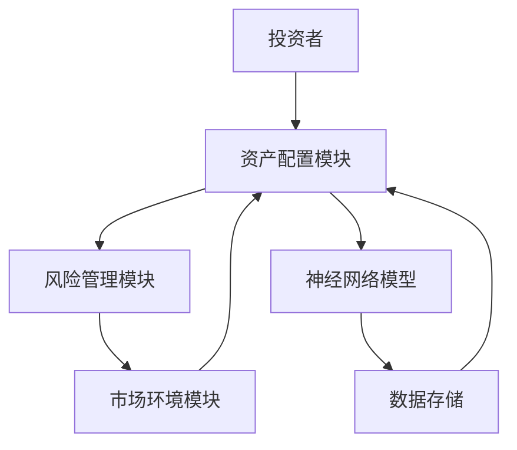
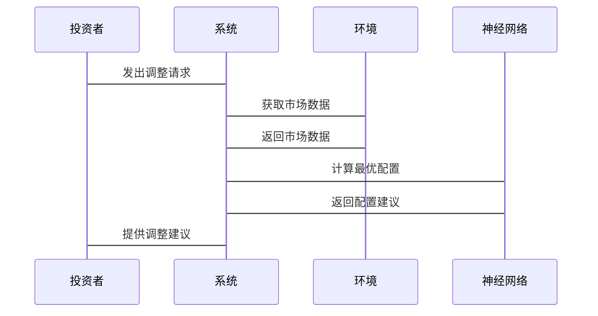

                 


# AI在资产负债管理动态优化中的应用

> 关键词：AI技术、资产负债管理、动态优化、强化学习、深度学习、金融应用

> 摘要：本文探讨了人工智能技术在金融领域资产负债管理中的动态优化应用，详细分析了强化学习、动态规划和深度学习等算法在动态优化中的原理、实现及其在资产负债管理中的实际应用。通过系统架构设计和项目实战案例，展示了AI在动态优化中的强大能力，并提供了实际应用中的注意事项和未来发展方向。

---

## 第1章: 背景介绍

### 1.1 问题背景

#### 1.1.1 资产负债管理的基本概念

资产负债管理是金融领域的重要组成部分，涉及资产和负债的配置、风险管理和优化。其核心目标是在满足风险承受能力的前提下，实现资产和负债的最优配置，以达到收益最大化或风险最小化。

#### 1.1.2 动态优化的必要性

传统的静态优化方法难以应对金融市场中不断变化的环境，例如市场波动、经济周期变化等。动态优化能够实时调整策略，适应市场变化，从而提高管理效率和效果。

#### 1.1.3 AI技术在金融领域的应用现状

人工智能技术在金融领域的应用日益广泛，尤其是在高频交易、风险管理、客户画像等方面。AI技术通过处理大量数据，能够发现传统方法难以察觉的模式和趋势，为决策提供支持。

### 1.2 问题描述

#### 1.2.1 资产负债管理中的动态优化问题

在资产负债管理中，动态优化问题涉及在不同时间点对资产和负债进行调整，以应对市场变化和内部目标的变化。例如，在利率变化时，如何调整债券组合以最大化收益。

#### 1.2.2 AI在动态优化中的作用

AI技术通过机器学习算法，能够从历史数据中学习市场规律，预测未来走势，并根据当前市场状态制定最优策略。AI在动态优化中能够处理多维变量和复杂约束条件，提供高效的解决方案。

#### 1.2.3 当前资产负债管理中的挑战

传统方法在处理复杂动态问题时存在效率低、适应性差的问题。市场环境的不确定性增加，对实时调整和优化提出了更高要求。AI技术的应用可以有效解决这些问题。

### 1.3 问题解决

#### 1.3.1 AI技术如何解决动态优化问题

AI通过强化学习、动态规划等算法，能够实时调整策略，适应市场变化。例如，使用强化学习算法，AI可以在模拟环境中不断试错，找到最优的资产配置策略。

#### 1.3.2 动态优化算法的基本思路

动态优化算法通常包括状态定义、动作选择、奖励机制和策略更新等步骤。通过不断迭代，算法能够逼近最优解。

#### 1.3.3 AI在动态优化中的具体应用

AI可以用于动态资产配置、风险管理和实时监控等领域。例如，使用强化学习算法优化投资组合，在不同市场条件下实现收益最大化。

### 1.4 边界与外延

#### 1.4.1 资产负债管理的边界条件

包括市场条件、监管要求、内部政策等。这些条件限制了动态优化的范围和目标。

#### 1.4.2 动态优化的适用范围

适用于需要实时调整和优化的场景，如高频交易、动态风险管理等。对于长期战略规划，动态优化可能不如静态方法适用。

#### 1.4.3 AI在动态优化中的局限性

AI算法依赖于历史数据和模型假设，可能在极端市场条件下表现不佳。此外，模型的复杂性和计算成本也是应用中的挑战。

### 1.5 概念结构与核心要素

#### 1.5.1 资产负债管理的核心要素

包括资产配置、负债管理、风险管理、流动性管理等。

#### 1.5.2 动态优化的关键因素

包括状态空间、动作空间、奖励函数、约束条件等。

#### 1.5.3 AI在动态优化中的角色

AI作为决策工具，通过数据驱动的方法优化资产和负债配置，提高管理效率。

---

## 第2章: 核心概念与联系

### 2.1 核心概念原理

#### 2.1.1 资产负债管理的基本原理

通过优化资产和负债的配置，实现风险和收益的平衡。

#### 2.1.2 动态优化的数学模型

动态优化问题通常可以表示为一个优化目标函数，受到动态约束条件的限制。

#### 2.1.3 AI在动态优化中的算法原理

AI通过学习历史数据，建立预测模型，并基于当前状态做出最优决策。

### 2.2 概念属性特征对比表格

以下是对资产负债管理与动态优化、AI与传统优化方法的对比：

| 对比内容 | 资产负债管理 | 动态优化 | AI技术 |
|----------|--------------|----------|--------|
| 方法论    | 基于规则和模型 | 基于数学优化 | 数据驱动学习 |
| 决策方式  | 静态调整 | 实时动态调整 | 自适应学习 |
| 优势      | 系统性、全面性 | 实时性、适应性 | 高效性、数据驱动 |

### 2.3 ER实体关系图

以下是资产负债管理的实体关系图：

```mermaid
erDiagram
    actor 投资者 {
        <属性>
        资产
        负债
        风险
        收益
    }
    actor 经理人 {
        <属性>
        资产组合
        负债结构
        风险偏好
    }
    actor 市场 {
        <属性>
        利率
        汇率
        股价
    }
    actor 监管机构 {
        <属性>
        监管政策
        风险指标
        报告要求
    }
    资产负债管理 <--- 投资者
    资产负债管理 <--- 经理人
    资产负债管理 <--- 市场
    资产负债管理 <--- 监管机构
```

---

## 第3章: 算法原理讲解

### 3.1 强化学习算法

#### 3.1.1 强化学习的基本概念

强化学习是一种通过试错学习的方法，智能体在环境中通过选择动作来最大化累积奖励。在动态优化中，智能体可以是投资者或经理人，环境是金融市场。

#### 3.1.2 Q-learning算法

Q-learning是一种经典的强化学习算法，适用于离散状态和动作空间。其更新公式为：

$$ Q(s,a) = Q(s,a) + \alpha (r + \gamma \max Q(s',a') - Q(s,a)) $$

其中，$\alpha$是学习率，$\gamma$是折扣因子。

#### 3.1.3 DQN算法

DQN（深度Q网络）通过使用神经网络近似Q值函数，适用于连续动作空间。其结构包括输入层、隐藏层和输出层。

#### 3.1.4 强化学习在动态优化中的应用

例如，使用DQN算法优化投资组合，在不同市场条件下动态调整资产配置。

### 3.2 动态规划算法

#### 3.2.1 动态规划的基本概念

动态规划通过分解问题为子问题，逐层解决，最终得到全局最优解。适用于可分阶段的问题。

#### 3.2.2 Bellman方程

Bellman方程描述了当前状态的价值与未来状态价值的关系：

$$ V(s) = \max_a \left( r + \gamma V(s') \right) $$

#### 3.2.3 动态规划在动态优化中的应用

例如，使用动态规划优化债券组合，在不同利率环境下实现最大收益。

### 3.3 深度学习算法

#### 3.3.1 深度学习的基本概念

深度学习通过多层神经网络，自动提取数据特征，适用于高维和复杂数据。

#### 3.3.2 神经网络模型

常用的模型包括CNN、RNN和Transformer。在动态优化中，可以使用LSTM网络捕捉时间序列数据中的模式。

#### 3.3.3 深度学习在动态优化中的应用

例如，使用LSTM预测股票价格，指导投资决策。

### 3.4 算法对比与选择

#### 3.4.1 强化学习、动态规划与深度学习的对比

| 参数 | 强化学习 | 动态规划 | 深度学习 |
|------|----------|----------|----------|
| 数据需求 | 需要环境反馈 | 需要状态转移概率 | 需要大量历史数据 |
| 计算复杂度 | 高 | 中等 | 高 |
| 适用场景 | 实时决策 | 分阶段决策 | 预测和分类 |

#### 3.4.2 不同场景下算法的选择

- 实时动态调整：强化学习
- 分阶段优化：动态规划
- 复杂模式识别：深度学习

---

## 第4章: 数学模型与公式

### 4.1 强化学习的数学模型

Q-learning的更新公式：

$$ Q(s,a) = Q(s,a) + \alpha (r + \gamma \max Q(s',a') - Q(s,a)) $$

### 4.2 动态规划的数学模型

Bellman方程：

$$ V(s) = \max_a \left( r + \gamma V(s') \right) $$

### 4.3 深度学习的数学模型

神经网络的损失函数：

$$ \text{损失函数} = \frac{1}{N}\sum_{i=1}^{N} (y_i - \hat{y_i})^2 $$

其中，$y_i$是真实值，$\hat{y_i}$是预测值。

---

## 第5章: 系统分析与架构设计方案

### 5.1 问题场景介绍

假设我们有一个投资组合，需要在不同市场条件下动态调整资产配置，以最大化收益并控制风险。

### 5.2 项目介绍

开发一个基于AI的动态资产配置系统，能够实时调整投资组合，应对市场变化。

### 5.3 系统功能设计

以下是系统功能模块的类图：


### 5.4 系统架构设计

以下是系统架构图：



### 5.5 系统接口设计

- 输入接口：市场数据、风险参数
- 输出接口：投资组合调整建议、风险报告

### 5.6 系统交互设计

以下是交互序列图：



---

## 第6章: 项目实战

### 6.1 环境安装

安装Python、TensorFlow、Keras、Mermaid等工具。

### 6.2 核心实现源代码

以下是一个简单的强化学习实现代码：

```python
import numpy as np
import gym

env = gym.make('CartPole-v0')
env.seed(1)
np.random.seed(1)

alpha = 0.1
gamma = 0.99
epsilon = 1.0

epsilon_min = 0.01
epsilon_decay = 0.995

# 初始化Q表
q_table = np.zeros([env.observation_space.shape[0], env.action_space.n])

for episode in range(1000):
    state = env.reset()
    for t in range(200):
        # 选择动作
        if np.random.random() < epsilon:
            action = env.action_space.sample()
        else:
            action = np.argmax(q_table[state])
        
        # 执行动作
        next_state, reward, done, _ = env.step(action)
        
        # 更新Q表
        q_value = q_table[state][action]
        next_max = np.max(q_table[next_state])
        q_table[state][action] = q_value + alpha * (reward + gamma * next_max - q_value)
        
        state = next_state
        if done:
            break
    
    # epsilon衰减
    epsilon = max(epsilon_min, epsilon * epsilon_decay)
```

### 6.3 代码应用解读与分析

上述代码实现了一个简单的Q-learning算法，在CartPole环境中训练智能体。通过不断试错，智能体学会如何平衡杆子。

### 6.4 实际案例分析

在股票投资中，可以使用类似的方法动态调整投资组合。例如，根据市场波动调整股票和债券的比例。

### 6.5 项目小结

通过项目实战，我们可以看到AI在动态优化中的强大能力。然而，实际应用中需要考虑模型的泛化能力和实时性问题。

---

## 第7章: 最佳实践、小结、注意事项、拓展阅读

### 7.1 最佳实践

- 数据质量是关键，确保数据的准确性和完整性。
- 定期更新模型，适应市场变化。
- 设置合理的风险控制机制，避免过度优化导致的风险。

### 7.2 小结

本文详细探讨了AI在资产负债管理动态优化中的应用，从算法原理到系统设计再到项目实战，全面展示了AI技术的强大能力。

### 7.3 注意事项

- 模型的复杂性可能增加计算成本。
- 数据泄露和过拟合问题需要警惕。
- 监管合规性也是实际应用中的重要考虑。

### 7.4 拓展阅读

- 《Reinforcement Learning: Theory and Algorithms》
- 《Deep Learning for Time Series Forecasting》
- 《Quantitative Risk Management: Concepts, Techniques, and Tools》

---

## 作者

作者：AI天才研究院/AI Genius Institute  
禅与计算机程序设计艺术/Zen And The Art of Computer Programming

---

感谢您的耐心阅读，希望这篇文章对您有所帮助！

