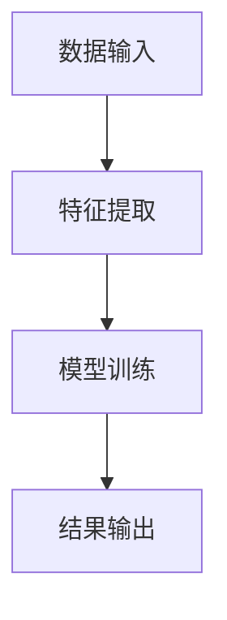

                 


# AI在金融产品营销中的创新应用

> 关键词：人工智能、金融营销、精准推荐、风险管理、客户画像

> 摘要：本文详细探讨了人工智能在金融产品营销中的创新应用，从背景介绍、核心概念、算法原理到系统设计与项目实战，系统性地分析了AI如何提升金融营销的效率与精准度。文章结合实际案例，深入解读了AI技术在客户画像、产品推荐、风险评估等环节中的具体应用，并通过代码实现与流程图展示，为读者提供了清晰的技术路径与实践指导。

---

## 第一部分: AI在金融产品营销中的创新应用概述

### 第1章: 人工智能与金融营销的结合

#### 1.1 AI技术的发展与现状
人工智能（Artificial Intelligence, AI）作为一项革命性技术，近年来在多个领域得到了广泛应用。AI的核心在于模拟人类的思维过程，通过数据处理、模式识别和决策支持，为复杂问题提供解决方案。在金融领域，AI的应用尤为突出，从智能投顾到风险管理，AI正在改变传统的金融业务模式。

#### 1.2 金融产品营销的特点与挑战
金融产品营销具有高度复杂性，涉及大量数据处理、客户行为分析以及风险评估。传统营销方式依赖人工经验，效率低且难以满足个性化需求。随着市场竞争加剧，金融机构需要更高效、精准的营销策略，这为AI技术的应用提供了广阔空间。

#### 1.3 AI在金融营销中的创新应用
AI技术在金融营销中的创新应用主要体现在客户画像、精准推荐和风险管理等方面。通过AI算法，金融机构可以快速分析海量数据，识别潜在客户，制定个性化营销策略，从而提高转化率和客户满意度。

### 第2章: AI在金融产品营销中的核心概念与联系

#### 2.1 数据处理与特征提取
数据是AI的核心，金融营销中的数据来源包括客户信息、交易记录、市场趋势等。数据清洗与预处理是确保模型准确性的关键步骤，特征工程则通过提取关键特征，提升模型的预测能力。

#### 2.2 模型训练与优化
监督学习和无监督学习是AI在金融营销中的主要方法。监督学习基于标注数据进行训练，适用于分类任务；无监督学习则用于发现数据中的隐含模式。模型调优和评估指标是确保模型性能的重要环节。

#### 2.3 算法原理与流程图
AI算法的核心原理包括数据输入、特征提取、模型训练和结果输出。通过Mermaid流程图，我们可以清晰地展示AI在金融营销中的工作流程。



### 第3章: AI在金融营销中的算法原理

#### 3.1 机器学习算法
机器学习算法是AI的核心，包括线性回归、支持向量机（SVM）和随机森林等。这些算法在金融营销中的应用需要结合具体场景，选择合适的模型。

#### 3.2 深度学习算法
深度学习通过神经网络模型，能够处理复杂的数据模式。卷积神经网络（CNN）和循环神经网络（RNN）在金融时间序列分析中具有重要作用。

#### 3.3 算法实现与代码示例
以下是Python代码实现线性回归模型的示例：

```python
import numpy as np
import matplotlib.pyplot as plt

# 生成数据
X = np.linspace(0, 10, 200)
y = 2 * X + 1 + np.random.normal(0, 1, 200)

# 训练模型
theta = np.polyfit(X, y, 1)
print(f"回归系数为：{theta[0]}，截距为：{theta[1]}")

# 可视化结果
plt.scatter(X, y, label='真实数据')
plt.plot(X, theta[0] * X + theta[1], label='回归线', color='red')
plt.legend()
plt.show()
```

### 第4章: 系统分析与架构设计

#### 4.1 项目需求分析
项目需求分析包括明确目标、范围和约束条件。金融AI营销系统的目标是通过AI技术提高营销效率和精准度，范围涵盖客户画像、产品推荐和风险评估。

#### 4.2 系统功能设计
系统功能设计包括领域模型设计和功能模块划分。领域模型展示了系统的核心实体及其关系，功能模块则具体描述了每个模块的功能。

#### 4.3 系统架构设计
系统架构设计采用分层架构，包括数据层、业务逻辑层和用户界面层。微服务架构则用于处理复杂的分布式系统。

### 第5章: 项目实战与案例分析

#### 5.1 环境搭建与配置
环境搭建包括安装Python和相关库，配置开发工具。以下是Python环境配置的示例：

```bash
pip install numpy pandas scikit-learn matplotlib
```

#### 5.2 核心功能实现
核心功能实现包括客户画像、产品推荐和风险管理。以下是客户画像的实现代码：

```python
from sklearn.cluster import KMeans

# 假设X为客户特征矩阵
kmeans = KMeans(n_clusters=3)
kmeans.fit(X)
print("聚类中心为：", kmeans.cluster_centers_)
```

### 第6章: 总结与展望

#### 6.1 总结
本文详细探讨了AI在金融产品营销中的创新应用，从理论到实践，展示了AI如何提升营销效率和精准度。通过具体案例和代码实现，为读者提供了清晰的技术路径。

#### 6.2 展望
未来，随着AI技术的不断发展，金融营销将更加智能化和个性化。金融机构需要结合自身需求，充分利用AI技术，提高竞争力。

---

作者：AI天才研究院/AI Genius Institute & 禅与计算机程序设计艺术 /Zen And The Art of Computer Programming

