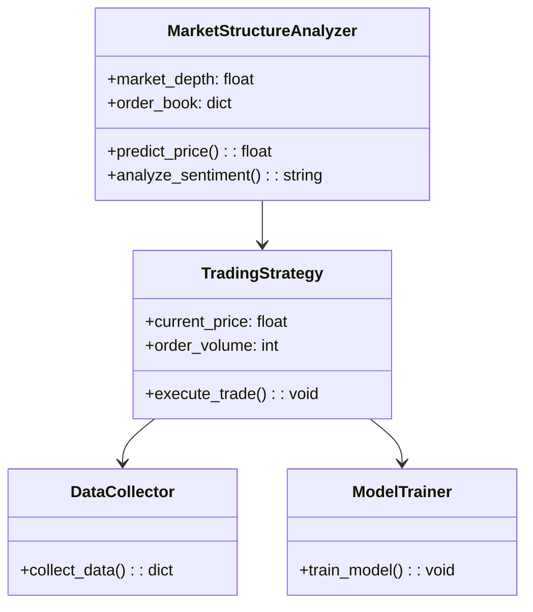

                 


# AI在金融市场微观结构分析中的应用

> **关键词**：人工智能、金融市场、微观结构分析、高频交易、订单簿分析、市场情绪分析、机器学习、深度学习  
> 
> **摘要**：  
> 本文深入探讨了人工智能技术在金融市场微观结构分析中的应用，重点分析了高频交易、订单簿分析和市场情绪分析等核心领域。通过结合机器学习、深度学习等AI算法，本文详细阐述了如何利用这些技术解决金融市场中的复杂问题，并提供了具体的实现方法和案例分析。文章结构清晰，内容详实，适合金融从业者、数据科学家以及对AI技术感兴趣的读者阅读。

---

# 第1章: AI与金融市场微观结构分析概述

## 1.1 人工智能与金融市场的结合

### 1.1.1 人工智能的基本概念  
人工智能（AI）是指通过计算机技术模拟人类智能的学科，其核心包括机器学习、自然语言处理、计算机视觉等技术。AI通过数据驱动的方式，能够自动识别模式、做出预测和决策。

### 1.1.2 金融市场的基本概念  
金融市场是资金流动和资产交易的场所，包括股票、债券、期货、外汇等多种金融工具。金融市场微观结构分析关注市场参与者的交易行为、价格形成机制以及市场流动性等。

### 1.1.3 AI在金融领域的应用现状  
AI技术已在金融领域得到广泛应用，尤其是在高频交易、风险管理、智能投顾等领域。AI能够处理海量数据，发现复杂模式，并快速做出决策。

---

## 1.2 金融市场微观结构分析的核心概念

### 1.2.1 微观结构的定义与特点  
金融市场微观结构分析研究市场参与者的交易行为、订单簿动态以及价格形成机制。其特点是实时性、高频性和复杂性。

### 1.2.2 市场参与者与交易行为  
市场参与者包括机构投资者、高频交易商、做市商等。不同参与者的交易行为对市场微观结构有重要影响。

### 1.2.3 价格形成机制与市场流动性  
价格形成机制涉及订单匹配、撮合算法等。市场流动性影响交易成本和价格波动，是微观结构分析的重要内容。

---

## 1.3 AI在金融市场微观结构分析中的优势

### 1.3.1 数据处理能力  
AI能够快速处理海量数据，提取特征并生成交易信号。

### 1.3.2 模式识别能力  
AI能够识别市场中的复杂模式，帮助预测价格波动和市场行为。

### 1.3.3 预测与决策能力  
AI通过机器学习模型，能够预测市场走势并优化交易策略。

---

## 1.4 本章小结  
本章介绍了AI与金融市场微观结构分析的基本概念和核心优势，为后续内容奠定了基础。

---

# 第2章: AI与高频交易

## 2.1 高频交易的定义与特点

### 2.1.1 高频交易的定义  
高频交易是指在极短时间内完成大量交易的行为，通常基于算法和自动化系统。

### 2.1.2 高频交易的核心特点  
高频交易具有高频性、自动化和算法驱动等特点，能够在 microseconds 级别完成交易。

### 2.1.3 高频交易与传统交易的区别  
高频交易依赖算法和自动化系统，而传统交易更多依赖人工决策。

---

## 2.2 高频交易中的AI应用

### 2.2.1 数据分析与处理  
AI通过分析订单流、市场深度等数据，优化交易策略。

### 2.2.2 交易策略的自动化  
AI能够自动生成交易信号，优化订单执行策略。

### 2.2.3 市场微观结构的实时监控  
AI实时监控市场微观结构，识别异常行为和潜在风险。

---

## 2.3 高频交易中的AI算法

### 2.3.1 机器学习算法  
机器学习算法如支持向量机（SVM）、随机森林（Random Forest）常用于分类和回归任务。

### 2.3.2 深度学习算法  
深度学习算法如LSTM（长短期记忆网络）适用于时间序列预测。

### 2.3.3 其他AI算法  
还包括强化学习（RL）和遗传算法（GA）等。

---

## 2.4 本章小结  
本章详细探讨了高频交易中的AI应用，分析了不同AI算法的特点及其在高频交易中的作用。

---

# 第3章: AI在订单簿分析中的应用

## 3.1 订单簿分析的核心概念

### 3.1.1 订单簿的定义与结构  
订单簿记录了市场上所有未成交的订单，包括买价、卖价、订单数量等。

### 3.1.2 市场深度与订单流  
市场深度反映了市场参与者对某一价格水平的买卖意愿，订单流描述了订单的动态变化。

### 3.1.3 市场微观结构的动态变化  
订单簿的动态变化反映了市场参与者的实时交易行为。

---

## 3.2 AI在订单簿分析中的应用

### 3.2.1 数据清洗与特征提取  
AI通过清洗数据并提取特征，如买卖价差、订单量比等，优化预测模型。

### 3.2.2 市场情绪分析  
AI能够分析订单簿中的情绪指标，预测价格波动。

### 3.2.3 价格预测与交易信号生成  
基于订单簿数据的AI模型能够预测价格走势并生成交易信号。

---

## 3.3 本章小结  
本章分析了AI在订单簿分析中的应用，强调了数据处理和预测模型的重要性。

---

# 第4章: AI在市场情绪分析中的应用

## 4.1 市场情绪分析的核心概念

### 4.1.1 市场情绪的定义与分类  
市场情绪反映了市场参与者的心理状态，通常分为乐观、中性和悲观三类。

### 4.1.2 市场情绪与价格波动的关系  
市场情绪影响投资者行为，进而影响市场价格波动。

### 4.1.3 市场情绪的测量方法  
包括基于文本的分析和基于价格的技术分析。

---

## 4.2 AI在市场情绪分析中的应用

### 4.2.1 基于文本的市场情绪分析  
通过自然语言处理技术分析新闻、社交媒体等文本数据，提取情绪指标。

### 4.2.2 基于价格的市场情绪分析  
通过技术指标（如RSI、MACD）分析价格波动，反映市场情绪。

---

## 4.3 本章小结  
本章探讨了市场情绪分析的核心概念和AI技术的应用，展示了如何利用AI技术捕捉市场情绪。

---

# 第五部分: 系统分析与架构设计方案

---

## 第5章: AI在金融市场微观结构分析中的系统架构

### 5.1 问题场景介绍  
本文基于高频交易和订单簿分析的场景，设计一个AI驱动的金融市场微观结构分析系统。

### 5.2 系统功能设计

#### 5.2.1 领域模型设计  


---

### 5.2.2 系统架构设计


---

## 第6章: 系统实现与项目实战

### 6.1 环境配置

```bash
pip install numpy pandas keras tensorflow matplotlib
```

---

### 6.2 核心实现代码

```python
import numpy as np
import pandas as pd
from tensorflow.keras.models import Sequential
from tensorflow.keras.layers import LSTM, Dense, Dropout

# 数据预处理
def preprocess_data(data):
    # 假设data是一个DataFrame，包含订单簿数据
    # 这里进行归一化处理
    data_normal = (data - data.mean()) / data.std()
    return data_normal

# LSTM模型构建
def build_model(input_shape):
    model = Sequential()
    model.add(LSTM(64, return_sequences=True, input_shape=(input_shape)))
    model.add(Dropout(0.2))
    model.add(LSTM(32, return_sequences=False))
    model.add(Dense(1))
    model.compile(loss='mean_squared_error', optimizer='adam')
    return model

# 训练模型
def train_model(model, X_train, y_train, epochs=100, batch_size=32):
    model.fit(X_train, y_train, epochs=epochs, batch_size=batch_size)

# 预测与评估
def evaluate_model(model, X_test, y_test):
    predictions = model.predict(X_test)
    # 计算均方误差
    mse = np.mean((predictions - y_test) ** 2)
    print(f"均方误差：{mse}")
```

---

## 第7章: 高级应用与未来趋势

### 7.1 强化学习在金融市场中的应用  
强化学习（Reinforcement Learning）可以通过模拟市场环境，训练智能体优化交易策略。

### 7.2 NLP在市场情绪分析中的应用  
自然语言处理技术可以更准确地分析新闻、社交媒体等文本数据，捕捉市场情绪。

### 7.3 未来趋势与挑战  
随着AI技术的不断发展，金融市场微观结构分析将更加智能化和自动化，但数据隐私和算法风险仍是主要挑战。

---

# 第8章: 小结与展望

### 8.1 本章总结  
本文全面探讨了AI在金融市场微观结构分析中的应用，涵盖高频交易、订单簿分析和市场情绪分析等多个领域。

### 8.2 未来展望  
未来，AI技术将更加深入地融入金融市场分析，推动金融行业的智能化发展。

---

# 作者：AI天才研究院 & 禅与计算机程序设计艺术

---

**本文内容来源于AI天才研究院（AI Genius Institute）的技术研究成果，转载请注明出处。**

