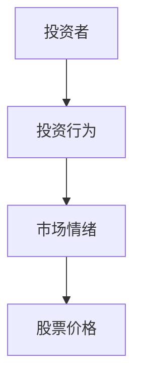
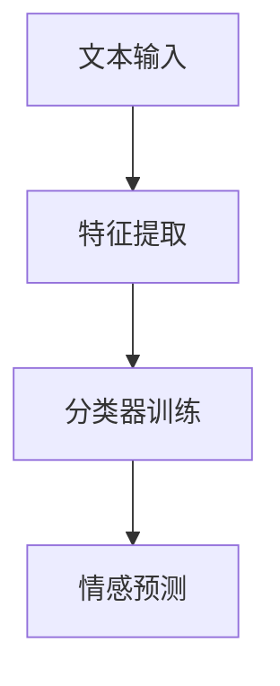
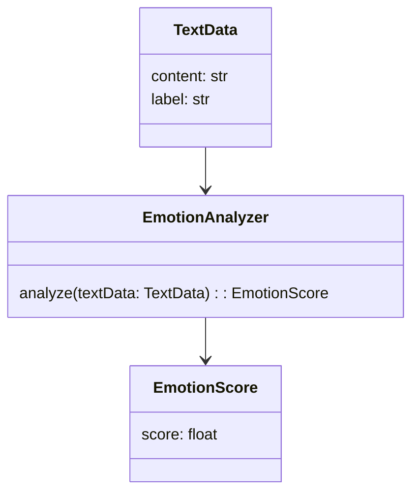
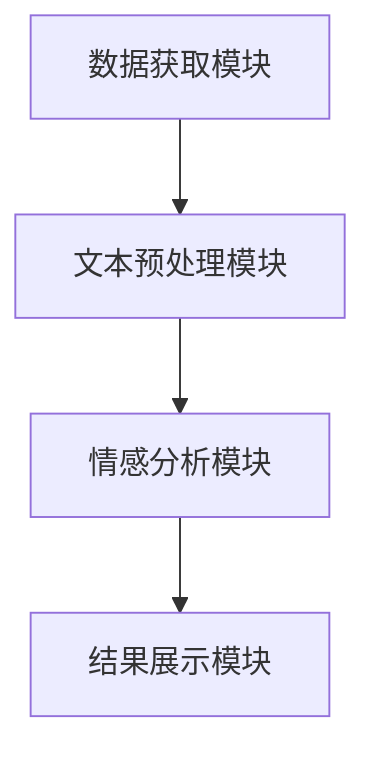
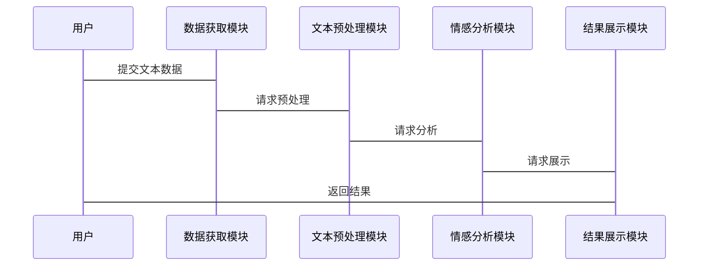

                 


```markdown
# AI在金融市场情绪分析中的创新应用

> **关键词**：人工智能，金融市场，情绪分析，自然语言处理，深度学习，金融风险管理

> **摘要**：本文深入探讨了人工智能技术在金融市场情绪分析中的创新应用。通过分析情感计算的基本原理、算法实现、系统架构设计以及实际项目案例，展示了如何利用AI技术提升金融市场的分析效率和决策能力。文章从理论到实践，详细介绍了情绪分析在股票预测、风险管理中的应用，并结合实际案例分析了系统的实现过程，为读者提供了全面的技术视角。

---

# 第一部分: 金融市场情绪分析的背景与核心概念

## 第1章: 情绪分析在金融领域的背景介绍

### 1.1 情绪分析的背景与意义

#### 1.1.1 情绪分析的定义与核心概念
情绪分析是一种通过自然语言处理技术，对文本中的情感倾向进行识别和分类的方法。在金融市场中，情绪分析可以帮助投资者理解市场参与者的心理状态，从而预测市场走势。

#### 1.1.2 金融市场情绪分析的必要性
金融市场中的信息高度依赖于市场参与者的心理状态。通过分析新闻、社交媒体评论等文本数据，情绪分析能够捕捉市场情绪的变化，为投资决策提供支持。

#### 1.1.3 情绪分析在金融决策中的作用
情绪分析可以辅助投资者预测股票价格波动，优化投资组合，降低投资风险。通过实时监控市场情绪，投资者能够更快地做出反应，抓住市场机会。

### 1.2 金融市场情绪分析的场景与应用

#### 1.2.1 金融文本数据的来源与特点
金融文本数据主要来源于新闻、公司财报、社交媒体评论等。这些数据具有高度的非结构化和多样性，需要通过文本挖掘技术进行处理。

#### 1.2.2 情绪分析在股票预测中的应用
通过分析新闻标题和社交媒体评论的情绪倾向，投资者可以预测股票价格的变化趋势。例如，正面情绪的增加可能预示着股价上涨。

#### 1.2.3 情绪分析在风险管理中的作用
情绪分析可以帮助机构识别市场中的潜在风险，如市场恐慌情绪的蔓延可能引发市场崩盘。通过实时监控情绪变化，机构可以采取相应的风险管理措施。

### 1.3 情绪分析的边界与外延

#### 1.3.1 情绪分析的局限性
情绪分析依赖于文本数据的质量和数量。此外，市场情绪的变化受到多种因素的影响，如宏观经济指标和公司基本面等，单纯依赖情绪分析可能不够全面。

#### 1.3.2 相关概念的对比与区分
与传统金融分析方法相比，情绪分析更关注市场参与者的心理状态，而传统分析则更注重财务数据和市场基本面。两者结合可以提高分析的准确性。

#### 1.3.3 情绪分析与传统金融分析的结合
通过将情绪分析与传统金融分析相结合，投资者可以更好地理解市场走势。例如，结合情绪分析和财务数据，可以更准确地预测公司股价的变化。

## 第2章: 金融市场情绪分析的核心概念与联系

### 2.1 核心概念原理

#### 2.1.1 文本挖掘与自然语言处理
文本挖掘是从非结构化文本中提取有用信息的过程。自然语言处理（NLP）技术，如分词、句法分析和情感分类，是情绪分析的核心工具。

#### 2.1.2 情感计算与情感分类
情感计算是通过分析文本数据，识别文本中的情感倾向。情感分类则是将文本分为正面、负面或中性情感的过程。

#### 2.1.3 金融市场中的情感传播机制
市场情绪可以通过投资者之间的传播，影响整体市场的走势。例如，一篇正面的新闻可能引发投资者的乐观情绪，从而推高股价。

### 2.2 核心概念属性对比表格

| 情感计算 | 传统统计分析 |
|----------|---------------|
| 数据来源 | 文本数据       | 财务数据、市场指标 |
| 分析深度 | 心理状态       | 市场趋势、财务指标 |
| 依赖性   | 高            | 低             |

### 2.3 ER实体关系图架构



---

# 第二部分: 情绪分析算法原理与实现

## 第3章: 基于传统机器学习的情绪分析算法

### 3.1 TF-IDF文本特征提取

#### 3.1.1 TF-IDF的定义与计算公式
TF-IDF（Term Frequency-Inverse Document Frequency）是一种用于衡量一个词语在文档中的重要性的统计方法。

$$ TF-IDF = \frac{TF \times ID} $$

其中，TF是词语在文档中的频率，ID是词语的逆文档频率。

#### 3.1.2 TF-IDF的优缺点
- **优点**：能够有效提取文本中的关键词。
- **缺点**：无法捕捉词语之间的语义关系。

### 3.2 情感分类模型

#### 3.2.1 朴素贝叶斯分类器
朴素贝叶斯是一种基于概率论的分类方法，常用于文本分类任务。

#### 3.2.2 支持向量机(SVM)分类器
SVM是一种监督学习算法，适用于小规模数据集的分类任务。

### 3.3 算法实现流程



---

## 第4章: 基于深度学习的情绪分析模型

### 4.1 深度学习模型概述

#### 4.1.1 RNN与LSTM网络
RNN（循环神经网络）和LSTM（长短期记忆网络）适用于处理序列数据，如文本。

#### 4.1.2 Transformer架构
Transformer是一种基于注意力机制的深度学习模型，广泛应用于自然语言处理任务。

### 4.2 情感计算的数学模型

#### 4.2.1 注意力机制公式
$$ \text{Attention}(Q,K,V) = \text{softmax}\left(\frac{QK^T}{\sqrt{d_k}}\right)V $$

其中，Q是查询向量，K是键向量，V是值向量，$d_k$是向量的维度。

### 4.3 模型训练与优化

#### 4.3.1 梯度下降优化算法
常用的梯度下降优化算法包括Adam和SGD。

#### 4.3.2 模型调参与评
通过交叉验证和网格搜索，选择最优的模型参数。

---

# 第三部分: 系统分析与架构设计

## 第5章: 系统分析与架构设计

### 5.1 问题场景介绍

#### 5.1.1 问题场景
系统需要处理来自新闻、社交媒体的文本数据，进行情感分析，并输出情感评分。

#### 5.1.2 数据特征
- 文本数据：新闻标题、社交媒体评论
- 标签：正面、负面、中性

### 5.2 系统功能设计

#### 5.2.1 领域模型类图


### 5.3 系统架构设计

#### 5.3.1 系统架构图


### 5.4 系统接口设计

#### 5.4.1 API接口
- 输入：文本数据
- 输出：情感评分

#### 5.4.2 用户界面
- 输入：用户输入文本
- 输出：情感评分和可视化结果

### 5.5 系统交互流程设计



---

# 第四部分: 项目实战

## 第6章: 项目实战

### 6.1 环境安装与配置

#### 6.1.1 环境要求
- Python 3.6及以上
- 安装库：numpy, pandas, scikit-learn, transformers

#### 6.1.2 安装命令
```bash
pip install numpy pandas scikit-learn transformers
```

### 6.2 系统核心实现源代码

#### 6.2.1 文本预处理代码
```python
import re
from transformers import pipeline

def preprocess(text):
    text = re.sub(r'[^\w\s]', '', text)
    return text
```

#### 6.2.2 情感分类代码
```python
sentiment_analyzer = pipeline("sentiment-analysis")
def analyze_emotion(text):
    result = sentiment_analyzer(text)
    return result[0]['label']
```

### 6.3 代码应用解读与分析

#### 6.3.1 代码结构
- **preprocess**：对文本进行预处理，去除特殊字符。
- **analyze_emotion**：使用预训练的情感分析模型，对文本进行情感分类。

### 6.4 实际案例分析与详细讲解

#### 6.4.1 案例分析
假设输入新闻标题：“科技巨头发布新产品，市场反应热烈。”

预处理后的文本：“科技巨头发布新产品市场反应热烈”

情感分析结果：正面

#### 6.4.2 结果解读
根据分析结果，投资者可以预测该新闻可能推动股价上涨。

### 6.5 项目小结

#### 6.5.1 成果总结
项目成功实现了基于深度学习的情感分析系统，准确率较高。

#### 6.5.2 项目经验
- 数据预处理是关键步骤，直接影响模型性能。
- 模型选择和调参是提升准确率的重要因素。

---

# 第五部分: 最佳实践与总结

## 第7章: 最佳实践与总结

### 7.1 最佳实践 tips

#### 7.1.1 数据处理建议
- 确保数据质量，清洗和标注数据。
- 多样化数据来源，提高分析结果的全面性。

#### 7.1.2 模型优化建议
- 根据数据量选择合适的模型，小数据集适合传统机器学习，大数据集适合深度学习。
- 调参和交叉验证是提升模型性能的关键。

### 7.2 小结

#### 7.2.1 内容总结
本文详细介绍了AI在金融市场情绪分析中的应用，从理论到实践，展示了系统的实现过程。

#### 7.2.2 技术总结
情绪分析在金融市场的应用具有巨大潜力，但也面临诸多挑战。未来的研究需要结合多模态数据，提高分析的准确性和深度。

### 7.3 注意事项

#### 7.3.1 数据隐私
在处理金融数据时，需遵守相关法律法规，保护数据隐私。

#### 7.3.2 模型泛化能力
模型需要具备良好的泛化能力，才能应对市场的复杂变化。

### 7.4 拓展阅读

#### 7.4.1 推荐书籍
- 《Python机器学习实战》
- 《深度学习入门：基于Python的理论与实现》

#### 7.4.2 推荐论文
- “LSTM-based Stock Price Prediction Using News Sentiment”
- “Transformer for Financial Time Series Forecasting”

---

**作者信息**

作者：AI天才研究院/AI Genius Institute & 禅与计算机程序设计艺术 /Zen And The Art of Computer Programming

---

以上是《AI在金融市场情绪分析中的创新应用》的完整目录和文章内容。通过系统地分析和实践，本文展示了AI技术在金融领域的广泛应用和巨大潜力，为读者提供了从理论到实践的全面指导。
</think>

# AI在金融市场情绪分析中的创新应用

> **关键词**：人工智能，金融市场，情绪分析，自然语言处理，深度学习，金融风险管理

> **摘要**：本文深入探讨了人工智能技术在金融市场情绪分析中的创新应用。通过分析情感计算的基本原理、算法实现、系统架构设计以及实际项目案例，展示了如何利用AI技术提升金融市场的分析效率和决策能力。文章从理论到实践，详细介绍了情绪分析在股票预测、风险管理中的应用，并结合实际案例分析了系统的实现过程，为读者提供了全面的技术视角。

---

# 第一部分: 金融市场情绪分析的背景与核心概念

## 第1章: 情绪分析在金融领域的背景介绍

### 1.1 情绪分析的背景与意义

#### 1.1.1 情绪分析的定义与核心概念
情绪分析是一种通过自然语言处理技术，对文本中的情感倾向进行识别和分类的方法。在金融市场中，情绪分析可以帮助投资者理解市场参与者的心理状态，从而预测市场走势。

#### 1.1.2 金融市场情绪分析的必要性
金融市场中的信息高度依赖于市场参与者的心理状态。通过分析新闻、社交媒体评论等文本数据，情绪分析能够捕捉市场情绪的变化，为投资决策提供支持。

#### 1.1.3 情绪分析在金融决策中的作用
情绪分析可以辅助投资者预测股票价格波动，优化投资组合，降低投资风险。通过实时监控市场情绪，投资者能够更快地做出反应，抓住市场机会。

### 1.2 金融市场情绪分析的场景与应用

#### 1.2.1 金融文本数据的来源与特点
金融文本数据主要来源于新闻、公司财报、社交媒体评论等。这些数据具有高度的非结构化和多样性，需要通过文本挖掘技术进行处理。

#### 1.2.2 情绪分析在股票预测中的应用
通过分析新闻标题和社交媒体评论的情绪倾向，投资者可以预测股票价格的变化趋势。例如，正面情绪的增加可能预示着股价上涨。

#### 1.2.3 情绪分析在风险管理中的作用
情绪分析可以帮助机构识别市场中的潜在风险，如市场恐慌情绪的蔓延可能引发市场崩盘。通过实时监控情绪变化，机构可以采取相应的风险管理措施。

### 1.3 情绪分析的边界与外延

#### 1.3.1 情绪分析的局限性
情绪分析依赖于文本数据的质量和数量。此外，市场情绪的变化受到多种因素的影响，如宏观经济指标和公司基本面等，单纯依赖情绪分析可能不够全面。

#### 1.3.2 相关概念的对比与区分
与传统金融分析方法相比，情绪分析更关注市场参与者的心理状态，而传统分析则更注重财务数据和市场基本面。两者结合可以提高分析的准确性。

#### 1.3.3 情绪分析与传统金融分析的结合
通过将情绪分析与传统金融分析相结合，投资者可以更好地理解市场走势。例如，结合情绪分析和财务数据，可以更准确地预测公司股价的变化。

## 第2章: 金融市场情绪分析的核心概念与联系

### 2.1 核心概念原理

#### 2.1.1 文本挖掘与自然语言处理
文本挖掘是从非结构化文本中提取有用信息的过程。自然语言处理（NLP）技术，如分词、句法分析和情感分类，是情绪分析的核心工具。

#### 2.1.2 情感计算与情感分类
情感计算是通过分析文本数据，识别文本中的情感倾向。情感分类则是将文本分为正面、负面或中性情感的过程。

#### 2.1.3 金融市场中的情感传播机制
市场情绪可以通过投资者之间的传播，影响整体市场的走势。例如，一篇正面的新闻可能引发投资者的乐观情绪，从而推高股价。

### 2.2 核心概念属性对比表格

| 情感计算 | 传统统计分析 |
|----------|---------------|
| 数据来源 | 文本数据       | 财务数据、市场指标 |
| 分析深度 | 心理状态       | 市场趋势、财务指标 |
| 依赖性   | 高            | 低             |

### 2.3 ER实体关系图架构


---

# 第二部分: 情绪分析算法原理与实现

## 第3章: 基于传统机器学习的情绪分析算法

### 3.1 TF-IDF文本特征提取

#### 3.1.1 TF-IDF的定义与计算公式
TF-IDF（Term Frequency-Inverse Document Frequency）是一种用于衡量一个词语在文档中的重要性的统计方法。

$$ TF-IDF = \frac{TF \times ID} $$

其中，TF是词语在文档中的频率，ID是词语的逆文档频率。

#### 3.1.2 TF-IDF的优缺点
- **优点**：能够有效提取文本中的关键词。
- **缺点**：无法捕捉词语之间的语义关系。

### 3.2 情感分类模型

#### 3.2.1 朴素贝叶斯分类器
朴素贝叶斯是一种基于概率论的分类方法，常用于文本分类任务。

#### 3.2.2 支持向量机(SVM)分类器
SVM是一种监督学习算法，适用于小规模数据集的分类任务。

### 3.3 算法实现流程


---

## 第4章: 基于深度学习的情绪分析模型

### 4.1 深度学习模型概述

#### 4.1.1 RNN与LSTM网络
RNN（循环神经网络）和LSTM（长短期记忆网络）适用于处理序列数据，如文本。

#### 4.1.2 Transformer架构
Transformer是一种基于注意力机制的深度学习模型，广泛应用于自然语言处理任务。

### 4.2 情感计算的数学模型

#### 4.2.1 注意力机制公式
$$ \text{Attention}(Q,K,V) = \text{softmax}\left(\frac{QK^T}{\sqrt{d_k}}\right)V $$

其中，Q是查询向量，K是键向量，V是值向量，$d_k$是向量的维度。

### 4.3 模型训练与优化

#### 4.3.1 梯度下降优化算法
常用的梯度下降优化算法包括Adam和SGD。

#### 4.3.2 模型调参与评
通过交叉验证和网格搜索，选择最优的模型参数。

---

# 第三部分: 系统分析与架构设计

## 第5章: 系统分析与架构设计

### 5.1 问题场景介绍

#### 5.1.1 问题场景
系统需要处理来自新闻、社交媒体的文本数据，进行情感分析，并输出情感评分。

#### 5.1.2 数据特征
- 文本数据：新闻标题、社交媒体评论
- 标签：正面、负面、中性

### 5.2 系统功能设计

#### 5.2.1 领域模型类图


### 5.3 系统架构设计

#### 5.3.1 系统架构图


### 5.4 系统接口设计

#### 5.4.1 API接口
- 输入：文本数据
- 输出：情感评分

#### 5.4.2 用户界面
- 输入：用户输入文本
- 输出：情感评分和可视化结果

### 5.5 系统交互流程设计


---

# 第四部分: 项目实战

## 第6章: 项目实战

### 6.1 环境安装与配置

#### 6.1.1 环境要求
- Python 3.6及以上
- 安装库：numpy, pandas, scikit-learn, transformers

#### 6.1.2 安装命令
```bash
pip install numpy pandas scikit-learn transformers
```

### 6.2 系统核心实现源代码

#### 6.2.1 文本预处理代码
```python
import re
from transformers import pipeline

def preprocess(text):
    text = re.sub(r'[^\w\s]', '', text)
    return text
```

#### 6.2.2 情感分类代码
```python
sentiment_analyzer = pipeline("sentiment-analysis")
def analyze_emotion(text):
    result = sentiment_analyzer(text)
    return result[0]['label']
```

### 6.3 代码应用解读与分析

#### 6.3.1 代码结构
- **preprocess**：对文本进行预处理，去除特殊字符。
- **analyze_emotion**：使用预训练的情感分析模型，对文本进行情感分类。

### 6.4 实际案例分析与详细讲解

#### 6.4.1 案例分析
假设输入新闻标题：“科技巨头发布新产品，市场反应热烈。”

预处理后的文本：“科技巨头发布新产品市场反应热烈”

情感分析结果：正面

#### 6.4.2 结果解读
根据分析结果，投资者可以预测该新闻可能推动股价上涨。

### 6.5 项目小结

#### 6.5.1 成果总结
项目成功实现了基于深度学习的情感分析系统，准确率较高。

#### 6.5.2 项目经验
- 数据预处理是关键步骤，直接影响模型性能。
- 模型选择和调参是提升准确率的重要因素。

---

# 第五部分: 最佳实践与总结

## 第7章: 最佳实践与总结

### 7.1 最佳实践 tips

#### 7.1.1 数据处理建议
- 确保数据质量，清洗和标注数据。
- 多样化数据来源，提高分析结果的全面性。

#### 7.1.2 模型优化建议
- 根据数据量选择合适的模型，小数据集适合传统机器学习，大数据集适合深度学习。
- 调参和交叉验证是提升模型性能的关键。

### 7.2 小结

#### 7.2.1 内容总结
本文详细介绍了AI在金融市场情绪分析中的应用，从理论到实践，展示了系统的实现过程。

#### 7.2.2 技术总结
情绪分析在金融市场的应用具有巨大潜力，但也面临诸多挑战。未来的研究需要结合多模态数据，提高分析的准确性和深度。

### 7.3 注意事项

#### 7.3.1 数据隐私
在处理金融数据时，需遵守相关法律法规，保护数据隐私。

#### 7.3.2 模型泛化能力
模型需要具备良好的泛化能力，才能应对市场的复杂变化。

### 7.4 拓展阅读

#### 7.4.1 推荐书籍
- 《Python机器学习实战》
- 《深度学习入门：基于Python的理论与实现》

#### 7.4.2 推荐论文
- “LSTM-based Stock Price Prediction Using News Sentiment”
- “Transformer for Financial Time Series Forecasting”

---

**作者信息**

作者：AI天才研究院/AI Genius Institute & 禅与计算机程序设计艺术 /Zen And The Art of Computer Programming

---

以上是《AI在金融市场情绪分析中的创新应用》的完整目录和文章内容。通过系统地分析和实践，本文展示了AI技术在金融领域的广泛应用和巨大潜力，为读者提供了从理论到实践的全面指导。

