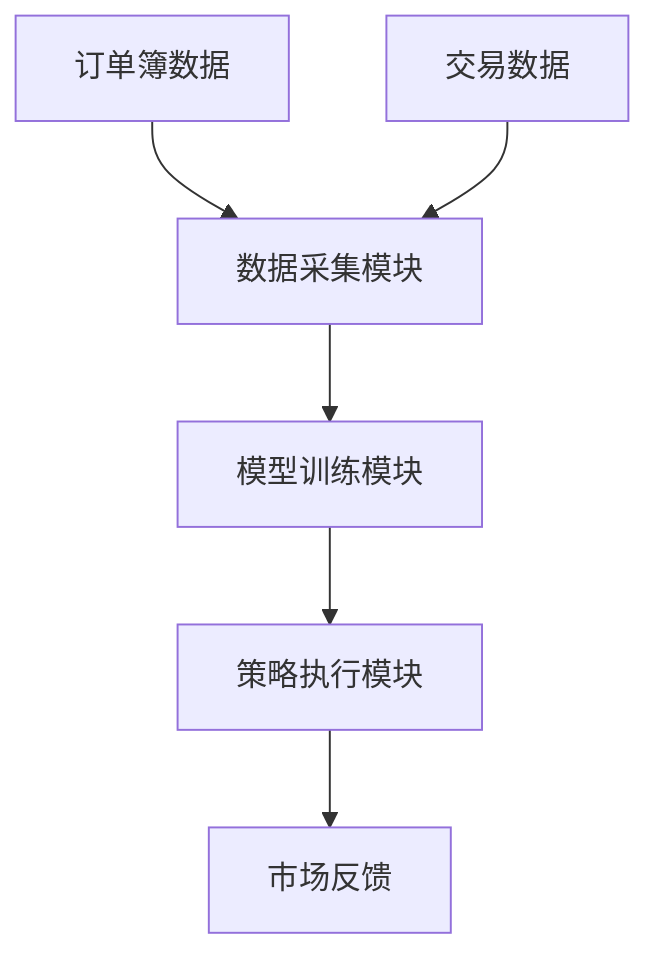

                 


# AI在金融市场流动性提供策略动态优化中的创新应用

> 关键词：AI, 金融市场, 流动性管理, 动态优化, 强化学习, 机器学习, 算法交易

> 摘要：本文深入探讨了人工智能技术在金融市场流动性管理中的创新应用，特别是通过动态优化策略提升流动性提供效率。文章从理论背景、算法原理、系统架构设计、项目实战到优化与展望，全面分析了AI在流动性管理中的潜力和实现路径，为金融从业者和研究人员提供了有价值的参考。

---

## 第一部分: AI在金融市场流动性提供中的背景与概念

### 第1章: 金融市场流动性管理概述

#### 1.1 金融市场的流动性概念

##### 1.1.1 什么是流动性
流动性指的是资产在市场中快速转换为现金的能力，是衡量市场健康程度的重要指标。高流动性意味着买卖容易，价格波动小；低流动性则可能导致交易成本增加，价格波动加剧。

##### 1.1.2 流动性在金融市场中的重要性
流动性是金融市场运作的核心，直接影响市场参与者的交易成本和效率。良好的流动性管理有助于降低市场风险，提高市场的稳定性和效率。

##### 1.1.3 流动性管理的目标与挑战
流动性管理的目标是确保市场在不同条件下的流动性需求得到满足，同时优化交易成本。然而，市场环境的复杂性和不确定性使得传统方法难以应对动态变化的流动性需求。

#### 1.2 AI在金融领域的应用背景

##### 1.2.1 人工智能在金融领域的应用现状
人工智能技术已经在金融领域的多个方面得到广泛应用，包括交易算法、风险管理、信用评分等。AI的引入极大地提升了金融市场的效率和精准度。

##### 1.2.2 金融市场中流动性管理的痛点
传统的流动性管理依赖于经验和规则，难以应对市场的快速变化和复杂场景。AI的引入为解决这些问题提供了新的思路。

##### 1.2.3 AI技术如何解决流动性管理问题
通过AI技术，可以实时分析市场数据，动态调整流动性策略，从而在复杂市场环境中实现更优的流动性管理。

### 第2章: AI驱动的流动性提供策略

#### 2.1 动态优化的基本概念

##### 2.1.1 动态优化的定义
动态优化是指在变化的市场环境中，根据实时数据调整策略，以达到最优目标的过程。在流动性管理中，动态优化意味着根据市场状况实时调整流动性提供策略。

##### 2.1.2 动态优化在流动性管理中的应用
动态优化可以应用于流动性预测、订单簿管理、交易策略调整等多个方面，帮助市场参与者更好地应对市场波动。

##### 2.1.3 动态优化的核心要素
动态优化的核心要素包括实时数据获取、模型构建与优化、策略执行与反馈机制。

#### 2.2 AI在流动性策略中的创新应用

##### 2.2.1 基于机器学习的策略优化
机器学习技术可以用于预测市场流动性变化，优化订单簿管理策略，从而提高流动性提供效率。

##### 2.2.2 基于强化学习的动态调整
强化学习通过模拟市场环境，训练AI模型在不同场景下做出最优决策，从而实现动态优化。

##### 2.2.3 结合市场微观结构的AI模型
市场微观结构分析为AI模型提供了更细粒度的市场信息，帮助模型更好地理解市场动态，优化流动性管理策略。

---

## 第二部分: AI算法与数学模型

### 第3章: 强化学习在流动性优化中的应用

#### 3.1 强化学习的基本原理

##### 3.1.1 强化学习的定义与特点
强化学习是一种通过试错过程来学习策略的技术，其核心是通过与环境的交互获得奖励，进而优化策略。

##### 3.1.2 状态、动作、奖励的定义
在流动性优化中，状态可以表示市场当前的流动性状况，动作是AI模型选择的操作，奖励是根据操作结果获得的收益或惩罚。

##### 3.1.3 Q-learning算法的数学模型
Q-learning算法通过更新Q值表来学习最优策略，数学模型如下：
$$ Q(s, a) = Q(s, a) + \alpha (r + \gamma \max Q(s', a') - Q(s, a)) $$

#### 3.2 动态策略优化的强化学习框架

##### 3.2.1 状态空间的构建
状态空间包括市场深度、订单簿状态、时间因素等多个维度的市场信息。

##### 3.2.2 动作空间的设计
动作空间包括调整订单数量、修改订单价格等具体操作。

##### 3.2.3 奖励函数的定义
奖励函数根据策略执行后的效果进行定义，例如，流动性提升带来正奖励，流动性下降带来负奖励。

### 第4章: 基于机器学习的流动性预测模型

#### 4.1 机器学习模型的选择与优化

##### 4.1.1 线性回归模型
线性回归模型用于预测市场流动性变化，虽然简单，但在某些场景下表现良好。

##### 4.1.2 支持向量回归模型
支持向量回归模型通过非线性特征映射，可以捕捉复杂的流动性变化模式。

##### 4.1.3 神经网络模型
深度神经网络模型能够处理高维非线性数据，适用于复杂的市场环境。

#### 4.2 流动性预测的数学模型

##### 4.2.1 时间序列模型的构建
时间序列模型通过分析历史流动性数据，预测未来的流动性变化。

##### 4.2.2 LSTM网络的应用
LSTM（长短期记忆网络）特别适合处理时间序列数据，能够捕捉市场的长期依赖关系。

##### 4.2.3 模型的训练与验证
通过交叉验证和回测，评估模型的预测精度和稳定性。

---

## 第三部分: 系统分析与架构设计

### 第5章: 流动性优化系统的架构设计

#### 5.1 系统功能模块划分

##### 5.1.1 数据采集模块
负责采集市场数据，包括订单簿、交易数据等。

##### 5.1.2 模型训练模块
对采集的数据进行特征提取和模型训练，生成最优策略。

##### 5.1.3 策略执行模块
根据模型生成的策略，执行实际的流动性管理操作。

#### 5.2 系统架构设计

##### 5.2.1 分层架构设计
系统分为数据层、算法层和策略执行层，各层之间通过接口进行交互。

##### 5.2.2 微服务架构
采用微服务架构，提高系统的可扩展性和灵活性。

##### 5.2.3 实时处理机制
通过实时数据处理和快速反馈机制，确保系统能够及时响应市场变化。

### 第6章: 系统架构图



---

## 第四部分: 项目实战

### 第7章: 高频交易中的策略优化

#### 7.1 项目背景与目标
通过AI技术优化高频交易中的流动性管理策略，降低交易成本，提高收益。

#### 7.2 环境配置
安装必要的开发工具和库，如Python、TensorFlow、Pandas等。

#### 7.3 核心代码实现

##### 7.3.1 数据处理
```python
import pandas as pd
data = pd.read_csv('market_data.csv')
```

##### 7.3.2 模型训练
```python
import tensorflow as tf
model = tf.keras.Sequential([
    tf.keras.layers.Dense(64, activation='relu'),
    tf.keras.layers.Dense(1, activation='linear')
])
model.compile(optimizer='adam', loss='mse')
model.fit(data[['bid', 'ask', 'volume']], data['spread'], epochs=100)
```

##### 7.3.3 策略执行
```python
def execute_strategy(model, market_data):
    predictions = model.predict(market_data[['bid', 'ask', 'volume']])
    # 根据预测结果调整订单
    return predictions
```

#### 7.4 结果分析与优化
通过回测和实盘测试，评估策略的效果，不断优化模型参数和策略执行逻辑。

---

## 第五部分: 优化与展望

### 第8章: 优化方向与未来展望

#### 8.1 当前项目的优化方向
进一步优化模型的泛化能力和实时处理能力，探索多目标优化策略。

#### 8.2 未来的研究方向
研究更先进的AI算法，如图神经网络和强化学习的结合，探索更复杂的市场动态。

#### 8.3 项目总结
通过AI技术实现流动性管理的动态优化，不仅提升了交易效率，还降低了市场风险。

---

## 作者

作者：AI天才研究院/AI Genius Institute & 禅与计算机程序设计艺术 /Zen And The Art of Computer Programming

