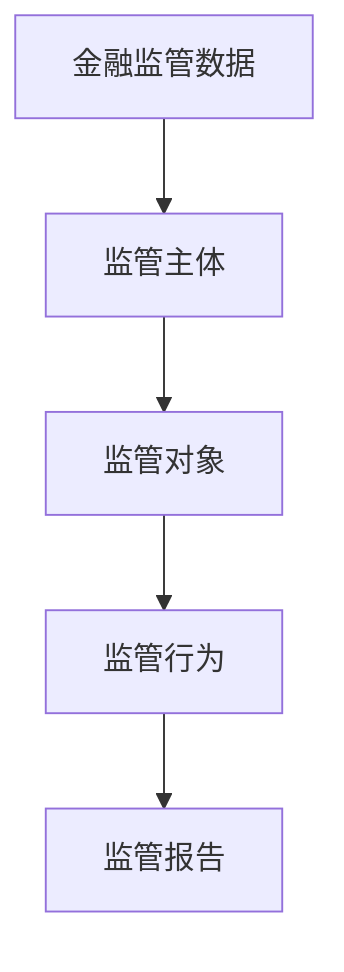
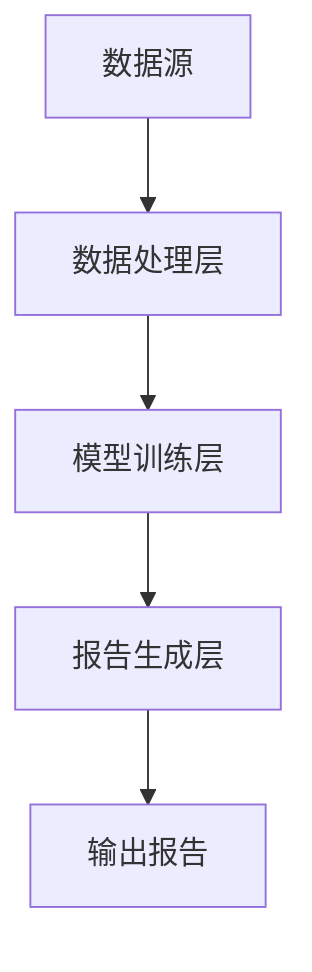

                 


# AI在金融监管报告生成中的应用

**关键词**：金融监管，人工智能，自然语言处理，生成模型，文本生成，金融数据分析

**摘要**：随着人工智能技术的快速发展，AI在金融监管报告生成中的应用越来越广泛。本文将从问题背景、核心概念、算法原理、系统架构到项目实战，全面探讨AI如何在金融监管报告生成中发挥重要作用。文章结合理论与实践，深入分析AI技术在金融监管中的优势，为读者提供一个清晰的视角来理解这一前沿领域的技术与应用。

---

## 第一部分: 问题背景与目标

### 第1章: 问题背景与目标

#### 1.1 问题背景
- **1.1.1 金融监管的重要性**：金融监管是维护金融市场稳定、保护投资者利益的重要手段。传统的监管方式依赖于人工审查和规则匹配，效率低下且容易出错。
- **1.1.2 传统金融监管报告的局限性**：传统报告生成过程繁琐，依赖人工操作，耗时长且成本高。同时，人工报告容易受到主观因素的影响，可能导致遗漏重要信息。
- **1.1.3 AI技术在金融监管中的潜力**：AI技术能够通过大数据分析和自然语言处理，快速生成准确的监管报告，提高监管效率和准确性。

#### 1.2 问题描述
- **1.2.1 金融监管报告生成的痛点**：传统报告生成过程繁琐，耗时长，且容易出错。人工操作难以应对海量数据的处理需求。
- **1.2.2 数据量与复杂性带来的挑战**：金融市场数据量庞大，且类型多样，传统的规则引擎难以应对复杂场景。
- **1.2.3 人工报告的效率与准确性问题**：人工生成报告容易受到主观因素的影响，导致报告质量和效率不高。

#### 1.3 问题解决目标
- **1.3.1 提高报告生成效率**：通过AI技术实现自动化报告生成，减少人工操作，提高效率。
- **1.3.2 提升报告的准确性和全面性**：利用AI技术对数据进行深度分析，确保报告内容的准确性和全面性。
- **1.3.3 实现自动化与智能化监管**：通过AI技术实现智能化监管，提高监管效率和效果。

---

## 第二部分: 核心概念与联系

### 第2章: 核心概念与联系

#### 2.1 核心概念原理
- **2.1.1 AI技术在金融监管中的应用原理**：AI技术通过机器学习算法对金融数据进行分析，生成符合监管要求的报告。核心在于数据处理、模型训练和生成输出。
- **2.1.2 自然语言处理（NLP）在报告生成中的作用**：NLP技术能够理解和生成自然语言文本，帮助AI系统自动生成符合规范的监管报告。
- **2.1.3 生成模型的数学基础**：生成模型通过概率分布和优化算法，生成符合要求的文本内容。

#### 2.2 核心概念属性对比
- **2.2.1 AI模型与传统规则引擎的对比**：
  - AI模型能够处理复杂场景，适应性更强。
  - 传统规则引擎依赖于预定义的规则，灵活性较差。
- **2.2.2 不同AI技术在金融监管中的适用场景**：
  - NLP适用于文本生成和信息提取。
  - 机器学习适用于模式识别和预测。
- **2.2.3 数据特征与模型性能的关系**：
  - 数据质量越高，模型生成的报告越准确。
  - 数据多样性越强，模型的适应性越强。

#### 2.3 ER实体关系图


---

## 第三部分: 算法原理与实现

### 第3章: 算法原理与实现

#### 3.1 算法原理
- **3.1.1 基于NLP的文本生成流程**：
  ```mermaid
  graph TD
      Start --> Input[输入金融数据]
      Input --> Process[自然语言处理]
      Process --> Generate[生成监管报告]
      Generate --> Output[输出报告]
  ```

#### 3.2 算法实现
- **3.2.1 环境安装**：
  ```bash
  pip install numpy pandas transformers
  ```
- **3.2.2 核心代码实现**：
  ```python
  def generate_report(data):
      # 数据预处理
      processed_data = preprocess(data)
      # 生成报告
      report = model.generate(processed_data)
      return report
  ```

---

## 第四部分: 数学模型与公式

### 第4章: 数学模型与公式

#### 4.1 概率模型
- **4.1.1 条件概率公式**：
  $$P(y|x) = \frac{P(x|y)P(y)}{P(x)}$$

#### 4.2 生成模型
- **4.2.1 变量关系**：
  $$y = f(x) + \epsilon$$
  其中，$x$为输入数据，$f(x)$为生成函数，$\epsilon$为噪声。

#### 4.3 优化目标
- **4.3.1 损失函数**：
  $$L = -\sum_{i=1}^{n} \log P(y_i|x_i)$$

---

## 第五部分: 系统架构与设计

### 第5章: 系统架构与设计

#### 5.1 系统功能设计
- **5.1.1 数据采集模块**：负责收集金融市场数据，包括股票价格、交易记录等。
- **5.1.2 模型训练模块**：对收集的数据进行预处理和模型训练，生成符合监管要求的报告。
- **5.1.3 报告生成模块**：根据训练好的模型生成监管报告，并输出结果。

#### 5.2 系统架构图


---

## 第六部分: 项目实战与案例分析

### 第6章: 项目实战与案例分析

#### 6.1 项目实战
- **6.1.1 环境安装**：
  ```bash
  pip install numpy pandas transformers
  ```
- **6.1.2 核心代码实现**：
  ```python
  def generate_report(data):
      # 数据预处理
      processed_data = preprocess(data)
      # 生成报告
      report = model.generate(processed_data)
      return report
  ```
- **6.1.3 案例分析**：
  通过实际案例分析，展示AI技术在金融监管报告生成中的应用效果。

---

## 总结

本文从问题背景、核心概念、算法原理、系统架构到项目实战，全面探讨了AI在金融监管报告生成中的应用。通过理论与实践的结合，展示了AI技术如何提高监管效率和准确性，为未来的金融监管提供了新的思路和方向。

**作者**：AI天才研究院/AI Genius Institute & 禅与计算机程序设计艺术 /Zen And The Art of Computer Programming

