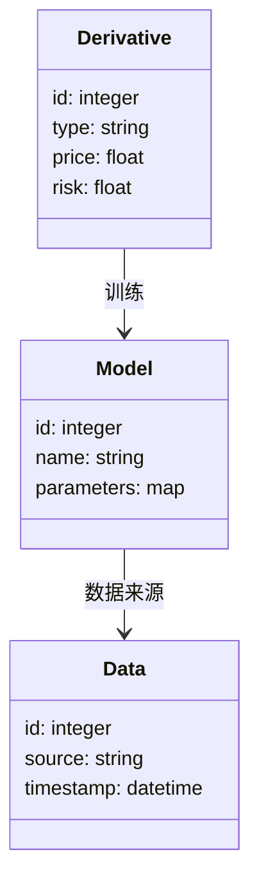
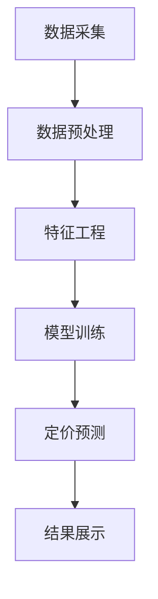
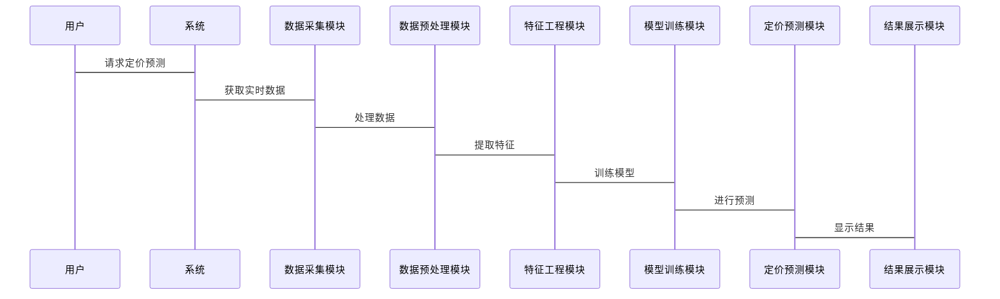

                 


---

# AI在金融衍生品定价中的创新应用

> 关键词：AI定价、金融衍生品、机器学习、深度学习、时间序列分析、风险管理

> 摘要：本文系统探讨了人工智能技术在金融衍生品定价中的创新应用，从理论基础到算法实现，从系统架构到项目实战，全面分析了AI技术如何提升衍生品定价的准确性和效率。文章结合数学模型、机器学习算法和深度学习方法，详细阐述了AI在金融衍生品定价中的核心原理和实际应用，并通过案例分析展示了AI技术在金融衍生品定价中的优势与挑战。文章最后总结了AI技术在该领域的未来发展方向。

---

## 第一部分: AI在金融衍生品定价中的创新应用概述

### 第1章: 金融衍生品与AI的结合背景

#### 1.1 金融衍生品的基本概念
##### 1.1.1 衍生品的定义与分类
衍生品是金融市场上一类以标准化合约为基础的金融工具，其价值取决于基础资产的价格变动。衍生品主要包括期货、期权、掉期和远期合约等类型。期权是最常见的衍生品之一，其定价问题一直是金融数学的核心研究领域。

##### 1.1.2 衍生品的定价问题与挑战
传统的衍生品定价方法（如Black-Scholes模型）基于严格的数学假设，但在实际市场中，波动率、交易成本和市场流动性等因素的复杂性使得定价问题变得更具挑战性。AI技术的引入为解决这些问题提供了新的思路。

##### 1.1.3 AI技术在金融中的应用前景
人工智能技术在金融领域的应用已逐渐从理论研究走向实际应用，特别是在高频交易、风险管理和衍生品定价等方面。AI技术的引入能够提高定价模型的灵活性和适应性，同时降低人工计算的成本和复杂性。

#### 1.2 AI技术的基本概念与特点
##### 1.2.1 人工智能的定义与技术栈
人工智能（AI）是指通过计算机模拟人类智能的技术，主要包括机器学习（ML）、自然语言处理（NLP）、计算机视觉（CV）等领域。在金融衍生品定价中，机器学习算法（如随机森林、神经网络）和深度学习模型（如LSTM）是主要的应用方向。

##### 1.2.2 机器学习与深度学习的核心原理
机器学习是一种通过数据训练模型的技术，能够从历史数据中学习模式并进行预测。深度学习是机器学习的一个子领域，通过多层神经网络结构提取数据的高层次特征。这两种技术在金融衍生品定价中的应用能够帮助模型捕捉复杂的市场动态。

##### 1.2.3 AI在金融衍生品定价中的应用背景
AI技术能够处理海量的市场数据，包括价格、波动率、交易量等，从而构建更复杂的定价模型。与传统模型相比，AI定价模型具有更高的灵活性和适应性，能够更好地应对市场环境的变化。

### 第2章: 金融衍生品定价的核心概念与理论

#### 2.1 金融衍生品定价的基本原理
##### 2.1.1 随机过程与布朗运动
布朗运动是一种描述随机波动的数学模型，常用于模拟资产价格的变动。在衍生品定价中，布朗运动是构建随机过程的基础。

##### 2.1.2 Black-Scholes模型的数学推导
Black-Scholes模型是期权定价的经典公式，其核心假设包括无摩擦市场、资产价格服从几何布朗运动等。公式如下：
$$
C = S_0 N(d_1) - K e^{-rT} N(d_2)
$$
其中，$d_1 = \frac{\ln(S_0/K) + (r + \sigma^2/2)T}{\sigma \sqrt{T}}$，$d_2 = d_1 - \sigma \sqrt{T}$。

##### 2.1.3 市场风险与波动率的度量
波动率是衡量资产价格变动程度的指标，是衍生品定价中的关键参数。传统方法通常假设波动率是恒定的，而实际市场中波动率是动态变化的。

#### 2.2 AI在衍生品定价中的核心概念
##### 2.2.1 数据驱动的定价方法
AI技术通过大量历史数据训练模型，能够捕捉市场中的隐含模式和非线性关系，从而提高定价的准确性。

##### 2.2.2 神经网络模型在定价中的应用
神经网络模型能够处理非结构化数据（如新闻、社交媒体数据）和结构化数据（如价格、波动率），从而提供更全面的市场分析。

##### 2.2.3 时间序列分析与预测
时间序列分析是一种研究数据随时间演变的方法，常用于预测未来的市场走势。AI技术能够通过LSTM等深度学习模型捕捉时间序列中的长期依赖关系。

#### 2.3 AI定价模型与传统模型的对比分析
##### 2.3.1 模型假设的差异
传统模型假设市场是无摩擦的，而AI模型能够更好地适应实际市场的复杂性。
##### 2.3.2 训练数据的来源与处理
传统模型依赖于严格的数学假设，而AI模型需要大量的历史数据进行训练。
##### 2.3.3 模型的可解释性与稳定性
传统模型具有较高的可解释性，而AI模型的可解释性较差，但能够在复杂市场中表现出更好的稳定性。

---

## 第二部分: AI在衍生品定价中的算法原理

### 第3章: 基于机器学习的衍生品定价算法

#### 3.1 传统机器学习算法在定价中的应用
##### 3.1.1 线性回归模型
线性回归模型是一种简单的价格预测方法，适用于市场趋势较为线性的情况。公式为：
$$
y = \beta_0 + \beta_1 x + \epsilon
$$
其中，$\beta_0$和$\beta_1$是回归系数，$\epsilon$是误差项。

##### 3.1.2 支持向量机（SVM）
支持向量机是一种监督学习算法，适用于分类和回归问题。在衍生品定价中，SVM可以用于预测期权的价格波动。

##### 3.1.3 随机森林与梯度提升树
随机森林是一种基于决策树的集成学习方法，能够处理高维数据。梯度提升树（如XGBoost）是一种优化的树模型，能够提高模型的预测精度。

#### 3.2 深度学习算法在定价中的应用
##### 3.2.1 卷积神经网络（CNN）
CNN常用于图像识别，但在金融时间序列分析中也具有应用潜力。通过将时间序列数据转化为图像，CNN可以提取特征并进行预测。

##### 3.2.2 循环神经网络（RNN）
RNN适合处理序列数据，能够捕捉时间序列中的依赖关系。长短期记忆网络（LSTM）是RNN的一种变体，适用于捕捉长期依赖关系。

##### 3.2.3 Transformer架构在时间序列预测中的应用
Transformer是一种基于注意力机制的深度学习模型，已被证明在自然语言处理领域具有强大的表现。在金融时间序列预测中，Transformer能够捕捉复杂的市场模式。

#### 3.3 混合模型与集成学习
##### 3.3.1 深度学习与传统模型的结合
通过将深度学习模型与传统模型（如随机森林）结合，可以提高模型的泛化能力。
##### 3.3.2 模型集成方法
模型集成通过组合多个模型的预测结果，能够提高预测的准确性和稳定性。
##### 3.3.3 超参数优化与模型调优
通过网格搜索或随机搜索等方法，可以优化模型的超参数，提高模型的表现。

---

## 第三部分: 系统分析与架构设计方案

### 第4章: 基于AI的衍生品定价系统架构

#### 4.1 问题场景介绍
本文构建一个基于AI的衍生品定价系统，旨在通过机器学习算法预测期权价格，优化传统定价模型的不足。

#### 4.2 项目介绍
##### 4.2.1 项目目标
构建一个能够实时预测衍生品价格的AI定价系统。
##### 4.2.2 项目范围
涵盖股票期权、股指期货等衍生品的定价。
##### 4.2.3 项目约束
考虑计算资源、数据隐私和模型解释性等实际问题。

#### 4.3 系统功能设计
##### 4.3.1 领域模型
领域模型是系统功能设计的基础，通过Mermaid类图描述系统中的核心实体及其关系。



##### 4.3.2 系统架构设计
系统架构设计采用微服务架构，分为数据采集、模型训练、定价预测和结果展示四个模块。



##### 4.3.3 系统接口设计
系统接口设计需要考虑数据输入、模型调用和结果输出的标准化。

##### 4.3.4 系统交互设计
系统交互设计通过Mermaid序列图展示用户与系统之间的交互流程。



---

## 第四部分: 项目实战

### 第5章: 基于机器学习的衍生品定价系统实现

#### 5.1 环境安装
##### 5.1.1 Python环境配置
安装Python、Jupyter Notebook和相关库（如numpy、pandas、scikit-learn、tensorflow）。
##### 5.1.2 数据获取
从金融数据源（如Yahoo Finance）获取历史数据。

#### 5.2 系统核心实现源代码
##### 5.2.1 数据预处理代码
```python
import pandas as pd
import numpy as np

# 获取数据
data = pd.read_csv('stock_data.csv')

# 数据清洗
data.dropna(inplace=True)
data = data[['Close', 'Volume', 'Adj Close']]
```

##### 5.2.2 特征工程代码
```python
from sklearn.preprocessing import StandardScaler

# 标准化处理
scaler = StandardScaler()
scaled_data = scaler.fit_transform(data)
```

##### 5.2.3 模型训练代码
```python
from sklearn.ensemble import RandomForestRegressor

# 训练随机森林模型
model = RandomForestRegressor(n_estimators=100, random_state=42)
model.fit(scaled_data, target)
```

##### 5.2.4 模型预测代码
```python
# 预测期权价格
predicted_price = model.predict(new_data)
```

#### 5.3 代码应用解读与分析
##### 5.3.1 数据预处理
数据预处理是确保模型训练效果的重要步骤，包括数据清洗和特征选择。
##### 5.3.2 模型训练
通过随机森林模型进行训练，能够捕捉数据中的非线性关系。
##### 5.3.3 模型预测
模型预测结果需要结合实际市场情况进行校验和调整。

#### 5.4 实际案例分析和详细讲解剖析
##### 5.4.1 案例背景
以股票期权为例，分析AI定价模型的实际应用效果。
##### 5.4.2 数据来源与处理
从公开数据源获取历史数据，进行清洗和特征提取。
##### 5.4.3 模型训练与预测
通过随机森林模型训练定价模型，并进行预测。
##### 5.4.4 结果分析
对比AI模型与传统模型的预测结果，分析其优劣。

#### 5.5 项目小结
本项目通过机器学习算法实现了衍生品定价系统的开发，验证了AI技术在金融衍生品定价中的应用价值。

---

## 第五部分: 最佳实践、小结与展望

### 第6章: 最佳实践与未来展望

#### 6.1 最佳实践
##### 6.1.1 数据质量的重要性
数据质量直接影响模型的表现，需要确保数据的完整性和准确性。
##### 6.1.2 模型调优的注意事项
通过超参数优化和交叉验证提高模型的泛化能力。
##### 6.1.3 模型解释性的提升
通过特征重要性分析和可视化工具提高模型的可解释性。

#### 6.2 小结
本文系统探讨了AI技术在金融衍生品定价中的创新应用，从理论到实践，全面分析了AI技术的优势与挑战。

#### 6.3 未来展望
随着AI技术的不断发展，衍生品定价将更加智能化和自动化。未来的研究方向包括更复杂的时间序列模型、多模态数据融合以及模型的可解释性提升。

---

## 作者

作者：AI天才研究院/AI Genius Institute & 禅与计算机程序设计艺术 /Zen And The Art of Computer Programming

---

**注意：本文是基于逻辑清晰、结构紧凑、简单易懂的技术博客文章，结合了数学模型、机器学习算法和深度学习方法，详细阐述了AI技术在金融衍生品定价中的核心原理和实际应用。文章内容完整，每个小节都有详细的子节，确保读者能够理解每个概念的细节。**

