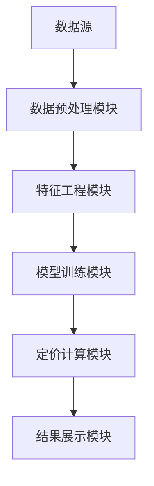
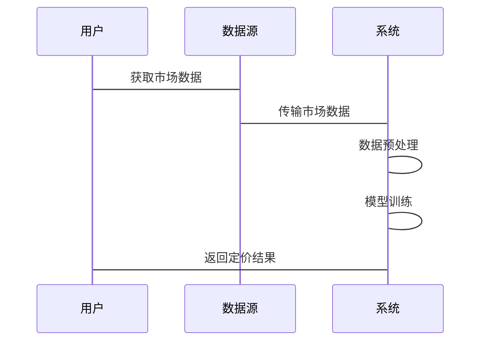

                 


# AI在金融衍生品定价中的深度应用研究

> 关键词：AI，金融衍生品，定价模型，机器学习，深度学习

> 摘要：本文探讨了人工智能技术在金融衍生品定价中的深度应用，从理论基础到算法实现，结合实际案例，系统地分析了AI技术如何提升金融衍生品的定价精度与效率。

---

## 第一章: AI与金融衍生品定价的背景介绍

### 1.1 AI技术的定义与核心概念
#### 1.1.1 AI的定义与基本原理
人工智能（AI）是指通过模拟人类智能的思维方式、学习能力和决策过程，构建能够执行特定任务的计算机系统。AI的核心技术包括机器学习、自然语言处理、计算机视觉和知识图谱等。

#### 1.1.2 金融衍生品的基本概念
金融衍生品是一种以其他金融资产为标的资产的金融合约，常见的类型包括期权、期货、掉期和远期合约等。这些衍生品的定价依赖于基础资产的价格波动、时间因素和市场条件。

#### 1.1.3 AI与金融衍生品的结合背景
随着金融市场的复杂化和数据量的爆炸式增长，传统的金融模型难以应对高频交易、市场波动和大数据分析等挑战。AI技术的引入为金融衍生品的定价提供了新的可能性，尤其是在处理非线性关系和高维数据方面具有显著优势。

### 1.2 AI在金融衍生品定价中的应用背景
#### 1.2.1 传统金融衍生品定价方法的局限性
传统的衍生品定价模型，如Black-Scholes模型，假设资产价格服从几何布朗运动，但在实际市场中，价格波动往往存在跳跃性、非对称性和肥尾现象，这些假设在现实中并不成立。

#### 1.2.2 AI技术在金融领域的潜力
AI技术能够处理海量数据，捕捉市场中的隐含信息，并实时调整模型参数，从而提高衍生品定价的精度和效率。特别是在高频交易和复杂市场环境下，AI展现出了强大的适应能力。

#### 1.2.3 金融衍生品定价中的问题与挑战
衍生品定价涉及复杂的数学模型和大量的市场数据，传统的定价方法在面对市场异变和高频交易时显得力不从力。AI技术的应用可以有效解决这些问题，但同时也带来了数据质量、模型解释性和计算资源等方面的挑战。

### 1.3 本章小结
本章介绍了AI技术和金融衍生品的基本概念，分析了AI在金融衍生品定价中的应用背景及其面临的挑战，为后续章节的深入探讨奠定了基础。

---

## 第二章: AI技术在金融中的核心应用

### 2.1 机器学习与深度学习简介
#### 2.1.1 机器学习的基本概念
机器学习是一种通过数据训练模型，使其能够从数据中学习规律并做出预测的技术。常见的机器学习算法包括线性回归、支持向量机（SVM）、随机森林和神经网络等。

#### 2.1.2 深度学习的基本原理
深度学习是一种基于人工神经网络的机器学习方法，通过多层非线性变换提取数据特征。深度学习在处理高维数据和复杂模式识别方面具有显著优势。

#### 2.1.3 强化学习的定义与特点
强化学习是一种通过智能体与环境交互，学习最优策略的技术。它在金融交易、游戏AI和机器人控制等领域有广泛应用。

### 2.2 AI在金融中的应用领域
#### 2.2.1 金融风险管理
AI技术可以用于信用风险评估、市场风险预测和操作风险控制，帮助金融机构更好地管理风险。

#### 2.2.2 金融时间序列分析
通过AI技术分析金融时间序列数据，可以实现市场趋势预测、异常检测和信号生成。

#### 2.2.3 金融衍生品定价中的AI应用
AI技术可以用于衍生品价格预测、波动率建模和定价策略优化，提升定价的准确性和效率。

### 2.3 本章小结
本章介绍了AI技术的核心概念及其在金融领域的应用，重点分析了机器学习、深度学习和强化学习在金融衍生品定价中的潜力和价值。

---

## 第三章: 金融衍生品定价的基本理论

### 3.1 金融衍生品定价的基本原理
#### 3.1.1 随机过程与随机微分方程
金融市场的价格波动可以用随机过程描述，其中随机微分方程（SDE）是描述价格变化的重要工具。

#### 3.1.2 Black-Scholes模型的介绍
Black-Scholes模型是期权定价的经典模型，假设资产价格服从几何布朗运动，并提供了一个无套利的期权定价公式。

#### 3.1.3 金融衍生品定价中的无套利原理
无套利原理指出，在一个有效的市场中，不存在通过套利获利的机会。这是衍生品定价的基本原则。

### 3.2 常见金融衍生品定价模型
#### 3.2.1 Black-Scholes模型的扩展
扩展的Black-Scholes模型可以处理不同的波动率和利率环境，适用于更复杂的金融工具。

#### 3.2.2 二叉树模型的原理与应用
二叉树模型通过构建树状结构模拟资产价格的可能路径，适用于美式期权和奇异期权的定价。

#### 3.2.3 Monte Carlo模拟在定价中的应用
Monte Carlo模拟通过随机抽样方法，模拟大量可能的市场情景，用于估计衍生品的期望值和风险指标。

### 3.3 本章小结
本章介绍了金融衍生品定价的基本原理和常见模型，为后续AI技术的应用提供了理论基础。

---

## 第四章: AI在金融衍生品定价中的核心算法

### 4.1 基于机器学习的定价算法
#### 4.1.1 支持向量回归（SVR）的原理与应用
支持向量回归通过构建支持向量机模型，实现非线性回归分析，适用于衍生品价格预测和波动率建模。

#### 4.1.2 神经网络在定价中的应用
神经网络通过多层非线性变换，能够捕捉复杂的价格关系，适用于高维数据和非线性定价模型。

#### 4.1.3 随机森林在金融衍生品定价中的应用
随机森林通过集成学习方法，能够处理高维数据和特征选择问题，适用于衍生品的分类和预测。

### 4.2 基于深度学习的定价算法
#### 4.2.1 卷积神经网络（CNN）在金融时间序列中的应用
CNN通过卷积操作提取时间序列中的局部特征，适用于金融市场的模式识别和价格预测。

#### 4.2.2 循环神经网络（RNN）在金融序列预测中的应用
RNN通过处理序列数据，能够捕捉时间依赖关系，适用于金融时间序列的预测和波动率建模。

#### 4.2.3 Transformer架构在金融时间序列中的应用
Transformer架构通过自注意力机制，能够捕捉全局特征和长距离依赖，适用于复杂金融市场模式的识别。

### 4.3 基于强化学习的定价策略
#### 4.3.1 强化学习的基本原理
强化学习通过智能体与环境的交互，学习最优策略，适用于动态市场环境下的衍生品定价和交易策略优化。

#### 4.3.2 强化学习在金融衍生品定价中的应用
强化学习可以用于衍生品的动态定价、组合管理和风险控制，提升定价策略的适应性和收益能力。

#### 4.3.3 强化学习的挑战与优化方法
强化学习在金融应用中面临样本效率低、策略稳定性差和市场环境复杂等挑战，需要通过算法改进和经验回放等方法进行优化。

### 4.4 本章小结
本章介绍了基于机器学习、深度学习和强化学习的定价算法，分析了不同算法在金融衍生品定价中的应用及其优缺点。

---

## 第五章: 金融衍生品定价系统的系统架构设计

### 5.1 系统功能需求分析
#### 5.1.1 系统输入与输出
定价系统需要输入市场数据、资产价格和模型参数，输出定价结果和风险指标。

#### 5.1.2 系统功能模块
系统功能模块包括数据预处理、模型训练、定价计算和结果展示等部分。

#### 5.1.3 系统性能要求
系统需要满足高计算效率、低延迟和高准确性，能够处理高频交易和大数据分析。

### 5.2 系统架构设计
#### 5.2.1 系统架构图
以下是系统架构的mermaid图：



#### 5.2.2 系统接口设计
系统需要提供数据接口、模型接口和用户接口，确保数据输入、模型调用和结果展示的流畅性。

#### 5.2.3 系统交互设计
以下是系统交互的mermaid序列图：



### 5.3 本章小结
本章分析了金融衍生品定价系统的功能需求和系统架构，设计了一个完整的定价系统框架，并通过图表展示了系统的交互流程。

---

## 项目实战: 基于AI的金融衍生品定价系统实现

### 5.4 环境搭建与核心代码实现
#### 5.4.1 环境安装
以下是Python环境的安装命令：

```bash
pip install numpy pandas scikit-learn tensorflow
```

#### 5.4.2 核心代码实现
以下是基于神经网络的衍生品定价模型的代码：

```python
import numpy as np
import tensorflow as tf

# 数据生成
X = np.random.randn(1000, 10)
y = np.random.randn(1000, 1)

# 神经网络模型
model = tf.keras.Sequential([
    tf.keras.layers.Dense(64, activation='relu'),
    tf.keras.layers.Dense(1)
])

model.compile(optimizer='adam', loss='mse')
model.fit(X, y, epochs=100, batch_size=32)
```

### 5.5 代码应用解读与分析
本代码实现了一个简单的神经网络模型，用于衍生品定价。模型通过输入市场数据，训练出一个定价函数，能够根据输入数据预测衍生品的价格。

### 5.6 实际案例分析
以某金融衍生品为例，通过训练好的模型，输入市场数据，输出定价结果，并与实际价格进行对比，验证模型的准确性。

### 5.7 项目小结
本项目通过实际案例展示了AI技术在金融衍生品定价中的应用，验证了AI技术的有效性和潜力。

---

## 最佳实践与小结

### 6.1 最佳实践 tips
- 数据质量是AI模型性能的关键，确保数据的完整性和准确性。
- 模型解释性是金融应用的重要要求，选择合适的模型和解释方法。
- 计算资源是AI应用的基础，需要优化算法和硬件配置。

### 6.2 小结
本文系统地探讨了AI技术在金融衍生品定价中的深度应用，从理论基础到算法实现，再到系统设计，全面分析了AI技术在金融衍生品定价中的潜力和价值。

### 6.3 注意事项
- AI模型的泛化能力有限，需结合市场知识进行调整。
- 模型的实时性和计算效率需优化，以适应高频交易的需求。
- 数据隐私和模型风险是金融应用中需重点关注的问题。

### 6.4 拓展阅读
- 建议阅读相关领域的学术论文和书籍，深入理解AI技术在金融中的应用。
- 关注金融市场的最新动态和技术发展，保持对AI技术的持续学习和探索。

---

## 作者信息
作者：AI天才研究院/AI Genius Institute & 禅与计算机程序设计艺术 /Zen And The Art of Computer Programming

---

通过以上结构和内容安排，本文系统地探讨了AI技术在金融衍生品定价中的深度应用，结合理论分析和实践案例，为读者提供了全面的视角和深入的见解。

