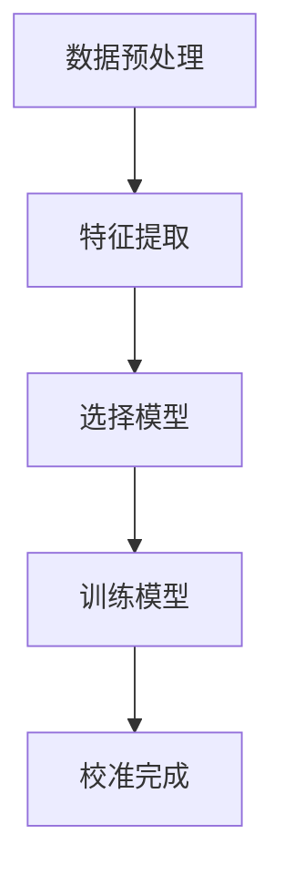

                 


# AI在金融衍生品定价模型校准中的创新应用

## 关键词：
- AI
- 金融衍生品
- 定价模型
- 校准
- 机器学习
- 深度学习

## 摘要：
本文探讨了人工智能技术在金融衍生品定价模型校准中的创新应用。通过分析定价模型校准的核心问题，结合机器学习和深度学习算法，提出了一种高效的AI驱动校准方法。本文详细介绍了AI算法的原理、系统架构设计、项目实战案例，并展望了未来的发展方向，为金融衍生品定价领域的技术创新提供了参考。

---

# 第一部分: 背景介绍

## 第1章: 金融衍生品定价模型校准的背景与挑战

### 1.1 金融衍生品的基本概念
#### 1.1.1 金融衍生品的定义与分类
- 金融衍生品的定义：基于标的资产（如股票、债券、商品等）的价格波动而衍生出来的金融工具。
- 分类：包括期权、期货、掉期、远期合约等。

#### 1.1.2 衍生品定价的基本原理
- 期权定价公式：以Black-Scholes模型为例，$$C = S_0 \Phi(d_1) - K e^{-rT} \Phi(d_2)$$，其中$C$是期权价格，$S_0$是标的资产价格，$K$是行权价，$r$是无风险利率，$T$是时间，$\Phi$是标准正态分布函数，$d_1 = \frac{\ln(S_0/K) + (r + \sigma^2/2)T}{\sigma \sqrt{T}}$$。

#### 1.1.3 校准在衍生品定价中的重要性
- 校准是指通过调整模型参数，使模型预测的价格与市场实际价格相匹配的过程。
- 校准的目的是提高模型的准确性和实用性。

### 1.2 定价模型校准的核心问题
#### 1.2.1 参数估计与数值方法
- 参数估计：如波动率$\sigma$、漂移系数$\mu$等的估计。
- 数值方法：如蒙特卡洛模拟、有限差分法等。

#### 1.2.2 模型选择与风险中性定价
- 模型选择：如随机波动率模型、跳跃扩散模型等。
- 风险中性定价：在无套利条件下，使模型参数满足风险中性假设。

#### 1.2.3 校准过程中的挑战与难点
- 高维参数空间中的优化问题。
- 数据噪声和缺失带来的不确定性。
- 计算复杂性和收敛性问题。

### 1.3 AI在金融领域的应用现状
#### 1.3.1 AI在金融分析中的应用
- 金融时间序列预测：如股票价格预测、波动率预测。
- 风险管理：如信用评分、市场风险预警。

#### 1.3.2 AI在衍生品定价中的创新应用
- 使用机器学习算法优化模型参数。
- 深度学习模型预测衍生品价格。
- 自适应校准方法提高模型鲁棒性。

#### 1.3.3 当前研究的热点与趋势
- 结合量子计算和AI技术的校准方法。
- 解释性AI（XAI）在金融模型中的应用。

---

# 第二部分: 核心概念与理论基础

## 第2章: 定价模型校准的核心概念与联系

### 2.1 定价模型校准的理论基础
#### 2.1.1 随机过程与蒙特卡洛模拟
- 随机过程：如布朗运动、跳跃过程。
- 蒙特卡洛模拟：通过模拟大量随机路径来估计模型参数。

#### 2.1.2 期权定价模型的数学框架
- Black-Scholes模型的扩展：如考虑交易成本、流动性冲击的模型。
- 数值解法：如二叉树模型、有限差分法。

#### 2.1.3 校准问题的数学表达
- 校准目标函数：$$\min_{\theta} \sum_{i=1}^n (P_i - M(\theta))^2$$，其中$P_i$是市场价格，$M(\theta)$是模型预测价格。
- 参数空间$\theta$的优化问题。

### 2.2 AI在模型校准中的应用原理
#### 2.2.1 机器学习算法的基本原理
- 监督学习：通过训练数据学习特征与目标变量之间的关系。
- 回归分析：如线性回归、支持向量回归（SVR）。

#### 2.2.2 深度学习模型在时间序列预测中的应用
- 循序神经网络（RNN）：处理时间序列数据。
- 长短期记忆网络（LSTM）：捕捉长期依赖关系。
- Transformer架构：用于全局依赖建模。

#### 2.2.3 神经网络在参数估计中的优势
- 神经网络的非线性拟合能力。
- 自动特征提取能力。

### 2.3 核心概念对比与ER实体关系图
#### 2.3.1 不同校准方法的对比分析
| 方法 | 优点 | 缺点 |
|------|------|------|
| 线性回归 | 简单易懂 | 无法处理非线性关系 |
| 支持向量回归 | 高精度 | 计算复杂 |
| 神经网络 | 非线性拟合能力强 | �易过拟合 |

#### 2.3.2 校准过程的ER实体关系图
```mermaid
er
actor: 用户
model: 定价模型
parameter: 模型参数
data: 市场数据
process: 校准过程
actor --> process
model --> parameter
data --> process
```

---

# 第三部分: 算法原理

## 第3章: AI驱动的校准算法原理

### 3.1 机器学习算法
#### 3.1.1 线性回归与支持向量回归
- 线性回归：$$y = \beta_0 + \beta_1 x + \epsilon$$
- 支持向量回归：通过寻找最优超平面和管核区域，最小化经验损失。

#### 3.1.2 神经网络模型
- 多层感知机（MLP）：$$y = \sigma(w_2 \sigma(w_1 x + b_1) + b_2)$$，其中$\sigma$是激活函数。

### 3.2 深度学习算法
#### 3.2.1 LSTM网络
- LSTM结构：包括输入门（input gate）、遗忘门（forget gate）和输出门（output gate）。
- 应用：用于时间序列数据的预测。

#### 3.2.2 Transformer架构
- 自注意力机制：$$\text{Attention}(Q, K, V) = \text{softmax}\left(\frac{QK^T}{\sqrt{d_k}}\right)V$$
- 用于捕捉全局依赖关系。

### 3.3 算法流程图


---

# 第四部分: 系统分析与架构设计

## 第4章: 系统架构与设计

### 4.1 问题场景介绍
- 金融衍生品定价系统的开发需求。
- 校准模块的功能需求。

### 4.2 系统功能设计
#### 4.2.1 数据采集模块
- 数据来源：市场数据、历史价格、波动率等。
- 数据预处理：清洗、标准化。

#### 4.2.2 特征工程模块
- 特征提取：如均值、方差、自相关系数等。
- 特征选择：使用主成分分析（PCA）降维。

#### 4.2.3 模型训练模块
- 模型选择：线性回归、LSTM、Transformer等。
- 超参数优化：如学习率、批量大小。

#### 4.2.4 结果分析模块
- 模型评估：均方误差（MSE）、R平方值。
- 结果可视化：预测价格与实际价格对比图。

### 4.3 系统架构设计


---

# 第五部分: 项目实战

## 第5章: 项目实战与实现

### 5.1 环境配置
- Python版本：3.8+
- 库的安装：numpy、pandas、tensorflow、scikit-learn。

### 5.2 核心实现
#### 5.2.1 数据预处理
```python
import numpy as np
import pandas as pd

# 加载数据
data = pd.read_csv('market_data.csv')
# 数据标准化
from sklearn.preprocessing import StandardScaler
scaler = StandardScaler()
data_scaled = scaler.fit_transform(data)
```

#### 5.2.2 模型实现
```python
from tensorflow.keras.models import Sequential
from tensorflow.keras.layers import LSTM, Dense, Dropout

model = Sequential()
model.add(LSTM(64, input_shape=(timesteps, features)))
model.add(Dropout(0.2))
model.add(Dense(1))
model.compile(loss='mean_squared_error', optimizer='adam')
```

#### 5.2.3 结果分析
```python
from sklearn.metrics import mean_squared_error, r2_score

y_pred = model.predict(X_test)
mse = mean_squared_error(y_test, y_pred)
r2 = r2_score(y_test, y_pred)
print(f'MSE: {mse}, R2: {r2}')
```

### 5.3 实际案例分析
- 案例背景：某金融衍生品的定价问题。
- 数据分析：通过LSTM模型预测期权价格，校准模型参数。
- 结果展示：对比模型预测价格与实际价格，验证模型的有效性。

### 5.4 项目小结
- 项目的成功之处。
- 可以改进的地方。

---

# 第六部分: 总结与展望

## 第6章: 总结与展望

### 6.1 总结
- 本文提出了基于AI的金融衍生品定价模型校准方法。
- 通过机器学习和深度学习算法，显著提高了校准效率和准确性。

### 6.2 展望
- 结合量子计算和AI技术，进一步提升校准精度。
- 开发可解释性AI（XAI）模型，增强金融领域的可信度。

### 6.3 最佳实践 tips
- 数据质量是模型性能的关键，需确保数据清洗和特征工程。
- 模型选择应根据具体问题和数据特点进行调整。
- 定期更新模型参数，以应对市场变化。

---

# 作者：AI天才研究院 & 禅与计算机程序设计艺术

---

通过以上目录结构和内容安排，本文全面介绍了AI在金融衍生品定价模型校准中的创新应用，从理论基础到实战案例，为读者提供了系统性的知识和实践指导。

