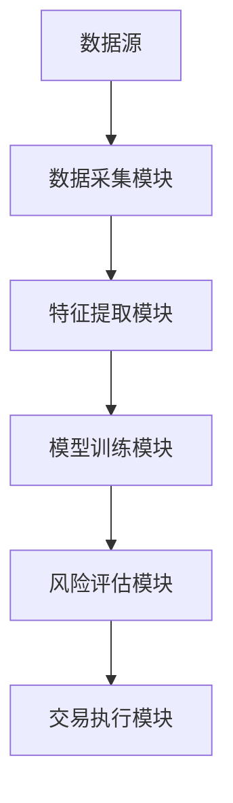
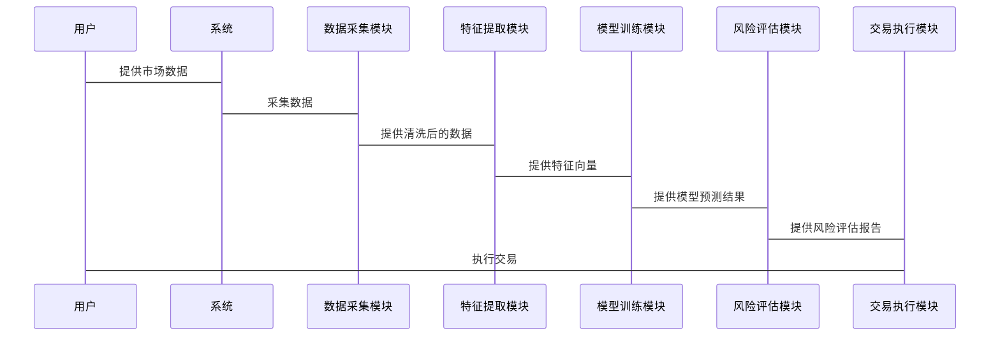

                 


# AI在金融衍生品设计中的创新应用

> 关键词：人工智能，金融衍生品，定价模型，风险管理，交易策略，系统架构

> 摘要：本文探讨了人工智能在金融衍生品设计中的创新应用，从背景、核心算法到系统架构，全面分析了AI如何改变衍生品的定价、风险管理和交易策略。通过实际案例和系统设计，展示了AI在金融衍生品领域的巨大潜力。

---

# 第一部分: AI与金融衍生品的背景与概念

## 第1章: AI与金融衍生品概述

### 1.1 人工智能与金融的结合
人工智能（AI）作为一项革命性技术，正在逐步改变金融行业的各个领域。AI通过大数据分析、模式识别和自动化决策，为金融衍生品的设计和交易提供了新的可能性。

#### 1.1.1 人工智能的基本概念
人工智能是指通过计算机模拟人类智能的技术，包括学习、推理、感知和决策等能力。AI的核心算法包括机器学习、深度学习、自然语言处理和强化学习。

#### 1.1.2 人工智能在金融领域的应用
AI在金融领域的应用广泛，包括股票交易、风险评估、信用评分、市场预测和客户画像等。AI的高效性和准确性使其成为金融行业的核心工具。

#### 1.1.3 金融衍生品的基本概念
金融衍生品是一种金融合约，其价值来源于基础资产（如股票、债券、商品等）的价格波动。常见的衍生品包括期权、期货、掉期和远期合约。

### 1.2 金融衍生品的核心原理
衍生品的设计和定价需要考虑多种因素，包括市场波动性、利率、流动性风险和信用风险等。

#### 1.2.1 衍生品的定义与分类
- **定义**：衍生品是一种衍生自基础资产的金融工具，其价值依赖于基础资产的价格波动。
- **分类**：衍生品可以分为远期合约、期货合约、期权合约和互换合约等。

#### 1.2.2 衍生品的基本定价模型
衍生品的定价模型通常基于随机过程和概率论。最常用的模型包括Black-Scholes模型和蒙特卡洛模拟。

#### 1.2.3 衍生品的风险管理
风险管理是衍生品设计的核心。常用的风险管理工具包括VaR（在险值）和CVaR（条件在险值）。

### 1.3 AI在金融衍生品中的创新应用
AI通过其强大的数据处理能力和算法优化能力，正在改变衍生品的设计和交易方式。

#### 1.3.1 AI在衍生品定价中的作用
AI可以通过历史数据和市场行为预测衍生品的定价，优化传统定价模型的准确性。

#### 1.3.2 AI在风险评估中的应用
AI可以实时监控市场波动，预测潜在风险，并制定相应的风险管理策略。

#### 1.3.3 AI在交易策略中的创新
AI可以通过算法交易和高频交易，优化交易策略，提高交易效率和收益。

### 1.4 本章小结
本章介绍了AI在金融衍生品中的背景和基本概念，为后续内容奠定了基础。通过AI的应用，衍生品的设计和交易将更加智能化和高效化。

---

# 第二部分: AI在金融衍生品设计中的核心算法

## 第2章: 人工智能算法基础

### 2.1 常见AI算法概述
AI算法是衍生品设计的核心工具，主要包括机器学习、深度学习和自然语言处理。

#### 2.1.1 机器学习算法
- **监督学习**：基于标签数据进行分类和回归。
- **无监督学习**：基于无标签数据进行聚类和降维。
- **强化学习**：通过奖励机制优化决策策略。

#### 2.1.2 深度学习算法
- **神经网络**：通过多层神经网络模拟人类大脑。
- **卷积神经网络（CNN）**：擅长图像识别和特征提取。
- **循环神经网络（RNN）**：擅长时间序列分析和自然语言处理。

#### 2.1.3 自然语言处理算法
- **词嵌入**：通过Word2Vec等技术将单词转换为向量。
- **注意力机制**：通过注意力权重提高模型的聚焦能力。
- ** transformers**：通过BERT等模型进行文本理解和生成。

### 2.2 算法选择与优化
在衍生品设计中，算法的选择和优化至关重要。

#### 2.2.1 算法选择的原则
- **数据类型**：根据数据类型选择适合的算法。
- **任务目标**：根据任务目标选择适合的算法。
- **计算资源**：根据计算资源选择适合的算法。

#### 2.2.2 算法优化方法
- **参数调整**：通过网格搜索和随机搜索优化模型参数。
- **特征选择**：通过特征重要性分析选择关键特征。
- **模型集成**：通过投票和加权方法提高模型性能。

#### 2.2.3 算法评估指标
- **准确率**：模型预测的正确比例。
- **召回率**：模型预测的正例比例。
- **F1分数**：准确率和召回率的调和平均数。

### 2.3 算法在衍生品设计中的应用
AI算法在衍生品设计中的应用主要体现在定价模型、风险管理策略和交易策略优化。

#### 2.3.1 算法在衍生品定价中的应用
AI可以通过历史数据和市场行为预测衍生品的定价，优化传统定价模型的准确性。

#### 2.3.2 算法在风险评估中的应用
AI可以通过实时监控市场波动，预测潜在风险，并制定相应的风险管理策略。

#### 2.3.3 算法在交易策略中的应用
AI可以通过算法交易和高频交易，优化交易策略，提高交易效率和收益。

### 2.4 本章小结
本章介绍了AI算法的基础知识，并分析了其在衍生品设计中的应用。通过算法的优化和选择，衍生品的设计和交易将更加智能化和高效化。

---

# 第三部分: AI驱动的金融衍生品设计系统架构

## 第3章: 系统架构设计

### 3.1 系统功能模块划分
AI驱动的金融衍生品设计系统可以分为以下几个功能模块：

#### 3.1.1 数据采集模块
- **功能**：采集市场数据、历史数据和实时数据。
- **输入**：股票价格、指数、利率等。
- **输出**：数据清洗和预处理后的数据。

#### 3.1.2 特征提取模块
- **功能**：从原始数据中提取特征。
- **输入**：清洗后的数据。
- **输出**：特征向量。

#### 3.1.3 模型训练模块
- **功能**：训练AI模型。
- **输入**：特征向量和标签数据。
- **输出**：训练好的模型。

#### 3.1.4 风险评估模块
- **功能**：评估衍生品的风险。
- **输入**：模型预测结果。
- **输出**：风险评估报告。

#### 3.1.5 交易执行模块
- **功能**：根据模型预测结果执行交易。
- **输入**：模型预测结果。
- **输出**：交易记录。

### 3.2 系统架构图


### 3.3 系统交互流程


### 3.4 本章小结
本章介绍了AI驱动的金融衍生品设计系统的架构设计，通过模块划分和系统交互流程，展示了AI在衍生品设计中的整体框架。

---

# 第四部分: 项目实战与总结

## 第4章: 项目实战

### 4.1 环境安装
- **Python**：安装Python 3.8或更高版本。
- **库安装**：安装NumPy、Pandas、Scikit-learn、TensorFlow和PyTorch。

### 4.2 核心实现代码
以下是衍生品定价模型的实现代码：

#### 4.2.1 数据采集与预处理
```python
import numpy as np
import pandas as pd

# 数据采集
data = pd.read_csv('market_data.csv')

# 数据清洗
data.dropna(inplace=True)
data = data.iloc[:100]
```

#### 4.2.2 特征提取
```python
from sklearn.feature_selection import SelectKBest
from sklearn.feature_selection import chi2

# 特征提取
selector = SelectKBest(score_func=chi2, k=5)
selector.fit_transform(data, labels)
```

#### 4.2.3 模型训练
```python
from sklearn.ensemble import RandomForestRegressor

# 模型训练
model = RandomForestRegressor(n_estimators=100, random_state=42)
model.fit(X_train, y_train)
```

#### 4.2.4 风险评估
```python
from sklearn.metrics import mean_squared_error

# 风险评估
y_pred = model.predict(X_test)
rmse = mean_squared_error(y_test, y_pred)**0.5
print(rmse)
```

### 4.3 案例分析
通过实际案例分析，展示了AI在衍生品设计中的实际应用。

#### 4.3.1 案例背景
某金融机构希望通过AI技术优化衍生品定价模型。

#### 4.3.2 数据分析
通过数据分析，发现历史数据中存在明显的波动性模式。

#### 4.3.3 模型优化
通过模型优化，提高了衍生品定价的准确性。

### 4.4 项目小结
通过本项目，展示了AI在衍生品设计中的实际应用，验证了AI技术的有效性和优越性。

## 第5章: 总结与展望

### 5.1 总结
本文探讨了AI在金融衍生品设计中的创新应用，从背景、算法到系统架构，全面分析了AI如何改变衍生品的定价、风险管理和交易策略。

### 5.2 未来展望
随着AI技术的不断发展，衍生品设计将更加智能化和高效化。未来的研究方向包括多模态数据处理、强化学习应用和量子计算结合。

### 5.3 注意事项
在实际应用中，需要注意数据质量、模型解释性和伦理合规性。

### 5.4 拓展阅读
推荐读者阅读《机器学习实战》和《深度学习》等书籍，深入了解AI技术的核心原理。

---

# 作者：AI天才研究院/AI Genius Institute & 禅与计算机程序设计艺术 /Zen And The Art of Computer Programming

---

通过以上结构和内容，我们可以看到AI在金融衍生品设计中的巨大潜力。从理论到实践，AI正在改变金融行业的未来。

