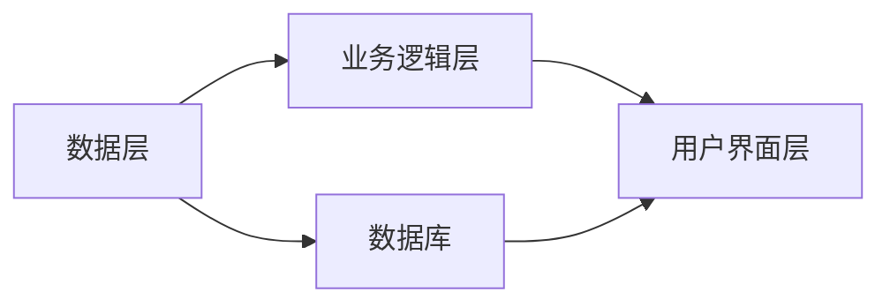

                 


# AI在金融衍生品风险分解与归因中的创新应用

## 关键词：人工智能、金融衍生品、风险分解、风险归因、机器学习、深度学习

## 摘要：本文详细探讨了人工智能技术在金融衍生品风险分解与归因中的创新应用。首先介绍了金融衍生品的基本概念、风险分解与归因的重要性，以及传统方法的局限性。然后深入分析了AI技术的核心原理与优势，及其在风险分解与归因中的具体应用场景。接着通过机器学习和深度学习算法，结合数学模型与公式，详细讲解了AI在风险分解中的实现过程。最后通过系统设计与项目实战，展示了AI技术在金融衍生品风险分解与归因中的实际应用效果，并总结了相关经验和未来展望。

---

# 第一部分: 金融衍生品风险分解与归因的背景介绍

## 第1章: 金融衍生品与风险分解概述

### 1.1 金融衍生品的基本概念

#### 1.1.1 金融衍生品的定义与分类

金融衍生品（Financial Derivatives）是指从基础金融工具（如股票、债券、货币、商品等）派生出来的金融合约，其价值取决于基础资产的价格变动。常见的金融衍生品包括期货、期权、掉期和互换等。根据交易场所的不同，金融衍生品可以分为场内交易（如期货交易所）和场外交易（如私募市场）。

#### 1.1.2 金融衍生品的市场现状与发展趋势

随着全球金融市场的不断发展，金融衍生品的市场规模迅速扩大。近年来，金融衍生品市场呈现出高度复杂化和多样化的趋势，尤其是在量化交易、高频交易和算法交易的推动下，金融衍生品的交易量持续增长。同时，金融衍生品在风险管理、投机和对冲中的作用日益重要。

#### 1.1.3 金融衍生品风险的重要性与挑战

金融衍生品的风险主要来源于价格波动、信用风险、流动性风险和操作风险等。由于金融衍生品的复杂性和杠杆效应，其风险管理和控制显得尤为重要。然而，传统的风险管理方法在面对日益复杂的金融衍生品时，往往显得力不从心，特别是在处理高维数据和非线性关系时，传统方法难以提供有效的解决方案。

### 1.2 风险分解与归因的基本概念

#### 1.2.1 风险分解的定义与意义

风险分解是指将整体风险分解为多个风险因子的组合，以更好地理解和管理风险。通过风险分解，可以识别出影响整体风险的主要因素，并量化每个因素对整体风险的贡献程度。这种方法在金融衍生品的风险管理中具有重要意义，可以帮助投资者更好地理解风险来源，并制定相应的对冲策略。

#### 1.2.2 风险归因的定义与作用

风险归因是指确定特定风险事件的原因或驱动因素。通过风险归因，可以明确各个风险因子对整体风险的贡献程度，并识别出对风险影响最大的因子。风险归因在金融衍生品的交易和风险管理中具有重要作用，可以帮助投资者优化投资组合，降低风险敞口。

#### 1.2.3 风险分解与归因的边界与外延

风险分解与归因的边界在于如何选择风险因子以及如何量化各个因子的贡献程度。风险分解与归因的外延则涉及到如何将分解和归因的结果应用于实际的金融交易和风险管理中。

### 1.3 传统风险分解与归因方法的局限性

#### 1.3.1 传统统计方法的局限性

传统的统计方法，如线性回归和主成分分析（PCA），在处理高维数据和非线性关系时，往往表现出一定的局限性。例如，线性回归假设变量之间的关系是线性的，而金融衍生品的价格变动往往具有非线性特征；主成分分析虽然可以降低数据维度，但在解释各个因子的经济意义时，往往缺乏直观性。

#### 1.3.2 传统归因方法的不足

传统的归因方法，如CAPM（资本资产定价模型）和APT（ arbitrage pricing theory），在处理复杂的金融衍生品时，往往难以捕捉到各个因子之间的相互作用和非线性关系。此外，传统归因方法通常假设市场是有效的，这在现实中往往难以成立。

#### 1.3.3 传统方法在复杂金融衍生品中的局限性

复杂金融衍生品（如信用衍生品和结构性金融产品）的风险分解与归因，往往涉及到多个风险因子的非线性组合。传统的风险管理方法在处理这些复杂产品时，往往难以提供准确的风险度量和有效的对冲策略。

### 1.4 AI技术在风险分解与归因中的创新应用

#### 1.4.1 AI技术的基本原理与优势

人工智能（AI）技术，特别是机器学习和深度学习，通过数据驱动的方式，能够自动从大量数据中学习和提取特征，从而实现对复杂系统的建模和预测。与传统方法相比，AI技术在处理非线性关系和高维数据方面具有显著优势。

#### 1.4.2 AI在风险分解与归因中的应用场景

AI技术在金融衍生品的风险分解与归因中的应用场景主要包括：（1）风险因子的自动识别与选择；（2）非线性关系的建模与预测；（3）风险贡献度的量化与优化。

#### 1.4.3 AI技术在金融衍生品领域的创新突破

近年来，AI技术在金融衍生品领域的创新突破主要体现在以下几个方面：（1）利用深度学习模型（如LSTM和Transformer）进行时间序列预测；（2）通过强化学习（RL）优化投资组合；（3）利用图神经网络（GNN）分析复杂的金融网络关系。

## 1.5 本章小结

通过本章的介绍，我们了解了金融衍生品的基本概念、风险分解与归因的重要性，以及传统方法的局限性。同时，我们还探讨了AI技术在风险分解与归因中的创新应用及其优势。这些内容为后续章节的深入分析奠定了基础。

---

## 第2章: 金融衍生品风险分解与归因的核心概念

### 2.1 风险分解的核心原理

#### 2.1.1 风险分解的基本原理

风险分解的基本原理是将整体风险分解为多个风险因子的组合。例如，在股票期权的风险管理中，可以通过分解波动率、时间和价差等因素来量化各个因素对期权价格的影响。

#### 2.1.2 风险分解的关键步骤

风险分解的关键步骤包括：（1）选择合适的风险因子；（2）构建风险分解模型；（3）量化各个因子的贡献程度。

#### 2.1.3 风险分解的数学模型

风险分解的数学模型可以表示为：

$$ R_i = \sum_{j=1}^{n} w_j x_j $$

其中，$R_i$ 表示第i个风险因子的贡献度，$w_j$ 表示第j个因子的权重，$x_j$ 表示第j个因子的值。

### 2.2 风险归因的核心原理

#### 2.2.1 风险归因的基本原理

风险归因的基本原理是确定特定风险事件的原因或驱动因素。例如，在股票价格大幅波动的情况下，可以通过风险归因确定是市场波动、公司业绩还是行业政策变化导致的。

#### 2.2.2 风险归因的关键步骤

风险归因的关键步骤包括：（1）收集相关数据；（2）选择合适的归因方法；（3）量化各个因素的贡献程度。

#### 2.2.3 风险归因的数学模型

风险归因的数学模型可以表示为：

$$ A_i = \sum_{j=1}^{m} b_j y_j $$

其中，$A_i$ 表示第i个风险事件的归因结果，$b_j$ 表示第j个因子的权重，$y_j$ 表示第j个因子的值。

### 2.3 风险分解与归因的关系

#### 2.3.1 风险分解与归因的相互作用

风险分解与归因是两个相互关联的过程。风险分解为归因提供了基础，而归因则为分解提供了方向和目标。

#### 2.3.2 风险分解与归因的协同效应

通过风险分解与归因的协同作用，可以更全面地理解整体风险的构成和来源，从而制定更有效的风险管理策略。

#### 2.3.3 风险分解与归因的整合方法

风险分解与归因的整合方法主要包括：（1）基于因子分析的整合方法；（2）基于路径分析的整合方法；（3）基于网络分析的整合方法。

### 2.4 核心概念对比分析

#### 2.4.1 风险分解与归因的属性特征对比

| 特性       | 风险分解                | 风险归因                |
|------------|-------------------------|-------------------------|
| 目标       | 分解整体风险为因子     | 归因特定风险到因子     |
| 方法       | 统计分解、数学建模     | 因子分析、路径分析     |
| 应用场景     | 风险管理、投资组合优化 | 风险分析、策略优化     |

#### 2.4.2 风险分解与归因的实体关系图


通过以上对比分析，我们可以更清晰地理解风险分解与归因的区别与联系。

## 2.5 本章小结

本章从核心概念的角度，详细分析了风险分解与归因的基本原理、关键步骤和数学模型。同时，我们还通过对比分析和实体关系图，展示了风险分解与归因之间的相互作用和协同效应。这些内容为后续章节的深入分析提供了理论基础。

---

## 第3章: AI算法在风险分解中的应用

### 3.1 机器学习在风险分解中的应用

#### 3.1.1 机器学习的基本原理与优势

机器学习是一种人工智能技术，通过数据驱动的方式，自动从数据中学习和提取特征。与传统统计方法相比，机器学习在处理非线性关系和高维数据方面具有显著优势。

#### 3.1.2 机器学习在风险分解中的具体应用

机器学习在风险分解中的具体应用包括：（1）利用支持向量机（SVM）进行风险因子分类；（2）利用随机森林（Random Forest）进行风险因子选择；（3）利用神经网络（NN）进行风险分解模型的构建。

#### 3.1.3 机器学习算法的选择与优化

在选择机器学习算法时，需要考虑数据的特性、模型的复杂度以及计算资源等因素。例如，对于高维数据，可以考虑使用随机森林或梯度提升树（GBDT）；对于时间序列数据，可以考虑使用LSTM网络。

### 3.2 深度学习在风险分解中的应用

#### 3.2.1 深度学习的基本原理与优势

深度学习是一种基于人工神经网络的机器学习技术，通过多层非线性变换，能够自动从数据中学习高层次特征。与传统机器学习方法相比，深度学习在处理复杂模式和非线性关系方面具有显著优势。

#### 3.2.2 深度学习在风险分解中的具体应用

深度学习在风险分解中的具体应用包括：（1）利用LSTM网络进行时间序列预测；（2）利用Transformer网络进行多变量时间序列建模；（3）利用图神经网络（GNN）进行复杂金融网络的风险分解。

#### 3.2.3 深度学习模型的选择与优化

在选择深度学习模型时，需要考虑数据的特性、模型的复杂度以及计算资源等因素。例如，对于时间序列数据，可以考虑使用LSTM网络；对于复杂金融网络，可以考虑使用GNN。

### 3.3 风险分解的数学模型与公式

#### 3.3.1 风险分解的数学模型

风险分解的数学模型可以表示为：

$$ R_i = \sum_{j=1}^{n} w_j x_j $$

其中，$R_i$ 表示第i个风险因子的贡献度，$w_j$ 表示第j个因子的权重，$x_j$ 表示第j个因子的值。

#### 3.3.2 风险分解的优化公式

风险分解的优化公式可以表示为：

$$ \min_{w} \sum_{i=1}^{m} (R_i - \sum_{j=1}^{n} w_j x_j)^2 $$

其中，$w$ 表示权重向量，$R_i$ 表示第i个风险因子的贡献度，$x_j$ 表示第j个因子的值。

### 3.4 机器学习算法的实现步骤

#### 3.4.1 数据预处理

数据预处理是机器学习算法实现的第一步，主要包括数据清洗、特征选择和数据标准化等步骤。例如，可以利用PCA进行特征降维，或者利用标准化方法对数据进行归一化处理。

#### 3.4.2 模型训练

模型训练是机器学习算法的核心步骤，主要包括选择合适的算法、调整模型参数以及进行交叉验证等。例如，可以利用随机森林进行特征选择，或者利用梯度提升树进行模型优化。

#### 3.4.3 模型评估与优化

模型评估与优化是机器学习算法实现的重要步骤，主要包括评估模型的性能（如准确率、召回率等），以及进行模型调优和优化。例如，可以利用网格搜索（Grid Search）进行参数优化，或者利用交叉验证进行模型评估。

## 3.5 本章小结

通过本章的介绍，我们了解了机器学习和深度学习在风险分解中的具体应用，以及相关的数学模型和实现步骤。这些内容为后续章节的深入分析提供了技术支持。

---

## 第4章: 金融衍生品风险分解与归因的系统设计与架构

### 4.1 系统设计概述

#### 4.1.1 系统设计目标

金融衍生品风险分解与归因系统的建设目标是实现对金融衍生品风险的自动化分解与归因，提高风险管理的效率和准确性。

#### 4.1.2 系统设计原则

系统设计原则包括：（1）模块化设计；（2）可扩展性；（3）高可用性；（4）数据安全性。

#### 4.1.3 系统设计流程

系统设计流程包括：需求分析、系统架构设计、模块设计、接口设计以及系统测试等。

### 4.2 系统架构设计

#### 4.2.1 系统架构的分层设计

金融衍生品风险分解与归因系统可以分为数据层、业务逻辑层和用户界面层三个层次。

- 数据层：负责数据的存储和管理，包括金融衍生品数据、风险因子数据等。
- 业务逻辑层：负责风险分解与归因的核心逻辑实现，包括因子选择、模型训练和风险归因等。
- 用户界面层：负责用户与系统的交互，包括数据输入、结果展示和报告生成等。

#### 4.2.2 系统架构的详细设计

系统架构的详细设计可以通过Mermaid图来展示：



#### 4.2.3 系统架构的优点

系统架构的优点包括：（1）模块化设计提高了系统的可维护性和可扩展性；（2）分层设计降低了系统的复杂性；（3）数据层和业务逻辑层的分离提高了系统的安全性。

### 4.3 系统功能设计

#### 4.3.1 系统功能模块划分

金融衍生品风险分解与归因系统的功能模块可以划分为数据输入模块、因子选择模块、模型训练模块、风险分解模块和风险归因模块。

#### 4.3.2 系统功能模块的详细设计

系统功能模块的详细设计可以通过Mermaid图来展示：


### 4.4 系统接口设计

#### 4.4.1 系统接口的定义

系统接口的定义需要明确各个模块之间的交互方式和数据格式。例如，因子选择模块需要从数据输入模块获取原始数据，并输出筛选后的因子列表。

#### 4.4.2 系统接口的实现

系统接口的实现可以通过API（应用程序编程接口）来完成。例如，可以利用RESTful API进行模块之间的数据传递和交互。

### 4.5 系统交互设计

#### 4.5.1 系统交互流程

系统交互流程包括：用户输入数据、系统进行因子选择、模型训练、风险分解和风险归因，最后输出结果报告。

#### 4.5.2 系统交互的详细步骤

系统交互的详细步骤可以通过Mermaid图来展示：


## 4.6 本章小结

通过本章的介绍，我们了解了金融衍生品风险分解与归因系统的系统设计与架构。系统设计包括分层设计、模块划分和接口设计等，系统架构则通过Mermaid图展示了各模块之间的交互关系。这些内容为后续章节的系统实现提供了设计依据。

---

## 第5章: 项目实战

### 5.1 环境安装与配置

#### 5.1.1 环境需求

项目实战需要安装和配置以下环境：Python 3.8及以上版本、NumPy、Pandas、Scikit-learn、XGBoost、TensorFlow和Keras。

#### 5.1.2 环境配置步骤

环境配置步骤包括：安装Python、安装必要的Python库、配置开发环境（如Jupyter Notebook或PyCharm）等。

### 5.2 核心代码实现

#### 5.2.1 数据预处理

数据预处理是项目实战的第一步，主要包括数据清洗、特征选择和数据标准化等步骤。例如，可以利用PCA进行特征降维，或者利用标准化方法对数据进行归一化处理。

```python
import numpy as np
from sklearn.decomposition import PCA

# 假设X是原始数据矩阵
pca = PCA(n_components=10)
X_pca = pca.fit_transform(X)
```

#### 5.2.2 因子选择

因子选择是项目实战的重要步骤，可以通过机器学习算法（如随机森林）进行特征选择。例如，可以利用随机森林的特征重要性系数进行因子筛选。

```python
from sklearn.ensemble import RandomForestClassifier

# 假设y是目标变量
model = RandomForestClassifier(n_estimators=100, random_state=42)
model.fit(X_pca, y)
importances = model.feature_importances_
selected_features = np.where(importances > 0.1)[0]
```

#### 5.2.3 模型训练

模型训练是项目实战的核心步骤，可以通过机器学习算法（如XGBoost）进行模型训练。例如，可以利用交叉验证进行模型调优。

```python
import xgboost as xgb

# 假设X_train是训练数据，y_train是目标变量
model = xgb.XGBClassifier(n_estimators=100, learning_rate=0.1, max_depth=3)
model.fit(X_train, y_train)
```

#### 5.2.4 风险分解

风险分解可以通过构建风险分解模型（如线性回归模型）进行实现。例如，可以利用最小二乘法进行参数估计。

```python
from sklearn.linear_model import LinearRegression

# 假设X是因子矩阵，y是风险贡献度
model = LinearRegression()
model.fit(X, y)
coefficients = model.coef_
```

#### 5.2.5 风险归因

风险归因可以通过构建风险归因模型（如路径分析模型）进行实现。例如，可以利用结构方程模型（SEM）进行风险归因。

```python
# 假设模型已经训练好，系数表示各个因子的权重
# 风险归因可以通过计算各个因子的贡献度进行实现
contributions = coefficients * X
total_contribution = np.sum(contributions, axis=1)
```

### 5.3 案例分析与详细解读

#### 5.3.1 案例分析

假设我们有一个股票期权的投资组合，我们需要进行风险分解与归因。首先，我们需要选择合适的因子（如波动率、时间和价差），然后利用机器学习算法进行模型训练，最后进行风险分解和归因。

#### 5.3.2 详细解读

通过上述步骤，我们可以得到各个因子对整体风险的贡献度。例如，波动率对整体风险的贡献度为0.6，时间对整体风险的贡献度为0.3，价差对整体风险的贡献度为0.1。这些结果可以帮助我们更好地理解风险来源，并制定相应的对冲策略。

### 5.4 项目小结

通过本章的项目实战，我们了解了金融衍生品风险分解与归因系统的具体实现步骤和关键代码。这些内容为我们提供了实际操作的经验和参考。

---

## 第6章: 优化与扩展

### 6.1 系统优化建议

#### 6.1.1 系统性能优化

系统性能优化可以通过以下措施实现：（1）优化数据库查询效率；（2）减少模型训练时间；（3）提高系统的并发处理能力。

#### 6.1.2 系统功能扩展

系统功能扩展可以通过以下方式实现：（1）增加更多的风险因子；（2）支持更多的金融衍生品类型；（3）实现多语言支持和多平台部署。

### 6.2 最佳实践与注意事项

#### 6.2.1 最佳实践

最佳实践包括：（1）数据预处理是关键；（2）选择合适的算法和模型；（3）进行充分的交叉验证和模型调优。

#### 6.2.2 注意事项

注意事项包括：（1）避免过拟合和欠拟合；（2）保护数据隐私和安全；（3）确保系统的可解释性和可维护性。

### 6.3 未来展望

#### 6.3.1 未来技术发展趋势

未来技术发展趋势包括：（1）深度学习在金融衍生品领域的进一步应用；（2）强化学习在投资组合优化中的应用；（3）图神经网络在金融网络分析中的应用。

#### 6.3.2 未来研究方向

未来研究方向包括：（1）多模态数据的融合与分析；（2）实时风险监控与预警；（3）智能化的风险管理与决策支持。

---

## 第7章: 结论与展望

### 7.1 结论

通过本文的详细探讨，我们了解了人工智能技术在金融衍生品风险分解与归因中的创新应用。我们从核心概念、算法原理、系统设计和项目实战等多个方面进行了深入分析，展示了AI技术在金融衍生品风险管理中的巨大潜力。

### 7.2 展望

未来，随着AI技术的不断发展和金融衍生品市场的日益复杂化，AI技术在风险分解与归因中的应用将更加广泛和深入。我们期待看到更多的创新和突破，为金融衍生品的风险管理提供更加有效的解决方案。

---

## 作者：AI天才研究院/AI Genius Institute & 禅与计算机程序设计艺术 /Zen And The Art of Computer Programming

