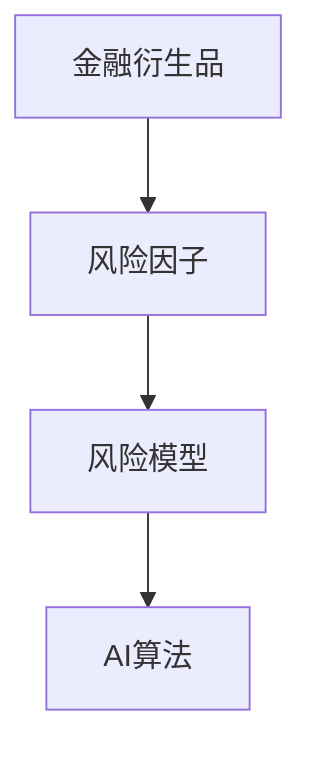
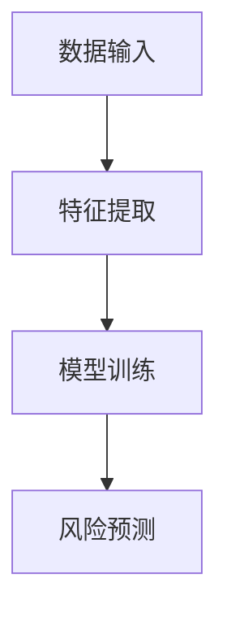
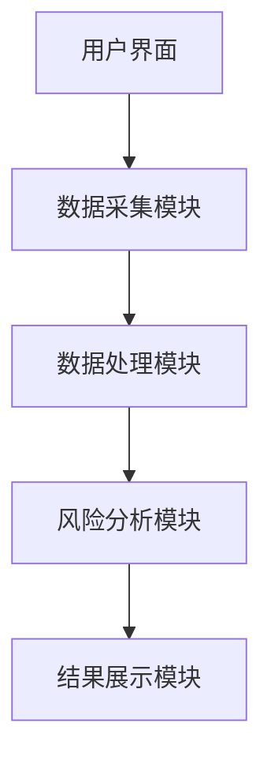

                 


# AI在金融衍生品风险分解中的创新应用

## 关键词：AI、金融衍生品、风险分解、机器学习、深度学习、风险管理、金融创新

## 摘要：  
本文探讨了人工智能（AI）在金融衍生品风险分解中的创新应用，分析了传统方法的局限性，介绍了AI技术的核心原理及其在金融衍生品风险分解中的具体应用。通过详细讲解AI算法的数学模型和系统架构设计，结合实际案例分析，展示了AI在提高金融衍生品风险管理效率和精度方面的潜力。本文旨在为金融从业者和AI技术爱好者提供一个全面的视角，帮助他们更好地理解和应用AI技术在金融衍生品风险分解中的创新方法。

---

# 第1章: 金融衍生品风险分解的背景与挑战

## 1.1 金融衍生品的基本概念

### 1.1.1 金融衍生品的定义与分类  
金融衍生品（Financial Derivatives）是以货币、债券、股票等传统金融工具为基础，通过数学模型和金融契约形成的金融产品。它们通常具有高杠杆性和复杂性，常见的类型包括期货、期权、掉期和互换等。

### 1.1.2 金融衍生品的风险特征  
金融衍生品的风险主要体现在价格波动、信用风险、流动性风险等方面。由于其复杂性，风险分解和管理是金融衍生品投资和交易中的核心问题。

### 1.1.3 传统风险分解方法的局限性  
传统方法如VaR（Value at Risk）和CVaR（Conditional Value at Risk）虽然在一定程度上解决了风险度量问题，但存在数据依赖性强、计算复杂性和模型假设限制等局限性。

---

## 1.2 AI技术在金融领域的应用前景

### 1.2.1 AI技术的基本概念  
人工智能（AI）是指模拟人类智能的计算机系统，涵盖机器学习、自然语言处理、计算机视觉等领域。AI技术的核心在于数据处理、模式识别和决策优化。

### 1.2.2 AI在金融领域的典型应用  
AI在金融领域的应用包括股票预测、信用评估、欺诈检测等。AI技术的引入为金融行业带来了更高的效率和精度。

### 1.2.3 AI在金融衍生品风险分解中的创新潜力  
AI技术可以通过深度学习模型捕捉复杂的数据模式，提供更精准的风险评估和预测，从而优化金融衍生品的风险管理。

---

## 1.3 本章小结  
本章介绍了金融衍生品的基本概念及其风险特征，分析了传统风险分解方法的局限性，并探讨了AI技术在金融领域，尤其是金融衍生品风险分解中的创新潜力。

---

# 第2章: AI在金融衍生品风险分解中的核心概念

## 2.1 AI与金融衍生品的结合原理

### 2.1.1 AI技术的核心原理  
AI通过数据驱动的方法，利用机器学习算法从大量数据中提取特征，构建模型并进行预测和决策。

### 2.1.2 金融衍生品风险分解的基本原理  
金融衍生品的风险分解旨在识别和量化各种风险因素对衍生品价格的影响。AI技术可以通过非线性模型捕捉复杂的市场动态。

### 2.1.3 AI在风险分解中的具体应用  
AI技术可以用于金融衍生品的价格预测、风险因子识别和风险对冲策略制定。

---

## 2.2 核心概念对比与联系

### 2.2.1 AI技术与传统统计方法的对比  
AI技术在数据处理能力和非线性模式捕捉方面具有优势，但需要大量数据支持；传统统计方法计算简单，但对复杂市场动态的捕捉能力有限。

### 2.2.2 金融衍生品风险分解的实体关系图  
通过ER图展示金融衍生品风险分解的核心实体及其关系。



---

## 2.3 本章小结  
本章详细介绍了AI技术与金融衍生品风险分解的核心概念，并通过对比分析和实体关系图展示了二者的结合方式。

---

# 第3章: AI算法在金融衍生品风险分解中的数学模型

## 3.1 常见AI算法简介

### 3.1.1 线性回归  
线性回归是一种简单但强大的预测模型，适用于线性关系的场景。

### 3.1.2 支持向量机  
支持向量机（SVM）适用于分类和回归问题，尤其在高维空间中表现优异。

### 3.1.3 神经网络  
神经网络通过多层结构模拟人脑，适用于复杂非线性关系的建模。

---

## 3.2 算法流程图



---

## 3.3 算法实现代码

### 3.3.1 线性回归模型

```python
# 示例代码：线性回归模型
import numpy as np
from sklearn.linear_model import LinearRegression

# 示例数据
X = np.array([[1], [2], [3], [4]])
y = np.array([2, 4, 6, 8])

# 模型训练
model = LinearRegression()
model.fit(X, y)

# 预测
print(model.predict([[5]]))  # 输出: [[10]]
```

### 3.3.2 神经网络模型

```python
# 示例代码：神经网络模型
import tensorflow as tf
import numpy as np

# 示例数据
X = np.array([[0.1], [0.2], [0.3], [0.4]], dtype=np.float32)
y = np.array([[0.15], [0.25], [0.35], [0.45]], dtype=np.float32)

# 模型构建
model = tf.keras.Sequential([
    tf.keras.layers.Dense(10, activation='relu'),
    tf.keras.layers.Dense(1)
])

model.compile(optimizer='adam', loss='mean_squared_error')

# 模型训练
model.fit(X, y, epochs=100, batch_size=4)

# 预测
print(model.predict([[0.5]]))  # 示例预测
```

---

## 3.4 数学模型与公式

### 3.4.1 线性回归公式  
$$ y = \beta_0 + \beta_1x + \epsilon $$

### 3.4.2 神经网络基本结构  
$$ a^{(l+1)} = \sigma(w^{(l)}a^{(l)} + b^{(l)}) $$  
其中，$a^{(l)}$ 表示第 $l$ 层的激活值，$w^{(l)}$ 是权重矩阵，$b^{(l)}$ 是偏置项，$\sigma$ 是激活函数。

---

## 3.5 本章小结  
本章通过数学公式和代码示例，详细讲解了线性回归和神经网络在金融衍生品风险分解中的应用。

---

# 第4章: 金融衍生品风险分解的系统架构设计

## 4.1 系统功能设计

### 4.1.1 数据采集模块  
负责收集市场数据、交易数据等。

### 4.1.2 风险分析模块  
利用AI算法进行风险因子识别和风险预测。

### 4.1.3 结果展示模块  
以可视化方式呈现风险分析结果。

---

## 4.2 系统架构图



---

## 4.3 接口设计

---

## 4.4 本章小结  
本章通过系统架构设计，展示了AI技术在金融衍生品风险分解中的整体应用框架。

---

# 小结与注意事项

## 小结  
本文系统地探讨了AI技术在金融衍生品风险分解中的创新应用，从理论基础到算法实现，再到系统设计，为读者提供了全面的视角。

## 注意事项  
在实际应用中，需注意数据质量、模型解释性和计算效率等问题，确保AI技术的有效性和可靠性。

## 拓展阅读  
推荐读者进一步阅读《机器学习在金融中的应用》和《深度学习与金融衍生品定价》等书籍，深入了解AI技术在金融领域的更多应用。

---

# 作者：AI天才研究院/AI Genius Institute & 禅与计算机程序设计艺术/Zen And The Art of Computer Programming

