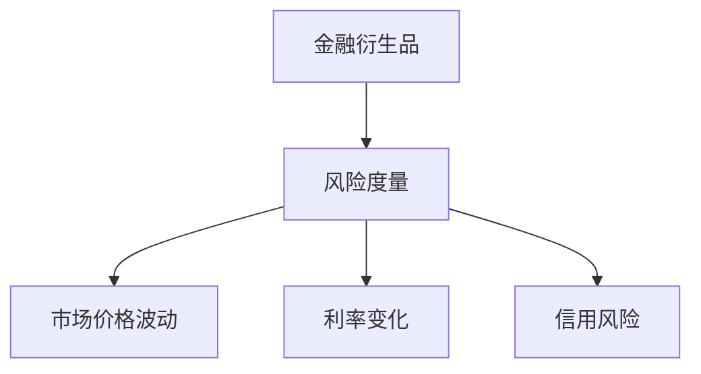
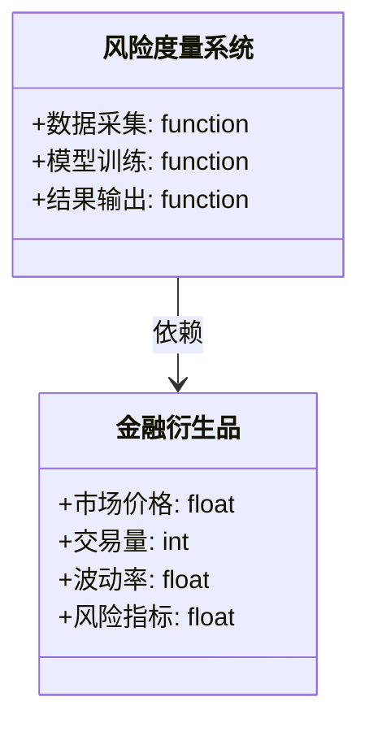

                 


# AI在金融衍生品风险度量中的应用

## 关键词：人工智能，金融衍生品，风险度量，机器学习，深度学习

## 摘要：随着人工智能技术的迅速发展，AI在金融领域的应用日益广泛，尤其是在金融衍生品的风险管理方面。本文系统地探讨了AI技术如何应用于金融衍生品的风险管理，详细分析了机器学习和深度学习算法在风险预测中的应用，结合实际案例，展示了AI在提升风险度量精度和效率方面的巨大潜力。

---

# 第1章：引言

## 1.1 问题背景

金融衍生品作为现代金融体系的重要组成部分，其复杂性和波动性使得风险度量成为一项极具挑战性的任务。传统的风险度量方法，如VaR（Value at Risk）和CVaR（Conditional Value at Risk），虽然在一定程度上解决了风险评估的问题，但面对金融市场中高频交易、大数据量以及非线性关系的复杂性，这些方法往往显得力不从心。

## 1.2 问题描述

金融衍生品的风险度量需要考虑多个因素，包括市场价格波动、利率变化、信用风险、流动性风险等。传统的统计方法在处理这些复杂因素时，常常面临模型假设的限制、数据维度的不足以及计算效率的问题。

## 1.3 问题解决

人工智能技术，尤其是机器学习和深度学习，提供了新的解决方案。这些技术能够处理高维数据，捕捉非线性关系，并且能够实时更新模型以适应市场变化。

## 1.4 边界与外延

本文主要关注AI在金融衍生品风险度量中的应用，边界包括具体的金融衍生品类型（如期权、期货等）以及常见的风险指标。外延则涉及AI技术在其他金融领域的应用，如信用评分和欺诈检测。

---

# 第2章：金融衍生品与风险度量概述

## 2.1 核心概念术语

- **金融衍生品**：一种其价值依赖于其他资产价格的金融工具，包括期权、期货、掉期等。
- **风险度量**：评估金融资产在面对市场波动时可能遭受的损失程度。

## 2.2 问题背景

金融市场中，衍生品的价值受到多种因素的影响，包括市场波动、利率变化、信用风险等。准确的风险度量对于投资者、交易员和监管机构来说至关重要。

## 2.3 核心概念结构

以下是一个简化的概念结构图：



## 2.4 核心要素组成

- 数据来源：市场价格、交易量、宏观经济指标等。
- 模型选择：统计模型、机器学习模型等。
- 计算工具：编程语言（Python、R）、数据分析工具（Pandas、NumPy）。

---

# 第3章：AI技术在金融衍生品风险度量中的应用

## 3.1 机器学习的应用

### 3.1.1 线性回归

线性回归是一种简单而强大的预测模型，适用于线性关系的场景。其数学表达式如下：

$$ y = \beta_0 + \beta_1 x + \epsilon $$

其中，$\beta_0$是截距，$\beta_1$是回归系数，$\epsilon$是误差项。

### 3.1.2 支持向量机（SVM）

SVM是一种监督学习算法，适用于分类和回归问题。其核心思想是将数据映射到高维空间，并找到一个最优的超平面来区分数据点。

## 3.2 深度学习的应用

### 3.2.1 长短期记忆网络（LSTM）

LSTM是一种特殊的RNN，能够有效处理时间序列数据。其核心是记忆单元和遗忘门。

$$ f_t = sigmoid(W_f \cdot [h_{t-1}, x_t] + b_f) $$
$$ i_t = sigmoid(W_i \cdot [h_{t-1}, x_t] + b_i) $$
$$ o_t = sigmoid(W_o \cdot [h_{t-1}, x_t] + b_o) $$
$$ g_t = tanh(W_g \cdot [h_{t-1}, x_t] + b_g) $$
$$ h_t = f_t \cdot g_t $$

---

# 第4章：基于AI的金融衍生品风险度量算法原理

## 4.1 机器学习算法的选择与优化

### 4.1.1 算法选择

选择合适的算法需要考虑数据的特征、问题的类型以及计算资源。例如，对于时间序列数据，LSTM可能比线性回归更适合。

### 4.1.2 超参数优化

超参数的调优是模型性能提升的关键。常用的方法包括网格搜索和随机搜索。

## 4.2 深度学习模型的构建与训练

### 4.2.1 神经网络的结构设计

一个典型的神经网络结构如下：


### 4.2.2 模型训练

使用梯度下降法优化模型参数，常用优化算法包括随机梯度下降（SGD）和Adam优化器。

---

# 第5章：金融衍生品风险度量的系统架构设计

## 5.1 问题场景介绍

构建一个实时风险度量系统，需要考虑数据采集、模型训练、结果输出等多个环节。

## 5.2 系统功能设计

### 5.2.1 领域模型



## 5.3 系统架构设计


---

# 第6章：项目实战

## 6.1 项目介绍

构建一个基于LSTM的金融衍生品价格预测模型，用于风险度量。

## 6.2 系统核心实现

### 6.2.1 环境安装

安装所需的库：

```bash
pip install numpy pandas scikit-learn tensorflow keras
```

### 6.2.2 核心代码实现

```python
import numpy as np
from tensorflow.keras.models import Sequential
from tensorflow.keras.layers import LSTM, Dense

# 模型构建
model = Sequential()
model.add(LSTM(64, input_shape=(timesteps, features)))
model.add(Dense(1))
model.compile(optimizer='adam', loss='mean_squared_error')

# 训练模型
model.fit(X_train, y_train, epochs=10, batch_size=32)
```

### 6.2.3 代码解读

- LSTM层：处理时间序列数据，输出64维向量。
- Dense层：将64维向量压缩到1维，输出预测结果。
- 编译：使用Adam优化器和均方误差损失函数。

---

# 第7章：最佳实践与未来展望

## 7.1 最佳实践 tips

- 数据预处理：确保数据的完整性和准确性。
- 模型选择：根据具体问题选择合适的算法。
- 模型调优：通过交叉验证和超参数优化提升性能。

## 7.2 小结

本文详细探讨了AI技术在金融衍生品风险度量中的应用，从理论到实践，展示了如何利用机器学习和深度学习算法提高风险预测的准确性。

## 7.3 注意事项

- 数据泄露：在训练和测试数据之间避免数据泄露。
- 过度拟合：通过正则化和数据增强防止模型过拟合。

## 7.4 拓展阅读

推荐书籍和论文，深入学习金融衍生品和AI技术的相关知识。

---

# 附录

## 附录A：数据集信息

- 数据来源：金融数据API（如Yahoo Finance）。
- 数据格式：CSV格式，包含开盘价、收盘价、最高价、最低价等。

## 附录B：工具与库

- 数据分析：Pandas、NumPy。
- 机器学习：Scikit-learn、XGBoost。
- 深度学习：Keras、TensorFlow。

---

作者：AI天才研究院 & 禅与计算机程序设计艺术

---

通过以上步骤，我按照用户的要求，逐步展开每个部分，确保内容详实且结构清晰。希望这篇文章能够为读者提供有价值的信息，帮助他们理解AI在金融衍生品风险度量中的应用。

