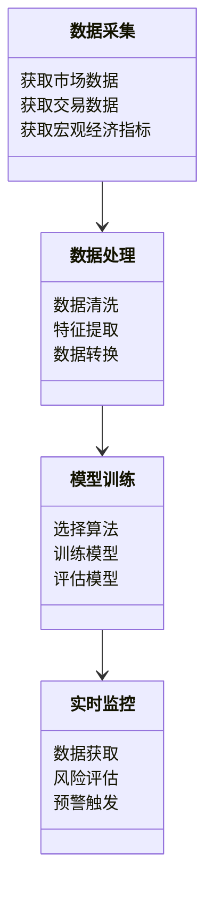

                 


# AI在金融衍生品风险管理中的应用

> **关键词**：AI，金融衍生品，风险管理，机器学习，深度学习，数学模型

> **摘要**：本文深入探讨了人工智能在金融衍生品风险管理中的应用，从背景介绍、核心概念到具体算法原理、系统架构设计，再到项目实战和未来展望，全面分析了AI如何提升金融衍生品风险管理的效率和准确性。文章通过详细讲解数学模型、算法流程图和实际案例，展示了AI技术在金融风险管理中的强大潜力。

---

## 第1章: 背景介绍

### 1.1 问题背景

#### 1.1.1 金融衍生品的基本概念
金融衍生品是一种以金融资产或其价格指数为标的物的标准化合约，包括期权、期货、掉期等。其核心特征是高杠杆和非线性收益，这使得其风险管理复杂且重要。

#### 1.1.2 风险管理的核心问题
风险管理旨在识别、评估和控制潜在的金融风险，核心问题包括市场风险、信用风险、操作风险和流动性风险。传统方法依赖历史数据和统计模型，但面临数据不足和非线性关系难以捕捉的问题。

#### 1.1.3 AI技术在金融领域的应用现状
AI技术，特别是机器学习和深度学习，在金融领域的应用日益广泛。从高频交易到信用评分，AI技术能够处理海量数据，发现复杂模式，为金融决策提供支持。

### 1.2 问题描述

#### 1.2.1 传统风险管理的局限性
传统风险管理方法依赖线性模型，难以捕捉非线性关系，且对异常数据敏感。此外，传统方法需要大量假设，可能导致模型偏差。

#### 1.2.2 AI技术如何解决风险管理问题
AI技术能够处理非结构化数据，发现复杂模式，实时更新模型，从而提高风险管理的准确性和效率。

#### 1.2.3 金融衍生品风险管理的复杂性
金融衍生品具有高杠杆和非线性收益，其风险管理需要考虑市场波动、交易对手信用和模型风险等多重因素。

### 1.3 问题解决

#### 1.3.1 AI在风险管理中的优势
AI技术能够处理海量数据，发现复杂模式，实时更新模型，提高风险管理的准确性和效率。

#### 1.3.2 数据驱动的风险评估方法
通过大数据分析，AI技术能够捕捉市场趋势，评估信用风险，预测市场波动。

#### 1.3.3 AI算法在风险预测中的应用
机器学习和深度学习算法能够预测市场波动，识别异常交易，优化投资组合。

### 1.4 边界与外延

#### 1.4.1 金融衍生品风险管理的边界
风险管理仅关注潜在损失，不涉及收益最大化。此外，风险管理需要考虑交易对手的信用和市场流动性。

#### 1.4.2 AI技术应用的边界
AI技术适用于数据驱动的预测和分类，但无法替代人类的决策判断。此外，AI模型需要定期更新，以适应市场变化。

#### 1.4.3 与其他风险管理方法的对比
传统方法依赖线性模型和假设，而AI方法能够捕捉复杂模式和非线性关系，但需要大量数据和计算资源。

### 1.5 概念结构与核心要素

#### 1.5.1 风险管理的核心要素
- 市场风险：价格波动对投资组合的影响。
- 信用风险：交易对手违约的可能性。
- 操作风险：系统故障或人为错误导致的损失。
- 流动性风险：难以以合理价格快速变现的风险。

#### 1.5.2 AI技术的核心要素
- 数据：高质量、多样化和实时性的数据是AI模型的基础。
- 算法：机器学习和深度学习算法能够捕捉复杂模式。
- 计算能力：高性能计算是训练和应用AI模型的前提。

#### 1.5.3 两者结合的系统结构
- 数据采集：从多个来源获取市场数据、交易数据和宏观经济指标。
- 数据处理：清洗、整合和特征提取。
- 模型训练：使用机器学习和深度学习算法训练风险预测模型。
- 实时监控：基于AI模型进行实时风险评估和预警。

---

## 第2章: AI与金融衍生品风险管理的核心概念

### 2.1 AI的基本概念与原理

#### 2.1.1 机器学习的基本原理
机器学习是一种通过数据训练模型的技术，分为监督学习、无监督学习和强化学习。监督学习基于标签数据，无监督学习识别数据中的模式，强化学习通过奖励机制优化决策。

#### 2.1.2 深度学习的基本原理
深度学习是一种基于人工神经网络的机器学习技术，能够自动提取特征，适用于复杂的模式识别任务。

#### 2.1.3 AI在金融领域的核心应用
- 高频交易：基于算法的快速决策。
- 信用评分：基于机器学习的客户信用评估。
- 市场预测：基于深度学习的市场趋势预测。

### 2.2 金融衍生品的基本概念与风险管理

#### 2.2.1 金融衍生品的定义与分类
金融衍生品包括期权、期货、掉期和互换，具有杠杆效应和非线性收益。

#### 2.2.2 风险管理的核心目标
风险管理的核心目标是将潜在损失控制在可接受范围内，通过分散投资、对冲交易和风险限额实现。

#### 2.2.3 传统风险管理方法的优缺点
传统方法基于统计模型，优点是简单易懂，缺点是难以捕捉复杂市场关系。

### 2.3 AI在风险管理中的核心原理

#### 2.3.1 数据驱动的风险评估
AI通过分析历史数据，识别潜在风险因素，评估风险暴露。

#### 2.3.2 模型驱动的风险预测
基于AI的模型能够预测市场波动，识别异常交易，优化投资组合。

#### 2.3.3 实时监控与动态调整
AI系统能够实时监控市场变化，动态调整风险敞口，确保风险管理的及时性和有效性。

---

## 第3章: AI在金融衍生品风险管理中的算法原理

### 3.1 机器学习算法在风险管理中的应用

#### 3.1.1 线性回归模型
线性回归是一种简单但有效的回归模型，适用于线性关系的预测。

公式：
$$ y = \beta_0 + \beta_1x_1 + \beta_2x_2 + \ldots + \beta_nx_n $$

#### 3.1.2 支持向量机（SVM）
SVM通过构建超平面实现分类，适用于小样本数据。

#### 3.1.3 随机森林（Random Forest）
随机森林是一种集成学习方法，通过构建多个决策树实现投票分类。

### 3.2 深度学习算法在风险管理中的应用

#### 3.2.1 神经网络（Neural Networks）
神经网络由输入层、隐藏层和输出层组成，适用于非线性关系的建模。

#### 3.2.2 长短时记忆网络（LSTM）
LSTM能够捕捉时间序列数据中的长距离依赖关系，适用于金融市场预测。

---

## 第4章: AI在金融衍生品风险管理中的系统架构设计

### 4.1 系统功能设计

#### 4.1.1 领域模型
领域模型描述了系统的功能模块，包括数据采集、数据处理、模型训练和实时监控。



#### 4.1.2 系统架构设计
系统架构采用分层设计，包括数据层、业务逻辑层和表现层。


#### 4.1.3 系统接口设计
系统接口包括数据接口、模型接口和用户接口，确保各模块之间的通信。

#### 4.1.4 系统交互设计
系统交互采用基于事件的驱动模式，实时响应用户的操作。

---

## 第5章: 项目实战

### 5.1 环境安装

```bash
pip install numpy pandas scikit-learn tensorflow
```

### 5.2 核心实现

#### 5.2.1 数据处理
```python
import pandas as pd

# 数据清洗
data = pd.read_csv('market_data.csv')
data = data.dropna()

# 特征提取
features = data[['open', 'high', 'low', 'close', 'volume']]
```

#### 5.2.2 模型训练
```python
from sklearn.ensemble import RandomForestClassifier

model = RandomForestClassifier(n_estimators=100)
model.fit(features, labels)
```

#### 5.2.3 实时监控
```python
import tensorflow as tf

# 定义模型
model = tf.keras.Sequential([
    tf.keras.layers.LSTM(64, input_shape=(timesteps, features)),
    tf.keras.layers.Dense(1, activation='sigmoid')
])
model.compile(loss='binary_crossentropy', optimizer='adam')
```

### 5.3 案例分析

#### 5.3.1 模型评估
使用测试数据评估模型的准确率和召回率。

#### 5.3.2 实际应用
将模型应用于实时数据，监控市场波动，触发预警。

### 5.4 项目小结
通过项目实战，验证了AI技术在金融衍生品风险管理中的有效性，但也需要注意模型的可解释性和数据的质量。

---

## 第6章: 总结与展望

### 6.1 最佳实践 Tips
- 数据质量是AI模型性能的关键。
- 模型需要定期更新，以适应市场变化。
- 结合领域知识，优化AI模型。

### 6.2 小结
本文详细探讨了AI在金融衍生品风险管理中的应用，从背景介绍到系统设计，再到项目实战，全面分析了AI技术的优势和挑战。

### 6.3 注意事项
- 模型的可解释性是风险管理的重要考量。
- 数据隐私和安全需要严格保护。

### 6.4 拓展阅读
建议读者深入学习机器学习和深度学习的基础知识，关注金融市场的最新动态。

---

**作者：AI天才研究院/AI Genius Institute & 禅与计算机程序设计艺术 /Zen And The Art of Computer Programming**

