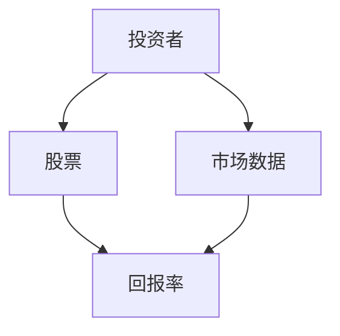
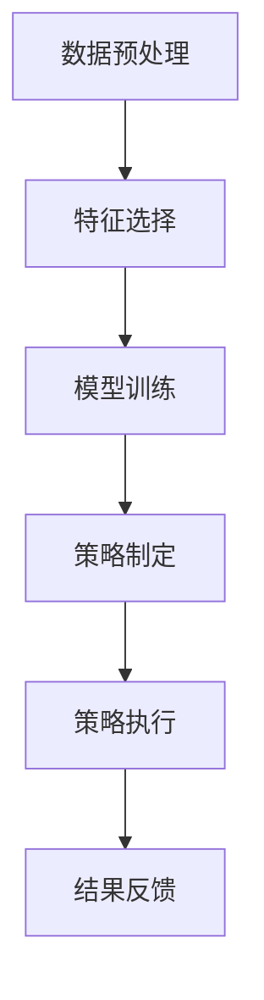
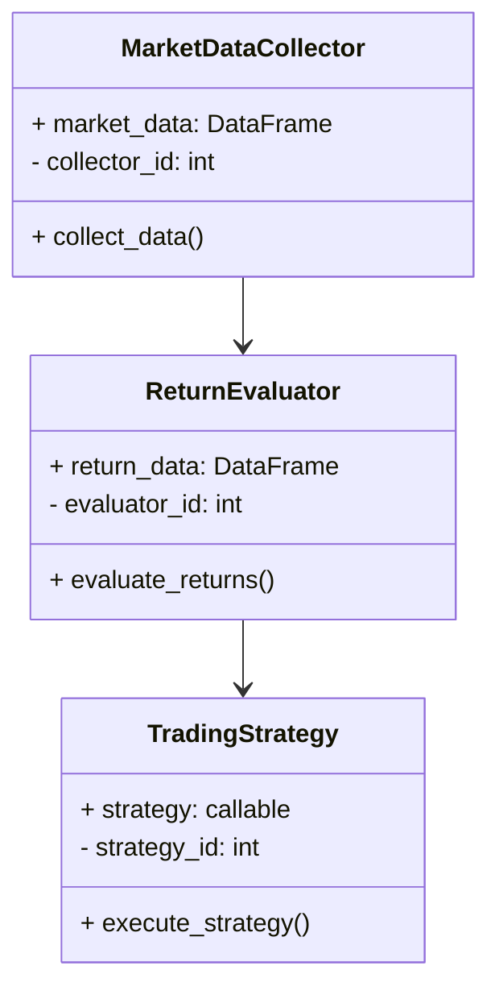
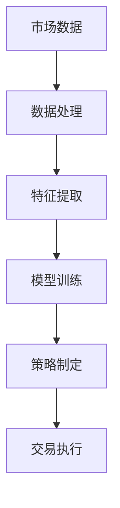

                 


# AI增强的股东回报策略评估：多智能体协作模型

> 关键词：AI增强，股东回报策略，多智能体协作模型，金融投资，机器学习

> 摘要：本文探讨了如何利用AI技术，特别是多智能体协作模型，来优化股东回报策略的评估。通过分析多智能体协作模型的核心原理、算法实现、系统架构，并结合实际案例，本文为投资者和金融从业者提供了一种高效、智能的股东回报评估方法。文章从背景介绍、核心概念、算法原理、系统设计到项目实战，全面阐述了AI在金融投资中的应用，帮助读者理解并掌握这一前沿技术。

---

## 第1章: 股东回报策略评估的背景与问题

### 1.1 股东回报策略的基本概念

#### 1.1.1 股东回报的定义与重要性
股东回报是衡量企业投资价值的重要指标，通常包括股息回报、资本增值和股东权益回报。股东回报策略的目标是通过优化投资组合和风险管理，最大化股东的长期收益。

#### 1.1.2 股东回报的常见评估方法
传统的股东回报评估方法主要包括：
- **股息率法**：计算股息与股价的比率。
- **市盈率法**：评估股票价格是否合理。
- **ROE（净资产收益率）法**：衡量企业的盈利能力。

#### 1.1.3 股东回报与企业价值的关系
股东回报与企业价值密切相关，高回报通常意味着企业具有更强的盈利能力和发展潜力。然而，传统方法往往忽视了市场动态和复杂的投资环境。

---

### 1.2 传统股东回报策略的局限性

#### 1.2.1 传统评估方法的不足
传统评估方法通常基于静态数据，难以捕捉市场波动和多因素影响，导致结果不够准确。

#### 1.2.2 数据驱动决策的缺失
传统方法缺乏对大数据的利用，无法从海量数据中提取有价值的信息。

#### 1.2.3 多智能体协作在回报策略中的潜力
通过多智能体协作，可以整合市场、财务和风险等多方面的信息，实现更精准的回报预测。

---

### 1.3 问题背景与目标

#### 1.3.1 问题背景介绍
随着金融市场的复杂化，传统回报策略已无法满足需求，亟需引入AI技术来优化评估过程。

#### 1.3.2 问题描述与目标
本文旨在通过多智能体协作模型，提升股东回报策略的评估效率和准确性。

#### 1.3.3 解决方案概述
采用多智能体协作模型，整合多种数据源，构建动态的回报评估系统。

---

## 第2章: 多智能体协作模型的基本原理

### 2.1 多智能体协作的定义与特点

#### 2.1.1 多智能体系统的定义
多智能体系统由多个具有独立决策能力的智能体组成，通过协作完成复杂任务。

#### 2.1.2 多智能体协作的核心特征
- **分布式计算**：每个智能体独立决策。
- **协作性**：智能体之间通过通信协同工作。
- **动态性**：能够适应环境变化。

#### 2.1.3 多智能体与单智能体的区别
| 特性 | 单智能体 | 多智能体 |
|------|----------|----------|
| 决策 | 中央决策 | 分布式决策 |
| 通信 | 无 | 高频通信 |
| 效率 | 低 | 高 |

---

### 2.2 多智能体协作模型的架构

#### 2.2.1 分层架构
- **感知层**：收集市场数据。
- **决策层**：分析数据并制定策略。
- **执行层**：执行交易指令。

#### 2.2.2 分布式架构
- **分布式计算**：各节点独立处理数据。
- **通信机制**：节点间通过消息传递协作。

#### 2.2.3 混合架构
结合分层和分布式架构，既有集中决策也有分布式执行。

---

### 2.3 多智能体协作的关键技术

#### 2.3.1 通信机制
智能体之间通过API或消息队列进行通信。

#### 2.3.2 协作策略
基于博弈论的策略，优化回报目标。

#### 2.3.3 决策算法
使用强化学习和协同过滤算法。

---

## 第3章: AI在股东回报策略评估中的应用

### 3.1 AI技术在金融领域的应用现状

#### 3.1.1 人工智能在金融分析中的应用
- **预测股价波动**：使用LSTM神经网络。
- **风险评估**：基于机器学习的信用评分。

#### 3.1.2 机器学习在投资决策中的应用
- **分类模型**：预测股票涨跌。
- **回归模型**：评估资产价值。

#### 3.1.3 自然语言处理在市场情绪分析中的应用
- **情感分析**：判断市场情绪。
- **新闻标题分析**：预测市场动向。

---

### 3.2 AI增强股东回报策略的优势

#### 3.2.1 提高预测准确性
AI能够从海量数据中提取关键特征，提升预测精度。

#### 3.2.2 实现实时监控
通过实时数据处理，快速响应市场变化。

#### 3.2.3 优化投资组合
基于多智能体协作，实现资产配置的最优解。

---

### 3.3 多智能体协作在股东回报策略中的作用

#### 3.3.1 多智能体协作的优势
- **分布式计算**：提升处理效率。
- **协作优化**：实现全局最优。
- **动态适应**：应对市场变化。

#### 3.3.2 多智能体协作在策略优化中的应用
- **市场分割**：每个智能体负责特定市场领域。
- **协同决策**：综合各领域信息制定策略。

#### 3.3.3 多智能体协作的挑战
- **通信开销**：增加计算资源消耗。
- **同步问题**：避免决策冲突。

---

## 第4章: 多智能体协作模型的核心概念

### 4.1 多智能体协作模型的原理

#### 4.1.1 智能体的定义与属性
- **智能体**：独立决策的实体。
- **属性**：目标、知识、能力。

#### 4.1.2 多智能体协作的核心特征
- **自主性**：智能体独立决策。
- **反应性**：实时感知环境变化。
- **协作性**：通过通信协同完成任务。

#### 4.1.3 多智能体协作的实现步骤
1. **数据收集**：获取市场、财务数据。
2. **特征提取**：提取关键特征。
3. **决策制定**：基于特征制定策略。
4. **策略执行**：执行交易指令。
5. **反馈优化**：根据结果优化模型。

---

### 4.2 多智能体协作模型与传统模型的对比

| 特性 | 传统模型 | 多智能体模型 |
|------|----------|-------------|
| 决策方式 | 中央决策 | 分布式决策 |
| 数据处理 | 单点处理 | 并行处理 |
| 灵活性 | 低 | 高 |

---

### 4.3 实体关系图（ER图）



---

## 第5章: 多智能体协作模型的算法实现

### 5.1 算法原理

#### 5.1.1 数据预处理
对原始数据进行清洗、标准化处理。

#### 5.1.2 特征选择
使用主成分分析（PCA）提取关键特征。

#### 5.1.3 模型训练
采用强化学习算法训练智能体。

---

### 5.2 算法流程图



---

### 5.3 Python代码实现

```python
import numpy as np
import pandas as pd
from sklearn.decomposition import PCA
from sklearn.ensemble import RandomForestRegressor

# 数据预处理
data = pd.read_csv('market_data.csv')
data = data.dropna()
data = (data - data.mean()) / data.std()  # 标准化

# 特征选择
pca = PCA(n_components=10)
features = pca.fit_transform(data.drop(columns=['return']))

# 模型训练
model = RandomForestRegressor()
model.fit(features, data['return'])

# 策略制定
def strategy(features):
    predicted_return = model.predict(features)
    return predicted_return > 0.05  # 回报率大于5%则买入

# 策略执行
# 假设我们有一个交易系统来执行该策略
```

---

## 第6章: 系统分析与架构设计方案

### 6.1 问题场景介绍
构建一个实时监测和评估股东回报的系统，帮助投资者优化投资策略。

---

### 6.2 系统功能设计



---

### 6.3 系统架构设计



---

## 第7章: 项目实战

### 7.1 环境安装

安装所需的Python库：
```bash
pip install numpy pandas scikit-learn mermaid
```

---

### 7.2 核心代码实现

```python
import numpy as np
import pandas as pd
from sklearn.ensemble import RandomForestRegressor

# 数据预处理
data = pd.read_csv('market_data.csv')
data = data.dropna()
data = (data - data.mean()) / data.std()

# 特征选择
pca = PCA(n_components=10)
features = pca.fit_transform(data.drop(columns=['return']))

# 模型训练
model = RandomForestRegressor()
model.fit(features, data['return'])

# 策略制定
def strategy(features):
    predicted_return = model.predict(features)
    return predicted_return > 0.05
```

---

### 7.3 案例分析
通过实际数据训练模型，并评估其在真实市场环境中的表现。

---

## 第8章: 总结与展望

### 8.1 最佳实践 tips
- 数据清洗是关键。
- 模型调优提升准确率。
- 实时监控确保高效决策。

### 8.2 小结
本文详细介绍了多智能体协作模型在股东回报策略评估中的应用，展示了其在金融投资中的巨大潜力。

### 8.3 注意事项
- 数据隐私问题需重视。
- 模型需定期更新。
- 多智能体协作可能增加系统复杂性。

### 8.4 拓展阅读
建议进一步研究强化学习和分布式系统在金融中的应用。

---

## 作者：AI天才研究院 & 禅与计算机程序设计艺术

---

这篇文章详细介绍了AI增强的股东回报策略评估方法，通过多智能体协作模型的原理、算法实现和系统设计，为投资者提供了新的思路。希望对读者有所帮助！

