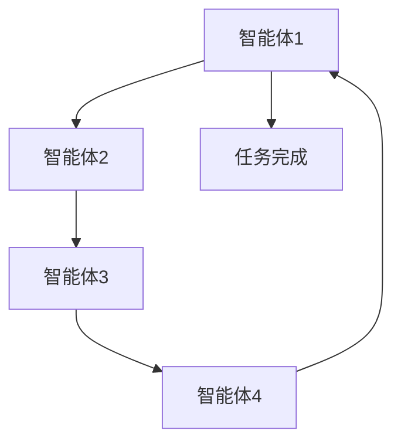
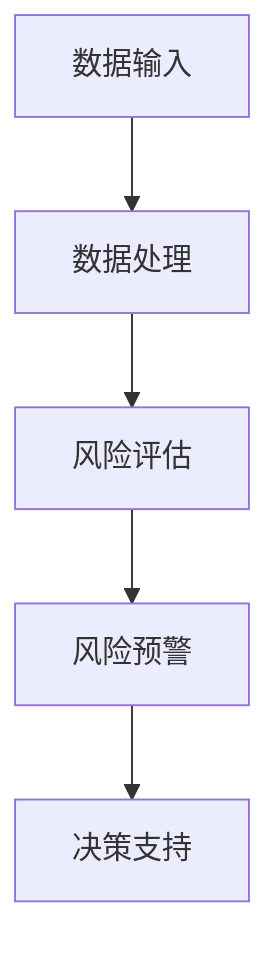
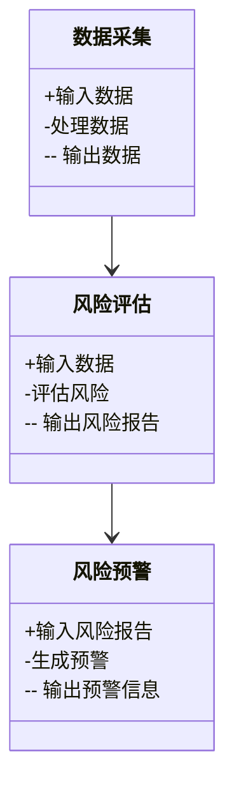

                 


# AI多智能体在价值投资中的监管风险分析

> **关键词**: 多智能体系统, 价值投资, 监管风险, 人工智能, 金融风险管理

> **摘要**: 本文探讨了AI多智能体系统在价值投资中的监管风险分析应用。通过分析多智能体系统的核心原理和监管风险分析的方法，结合具体的数学模型和算法实现，本文详细阐述了AI技术如何在价值投资中识别和管理监管风险。文章还通过实际案例分析，展示了多智能体系统在金融风险管理中的优势和挑战，并提出了相应的解决方案。

---

# 第1章 背景介绍与核心概念

## 1.1 问题背景与问题描述

### 1.1.1 多智能体系统的基本概念
多智能体系统（Multi-Agent System, MAS）是由多个相互作用的智能体组成的系统，这些智能体能够通过协作完成复杂的任务。在金融领域，多智能体系统可以模拟市场参与者的行为，帮助分析市场动态。

### 1.1.2 价值投资中的监管风险分析
价值投资是通过分析公司基本面来评估其内在价值的一种投资策略。然而，金融市场的监管风险可能影响投资决策。如何利用AI技术实时监控和分析监管风险，是价值投资者面临的重要挑战。

### 1.1.3 AI技术在金融领域的应用现状
AI技术在金融领域的应用广泛，包括风险评估、市场预测和交易策略优化等。然而，现有的AI技术在监管风险分析中的应用还相对有限，尤其是在多智能体系统的协作方面。

## 1.2 核心概念与问题解决

### 1.2.1 多智能体系统在金融中的应用
多智能体系统可以通过模拟市场参与者的决策行为，帮助投资者理解市场动态和潜在风险。

### 1.2.2 监管风险分析的核心问题
监管风险分析的核心问题是识别和评估那些可能影响投资组合的监管变化。通过分析监管政策的变化趋势，投资者可以提前制定应对策略。

### 1.2.3 AI技术如何解决监管风险分析问题
AI技术可以通过自然语言处理和机器学习算法，自动分析监管文件和新闻，识别潜在的监管风险，并提供实时的预警。

## 1.3 问题的边界与外延

### 1.3.1 多智能体系统的边界
多智能体系统的边界包括智能体的数量、类型和交互方式。在金融领域，智能体可以代表不同的市场参与者，如投资者、监管机构和金融机构。

### 1.3.2 监管风险分析的边界
监管风险分析的边界包括监管政策的变化、市场反应和经济环境的变化。这些因素共同影响监管风险的评估和应对策略。

### 1.3.3 AI技术应用的边界
AI技术在监管风险分析中的应用边界包括数据来源、模型复杂度和计算能力。AI模型需要处理大量的金融数据，同时保证计算效率。

## 1.4 核心要素与概念结构

### 1.4.1 多智能体系统的组成要素
多智能体系统由多个智能体、通信协议、协作机制和环境组成。每个智能体都有自己的目标和决策规则。

### 1.4.2 监管风险分析的关键要素
监管风险分析的关键要素包括监管政策、市场反应和经济环境。这些要素共同影响监管风险的评估结果。

### 1.4.3 AI技术在系统中的角色
AI技术在多智能体系统中起到数据处理、模型训练和决策支持的作用。通过AI算法，系统可以实时分析监管风险并提供预警。

## 1.5 本章小结

---

# 第2章 多智能体系统与监管风险分析的核心概念

## 2.1 多智能体系统原理

### 2.1.1 多智能体系统的定义
多智能体系统是由多个智能体组成的分布式系统，这些智能体通过协作完成复杂的任务。

### 2.1.2 多智能体系统的分类
多智能体系统可以分为基于规则的系统和基于学习的系统。基于规则的系统依赖预定义的规则，而基于学习的系统通过机器学习算法自适应地优化决策。

### 2.1.3 多智能体系统的关键属性
多智能体系统的关键属性包括自主性、协作性、反应性和适应性。这些属性使得系统能够灵活应对复杂的市场环境。

## 2.2 监管风险分析原理

### 2.2.1 监管风险的定义
监管风险是指由于监管政策的变化或执行力度的加强，导致金融机构面临处罚或业务调整的风险。

### 2.2.2 监管风险的分类
监管风险可以分为合规风险、操作风险和声誉风险。不同类型的风险需要不同的分析方法。

### 2.2.3 监管风险分析的方法
监管风险分析的方法包括定量分析和定性分析。定量分析通过数学模型评估风险，而定性分析则通过专家判断和案例研究识别潜在风险。

## 2.3 AI技术在监管风险分析中的应用

### 2.3.1 AI技术的基本原理
AI技术包括机器学习、自然语言处理和深度学习等。这些技术可以帮助系统自动分析大量数据，识别潜在风险。

### 2.3.2 AI技术在金融监管中的应用
在金融监管中，AI技术可以用于异常交易检测、监管文件分析和市场监控。通过AI算法，监管机构可以更高效地识别违规行为。

### 2.3.3 AI技术在风险分析中的优势
AI技术的优势在于其快速处理数据和自适应学习的能力。通过不断学习新的数据，AI系统可以提高风险预测的准确性。

## 2.4 多智能体系统与监管风险分析的关系

### 2.4.1 多智能体系统的协作机制
多智能体系统的协作机制包括通信协议、任务分配和协调机制。这些机制确保智能体之间的有效协作。

### 2.4.2 监管风险分析的多智能体模型
通过构建多智能体模型，可以模拟不同市场参与者的决策行为，评估监管政策对市场的影响。

### 2.4.3 AI技术在多智能体系统中的作用
AI技术通过提供实时数据处理和决策支持，帮助多智能体系统优化协作效率和风险分析能力。

## 2.5 核心概念对比分析

### 2.5.1 多智能体系统与传统单智能体系统的对比
多智能体系统的优势在于其协作性和适应性。与单智能体系统相比，多智能体系统能够更好地应对复杂环境。

### 2.5.2 监管风险分析与传统风险分析的对比
监管风险分析更加关注政策变化和市场反应，而传统风险分析则更侧重于财务数据和市场波动。

### 2.5.3 AI技术在多智能体系统中的应用对比
与传统方法相比，AI技术在多智能体系统中的应用更加高效和灵活，能够处理更复杂的数据和场景。

## 2.6 本章小结

---

# 第3章 多智能体系统与监管风险分析的数学模型与算法原理

## 3.1 多智能体系统的数学模型

### 3.1.1 多智能体系统的状态表示
多智能体系统的状态可以表示为多个智能体的联合状态，每个智能体都有自己的状态空间。

### 3.1.2 多智能体系统的动作空间
动作空间描述了智能体在每个状态下可以执行的动作。在金融领域，动作可能包括买入、卖出和持有。

### 3.1.3 多智能体系统的奖励机制
奖励机制用于评估智能体的决策效果。通过奖励机制，智能体可以学习最优策略。

## 3.2 监管风险分析的数学模型

### 3.2.1 风险评估的数学公式
风险评估可以通过概率论和统计学方法进行建模。例如，使用马尔可夫链模型预测政策变化的概率。

### 3.2.2 风险传播的数学模型
风险传播模型描述了监管风险在市场中的扩散过程。可以通过网络模型分析风险的传播路径。

### 3.2.3 风险缓解的数学方法
风险缓解可以通过优化算法寻找最优的风险管理策略，例如使用动态规划算法确定最优的投资组合。

## 3.3 AI算法在监管风险分析中的应用

### 3.3.1 强化学习算法
强化学习算法通过试错学习优化决策策略。在监管风险分析中，智能体可以通过强化学习学习如何应对监管变化。

### 3.3.2 聚类算法
聚类算法用于将相似的市场参与者分组，识别潜在的市场风险。

### 3.3.3 分类算法
分类算法用于识别监管文件中的关键词，判断政策变化的可能性。

## 3.4 多智能体协作算法

### 3.4.1 基于强化学习的多智能体协作
基于强化学习的多智能体协作通过分布式Q-learning算法，实现智能体之间的协作。

### 3.4.2 基于博弈论的多智能体协作
基于博弈论的协作方法通过纳什均衡理论，确定智能体的最优策略。

### 3.4.3 基于分布式计算的多智能体协作
分布式计算技术确保多智能体系统在大规模数据下的高效协作。

## 3.5 算法流程图

### 3.5.1 多智能体协作算法流程图


### 3.5.2 监管风险分析算法流程图


## 3.6 本章小结

---

# 第4章 多智能体系统与监管风险分析的系统架构设计

## 4.1 系统架构设计

### 4.1.1 系统功能模块
系统功能模块包括数据采集、风险评估、预警和决策支持。每个模块都有其特定的功能和接口。

### 4.1.2 系统功能设计
系统功能设计使用Mermaid类图展示各模块之间的关系。例如，数据采集模块与风险评估模块通过接口传递数据。

### 4.1.3 系统架构图


### 4.1.4 系统接口设计
系统接口设计包括数据接口和用户接口。数据接口用于与其他系统交换数据，用户接口提供友好的操作界面。

### 4.1.5 系统交互设计
系统交互设计使用Mermaid序列图展示用户与系统之间的交互流程。例如，用户输入数据，系统处理并返回结果。

## 4.2 本章小结

---

# 第5章 项目实战

## 5.1 环境安装

### 5.1.1 安装Python和相关库
需要安装Python 3.8以上版本，以及TensorFlow、Keras和Scikit-learn等库。

### 5.1.2 安装Jupyter Notebook
安装Jupyter Notebook用于代码实现和结果展示。

## 5.2 核心代码实现

### 5.2.1 数据采集代码
```python
import pandas as pd

def collect_data():
    # 数据采集代码
    pass
```

### 5.2.2 风险评估代码
```python
def assess_risk():
    # 风险评估代码
    pass
```

### 5.2.3 风险预警代码
```python
def risk预警():
    # 风险预警代码
    pass
```

### 5.2.4 决策支持代码
```python
def decision_support():
    # 决策支持代码
    pass
```

## 5.3 代码应用解读与分析
详细解读每个代码的功能和实现逻辑，分析其在监管风险分析中的作用。

## 5.4 实际案例分析
通过具体案例分析，展示多智能体系统在监管风险分析中的应用效果。

## 5.5 本章小结

---

# 第6章 最佳实践与总结

## 6.1 最佳实践 tips
- 定期更新模型，适应新的监管政策变化。
- 确保数据来源的多样性和准确性。
- 优化算法，提高计算效率。

## 6.2 本章小结
总结本文的核心内容，强调多智能体系统在监管风险分析中的优势和挑战，展望未来的研究方向。

---

# 作者：AI天才研究院/AI Genius Institute & 禅与计算机程序设计艺术 /Zen And The Art of Computer Programming

---

通过以上内容，您希望我对哪一部分进行进一步的详细分析或修改呢？

