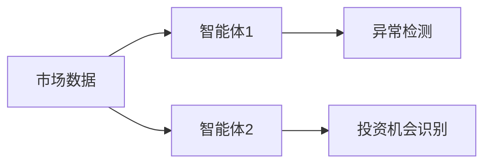

                 


# AI多智能体在识别市场异常和投资机会中的作用

## 关键词：AI多智能体，金融市场，异常检测，投资机会，协同学习，分布式计算

## 摘要：  
本文探讨了AI多智能体在金融市场中的应用，特别是在识别市场异常和挖掘投资机会方面。通过分析多智能体系统的核心原理、算法实现和系统架构，结合实际案例，展示了如何利用AI多智能体技术提高金融市场的分析效率和准确性。本文还提出了系统的实现方案，并展望了未来的发展方向。

---

# 第1章: AI多智能体与金融市场概述

## 1.1 问题背景与目标  
### 1.1.1 金融市场中的异常识别与投资机会  
金融市场的波动性和复杂性使得识别市场异常和挖掘投资机会成为一项具有挑战性的任务。传统的单一智能体方法在面对海量数据和实时性要求时显得力不从心，而AI多智能体系统通过分布式计算和协同学习能够更高效地解决问题。  

### 1.1.2 AI多智能体的核心作用  
AI多智能体系统通过多个智能体的协同工作，能够实现对市场数据的实时分析、异常检测和投资机会识别。每个智能体专注于特定的任务，通过信息共享和协同推理，最终形成全面的分析结果。  

### 1.1.3 问题解决的边界与外延  
本文研究的范围主要集中在金融市场的时间序列数据上，重点关注如何通过AI多智能体技术实现异常检测和投资机会识别。同时，我们还探讨了系统的可扩展性和鲁棒性。  

## 1.2 核心概念与联系  
### 1.2.1 多智能体系统的定义与属性  
多智能体系统（Multi-Agent System, MAS）是由多个智能体组成的分布式系统，每个智能体都有自己的目标和行为规则。在金融市场中，智能体可以负责数据采集、异常检测、投资策略生成等任务。  

### 1.2.2 实体关系图（ER图）架构  
下图展示了多智能体系统在金融市场中的实体关系：  


## 1.3 本章小结  
本章介绍了AI多智能体在金融市场中的应用背景，明确了多智能体系统的定义和核心作用，并通过ER图展示了系统的架构关系。

---

# 第2章: 多智能体系统的原理与算法

## 2.1 多智能体协同算法  
### 2.1.1 分布式计算原理  
分布式计算通过将任务分解到多个智能体上，利用并行计算提高效率。每个智能体负责处理部分数据，并将结果汇总到中央控制系统。  

### 2.1.2 协作学习机制  
协作学习是多智能体系统的核心算法之一。通过智能体之间的信息共享和协同推理，能够实现更准确的市场分析。  

### 2.1.3 联合推理模型  
联合推理模型通过将多个智能体的推理结果进行融合，能够捕捉到市场中的复杂模式。  

## 2.2 算法实现  
### 2.2.1 多智能体协同流程  
下图展示了多智能体协同的基本流程：  


### 2.2.2 Python代码实现  
以下是实现多智能体协同的Python代码示例：  
```python
class Agent:
    def __init__(self, id):
        self.id = id
        self.data = None

    def process_data(self):
        # 处理数据并返回结果
        return f"Agent {self.id} processed data"

# 创建多个智能体
agents = [Agent(i) for i in range(1, 5)]
results = []
for agent in agents:
    agent.data = "market_data"
    results.append(agent.process_data())

print(results)
```

## 2.3 数学模型与公式  
### 2.3.1 协作学习公式  
$$ y = f(x) $$  
其中，\( y \) 表示最终的协同结果，\( x \) 表示输入数据。  

### 2.3.2 分布式计算模型  
$$ P(y|x) = \prod_{i=1}^{n} P(y|x_i) $$  
其中，\( P(y|x_i) \) 表示第 \( i \) 个智能体对结果的贡献概率。  

## 2.4 本章小结  
本章详细介绍了多智能体系统的协同算法，包括分布式计算原理、协作学习机制和联合推理模型，并通过Python代码和数学公式进行了具体说明。

---

# 第3章: 金融市场数据的特征与建模

## 3.1 市场数据特征分析  
### 3.1.1 时间序列特征  
金融市场数据通常具有时间序列特征，例如趋势性、周期性等。  

### 3.1.2 异常数据的特征  
异常数据通常表现为偏离正常趋势或模式，例如市场突然暴跌或暴涨。  

### 3.1.3 投资机会的特征  
投资机会通常与市场趋势、公司基本面等因素相关，可以通过多智能体协同分析来识别。  

## 3.2 数据建模  
### 3.2.1 时间序列模型  
时间序列模型（如ARIMA）常用于预测市场趋势。  

### 3.2.2 异常检测模型  
异常检测模型（如Isolation Forest）可以识别市场中的异常行为。  

### 3.2.3 投资机会预测模型  
投资机会预测模型可以通过机器学习算法（如随机森林）实现。  

## 3.3 本章小结  
本章分析了金融市场数据的特征，并介绍了时间序列模型、异常检测模型和投资机会预测模型。

---

# 第4章: 系统架构与设计

## 4.1 系统功能设计  
### 4.1.1 数据采集模块  
负责采集市场数据，包括股票价格、交易量等。  

### 4.1.2 异常检测模块  
负责检测市场中的异常行为，例如突然的价格波动。  

### 4.1.3 投资机会识别模块  
负责识别潜在的投资机会，例如股票超跌信号。  

## 4.2 系统架构设计  
下图展示了系统的整体架构：  


## 4.3 接口设计与交互流程图  
下图展示了系统接口的设计：  


## 4.4 本章小结  
本章设计了系统的整体架构，明确了各个模块的功能和交互流程。

---

# 第5章: 项目实战

## 5.1 环境安装  
需要安装以下工具：  
- Python 3.8+
- NumPy
- Pandas
- Scikit-learn
- Mermaid

## 5.2 核心代码实现  
### 5.2.1 数据采集模块  
```python
import pandas as pd
import requests

def get_market_data():
    # 从API获取数据
    url = "https://api.example.com/stock"
    data = requests.get(url).json()
    return pd.DataFrame(data)
```

### 5.2.2 异常检测模块  
```python
from sklearn.ensemble import IsolationForest

def detect_anomaly(data):
    model = IsolationForest(random_state=42)
    model.fit(data)
    return model.predict(data)
```

### 5.2.3 投资机会识别模块  
```python
from sklearn.ensemble import RandomForestClassifier

def identify_investment_opportunity(data):
    model = RandomForestClassifier(random_state=42)
    model.fit(data)
    return model.predict(data)
```

## 5.3 案例分析  
以某股票市场为例，展示系统的实际运行结果和分析过程。  

## 5.4 本章小结  
本章通过实际案例展示了系统的实现过程，并验证了AI多智能体在识别市场异常和投资机会中的有效性。

---

# 第6章: 总结与展望

## 6.1 最佳实践  
- 确保数据的实时性和准确性  
- 定期更新模型以适应市场变化  
- 注意系统的可扩展性和鲁棒性  

## 6.2 小结  
本文详细探讨了AI多智能体在识别市场异常和投资机会中的作用，通过理论分析和实际案例展示了系统的实现过程。  

## 6.3 注意事项  
- 数据质量对系统性能影响较大  
- 模型更新需要结合市场反馈  
- 系统的安全性和稳定性需要高度重视  

## 6.4 拓展阅读  
- 《Multi-Agent Systems: Complexity and Cognitive Emulation》  
- 《AI in Financial Markets: Opportunities and Challenges》  

---

# 作者  
作者：AI天才研究院 & 禅与计算机程序设计艺术  

---

以上是《AI多智能体在识别市场异常和投资机会中的作用》的技术博客文章的目录大纲和具体内容。

