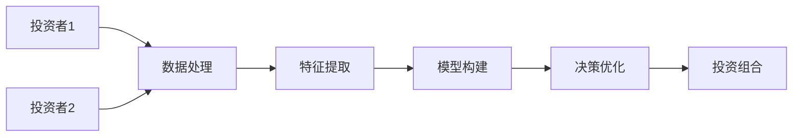
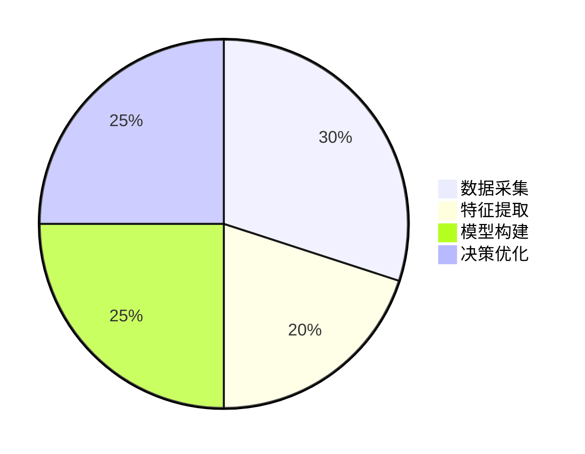

                 


# AI多智能体如何优化价值投资的长期持股策略

## 关键词：AI多智能体，价值投资，长期持股策略，投资决策，人工智能

## 摘要：本文探讨了如何利用AI多智能体技术优化价值投资的长期持股策略。通过分析多智能体系统的协作机制和价值评估模型，本文详细介绍了AI在投资决策中的应用，结合实际案例和系统设计，展示了如何通过AI技术提升投资策略的有效性和稳定性。

---

## 第一部分：AI多智能体与价值投资的背景与概述

### 第1章：AI多智能体与价值投资的背景

#### 1.1 问题背景

- **传统价值投资的局限性**：传统价值投资依赖于分析师的主观判断和经验，存在信息处理不全、决策效率低等问题。

- **AI技术在金融领域的应用趋势**：AI技术能够处理海量数据，识别复杂模式，为投资决策提供支持。

- **多智能体系统的优势**：多智能体系统通过协作优化决策过程，能够模拟人类投资团队的决策机制。

#### 1.2 问题描述

- **价值投资中的信息处理挑战**：市场数据复杂且动态变化，传统方法难以实时处理。

- **长期持股策略的核心问题**：如何在长期波动中保持策略稳定性和收益性。

- **AI多智能体在投资决策中的角色**：通过协作和学习，优化投资决策过程。

#### 1.3 问题解决

- **AI多智能体如何优化投资决策**：通过数据挖掘、模式识别和决策优化，提升投资决策的准确性和效率。

- **多智能体协作在价值评估中的应用**：多个智能体协同工作，分别负责数据处理、模型构建和决策优化。

- **长期持股策略的AI实现路径**：利用AI技术构建动态调整机制，优化持股组合。

#### 1.4 边界与外延

- **多智能体系统的边界条件**：系统的输入数据范围、决策权限和市场环境。

- **价值投资的适用范围**：适用于稳定市场的长期投资，需考虑市场波动和政策变化。

- **长期持股策略的适用场景**：适合价值稳定的资产，如优质股票、房地产等。

#### 1.5 概念结构与核心要素

- **多智能体系统的组成要素**：数据采集、特征提取、模型构建、决策优化。

- **价值投资的核心要素**：资产的内在价值、市场估值、投资周期。

- **长期持股策略的关键因素**：资产选择、仓位调整、风险管理。

---

## 第二部分：AI多智能体的核心概念与原理

### 第2章：AI多智能体的定义与特点

#### 2.1 核心概念

- **多智能体系统的定义**：由多个相互作用的智能体组成的系统，每个智能体能够感知环境、做出决策并采取行动。

- **多智能体系统的特点**：分布式、协作性、自主性、动态性。

- **多智能体系统的分类**：基于任务、基于环境、基于行为。

#### 2.2 价值投资的核心要素

- **价值投资的定义**：基于资产的内在价值进行投资，追求长期收益。

- **价值投资的关键指标**：市盈率、市净率、股息率、ROE。

- **价值投资的决策逻辑**：寻找低于内在价值的资产，长期持有。

#### 2.3 AI多智能体与价值投资的关系

- **多智能体在价值评估中的应用**：通过协作优化资产筛选和估值模型。

- **AI技术对投资决策的支持**：利用机器学习算法分析历史数据，预测市场趋势。

---

## 第三部分：AI多智能体的算法原理

### 第3章：多智能体协作机制

#### 3.1 分布式协作机制

- **分布式任务分配**：智能体根据自身能力分配任务。

- **通信协议**：智能体之间通过特定协议交换信息。

- **协调与同步**：通过协调机制保持系统一致性。

#### 3.2 基于强化学习的协作优化

- **强化学习简介**：通过试错学习优化决策策略。

- **多智能体强化学习模型**：基于Q-learning的协作优化算法。

- **算法流程图**



---

## 第四部分：AI多智能体系统的设计与实现

### 第4章：系统架构设计

#### 4.1 系统功能设计

- **数据采集模块**：实时采集市场数据和财务报表。

- **特征提取模块**：提取关键财务指标和市场指标。

- **模型构建模块**：基于机器学习构建估值模型。

- **决策优化模块**：优化投资组合和风险控制。

#### 4.2 系统架构图



---

## 第五部分：项目实战

### 第5章：AI多智能体投资系统的实现

#### 5.1 环境安装

- **Python环境**：安装Python 3.8以上版本。

- **依赖库安装**：numpy、pandas、scikit-learn、tensorflow。

#### 5.2 核心代码实现

```python
import numpy as np
import pandas as pd
from sklearn.metrics import accuracy_score
from tensorflow.keras.models import Sequential
from tensorflow.keras.layers import Dense

# 数据预处理
data = pd.read_csv('market_data.csv')
X = data.drop('target', axis=1)
y = data['target']

# 模型构建
model = Sequential()
model.add(Dense(64, activation='relu', input_dim=X.shape[1]))
model.add(Dense(1, activation='sigmoid'))
model.compile(optimizer='adam', loss='binary_crossentropy', metrics=['accuracy'])

# 训练模型
model.fit(X, y, epochs=100, batch_size=32)
```

#### 5.3 案例分析

- **数据来源**：股票市场数据。

- **模型训练**：基于历史数据训练估值模型。

- **投资组合优化**：根据模型预测优化持股策略。

---

## 第六部分：总结与展望

### 第6章：总结与小结

- **小结**：AI多智能体技术为价值投资提供了新的可能性，通过协作优化投资决策。

- **注意事项**：模型需持续优化，数据质量和市场环境影响模型表现。

- **扩展阅读**：推荐相关书籍和论文，如《The Intelligent Investor》。

---

## 作者：AI天才研究院 & 禅与计算机程序设计艺术

---

**注**：本文仅展示了目录大纲和部分内容，完整文章需要根据上述结构详细展开，每个章节都需要丰富的细节和具体案例支持。

