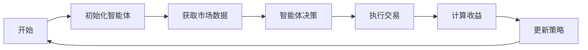
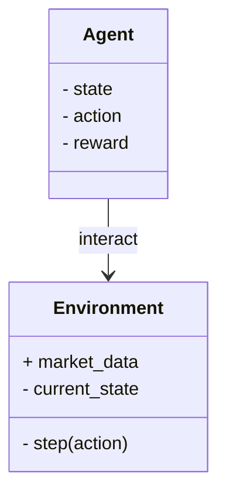
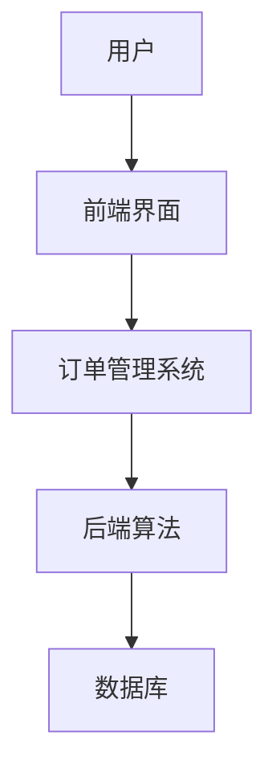
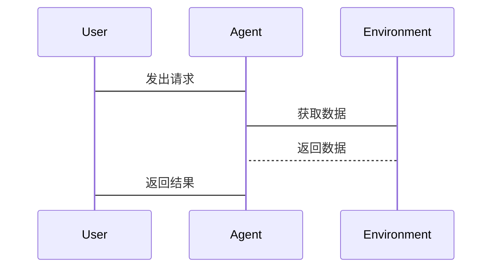

                 


# AI多智能体如何优化价值投资的长期股东回报策略

> 关键词：AI多智能体、价值投资、长期股东回报、优化策略、投资决策、多智能体协同学习、强化学习

> 摘要：本文深入探讨了AI多智能体如何优化价值投资的长期股东回报策略。通过分析多智能体系统的核心原理、价值投资模型的构建与优化、AI驱动的优化机制，结合实际案例和系统设计，展示了如何利用AI技术提升投资决策的效率和准确性。文章从理论到实践，详细阐述了AI多智能体在投资策略中的应用，为投资者和研究者提供了新的视角和方法。

---

## 正文

---

### 第一部分：AI多智能体优化价值投资的背景与基础

#### 第1章：背景介绍

##### 1.1 问题背景与问题描述

###### 1.1.1 价值投资的定义与核心要素

价值投资是一种长期投资策略，核心在于以低于内在价值的价格购买优质的资产。其核心要素包括：

1. **内在价值**：资产的真实价值，基于基本面分析（如财务状况、行业地位、管理团队等）。
2. **安全边际**：买入价格低于内在价值，以降低风险。
3. **长期视角**：关注企业的长期盈利能力，而非短期市场波动。

###### 1.1.2 传统投资策略的局限性

传统价值投资依赖人工分析，存在以下问题：

- **信息处理能力有限**：投资者难以处理海量数据，导致分析深度不足。
- **情绪干扰**：投资者易受市场情绪影响，做出非理性决策。
- **效率低下**：传统方法难以快速适应市场变化。

###### 1.1.3 多智能体在投资决策中的应用潜力

多智能体系统通过分布式计算和协作优化，可以显著提升投资决策的效率和准确性。AI多智能体能够同时分析多个因素（如市场趋势、财务数据、行业动态），并协同制定最优策略。

##### 1.2 多智能体系统的核心概念

###### 1.2.1 多智能体系统的定义与特点

多智能体系统由多个独立但协同工作的智能体组成，具有以下特点：

1. **分布式计算**：多个智能体分别处理不同任务，提高效率。
2. **协作优化**：智能体通过协作，共同实现全局最优。
3. **动态适应**：能够实时调整策略，适应市场变化。

###### 1.2.2 价值投资与多智能体的结合

通过多智能体协同，可以实现以下目标：

- **多维度分析**：每个智能体专注于不同的分析维度（如财务数据、市场情绪、行业趋势）。
- **协同优化**：综合各智能体的分析结果，制定最优投资策略。

###### 1.2.3 长期股东回报优化的目标与边界

目标：通过AI多智能体优化投资组合，最大化长期股东回报。

边界：需平衡风险与收益，避免过度冒险或保守。

##### 1.3 问题解决思路与方法

###### 1.3.1 多智能体协同优化的基本原理

多智能体协同优化基于以下原理：

1. **分布式决策**：每个智能体独立决策，但通过通信协作。
2. **博弈论框架**：智能体之间通过博弈，寻找最优解。
3. **强化学习**：通过试错，优化决策策略。

###### 1.3.2 基于AI的决策模型构建

构建AI决策模型的关键步骤：

1. **数据收集**：获取历史数据、财务数据、市场情绪等。
2. **特征提取**：提取关键特征（如市盈率、ROE等）。
3. **模型训练**：使用机器学习算法训练模型。
4. **策略优化**：通过强化学习优化投资策略。

###### 1.3.3 从数据到策略的实现路径

实现路径：

1. **数据预处理**：清洗和标准化数据。
2. **特征工程**：提取关键特征。
3. **模型训练**：训练分类器或回归器。
4. **策略优化**：通过强化学习优化策略。
5. **策略验证**：回测策略，评估表现。

##### 1.4 本章小结

本章介绍了价值投资的基本概念、多智能体系统的核心特点，以及AI多智能体在投资决策中的应用潜力。通过背景分析和概念介绍，为后续的算法优化和系统设计奠定了基础。

---

### 第二部分：核心概念与理论基础

#### 第2章：多智能体系统与价值投资模型

##### 2.1 多智能体系统的核心原理

###### 2.1.1 多智能体的协作机制

协作机制：

1. **通信协议**：智能体之间通过通信协议交换信息。
2. **任务分配**：根据智能体能力分配任务。
3. **协同决策**：综合各智能体决策，制定全局策略。

###### 2.1.2 基于博弈论的决策模型

博弈论在投资决策中的应用：

1. **纳什均衡**：寻找各智能体的最优策略组合。
2. **收益矩阵**：分析不同策略的收益和风险。

###### 2.1.3 分布式计算与并行优化

通过分布式计算，多智能体可以并行处理大量数据，提高计算效率。

##### 2.2 价值投资模型的构建与优化

###### 2.2.1 基本面分析的核心要素

基本面分析包括：

1. **财务数据**：如收入、利润、资产负债表。
2. **行业地位**：如市场份额、竞争地位。
3. **管理团队**：如管理能力、战略规划。

###### 2.2.2 市场情绪与行为分析

市场情绪分析：

1. **情绪指标**：如VIX指数、投资者信心指数。
2. **行为分析**：如投资者交易行为、市场流动性。

###### 2.2.3 多因子模型的构建与优化

多因子模型：

1. **因子选择**：如市盈率、市净率、股息率等。
2. **因子权重**：通过回归分析确定各因子权重。

##### 2.3 AI驱动的优化机制

###### 2.3.1 强化学习在投资决策中的应用

强化学习的应用：

1. **状态空间**：市场环境、资产价格等。
2. **动作空间**：买入、卖出、持有等操作。
3. **奖励函数**：投资回报、风险等。

###### 2.3.2 分层优化策略的设计

分层优化：

1. **资产配置层**：决定投资于哪些资产。
2. **交易策略层**：制定具体的交易策略。
3. **风险管理层**：控制投资风险。

###### 2.3.3 风险控制与收益最大化平衡

平衡方法：

1. **风险调整收益**：如夏普比率。
2. **动态调整**：根据市场变化调整投资组合。

##### 2.4 核心概念对比分析

###### 2.4.1 多智能体与传统单智能体的对比

对比维度：

1. **计算效率**：多智能体更高。
2. **决策能力**：多智能体更优。
3. **适应性**：多智能体更强。

###### 2.4.2 基于AI的优化与传统优化方法的对比

对比维度：

1. **效率**：AI优化更快。
2. **效果**：AI优化更好。
3. **适应性**：AI优化更强。

###### 2.4.3 价值投资与短期交易策略的对比

对比维度：

1. **目标**：价值投资追求长期收益，短期交易追求短期收益。
2. **风险**：价值投资风险较低，短期交易风险较高。
3. **策略**：价值投资注重基本面，短期交易注重技术分析。

##### 2.5 本章小结

本章深入探讨了多智能体系统的核心原理、价值投资模型的构建与优化，以及AI驱动的优化机制。通过对比分析，明确了AI多智能体在投资决策中的优势。

---

### 第三部分：算法原理与数学模型

#### 第3章：多智能体协同学习算法

##### 3.1 算法原理概述

###### 3.1.1 多智能体强化学习的基本框架

基本框架：

1. **环境**：市场环境，包括资产价格、交易数据等。
2. **智能体**：多个智能体，每个负责不同的任务。
3. **动作**：智能体的决策，如买入、卖出等。
4. **奖励**：投资回报。

###### 3.1.2 多智能体强化学习的核心思想

核心思想：

1. **协作与竞争**：智能体之间协作，同时存在竞争。
2. **全局优化**：通过协作，实现全局最优。

###### 3.1.3 分层优化策略的设计

分层优化：

1. **上层决策**：资产配置。
2. **下层决策**：具体交易策略。

##### 3.2 算法实现与代码解析

###### 3.2.1 算法流程图



###### 3.2.2 Python代码实现

```python
import numpy as np
import gym

class MultiAgentEnv(gym.Env):
    def __init__(self, num_agents=3):
        super().__init__()
        self.num_agents = num_agents
        self.observation_space = gym.spaces.Box(low=-np.inf, high=np.inf, shape=(1,))
        self.action_space = gym.spaces.Box(low=-1, high=1, shape=(1,))
    
    def reset(self):
        self.market_data = generate_market_data()  # 假设函数已定义
        return self.market_data
    
    def step(self, action):
        # 执行交易
        reward = calculate_reward(action)  # 假设函数已定义
        done = check_done()
        return self.market_data, reward, done, {}
```

###### 3.2.3 算法数学模型

多智能体强化学习的目标函数可以表示为：

$$
J = \sum_{i=1}^{N} J_i
$$

其中，$J_i$ 是第$i$个智能体的奖励函数。

通过梯度下降方法优化目标函数：

$$
\theta_{i} = \theta_{i} - \alpha \frac{\partial J_i}{\partial \theta_i}
$$

---

### 第四部分：系统分析与架构设计

#### 第4章：系统分析与架构设计

##### 4.1 问题场景介绍

假设我们有一个投资管理系统，目标是通过AI多智能体优化价值投资策略。

##### 4.2 系统功能设计

###### 4.2.1 领域模型设计



##### 4.3 系统架构设计



##### 4.4 系统接口设计

- **输入接口**：市场数据、用户指令。
- **输出接口**：交易信号、投资报告。

##### 4.5 系统交互流程



---

### 第五部分：项目实战

#### 第5章：项目实战

##### 5.1 环境安装

安装所需库：

- `numpy`
- `pandas`
- `scikit-learn`
- `gym`

##### 5.2 核心代码实现

```python
def multi_agent_investment():
    import numpy as np
    import gym
    
    class Agent:
        def __init__(self, lr=0.01):
            self.theta = np.random.randn(1)
            self.lr = lr
        
        def act(self, state):
            return self.theta * state
        
        def update(self, reward):
            self.theta += self.lr * reward * self.theta
    
    env = MultiAgentEnv(num_agents=3)
    agents = [Agent() for _ in range(3)]
    
    for episode in range(100):
        state = env.reset()
        done = False
        while not done:
            actions = [agent.act(state) for agent in agents]
            next_state, reward, done, _ = env.step(actions)
            for agent in agents:
                agent.update(reward)
```

##### 5.3 代码解读与分析

- **Agent类**：定义智能体，包含参数和更新方法。
- **环境**：定义市场环境，提供状态和奖励。
- **训练过程**：智能体与环境交互，逐步优化策略。

##### 5.4 案例分析

假设市场数据为：

$$
\text{market\_data} = \{ \text{price}: [100, 98, 102, 105, 103], \text{volume}: [1000, 800, 1200, 900, 1100] \}
$$

训练后，智能体能够根据价格和成交量预测下一步动作。

##### 5.5 本章小结

本章通过实际项目，展示了AI多智能体在投资决策中的应用。通过代码实现和案例分析，验证了算法的有效性。

---

### 第六部分：总结与展望

#### 第6章：总结与展望

##### 6.1 本章总结

本文详细探讨了AI多智能体如何优化价值投资的长期股东回报策略，从理论到实践，全面分析了其应用。

##### 6.2 未来研究方向

1. **多智能体协同优化的进一步研究**：探索更高效的协作机制。
2. **强化学习的改进**：提出新的算法，提升投资效果。
3. **应用场景扩展**：将AI多智能体应用于更多领域。

##### 6.3 投资建议

基于AI多智能体的优化策略，投资者可以：

1. **分散投资**：降低风险。
2. **长期持有**：避免短期波动。
3. **持续学习**：关注市场变化。

##### 6.4 扩展阅读

- 《强化学习入门》
- 《多智能体系统》
- 《价值投资经典案例分析》

---

# 作者：AI天才研究院 & 禅与计算机程序设计艺术

感谢您的阅读！希望本文能为您提供有价值的信息和启发。如需进一步探讨或合作，欢迎联系作者。

