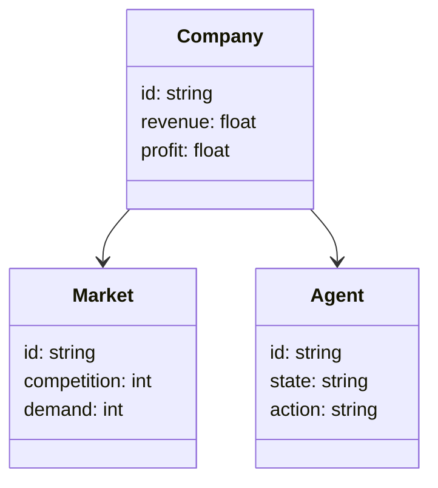
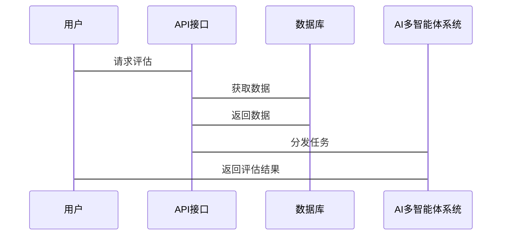

                 


# AI多智能体如何提升对公司长期盈利能力的评估

## 关键词
AI多智能体, 公司盈利能力, 长期评估, 强化学习, 分布式计算

## 摘要
AI多智能体技术通过协作和协调多个智能体，能够显著提升对公司长期盈利能力的评估精度和效率。本文详细探讨了AI多智能体的核心概念、算法原理、系统架构，以及在实际项目中的应用，结合丰富的案例和代码示例，为读者提供全面的理论和实践指导。

---

## 第1章: AI多智能体与公司长期盈利能力评估的背景

### 1.1 AI多智能体的基本概念

#### 1.1.1 多智能体系统的定义
多智能体系统（Multi-Agent System, MAS）是由多个相互作用的智能体组成的系统，每个智能体能够独立感知环境并做出决策。与单智能体系统相比，MAS能够更好地处理复杂问题，通过协作实现整体目标。

#### 1.1.2 AI多智能体的核心特征
- **自主性**：智能体能够自主决策。
- **反应性**：能够实时感知环境并做出反应。
- **协作性**：多个智能体协同工作，共同完成任务。
- **分布式计算**：智能体之间通过分布式计算实现协作。

#### 1.1.3 多智能体与单智能体的区别
| 特性             | 单智能体             | 多智能体             |
|------------------|----------------------|----------------------|
| 决策中心化       | 是                   | 否                   |
| 问题复杂度       | 较低                 | 较高                 |
| 协作能力         | 无                   | 有                   |

### 1.2 公司长期盈利能力评估的背景

#### 1.2.1 公司盈利能力的传统评估方法
传统评估方法通常基于财务数据和历史表现，包括：
- **净利润率**：净利润与营业收入的比率。
- **ROE（净资产收益率）**：衡量股东投资回报率。
- **ROA（资产净利率）**：衡量资产使用效率。

#### 1.2.2 传统方法的局限性
- **数据滞后**：依赖历史数据，无法实时反映公司动态。
- **单一视角**：缺乏对市场变化、竞争环境等外部因素的综合考量。
- **决策延迟**：无法快速响应市场变化，导致错失机遇。

#### 1.2.3 引入AI多智能体的必要性
AI多智能体能够实时分析市场动态、客户行为和内部数据，提供动态评估和预测，帮助公司做出更快、更准确的决策。

### 1.3 AI多智能体在公司盈利能力评估中的作用

#### 1.3.1 提高评估的准确性
AI多智能体能够整合多源数据，通过协作学习提升预测模型的准确性。

#### 1.3.2 增强决策的实时性
通过实时数据分析和反馈，AI多智能体能够快速调整评估策略，提升决策的及时性。

#### 1.3.3 优化资源配置效率
AI多智能体通过协作优化资源配置，降低运营成本，提高整体盈利能力。

### 1.4 本章小结
本章介绍了AI多智能体的基本概念及其在公司长期盈利能力评估中的重要性，为后续章节奠定了理论基础。

---

## 第2章: AI多智能体的核心概念与联系

### 2.1 AI多智能体的核心概念

#### 2.1.1 多智能体系统的组成要素
- **智能体**：独立决策的单元。
- **通信机制**：智能体之间的信息交换方式。
- **协作协议**：智能体之间协作的规则和策略。

#### 2.1.2 AI多智能体的通信机制
- **直接通信**：智能体之间直接交换信息。
- **间接通信**：通过共享数据库或中间件进行信息交换。

#### 2.1.3 多智能体的协作与协调
协作：智能体共同完成任务；协调：智能体之间通过协商解决冲突，确保整体目标的实现。

### 2.2 AI多智能体的属性特征对比

#### 2.2.1 各种AI多智能体模型的对比分析
| 模型             | 优点                     | 缺点                     |
|------------------|--------------------------|--------------------------|
| 基于强化学习的MAS | 高效性，适应动态环境       | 实现复杂，计算资源消耗大 |
| 基于分布式计算的MAS | 高可扩展性               | 通信延迟，协调困难       |

#### 2.2.2 不同模型的优缺点
- **基于强化学习的MAS**：适用于动态环境，能够快速适应变化，但实现复杂，计算资源消耗大。
- **基于分布式计算的MAS**：适用于大规模分布式系统，可扩展性高，但通信延迟可能导致协调困难。

#### 2.2.3 选择合适模型的策略
根据具体应用场景选择合适的模型。例如，动态竞争环境适合强化学习模型，而分布式系统适合分布式计算模型。

### 2.3 ER实体关系图架构

#### 2.3.1 实体关系图的定义
ER图用于描述系统中各实体之间的关系，帮助设计数据库结构。

#### 2.3.2 多智能体系统的ER图设计
```mermaid
er
actor: User {
  id: string
  name: string
}
agent: AI多智能体 {
  id: string
  state: string
}
environment: 环境 {
  id: string
  status: string
}
```

#### 2.3.3 ER图在盈利能力评估中的应用
通过ER图明确各实体之间的关系，设计合理的数据模型，支持多智能体协作。

### 2.4 本章小结
本章详细探讨了AI多智能体的核心概念及其在公司盈利能力评估中的应用，为后续章节的系统设计奠定了基础。

---

## 第3章: AI多智能体的算法原理

### 3.1 算法原理概述

#### 3.1.1 多智能体协作算法的基本原理
多智能体协作算法通过分布式计算和强化学习实现协作。每个智能体独立学习，同时通过通信机制共享信息，共同优化整体目标。

#### 3.1.2 基于强化学习的多智能体算法
强化学习通过奖励机制激励智能体做出最优决策。多智能体强化学习（MRL）通过分布式计算和协作学习提升整体性能。

#### 3.1.3 分布式计算在多智能体中的应用
分布式计算将任务分解为多个子任务，由多个智能体协作完成，提升计算效率和系统可扩展性。

### 3.2 算法原理的数学模型与公式

#### 3.2.1 强化学习的基本公式
$$ Q(s, a) = r + \gamma \max_{a'} Q(s', a') $$
其中：
- \( Q(s, a) \)：状态s下动作a的Q值。
- \( r \)：奖励值。
- \( \gamma \)：折扣因子。
- \( Q(s', a') \)：下一状态s'下动作a'的Q值。

#### 3.2.2 多智能体协作的数学模型
$$ V(s) = \max_{a} \sum_{i=1}^{n} Q_i(s, a_i) $$
其中：
- \( V(s) \)：状态s的整体价值。
- \( Q_i(s, a_i) \)：智能体i在状态s下动作a_i的Q值。

### 3.3 算法实现的Python代码示例

#### 3.3.1 多智能体协作算法的实现
```python
import numpy as np

class Agent:
    def __init__(self, state_space, action_space):
        self.state_space = state_space
        self.action_space = action_space
        self.Q = np.zeros((state_space, action_space))
    
    def act(self, state):
        # 选择最大值的动作
        return np.argmax(self.Q[state])
    
    def update(self, state, action, reward, next_state):
        # Q-learning更新规则
        self.Q[state, action] = reward + 0.99 * np.max(self.Q[next_state])
```

### 3.4 本章小结
本章详细介绍了AI多智能体的算法原理，包括强化学习和分布式计算的应用，为后续章节的系统实现提供了理论支持。

---

## 第4章: 系统分析与架构设计方案

### 4.1 系统分析

#### 4.1.1 问题场景介绍
公司需要实时评估其盈利能力，要求系统能够快速响应市场变化，提供准确的预测和优化建议。

#### 4.1.2 项目介绍
本项目旨在开发一个基于AI多智能体的公司盈利能力评估系统，通过实时数据采集和智能分析，提升评估的准确性和效率。

### 4.2 系统功能设计

#### 4.2.1 领域模型设计


#### 4.2.2 系统架构设计


### 4.3 系统接口设计

#### 4.3.1 系统接口
- **API接口**：提供RESTful API，供外部系统调用。
- **数据库接口**：与公司数据库对接，获取实时数据。

### 4.4 系统交互设计

#### 4.4.1 系统交互流程


### 4.5 本章小结
本章通过系统分析和架构设计，明确了AI多智能体系统在公司盈利能力评估中的应用架构，为后续实现提供了指导。

---

## 第5章: 项目实战

### 5.1 环境安装

#### 5.1.1 安装Python
```bash
python --version
pip install --upgrade pip
```

#### 5.1.2 安装依赖库
```bash
pip install numpy matplotlib scikit-learn
```

### 5.2 系统核心实现源代码

#### 5.2.1 核心代码实现
```python
import numpy as np
import matplotlib.pyplot as plt

class MultiAgentSystem:
    def __init__(self, num_agents):
        self.num_agents = num_agents
        self.agents = [Agent(state_space=10, action_space=4) for _ in range(num_agents)]
    
    def run(self, episodes=100):
        for episode in range(episodes):
            state = np.random.randint(0, 10)
            agent_idx = np.random.randint(0, self.num_agents)
            action = self.agents[agent_idx].act(state)
            next_state = np.random.randint(0, 10)
            reward = np.random.uniform(0, 1)
            self.agents[agent_idx].update(state, action, reward, next_state)
    
    def evaluate(self):
        # 绘制学习曲线
        plt.figure()
        for agent in self.agents:
            plt.plot(agent.Q.mean(axis=1))
        plt.title('Learning Curve')
        plt.show()
```

### 5.3 代码应用解读与分析

#### 5.3.1 代码功能
该代码实现了一个简单的多智能体系统，每个智能体通过Q-learning算法进行学习，提升对状态-动作对的评估。

#### 5.3.2 代码实现细节
- **初始化**：创建多个智能体，每个智能体初始化一个Q值矩阵。
- **运行**：每个智能体在多个episode中进行学习，更新Q值矩阵。
- **评估**：绘制学习曲线，展示智能体的学习效果。

### 5.4 实际案例分析和详细讲解剖析

#### 5.4.1 案例分析
假设某公司需要评估其盈利能力，我们通过AI多智能体系统分析市场数据和内部数据，提供实时评估和优化建议。

#### 5.4.2 系统实现步骤
1. 数据采集：获取公司和市场的实时数据。
2. 数据处理：清洗和预处理数据。
3. 系统运行：启动AI多智能体系统，开始评估过程。
4. 结果分析：根据系统输出，调整公司策略。

### 5.5 本章小结
本章通过项目实战，详细讲解了AI多智能体系统的实现过程，帮助读者掌握理论知识的实际应用。

---

## 第6章: AI多智能体的最佳实践与小结

### 6.1 最佳实践 tips

#### 6.1.1 选择合适的算法
根据具体场景选择合适的多智能体算法，如强化学习或分布式计算。

#### 6.1.2 系统优化
通过并行计算和优化通信机制，提升系统性能。

#### 6.1.3 持续学习
定期更新模型，适应环境变化，保持系统的高效性。

### 6.2 小结
AI多智能体技术通过协作和协调多个智能体，显著提升了对公司长期盈利能力的评估效率和准确性。通过本文的详细讲解，读者可以深入了解AI多智能体的核心概念、算法原理和实际应用。

### 6.3 注意事项
- **数据隐私**：确保数据的安全性和隐私性。
- **系统稳定性**：保证系统的稳定运行，避免因故障导致评估失败。
- **模型更新**：定期更新模型，保持评估的准确性。

### 6.4 拓展阅读
- **强化学习**：深入学习强化学习的理论和应用。
- **分布式计算**：研究分布式计算在多智能体系统中的应用。
- **AI伦理**：探讨AI技术在商业应用中的伦理问题。

---

## 作者
作者：AI天才研究院/AI Genius Institute  
作者：禅与计算机程序设计艺术/Zen And The Art of Computer Programming

