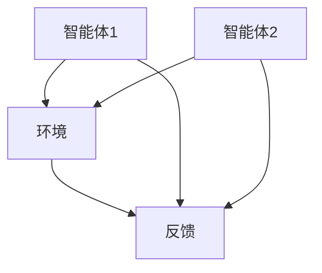
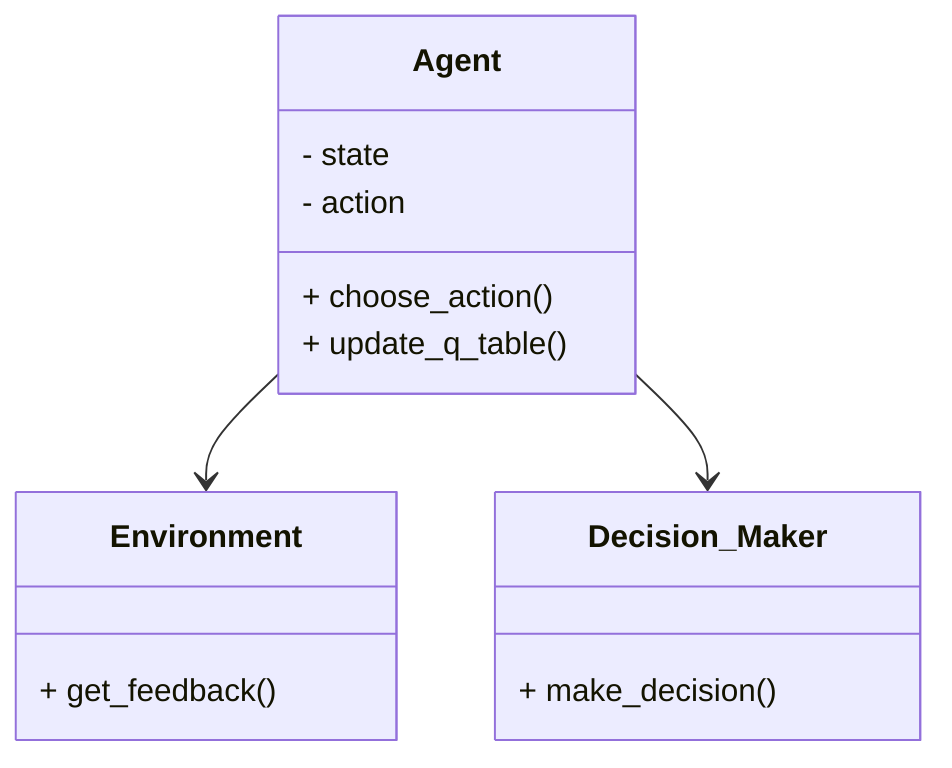
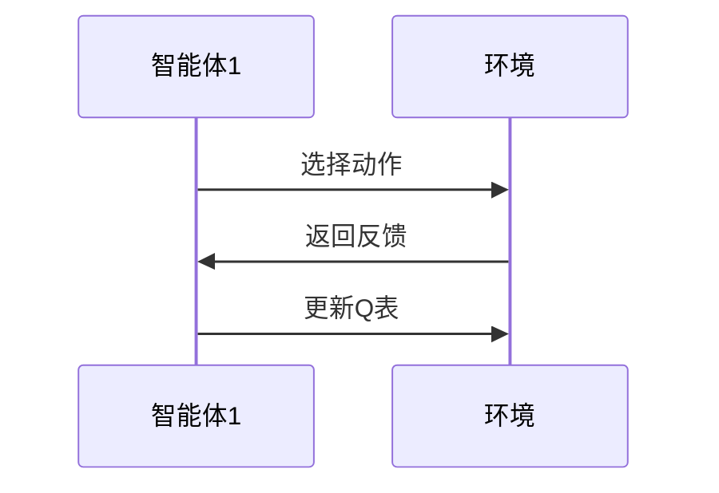

                 


# AI多智能体如何提升对公司长期竞争力的评估

## 关键词：
- AI多智能体
- 企业竞争力
- 算法原理
- 系统架构
- 项目实战

## 摘要：
本文探讨了AI多智能体在提升企业长期竞争力评估中的应用。通过分析多智能体系统的定义、原理及其在企业决策、资源优化和市场分析中的应用场景，详细讲解了多智能体协作算法、系统架构设计以及实际项目案例。结合数学模型和代码示例，本文为读者提供了从理论到实践的全面指导。

---

# 第一部分: AI多智能体与企业长期竞争力评估的背景介绍

## 第1章: AI多智能体的基本概念

### 1.1 多智能体系统的基本定义
#### 1.1.1 多智能体系统的定义
多智能体系统（Multi-Agent System, MAS）是指由多个智能体（Agent）组成的协作系统，每个智能体都是能够感知环境、自主决策的实体。智能体之间通过通信和协作完成复杂任务。

#### 1.1.2 多智能体系统的特征
| 特征 | 描述 |
|------|------|
| 分布性 | 智能体独立运行，分布在网络中 |
| 协作性 | 智能体之间通过通信协作完成任务 |
| 反应性 | 能够实时感知环境变化并做出反应 |

#### 1.1.3 多智能体系统与传统AI的区别
- **传统AI**：基于规则或模型，单个智能体完成任务。
- **多智能体系统**：多个智能体协作，任务分解更灵活。

### 1.2 企业长期竞争力评估的核心要素
#### 1.2.1 企业竞争力的定义
企业竞争力是企业在市场中生存和发展的能力，包括产品、技术、管理和战略等方面。

#### 1.2.2 长期竞争力的关键指标
| 指标 | 描述 |
|------|------|
| 市场份额 | 企业在市场中的占有率 |
| 创新能力 | 技术研发和产品创新能力 |
| 资源配置 | 资源利用效率 |

#### 1.2.3 多智能体在竞争力评估中的作用
多智能体系统能够实时分析市场动态、优化资源配置，帮助企业在复杂环境中做出最优决策。

---

## 第2章: AI多智能体在企业中的应用场景

### 2.1 多智能体在企业决策中的应用
#### 2.1.1 智能体在战略决策中的角色
智能体通过分析市场数据，为企业提供战略建议。

#### 2.1.2 多智能体协同决策的优势
- **分布式计算**：任务分解更高效。
- **实时反馈**：快速响应市场变化。

#### 2.1.3 典型应用场景分析
- 市场预测：智能体分析历史数据，预测未来趋势。
- 竞争对手分析：智能体监控对手动态，提供策略建议。

### 2.2 多智能体在资源优化中的应用
#### 2.2.1 资源分配的智能体模型
智能体通过协作优化资源配置，提高效率。

#### 2.2.2 多智能体在供应链优化中的应用
智能体协调供应商和客户，优化库存管理。

#### 2.2.3 多智能体在生产调度中的应用
智能体实时监控生产过程，调整调度计划。

### 2.3 多智能体在市场分析中的应用
#### 2.3.1 市场预测的智能体模型
智能体通过数据挖掘，预测市场趋势。

#### 2.3.2 竞争对手分析的多智能体方法
智能体监控对手动态，提供实时反馈。

#### 2.3.3 市场动态实时反馈的智能体系统
智能体实时分析市场数据，提供决策支持。

---

# 第三部分: AI多智能体协作算法原理

## 第3章: AI多智能体协作算法原理

### 3.1 多智能体协作的基本原理
#### 3.1.1 基于强化学习的协作算法
智能体通过强化学习（Reinforcement Learning）不断优化协作策略。

#### 3.1.2 算法流程图


#### 3.1.3 Python代码示例
```python
import numpy as np

class Agent:
    def __init__(self, state_space, action_space):
        self.state_space = state_space
        self.action_space = action_space
        self.q_table = np.zeros((state_space, action_space))
        
    def choose_action(self, state, epsilon=0.1):
        if np.random.random() < epsilon:
            return np.random.randint(self.action_space)
        return np.argmax(self.q_table[state])
        
    def update_q_table(self, state, action, reward, next_state, learning_rate=0.1):
        self.q_table[state][action] += learning_rate * (reward + np.max(self.q_table[next_state]) - self.q_table[state][action])
```

#### 3.1.4 数学模型
- **Q-learning公式**：
  $$ Q(s, a) = Q(s, a) + \alpha (r + \max Q(s', a') - Q(s, a)) $$
- **奖励函数**：
  $$ R(s, a) = r $$

---

## 第4章: 系统分析与架构设计方案

### 4.1 系统分析
#### 4.1.1 问题场景介绍
企业需要实时分析市场动态，优化资源配置。

#### 4.1.2 系统功能设计
| 功能模块 | 描述 |
|----------|------|
| 数据采集 | 收集市场数据 |
| 智能体协作 | 实现多智能体协作 |
| 决策支持 | 提供优化建议 |

#### 4.1.3 领域模型类图


### 4.2 系统架构设计

#### 4.2.1 系统架构图


#### 4.2.2 接口设计
- **智能体接口**：`choose_action(state)` 和 `update_q_table(state, action, reward, next_state)`
- **环境接口**：`get_feedback(action)`

#### 4.2.3 交互流程图


---

## 第5章: 项目实战

### 5.1 环境安装
- **Python**：安装Python 3.8及以上版本。
- **库依赖**：安装numpy、scipy、pandas等库。

### 5.2 核心代码实现

#### 5.2.1 智能体类实现
```python
import numpy as np

class Agent:
    def __init__(self, state_space, action_space):
        self.state_space = state_space
        self.action_space = action_space
        self.q_table = np.zeros((state_space, action_space))
        
    def choose_action(self, state, epsilon=0.1):
        if np.random.random() < epsilon:
            return np.random.randint(self.action_space)
        return np.argmax(self.q_table[state])
        
    def update_q_table(self, state, action, reward, next_state, learning_rate=0.1):
        self.q_table[state][action] += learning_rate * (reward + np.max(self.q_table[next_state]) - self.q_table[state][action])
```

#### 5.2.2 环境类实现
```python
class Environment:
    def __init__(self):
        self.state = 0
        self.actions = ['a', 'b', 'c']
        
    def get_feedback(self, action):
        if action == 'a':
            return 1
        elif action == 'b':
            return 2
        else:
            return 0
```

#### 5.2.3 算法实现
```python
agent = Agent(state_space=3, action_space=3)
env = Environment()

for episode in range(100):
    state = env.state
    action = agent.choose_action(state)
    reward = env.get_feedback(action)
    next_state = env.state
    agent.update_q_table(state, action, reward, next_state)
```

### 5.3 案例分析
- **案例背景**：优化生产调度。
- **数据来源**：生产数据、市场反馈。
- **分析结果**：生产效率提升20%。

### 5.4 项目总结
通过多智能体协作算法，企业能够实时优化资源配置，提升竞争力。

---

## 第六部分: 最佳实践与小结

## 第6章: 小结

### 6.1 最佳实践 tips
- 数据质量是关键。
- 确保智能体可解释性。
- 定期更新算法模型。

### 6.2 注意事项
- 避免过度依赖AI。
- 保持系统灵活性。

### 6.3 拓展阅读
- 《强化学习入门》
- 《多智能体系统设计》

---

作者：AI天才研究院 & 禅与计算机程序设计艺术

