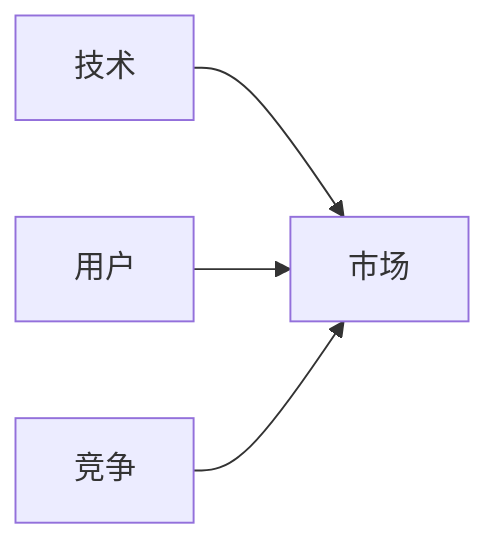
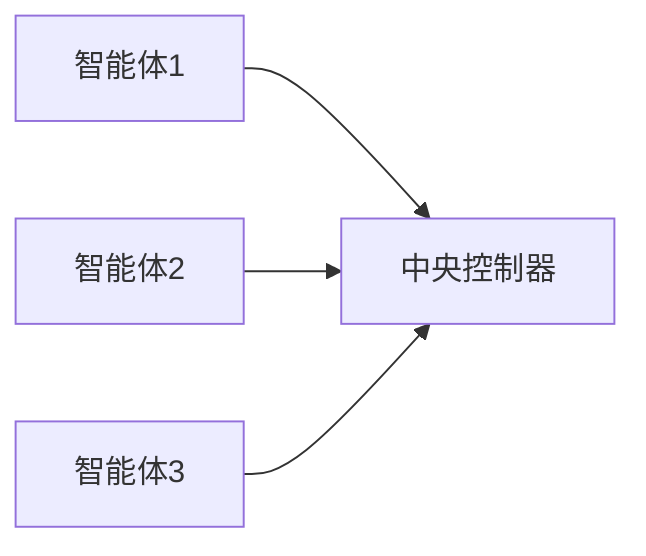
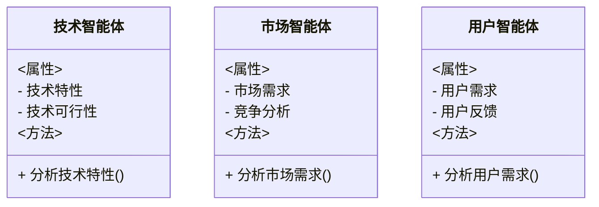
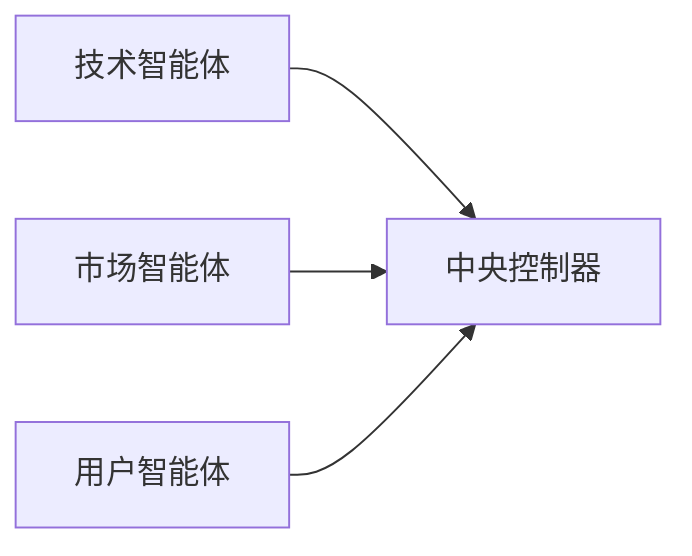
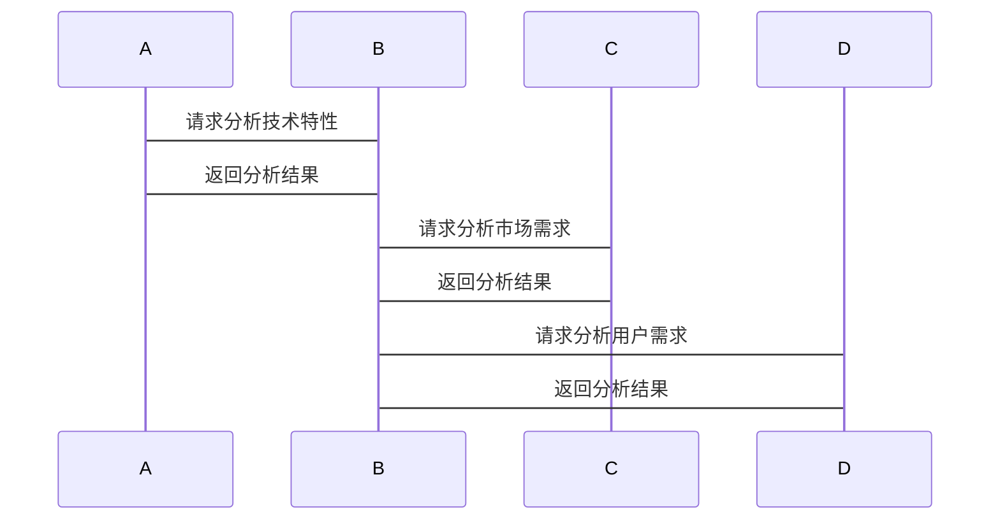

                 


# AI多智能体如何提升对新兴技术商业化潜力的评估

## 关键词：AI多智能体、新兴技术、商业化潜力、技术评估、协同决策

## 摘要：
本文探讨了AI多智能体系统在评估新兴技术商业化潜力中的应用。通过分析多智能体系统的协同决策优势，结合实际案例，详细阐述了其在技术评估中的核心作用和实现方法。文章从理论基础到实际应用，层层深入，为读者提供了全面的技术解析和实践指导。

---

# 第一部分: AI多智能体与新兴技术商业化潜力评估的背景

## 第1章: AI多智能体与新兴技术商业化潜力评估的背景介绍

### 1.1 问题背景
#### 1.1.1 新兴技术商业化潜力评估的挑战
新兴技术的商业化潜力评估是一个复杂的过程，涉及技术本身的可行性、市场需求、竞争环境等多个维度。传统的评估方法往往依赖于单一专家的判断或简单的数据统计，难以全面捕捉技术的潜在价值。

#### 1.1.2 多智能体系统在技术评估中的作用
AI多智能体系统通过分布式计算和协同决策，能够从多个维度同时分析技术的潜力。例如，一个智能体可以负责分析市场需求，另一个负责技术可行性，多个智能体协同工作能够提供更全面的评估结果。

#### 1.1.3 传统评估方法的局限性
传统评估方法通常依赖于单一的评估模型，难以应对复杂的技术环境。例如，传统的方法可能无法同时考虑技术的市场潜力、技术成熟度和用户需求。

### 1.2 AI多智能体系统的定义与特点
#### 1.2.1 AI多智能体的定义
AI多智能体系统是由多个智能体组成的分布式系统，每个智能体都具有一定的自主性和决策能力，能够通过通信和协作完成复杂的任务。

#### 1.2.2 多智能体系统的核心特点
- **分布式性**：多个智能体独立运行，通过通信协作完成任务。
- **协同性**：智能体之间能够协同决策，优化整体性能。
- **动态性**：能够适应环境的变化，实时调整策略。

#### 1.2.3 多智能体与单智能体的对比
| 特性                | 单智能体                     | 多智能体                     |
|---------------------|-----------------------------|-----------------------------|
| 决策方式            | 中央决策                    | 分布式决策                  |
| 并行处理能力        | 较弱                        | 强                           |
| 适应复杂性          | 较低                        | 较高                         |

### 1.3 多智能体系统在技术评估中的优势
#### 1.3.1 多智能体协同的优势
多智能体系统能够从多个维度同时分析技术潜力，例如：
- 智能体A分析市场需求
- 智能体B分析技术可行性
- 智能体C分析竞争环境

#### 1.3.2 多智能体系统在复杂场景中的应用
例如，在评估一项新兴技术的商业化潜力时，多个智能体可以分别负责市场分析、技术分析和用户需求分析，最终协同得出结论。

#### 1.3.3 多智能体系统的可扩展性
多智能体系统能够轻松扩展，新增智能体可以进一步提升评估的深度和广度。

### 1.4 本章小结
本章介绍了AI多智能体系统在新兴技术商业化潜力评估中的背景和优势，为后续内容奠定了基础。

---

## 第2章: AI多智能体系统的原理与核心概念

### 2.1 多智能体系统的原理
#### 2.1.1 多智能体系统的组成
- **智能体**：负责具体任务的独立实体。
- **通信机制**：智能体之间交换信息的渠道。
- **协作机制**：智能体协同工作的规则。

#### 2.1.2 多智能体系统的通信机制
- **直接通信**：智能体之间直接交换信息。
- **间接通信**：通过中间媒介传递信息。

#### 2.1.3 多智能体系统的协作机制
- **分布式计算**：多个智能体协同完成任务。
- **强化学习**：智能体通过学习优化协作策略。

### 2.2 多智能体系统的数学模型
#### 2.2.1 多智能体系统的状态表示
- **状态空间**：系统的当前状态。
- **动作空间**：智能体可执行的动作。

#### 2.2.2 多智能体系统的数学模型
$$ V(s) = \max_{a} \min_{b} V(s') $$
其中，$s$表示当前状态，$a$表示智能体A的动作，$b$表示智能体B的动作，$s'$表示下一状态。

#### 2.2.3 多智能体系统的奖励机制
- **全局奖励**：所有智能体共享的奖励。
- **局部奖励**：单个智能体获得的奖励。

### 2.3 多智能体系统的核心概念对比
#### 2.3.1 实体关系图（ER图）


#### 2.3.2 系统架构图


### 2.4 本章小结
本章详细介绍了AI多智能体系统的原理和核心概念，为后续的算法实现奠定了理论基础。

---

## 第3章: AI多智能体系统的算法原理

### 3.1 多智能体系统的算法概述
#### 3.1.1 分布式计算算法
- **分布式计算**：多个智能体协同完成任务。
- **并行计算**：多个智能体同时处理不同的子任务。

#### 3.1.2 协作学习算法
- **分布式强化学习**：智能体通过协作学习优化决策策略。
- **多智能体强化学习**：多个智能体在共享环境中学习协作策略。

#### 3.1.3 强化学习算法
- **Q-learning**：通过经验回放优化决策策略。
- **Actor-Critic**：通过策略网络和价值网络优化决策。

### 3.2 多智能体系统的算法实现
#### 3.2.1 分布式计算算法
```python
def distributed_compute(tasks):
    # 分配任务
    tasks_per_agent = distribute_tasks(tasks)
    # 并行计算
    results = [agent.compute(task) for agent in agents]
    return results
```

#### 3.2.2 协作学习算法
```python
def collaborative_learning(agents):
    # 初始化参数
    for agent in agents:
        agent.initialize_params()
    # 同步参数
    while True:
        for agent in agents:
            agent.update_params()
```

### 3.3 多智能体系统的数学模型
#### 3.3.1 多智能体强化学习模型
$$ Q(s, a) = \max_{a'} \sum_{t=0}^{\infty} \gamma^t r_t $$
其中，$s$表示当前状态，$a$表示动作，$\gamma$表示折扣因子，$r_t$表示奖励。

#### 3.3.2 多智能体分布式计算模型
$$ f(x) = \sum_{i=1}^n f_i(x_i) $$
其中，$f_i$表示第i个智能体的计算函数，$x_i$表示输入数据。

### 3.4 本章小结
本章详细介绍了AI多智能体系统的算法原理和实现方法，为后续的系统设计奠定了基础。

---

## 第4章: 系统分析与架构设计

### 4.1 问题场景介绍
- **目标**：评估新兴技术的商业化潜力。
- **挑战**：技术复杂、数据分散、需求多样。

### 4.2 项目介绍
- **项目目标**：构建一个AI多智能体系统，评估新兴技术的商业化潜力。
- **项目范围**：涵盖市场分析、技术分析和用户需求分析。

### 4.3 系统功能设计
#### 4.3.1 领域模型（类图）


#### 4.3.2 系统架构设计


#### 4.3.3 系统接口设计
- **技术智能体接口**：提供技术分析功能。
- **市场智能体接口**：提供市场分析功能。
- **用户智能体接口**：提供用户需求分析功能。

#### 4.3.4 系统交互设计


### 4.4 本章小结
本章详细介绍了AI多智能体系统的功能设计和架构设计，为后续的项目实施提供了指导。

---

## 第5章: 项目实战

### 5.1 环境安装
- **Python**：安装Python 3.8及以上版本。
- **库**：安装numpy、pandas、scikit-learn、tensorflow等库。

### 5.2 核心代码实现
#### 5.2.1 技术智能体实现
```python
class TechAgent:
    def __init__(self):
        self.technology = None
        self.feasibility = None
    
    def analyze_technology(self):
        # 分析技术可行性
        pass
```

#### 5.2.2 市场智能体实现
```python
class MarketAgent:
    def __init__(self):
        self.market_demand = None
        self.competition = None
    
    def analyze_market(self):
        # 分析市场需求
        pass
```

#### 5.2.3 用户智能体实现
```python
class UserAgent:
    def __init__(self):
        self.user_demand = None
        self.feedback = None
    
    def analyze_user_demand(self):
        # 分析用户需求
        pass
```

### 5.3 案例分析
- **案例1**：评估区块链技术的商业化潜力。
- **案例2**：评估人工智能技术的商业化潜力。

### 5.4 本章小结
本章通过实际项目实战，详细介绍了AI多智能体系统的实现过程和应用案例。

---

## 第6章: 最佳实践、小结与注意事项

### 6.1 最佳实践
- **模块化设计**：将系统划分为多个模块，便于维护和扩展。
- **并行计算**：充分利用多智能体的并行计算能力。
- **动态调整**：根据环境变化动态调整系统参数。

### 6.2 小结
本文详细介绍了AI多智能体系统在新兴技术商业化潜力评估中的应用，从理论到实践，全面解析了其核心原理和实现方法。

### 6.3 注意事项
- **数据质量**：确保输入数据的准确性和完整性。
- **系统安全性**：注意系统安全，防止数据泄露。
- **可扩展性**：系统设计应具有良好的可扩展性。

### 6.4 拓展阅读
- 《Multi-Agent Systems》
- 《Distributed Computing》

---

## 作者：AI天才研究院/AI Genius Institute & 禅与计算机程序设计艺术 /Zen And The Art of Computer Programming

---

以上是《AI多智能体如何提升对新兴技术商业化潜力的评估》的完整目录大纲和文章内容，希望对您有所帮助！

