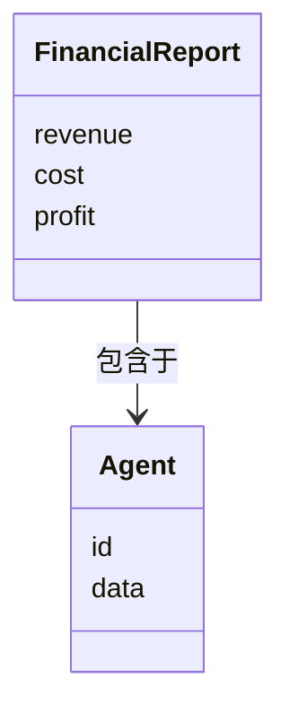
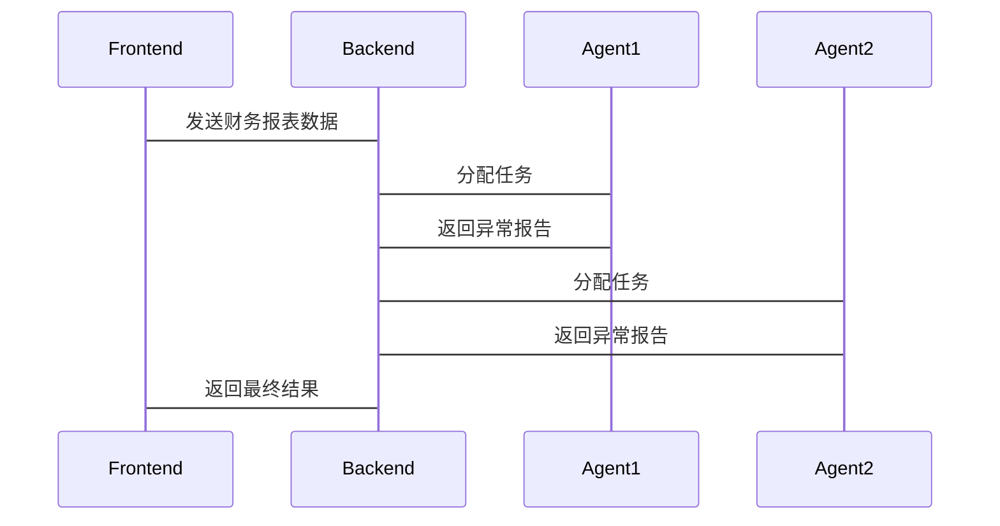

                 


# AI多智能体提升价值投资的财务报表一致性检查

> 关键词：AI多智能体、价值投资、财务报表、一致性检查、异常检测、协作算法、金融分析

> 摘要：本文深入探讨了如何利用AI多智能体技术提升价值投资中的财务报表一致性检查效率和准确性。通过分析多智能体系统的协作机制、异常检测算法、系统架构设计及实际案例，展示了AI技术在金融领域的强大应用潜力。

---

# 第一部分: AI多智能体与价值投资的背景与基础

## 第1章: 价值投资与财务报表分析

### 1.1 价值投资的核心理念

#### 1.1.1 价值投资的定义与特点

价值投资是一种以基本面分析为基础的投资策略，强调通过分析企业的财务状况、行业地位和竞争优势，找到被市场低估的投资标的。其核心理念是“以合理的价格买入优质的资产”，追求长期稳定的收益。

- **定义**: 价值投资关注企业的内在价值，而非市场的短期波动。
- **特点**: 长期视角、基本面分析、逆向思维、安全边际。

#### 1.1.2 财务报表在价值投资中的重要性

财务报表是投资者评估企业价值的核心工具，主要包括资产负债表、利润表和现金流量表。

- **资产负债表**: 反映企业财务状况，包括资产、负债和所有者权益。
- **利润表**: 展示企业经营成果，包括收入、成本和利润。
- **现金流量表**: 描述企业现金流入和流出的情况。

#### 1.1.3 价值投资中的财务报表分析方法

常见的财务报表分析方法包括：

1. **比率分析**: 如市盈率、市净率、ROE等。
2. **趋势分析**: 比较企业在不同时间点的财务数据，识别趋势。
3. **行业对比**: 将企业与同行业公司进行对比，评估其相对位置。

### 1.2 财务报表一致性检查的必要性

#### 1.2.1 财务报表异常的常见类型

财务报表中的异常情况可能包括：

1. **数据不一致**: 如收入与成本不匹配。
2. **虚假交易**: 通过虚构交易虚增收入。
3. **会计政策变更**: 擅自改变会计政策以调节财务数据。
4. **内部控制缺陷**: 导致财务数据失真。

#### 1.2.2 传统财务报表检查的局限性

传统财务报表检查依赖人工审核，存在以下问题：

1. **效率低**: 需要大量人工劳动。
2. **主观性**: 审核结果受审核人员经验影响。
3. **覆盖面有限**: 难以全面覆盖所有异常情况。

#### 1.2.3 引入AI技术的必要性

AI技术能够通过大数据分析和机器学习算法，提高财务报表检查的效率和准确性。

---

## 第2章: AI多智能体的基本概念

### 2.1 多智能体系统概述

#### 2.1.1 多智能体系统的定义

多智能体系统是由多个相互作用的智能体组成的分布式系统，每个智能体具有一定的自主性和协作能力。

- **定义**: 多智能体系统由多个智能体组成，每个智能体能够感知环境、自主决策并与其他智能体协作。
- **特征**: 分布式、协作性、自主性、反应性。

#### 2.1.2 多智能体系统的特征

1. **分布式**: 智能体独立运行，分布在不同的节点。
2. **协作性**: 智能体之间通过协作完成共同目标。
3. **自主性**: 每个智能体能够自主决策。
4. **反应性**: 智能体能够感知环境并实时调整行为。

#### 2.1.3 多智能体系统与单智能体的区别

| 特性 | 多智能体系统 | 单智能体系统 |
|------|--------------|--------------|
| 结构 | 分布式       | 集中式       |
| 协作 | 高           | 低           |
| 灵活性 | 高           | 低           |

### 2.2 AI在财务报表分析中的应用

#### 2.2.1 AI技术在金融领域的应用现状

AI技术在金融领域的应用广泛，包括股票预测、风险评估、信用评分等。

#### 2.2.2 AI在财务数据处理中的优势

1. **高效性**: AI能够快速处理大量数据。
2. **准确性**: 通过机器学习算法，提高数据分析的准确性。
3. **可扩展性**: AI系统能够处理不同规模的数据。

#### 2.2.3 多智能体在财务报表分析中的独特价值

多智能体系统能够通过协作提高财务报表分析的准确性和效率。

---

# 第二部分: AI多智能体的算法原理与数学模型

## 第3章: 多智能体协作算法

### 3.1 多智能体协作的基本原理

#### 3.1.1 多智能体协作的定义

多智能体协作是指多个智能体通过协作完成共同目标的过程。

#### 3.1.2 多智能体协作的核心机制

1. **任务分配**: 根据智能体的能力分配任务。
2. **信息共享**: 智能体之间共享信息和数据。
3. **协作决策**: 基于共享信息做出决策。

#### 3.1.3 多智能体协作的数学模型

$$
\text{协作收益} = \sum_{i=1}^{n} \text{智能体} i \text{的贡献}
$$

### 3.2 基于多智能体的异常检测算法

#### 3.2.1 异常检测的基本原理

异常检测算法通过分析数据，识别与正常数据不一致的异常值。

#### 3.2.2 多智能体协作的异常检测流程

1. **数据预处理**: 对数据进行清洗和标准化。
2. **任务分配**: 将数据分片分配给不同的智能体。
3. **异常检测**: 每个智能体对分配的数据进行异常检测。
4. **结果汇总**: 将所有智能体的检测结果汇总，识别全局异常。

#### 3.2.3 异常检测的数学公式

$$
\text{异常概率} = \frac{\text{异常标记数}}{\text{总数据量}}
$$

---

## 第4章: 算法实现与代码解析

### 4.1 多智能体协作算法的实现

#### 4.1.1 算法的整体框架

1. 初始化智能体。
2. 分配任务。
3. 智能体协作完成任务。
4. 汇总结果。

#### 4.1.2 算法的代码实现

```python
class Agent:
    def __init__(self, id):
        self.id = id
        self.data = None

    def process_data(self):
        # 数据处理逻辑
        pass

    def report(self):
        # 返回结果
        pass

def multi_agent_algorithm(data, num_agents):
    agents = [Agent(i) for i in range(num_agents)]
    # 分配数据
    chunk_size = len(data) // num_agents
    for i in range(num_agents):
        agents[i].data = data[i * chunk_size: (i + 1) * chunk_size]
    # 协作处理
    for agent in agents:
        agent.process_data()
    # 汇总结果
    results = [agent.report() for agent in agents]
    return results
```

---

# 第三部分: 系统分析与架构设计方案

## 第5章: 系统分析与架构设计

### 5.1 问题场景介绍

财务报表一致性检查的场景包括企业财务报表的自动审核、风险预警等。

### 5.2 系统功能设计

#### 5.2.1 领域模型



#### 5.2.2 系统架构设计


### 5.3 系统接口设计

- **输入接口**: 接收财务报表数据。
- **输出接口**: 返回一致性检查结果。

### 5.4 系统交互设计



---

# 第四部分: 项目实战与案例分析

## 第6章: 项目实战

### 6.1 环境安装

安装Python和必要的库，如NumPy、Pandas、Scikit-learn等。

### 6.2 系统核心实现

实现多智能体协作算法，完成财务报表一致性检查。

### 6.3 实际案例分析

以某公司为例，展示如何通过多智能体系统进行财务报表一致性检查。

---

# 第五部分: 总结与展望

## 第7章: 总结与展望

### 7.1 总结

本文详细介绍了AI多智能体在价值投资中的应用，展示了其在财务报表一致性检查中的优势。

### 7.2 未来展望

未来，随着AI技术的发展，多智能体系统将在金融领域发挥更大的作用。

---

作者：AI天才研究院/AI Genius Institute & 禅与计算机程序设计艺术 /Zen And The Art of Computer Programming

