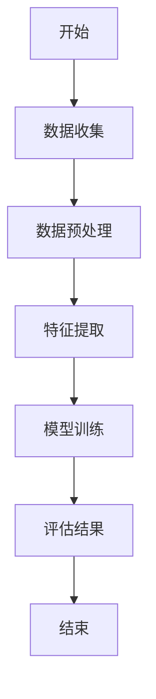
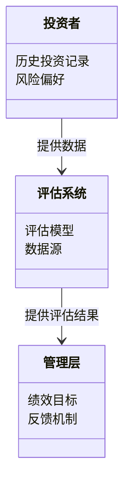
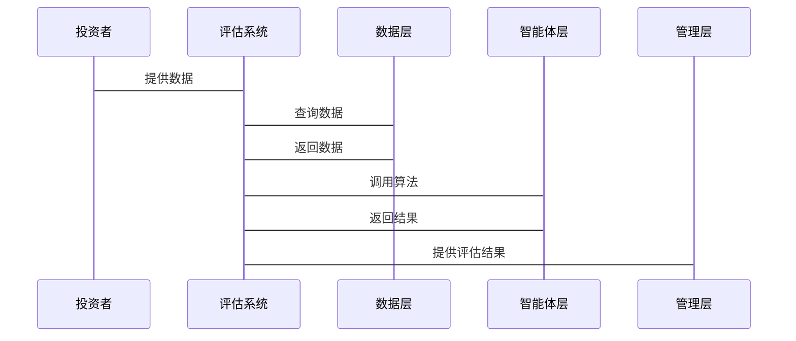

                 


# AI多智能体系统在价值投资中的人力资本评估

> 关键词：AI多智能体系统、价值投资、人力资本评估、机器学习、投资组合优化

> 摘要：本文探讨了AI多智能体系统在价值投资中的人力资本评估应用。通过分析传统评估方法的不足，结合多智能体系统的优势，提出了基于AI的创新解决方案。文章详细阐述了系统的核心概念、算法原理、系统架构，并通过实际案例展示了系统的应用效果。最后，总结了最佳实践和未来发展方向。

---

## 第1章: 问题背景与描述

### 1.1 问题背景
#### 1.1.1 价值投资与人力资本的重要性
价值投资是一种以内在价值为基础的投资策略，其核心在于识别具有长期增长潜力的公司。而人力资本评估是价值投资中不可或缺的一部分，它通过分析公司员工的素质、能力和贡献，评估公司未来的盈利能力和发展潜力。传统的人力资本评估方法依赖于主观判断和经验分析，存在效率低、误差大、难以量化的问题。

#### 1.1.2 传统人力资本评估的局限性
- **主观性**：传统评估方法依赖于主观判断，容易受到评估者偏见的影响。
- **数据量不足**：传统方法难以处理海量数据，且缺乏动态性。
- **效率低下**：传统方法耗时长，难以快速响应市场变化。

#### 1.1.3 AI技术在金融领域的应用潜力
人工智能技术的快速发展为金融领域的创新提供了新的可能性。AI可以通过大数据分析、机器学习和深度学习等技术，帮助投资者更准确地评估公司的人力资本，从而优化投资决策。

### 1.2 问题描述
#### 1.2.1 传统评估方法的不足
传统的人力资本评估方法在面对复杂市场环境时，难以提供精准的评估结果。例如，难以量化员工的贡献对股价的具体影响，也无法预测员工流失对股价的潜在冲击。

#### 1.2.2 价值投资中的关键挑战
价值投资的核心在于发现被市场低估的公司，而人力资本评估是发现这些公司的重要手段。然而，传统评估方法的局限性使得投资者难以准确评估公司的潜在价值。

#### 1.2.3 多智能体系统的优势
多智能体系统通过协作和竞争机制，能够更全面地分析市场信息和公司数据，从而提供更精准的人力资本评估结果。

### 1.3 问题解决
#### 1.3.1 多智能体系统的解决方案
多智能体系统通过分工协作，分别负责数据收集、分析和预测等任务，从而提高评估效率和准确性。

#### 1.3.2 AI技术如何提升评估效率
AI技术可以通过机器学习算法，从海量数据中提取有价值的信息，帮助投资者快速做出决策。

#### 1.3.3 系统化评估框架的构建
通过构建系统化的人力资本评估框架，可以将AI技术与多智能体系统有机结合，形成一个高效、准确的评估体系。

### 1.4 边界与外延
#### 1.4.1 系统的应用边界
多智能体系统主要用于人力资本评估，不直接参与投资决策，但可以为投资决策提供重要参考。

#### 1.4.2 相关领域的扩展
本文主要关注价值投资领域，未来可以扩展到其他领域，如企业并购、风险管理等。

#### 1.4.3 技术的未来发展方向
随着AI技术的不断进步，多智能体系统在金融领域的应用将更加广泛和深入。

### 1.5 核心要素组成
#### 1.5.1 多智能体系统的组成
多智能体系统由多个智能体组成，每个智能体负责特定的任务，如数据收集、分析和预测。

#### 1.5.2 AI算法的关键要素
AI算法是系统的核心，包括机器学习模型、数据处理算法和优化算法。

#### 1.5.3 价值评估的指标体系
价值评估指标体系包括公司财务指标、员工绩效指标和市场表现指标等。

---

## 第2章: 核心概念与联系

### 2.1 核心概念原理
#### 2.1.1 多智能体系统的定义与特征
多智能体系统是由多个智能体组成的系统，每个智能体具有自主性、反应性和协作性。

#### 2.1.2 AI在价值投资中的应用机制
AI通过分析公司数据和市场信息，帮助投资者做出更精准的决策。

#### 2.1.3 人力资本评估的系统架构
人力资本评估系统包括数据层、逻辑层和智能体层，分别负责数据存储、处理和决策。

### 2.2 概念属性对比
#### 2.2.1 多智能体系统与传统评估方法对比
- **效率**：多智能体系统效率更高，传统方法效率较低。
- **准确性**：多智能体系统更准确，传统方法误差较大。
- **适应性**：多智能体系统适应性强，传统方法适应性差。

#### 2.2.2 不同AI模型的性能对比
- **监督学习**：适合有标签数据的场景。
- **无监督学习**：适合无标签数据的场景。
- **强化学习**：适合动态环境的场景。

#### 2.2.3 不同评估指标的优劣势分析
- **财务指标**：反映公司财务状况，但难以直接反映人力资本。
- **员工绩效指标**：反映员工贡献，但难以量化对股价的影响。
- **市场表现指标**：反映公司市场价值，但难以预测未来表现。

### 2.3 ER实体关系图
```mermaid
erDiagram
    投资者
    管理层
    评估系统
    投资者 --> 评估系统 : 提供数据
    评估系统 --> 管理层 : 提供评估结果
    投资者 --> 管理层 : 提供反馈
```

### 2.4 算法流程图


---

## 第3章: 算法原理讲解

### 3.1 协作与竞争机制
#### 3.1.1 分工协作
多智能体系统通过分工协作，分别完成数据收集、分析和预测等任务。

#### 3.1.2 竞争机制
通过竞争机制，系统可以自动优化智能体的性能，提高整体效率。

### 3.2 任务分配算法
#### 3.2.1 基于权重的任务分配
$$ w_i = \frac{score_i}{\sum_{j} score_j} $$
其中，$w_i$ 是智能体i的权重，$score_i$ 是智能体i的得分。

#### 3.2.2 加权分配模型
$$ x_i = \sum_{j=1}^{n} w_j \cdot t_j $$
其中，$x_i$ 是智能体i的任务量，$w_j$ 是智能体j的权重，$t_j$ 是智能体j的任务量。

### 3.3 学习与优化算法
#### 3.3.1 强化学习算法
$$ Q(s, a) = r + \gamma \max_{a'} Q(s', a') $$
其中，$Q(s, a)$ 是状态s下动作a的Q值，$r$ 是奖励，$\gamma$ 是折扣因子。

#### 3.3.2 遗传算法
遗传算法通过模拟自然选择和遗传过程，优化智能体的参数。

---

## 第4章: 系统分析与架构设计

### 4.1 问题场景介绍
#### 4.1.1 价值投资中的决策过程
投资者需要通过分析公司的人力资本，评估其潜在价值。

#### 4.1.2 系统设计目标
系统设计目标包括高效性、准确性和可扩展性。

### 4.2 系统功能设计
#### 4.2.1 领域模型


#### 4.2.2 系统架构


### 4.3 系统接口设计
#### 4.3.1 接口定义
- **输入接口**：接收投资者数据和市场信息。
- **输出接口**：提供评估结果和优化建议。

#### 4.3.2 交互流程


---

## 第5章: 项目实战

### 5.1 环境安装
#### 5.1.1 安装Python
```bash
python --version
pip install numpy pandas scikit-learn
```

#### 5.1.2 安装机器学习库
```bash
pip install tensorflow keras
```

### 5.2 核心代码实现
#### 5.2.1 数据预处理
```python
import pandas as pd
import numpy as np

# 读取数据
data = pd.read_csv('data.csv')

# 数据清洗
data = data.dropna()
```

#### 5.2.2 模型训练
```python
from sklearn.model

