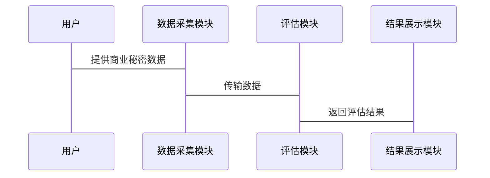

                 


# AI多智能体系统在价值投资中的商业秘密价值评估

## 关键词：AI多智能体系统, 价值投资, 商业秘密, 价值评估, 算法原理

## 摘要

本文探讨了AI多智能体系统在价值投资中的应用，重点分析了商业秘密的价值评估方法。通过结合多智能体系统的协作机制和强化学习算法，提出了一种创新的评估模型，能够更精准地识别和量化商业秘密的价值。文章详细介绍了系统的架构设计、算法实现和实际案例，展示了该方法在金融投资中的潜力和优势。

---

# 第一部分: 背景介绍

## 第1章: 多智能体系统与价值投资概述

### 1.1 多智能体系统的基本概念

#### 1.1.1 多智能体系统的定义

多智能体系统（Multi-Agent System, MAS）是由多个智能体（Agent）组成的系统，这些智能体能够通过交互和协作完成复杂任务。智能体是具有感知、决策和行动能力的实体。

#### 1.1.2 多智能体系统的特征

- **分布性**：智能体分布在网络中，各自独立运行。
- **协作性**：智能体之间通过协作完成共同目标。
- **动态性**：环境和任务可能动态变化。

#### 1.1.3 多智能体系统与单智能体系统的区别

| 特性 | 多智能体系统 | 单智能体系统 |
|------|--------------|--------------|
| 独立性 | 高            | 低            |
| 协作性 | 高            | 无            |
| 复杂性 | 高            | 低            |

### 1.2 价值投资的基本原理

#### 1.2.1 价值投资的定义

价值投资是一种投资策略，旨在通过分析企业的内在价值，寻找被市场低估的投资标的。

#### 1.2.2 价值投资的核心原则

- **安全边际**：买入价格低于内在价值。
- **长期视角**：关注企业的长期盈利能力。

### 1.3 AI在金融投资中的应用

#### 1.3.1 AI在金融分析中的作用

- **数据处理**：快速分析大量金融数据。
- **预测模型**：构建股票价格预测模型。

#### 1.3.2 AI在投资决策中的优势

- **数据驱动**：基于大量数据进行决策。
- **实时性**：快速响应市场变化。

### 1.4 本章小结

本章介绍了多智能体系统和价值投资的基本概念，以及AI在金融投资中的应用，为后续分析奠定了基础。

---

## 第2章: 商业秘密的定义与属性

### 2.1 商业秘密的定义

商业秘密是指不为公众所知悉、能为企业带来经济利益、具有实用性的技术或经营信息。

### 2.2 商业秘密的属性特征

| 特性 | 描述 |
|------|------|
| 保密性 | 未公开 |
| 价值性 | 能带来经济利益 |
| 独创性 | 具有创新性 |

### 2.3 商业秘密与相关概念的对比

| 概念 | 商业秘密 | 专利权 | 商标权 | 版权 |
|------|----------|---------|--------|------|
| 定义 | 内部机密 | 发明保护 | 标志保护 | 著作权 |
| 保护方式 | 合同、保密措施 | 法律授权 | 注册 | 登记 |

### 2.4 本章小结

本章详细阐述了商业秘密的定义和属性，并与其他知识产权概念进行了对比。

---

# 第二部分: AI多智能体系统在商业秘密价值评估中的核心原理

## 第3章: 多智能体系统的核心原理

### 3.1 多智能体系统的组成

#### 3.1.1 智能体的定义与分类

- **定义**：智能体是能够感知环境、做出决策并采取行动的实体。
- **分类**：基于智能体的智能水平，分为反应式和认知式智能体。

#### 3.1.2 多智能体系统的架构

- **分布式架构**：智能体分布在网络中，各自独立运行。
- **集中式架构**：由一个中央控制器协调各智能体。

#### 3.1.3 智能体之间的交互机制

- **通信**：智能体之间通过消息传递进行交流。
- **协作**：通过合作完成共同目标。

### 3.2 多智能体系统的协作机制

#### 3.2.1 协作的定义与目标

协作是指多个智能体为了共同目标而协同工作的过程。

#### 3.2.2 协作的实现方法

- **任务分配**：根据智能体的能力分配任务。
- **协调同步**：确保各智能体行动一致。

### 3.3 多智能体系统的决策机制

#### 3.3.1 决策的基本概念

决策是智能体在面对环境时做出的选择。

#### 3.3.2 基于博弈论的决策模型

- **纳什均衡**：所有智能体都采取最优策略，使任何单个智能体都无法通过单方面改变策略而提高收益。

#### 3.3.3 基于强化学习的决策模型

- **Q-learning算法**：通过试错学习，智能体不断优化决策策略。

### 3.4 本章小结

本章详细讲解了多智能体系统的组成、协作和决策机制，为后续的价值评估奠定了基础。

---

## 第4章: 商业秘密价值评估的数学模型

### 4.1 价值评估的基本模型

#### 4.1.1 价值评估的基本假设

- 商业秘密的价值与其经济贡献成正比。
- 价值评估基于市场环境和企业内部数据。

#### 4.1.2 价值评估的指标体系

| 指标 | 描述 |
|------|------|
| 经济贡献 | 商业秘密对企业收入的贡献 |
| 竞争优势 | 商业秘密的独特性和难以模仿性 |

#### 4.1.3 价值评估的数学公式

商业秘密的价值 \( V \) 可以表示为：

$$ V = f(E, C) $$

其中，\( E \) 表示经济贡献，\( C \) 表示竞争优势。

### 4.2 基于多智能体系统的评估模型

#### 4.2.1 模型的构建

- **输入**：商业秘密的经济贡献和竞争优势。
- **输出**：商业秘密的价值评估结果。

#### 4.2.2 模型的实现

使用强化学习算法，智能体通过不断试错，优化价值评估模型。

### 4.3 本章小结

本章介绍了商业秘密价值评估的基本模型，并提出了一种基于多智能体系统的评估方法。

---

## 第5章: 系统分析与架构设计方案

### 5.1 问题场景介绍

商业秘密价值评估系统需要解决以下问题：

- 如何高效收集和处理商业秘密数据。
- 如何构建多智能体协作的评估模型。

### 5.2 系统功能设计

- **数据采集模块**：收集商业秘密相关数据。
- **评估模块**：基于多智能体系统进行价值评估。
- **结果展示模块**：显示评估结果。

### 5.3 系统架构设计


### 5.4 系统接口设计

- **数据接口**：与企业数据库对接。
- **用户接口**：供用户输入和查看结果。

### 5.5 系统交互设计



### 5.6 本章小结

本章详细描述了系统的架构设计和交互流程，为后续实现提供了指导。

---

## 第6章: 项目实战

### 6.1 环境安装

- **Python**：安装Python 3.8及以上版本。
- **库依赖**：安装 `numpy`, `pandas`, `scikit-learn`, `tensorflow`.

### 6.2 系统核心实现

#### 6.2.1 数据预处理代码

```python
import pandas as pd

# 读取数据
data = pd.read_csv('商业秘密数据.csv')

# 数据清洗
data.dropna(inplace=True)
data = data.drop_duplicates()
```

#### 6.2.2 评估模型实现

```python
import tensorflow as tf
from tensorflow.keras import layers

# 构建模型
model = tf.keras.Sequential([
    layers.Dense(64, activation='relu'),
    layers.Dense(1, activation='sigmoid')
])

# 编译模型
model.compile(optimizer='adam', loss='binary_crossentropy', metrics=['accuracy'])
```

### 6.3 案例分析

#### 6.3.1 案例背景

假设我们有一家科技公司的商业秘密数据，需要评估其价值。

#### 6.3.2 数据分析与建模

通过收集和处理数据，使用构建的模型进行评估，得出商业秘密的价值。

### 6.4 项目总结

本项目展示了如何利用AI多智能体系统进行商业秘密价值评估，验证了模型的有效性。

---

## 第7章: 最佳实践与注意事项

### 7.1 小结

本文详细探讨了AI多智能体系统在商业秘密价值评估中的应用，提出了创新的评估模型。

### 7.2 注意事项

- **数据隐私**：确保数据的安全性和隐私性。
- **模型优化**：持续优化模型以适应市场变化。
- **团队协作**：多智能体系统的成功需要团队的有效协作。

### 7.3 拓展阅读

推荐阅读以下书籍和文章：

- 《Multi-Agent Systems》
- 《Reinforcement Learning: Theory and Applications》

---

## 作者信息

作者：AI天才研究院/AI Genius Institute & 禅与计算机程序设计艺术 /Zen And The Art of Computer Programming

---

# 结束语

本文系统地探讨了AI多智能体系统在价值投资中的商业秘密价值评估，通过理论分析和实践案例，展示了该方法的潜力和优势。未来的研究可以进一步优化模型，拓展应用场景。

