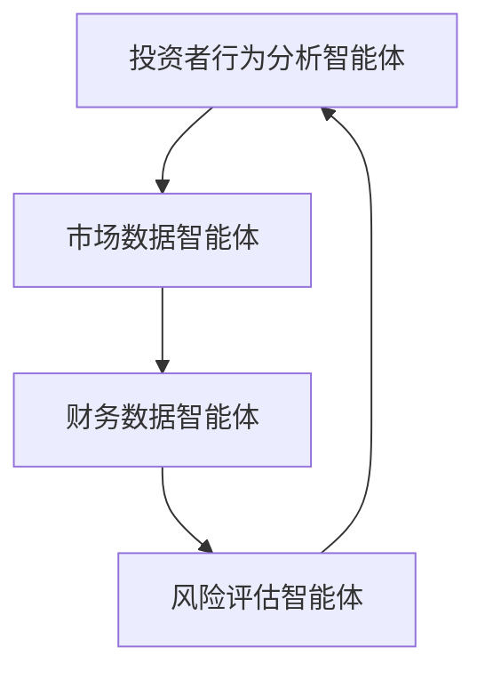
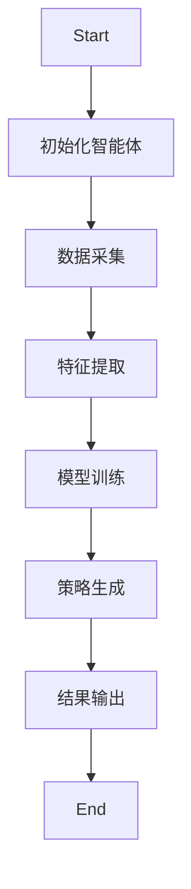
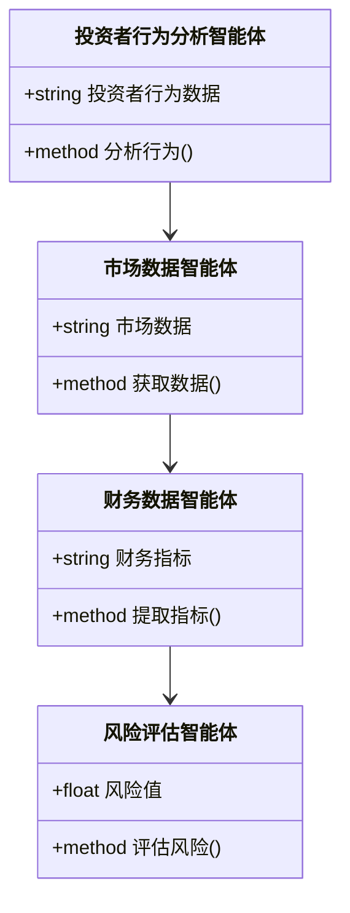
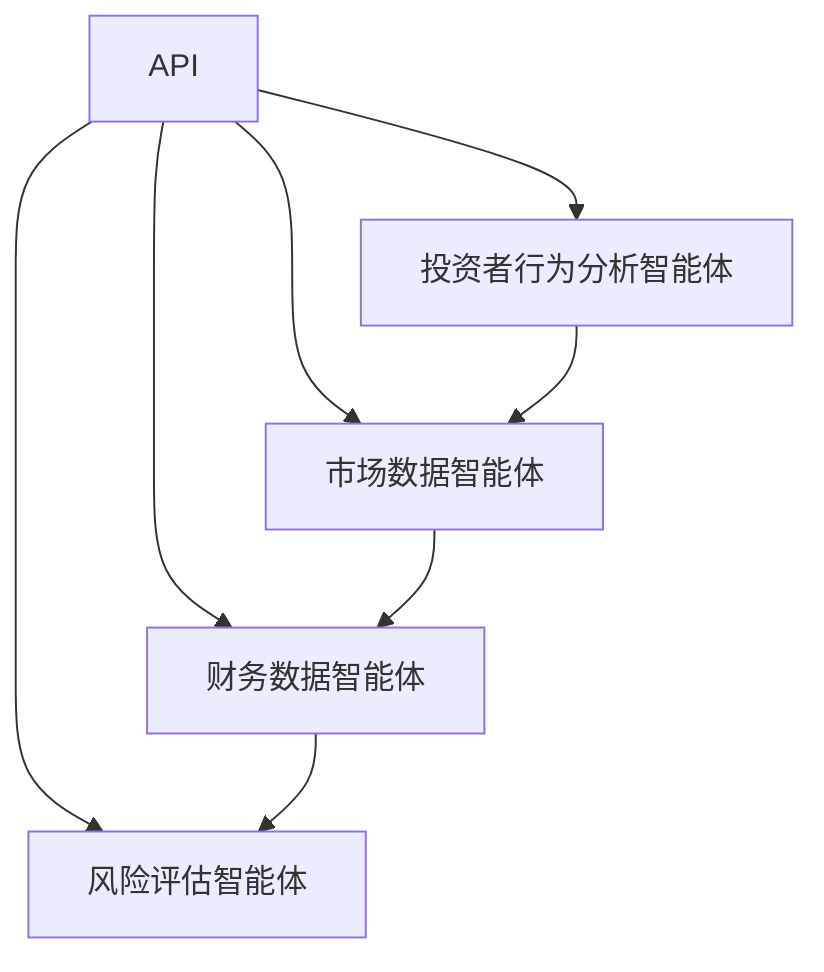

                 


# AI多智能体系统在价值投资中的研发效率评估

## 关键词：AI多智能体系统、价值投资、研发效率、算法原理、系统架构、项目实战

## 摘要：本文探讨了AI多智能体系统在价值投资中的应用，分析了其研发效率的评估方法。通过详细讲解系统的核心概念、算法原理、系统架构设计以及实际项目案例，本文旨在为读者提供深入的技术洞察，帮助他们理解如何利用AI多智能体系统提升价值投资的效率和准确性。

---

# 第一部分: AI多智能体系统与价值投资概述

## 第1章: AI多智能体系统概述

### 1.1 AI多智能体系统的定义与特点

#### 1.1.1 多智能体系统的定义  
多智能体系统（Multi-Agent System, MAS）是由多个独立或协作的智能体组成的系统。每个智能体都能感知环境、自主决策并执行任务。智能体之间通过通信和协作，共同完成复杂任务。

#### 1.1.2 AI多智能体系统的核心特点  
- **分布式智能**：多个智能体协同工作，避免单点故障。  
- **自主性**：每个智能体都能独立决策。  
- **协作性**：通过通信和协作完成复杂任务。  
- **动态性**：适应环境变化，实时调整策略。  

#### 1.1.3 多智能体系统与单智能体系统的区别  
| 特性            | 单智能体系统          | 多智能体系统          |
|-----------------|----------------------|----------------------|
| 智能体数量      | 单个                | 多个                |
| 独立性          | 高                  | 中等                |
| 协作性          | 无                  | 高                  |
| 故障容错性      | 低                  | 高                  |

### 1.2 价值投资的基本概念

#### 1.2.1 价值投资的定义  
价值投资是一种投资策略，通过分析公司的基本面，寻找被市场低估的股票进行投资，期望在长期获得超额收益。

#### 1.2.2 价值投资的核心原则  
- **安全边际**：买入价格低于内在价值。  
- **长期视角**：关注公司的长期盈利能力。  
- **分散投资**：降低风险。  

#### 1.2.3 价值投资与其它投资策略的对比  
| 策略类型        | 价值投资          | 技术分析          |
|-----------------|------------------|------------------|
| 基础            | 公司基本面        | 市场技术指标      |
| 时间框架        | 长期              | 短期              |
| 方法            | 分析公司财务      | 分析价格走势      |

### 1.3 AI多智能体系统在价值投资中的结合

#### 1.3.1 多智能体系统在金融领域的应用背景  
金融市场的复杂性和不确定性使得传统方法在效率和准确性上存在局限。AI多智能体系统通过分布式计算和协作，能够更高效地处理海量数据。

#### 1.3.2 价值投资与AI多智能体系统的契合点  
- AI多智能体系统能够分析大量非结构化数据，如新闻、社交媒体等，提升分析效率。  
- 每个智能体专注于不同的任务，如财务数据、市场情绪等，提高整体决策的准确性。  

#### 1.3.3 该结合的意义与潜在价值  
通过AI多智能体系统，价值投资可以在数据处理、决策效率和风险控制方面得到显著提升，帮助投资者捕捉更多投资机会。

---

## 第2章: 问题背景与目标

### 2.1 传统价值投资中的效率瓶颈

#### 2.1.1 传统价值投资的流程与痛点  
- 数据收集范围有限，难以覆盖全球市场。  
- 人工分析耗时长，容易受主观因素影响。  
- 信息更新不及时，错失投资机会。  

#### 2.1.2 数据分析与决策的低效性  
- 数据量大，分析效率低。  
- 人工分析存在主观偏差。  

#### 2.1.3 人工经验的局限性  
- 个人经验有限，难以覆盖所有行业。  
- 市场变化快，经验难以及时更新。  

### 2.2 引入AI多智能体系统的必要性

#### 2.2.1 提高数据分析效率的潜力  
AI多智能体系统能够实时处理海量数据，提供快速反馈。  

#### 2.2.2 增强决策智能化的可能  
通过机器学习和协作，智能体能够生成更准确的投资建议。  

#### 2.2.3 降低人为错误的目标  
通过自动化处理，减少人为因素对决策的影响，提高准确性。  

### 2.3 本书的研究目标与范围

#### 2.3.1 研究目标的明确  
研究AI多智能体系统在价值投资中的应用，评估其研发效率。  

#### 2.3.2 研究范围的界定  
涵盖数据处理、决策算法、系统架构等多个方面。  

#### 2.3.3 研究的意义与价值  
为投资者提供一种高效、准确的价值投资方法，推动AI在金融领域的应用。

---

## 第三部分: 核心概念与联系

## 第3章: 核心概念原理

### 3.1 AI多智能体系统的原理

#### 3.1.1 多智能体系统的组成与交互  
通过Mermaid图展示多智能体系统的组成与交互流程：



#### 3.1.2 AI算法在多智能体中的应用  
主要算法包括强化学习、分布式机器学习和协作滤波算法。

#### 3.1.3 多智能体系统的协作机制  
通过通信协议和协调算法实现智能体间的协作。

### 3.2 价值投资的数学模型

#### 3.2.1 价值评估的基本公式  
$$内在价值 = \frac{净利润}{折现率}$$

#### 3.2.2 数据分析与特征工程  
- 数据预处理：清洗、转换。  
- 特征提取：财务指标、市场情绪等。  

---

## 第四部分: 算法原理讲解

## 第4章: 算法原理

### 4.1 多智能体协作算法

#### 4.1.1 算法流程  
通过Mermaid图展示算法流程：



#### 4.1.2 Python实现代码  
```python
import numpy as np
import pandas as pd

def multi_agent_collaboration(data):
    # 数据预处理
    processed_data = data.dropna().astype(float)
    # 特征提取
    features = processed_data[['市盈率', '市净率', 'ROE']]
    # 模型训练
    model = MultiAgentModel(features.shape[1])
    predictions = model.predict(features)
    return predictions

class MultiAgentModel:
    def __init__(self, num_agents):
        self.agents = [Agent(i) for i in range(num_agents)]
    
    def predict(self, features):
        results = []
        for agent in self.agents:
            result = agent.decide(features)
            results.append(result)
        return np.mean(results)
```

#### 4.1.3 数学模型  
$$P_i = \frac{1}{n} \sum_{j=1}^{n} A_j(x_i)$$  
其中，$P_i$是最终预测结果，$A_j(x_i)$是第$j$个智能体对输入$x_i$的决策。

---

## 第五部分: 系统分析与架构设计方案

## 第5章: 系统分析与架构设计

### 5.1 项目介绍

#### 5.1.1 项目背景  
利用AI多智能体系统提升价值投资效率。

### 5.2 系统功能设计

#### 5.2.1 领域模型  
通过Mermaid类图展示领域模型：



### 5.3 系统架构设计

#### 5.3.1 系统架构图  
通过Mermaid图展示系统架构：



---

## 第六部分: 项目实战

## 第6章: 项目实战

### 6.1 环境安装

#### 6.1.1 安装Python环境  
安装Python 3.8及以上版本，安装必要的库如numpy、pandas、mermaid等。

### 6.2 系统核心实现源代码

#### 6.2.1 核心代码  
```python
import numpy as np
import pandas as pd

class Agent:
    def __init__(self, id):
        self.id = id
        self.data = None
    
    def receive_data(self, data):
        self.data = data
    
    def decide(self, features):
        # 简单决策逻辑：若市盈率低于行业平均，返回买入信号
        industry_avg = np.mean(features['市盈率'])
        if features['市盈率'][self.id] < industry_avg:
            return 1
        else:
            return 0

class MultiAgentSystem:
    def __init__(self, num_agents):
        self.agents = [Agent(i) for i in range(num_agents)]
    
    def run(self, data):
        # 分配数据
        for i in range(len(data)):
            self.agents[i].receive_data(data[i])
        # 收集决策
        decisions = [agent.decide(agent.data) for agent in self.agents]
        return np.mean(decisions)
```

#### 6.2.2 代码解读  
每个智能体接收数据后，根据自身特征做出决策，系统将所有决策结果汇总，计算平均值作为最终信号。

### 6.3 实际案例分析

#### 6.3.1 数据准备  
使用某行业股票数据，包含市盈率、市净率等指标。

#### 6.3.2 实验结果  
运行代码，输出最终的投资信号。

---

## 第七部分: 总结

## 第7章: 总结

### 7.1 最佳实践 tips  
- 定期更新模型，适应市场变化。  
- 合理分配智能体任务，提高协作效率。  

### 7.2 小结  
本文详细探讨了AI多智能体系统在价值投资中的应用，通过理论分析和实际案例，展示了其在提升研发效率方面的潜力。

### 7.3 注意事项  
- 数据质量和实时性对系统性能影响重大。  
- 系统的安全性和稳定性需要特别注意。  

### 7.4 拓展阅读  
推荐阅读《Multi-Agent Systems in Finance》和《Deep Learning for Investment》。

---

# 作者：AI天才研究院 & 禅与计算机程序设计艺术

---

本文通过系统化的分析和实践，深入探讨了AI多智能体系统在价值投资中的研发效率评估。从理论到实践，为读者提供了全面的技术指导和实践参考。

