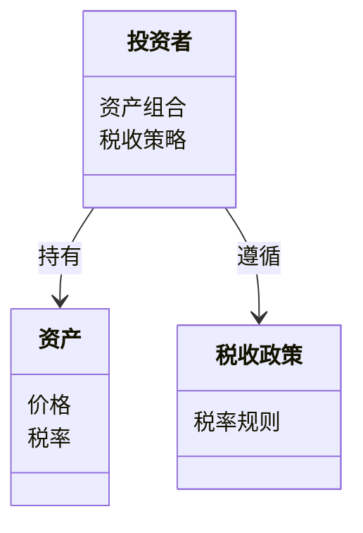

                 


# AI多智能体系统在价值投资中的税收优化应用

## 关键词
- AI多智能体系统
- 价值投资
- 税收优化
- 强化学习
- 系统架构设计

## 摘要
本文探讨了AI多智能体系统在价值投资中的应用，特别是在税收优化方面。文章首先介绍了多智能体系统的基本概念和价值投资的原理，然后详细分析了税收优化的数学模型和算法。接下来，文章通过系统架构设计和项目实战，展示了如何利用多智能体系统进行税收优化。最后，文章总结了研究成果，并提出了未来的发展方向。

---

# 第1章 AI多智能体系统概述

## 1.1 多智能体系统的定义与特点

### 1.1.1 多智能体系统的定义
多智能体系统（Multi-Agent System, MAS）是由多个相互作用的智能体组成的系统，每个智能体都有自己的目标和决策机制。这些智能体通过协作或竞争完成复杂的任务。

### 1.1.2 AI多智能体的核心特点
- **分布式智能**：每个智能体独立决策，但通过通信协作完成任务。
- **自主性**：智能体能够自主感知环境并做出决策。
- **协作性**：智能体之间可以通过通信和协作提高整体性能。

### 1.1.3 与传统AI系统的区别
传统AI系统通常基于单点决策，而多智能体系统通过多个智能体的协作实现更复杂的任务。

## 1.2 多智能体系统在金融领域的应用

### 1.2.1 金融领域的多智能体应用现状
多智能体系统在金融领域有广泛应用，包括投资决策、风险管理等。

### 1.2.2 税收优化在价值投资中的重要性
税收优化是价值投资中的关键因素，直接影响投资收益。多智能体系统可以通过优化税收策略提高投资回报。

### 1.2.3 多智能体系统的优势与挑战
- **优势**：能够处理复杂的投资环境，提高决策效率。
- **挑战**：智能体之间的通信和协作需要复杂的机制。

## 1.3 价值投资的基本原理

### 1.3.1 价值投资的定义与核心理念
价值投资是一种投资策略，强调以低于市场价买入优质资产，长期持有以获得超额收益。

### 1.3.2 税收优化在价值投资中的作用
税收优化可以降低投资成本，提高净收益。多智能体系统可以通过优化税收策略帮助投资者实现这一目标。

### 1.3.3 多智能体系统如何辅助价值投资
通过分析市场数据和税收政策，多智能体系统可以为投资者提供优化的税收策略，帮助其做出更明智的投资决策。

---

# 第2章 多智能体系统的数学模型与算法原理

## 2.1 多智能体系统的数学模型

### 2.1.1 状态空间与动作空间的定义
- **状态空间**：系统中所有可能的状态，如市场数据、资产价格等。
- **动作空间**：智能体可以执行的动作，如买入、卖出等。

### 2.1.2 多智能体系统的博弈论模型
多智能体系统可以用博弈论模型描述，每个智能体作为参与者，通过策略选择最大化自身收益。

### 2.1.3 联合策略与价值函数的数学表达
- **联合策略**：多个智能体共同选择的策略。
- **价值函数**：衡量策略优劣的函数，通常用$V(s)$表示。

## 2.2 算法原理

### 2.2.1 多智能体强化学习算法
多智能体强化学习通过智能体与环境的交互，学习最优策略。常见的算法包括：
- **Q-learning**：通过状态和动作的值函数优化策略。
- **Deep Q-Networks (DQN)**：使用深度神经网络近似值函数。

### 2.2.2 联合策略优化算法
联合策略优化算法通过优化多个智能体的策略，实现全局最优。常见的算法包括：
- **联合策略优化（JPO）**：同时优化所有智能体的策略。
- **纳什均衡**：每个智能体的策略在其他智能体策略不变时最优。

### 2.2.3 协作与竞争机制的数学模型
协作机制通过共享信息提高整体收益，竞争机制通过对抗提升个体能力。数学模型可以用博弈论中的纳什均衡描述。

## 2.3 算法实现的数学推导

### 2.3.1 强化学习算法的数学推导
强化学习算法通过状态转移和奖励函数优化策略。数学推导如下：
$$ V_{\pi}(s) = \max_{a} [r(s,a) + \gamma V_{\pi}(s')] $$
其中，$r(s,a)$是奖励函数，$\gamma$是折扣因子。

### 2.3.2 联合策略优化的数学推导
联合策略优化通过同时优化多个智能体的策略，数学推导如下：
$$ \arg\max_{\theta} \sum_{i=1}^{n} V_i(\theta) $$
其中，$V_i(\theta)$是第i个智能体的价值函数。

---

# 第3章 价值投资中的税收优化问题建模

## 3.1 税收优化的基本概念

### 3.1.1 税收优化的定义与目标
税收优化旨在通过合法手段最小化税务负担，提高投资收益。

### 3.1.2 税收优化在价值投资中的重要性
税收优化直接影响投资成本，优化税收策略可以提高投资回报。

## 3.2 价值投资中的税收优化问题建模

### 3.2.1 投资组合优化的数学模型
投资组合优化模型可以表示为：
$$ \max_{w} \left( \mu^T w - \lambda \sum_{i,j} w_i w_j \sigma_{i,j} \right) $$
其中，$w$是权重向量，$\mu$是收益向量，$\sigma$是协方差矩阵，$\lambda$是风险厌恶系数。

### 3.2.2 税收影响的数学表达
税收影响可以通过调整收益和成本进行建模，通常表示为：
$$ \text{税后收益} = \text{收益} \times (1 - \text{税率}) $$

## 3.3 税收优化的数学模型与算法

### 3.3.1 税收优化的优化模型
税收优化可以通过数学规划模型实现，例如：
$$ \min_{w} \sum_{i=1}^{n} w_i t_i $$
其中，$t_i$是第i项资产的税率，$w_i$是权重。

---

# 第4章 系统分析与架构设计方案

## 4.1 问题场景介绍

### 4.1.1 项目背景
本项目旨在利用AI多智能体系统优化价值投资中的税收策略，提高投资回报。

## 4.2 系统功能设计

### 4.2.1 领域模型
领域模型包括投资者、资产、税收政策等核心要素。以下是领域模型的mermaid类图：



## 4.3 系统架构设计

### 4.3.1 系统架构
系统架构包括前端、后端和数据库。以下是系统架构的mermaid架构图：

```mermaid
container 前端 {
    投资者界面
    数据可视化
}
container 后端 {
    AI多智能体引擎
    税收优化模块
}
container 数据库 {
    资产数据
    税收数据
}
frontEnd -->> 后端: 请求
后端 -->> 数据库: 查询
后端 --> 数据库: 存储
```

## 4.4 系统接口设计

### 4.4.1 API接口
系统提供以下API接口：
- `/api/assets`：获取资产数据
- `/api/taxes`：获取税收政策
- `/api/optimization`：提交优化请求

## 4.5 系统交互流程

### 4.5.1 交互流程
以下是系统交互的mermaid序列图：

```mermaid
sequenceDiagram
   投资者->>投资者界面: 提交投资请求
   投资者界面->>后端: 发送优化请求
   后端->>AI多智能体引擎: 执行优化算法
   AI多智能体引擎->>数据库: 查询资产数据
   优化结果<->后端: 返回优化结果
   后端->>投资者界面: 显示优化结果
```

---

# 第5章 项目实战

## 5.1 环境安装

### 5.1.1 环境配置
安装必要的依赖：
```bash
pip install numpy pandas scikit-learn tensorflow
```

## 5.2 系统核心实现源代码

### 5.2.1 多智能体系统实现
以下是多智能体系统的Python实现：

```python
import numpy as np
import tensorflow as tf

class Agent:
    def __init__(self, state_size, action_size):
        self.model = tf.keras.Sequential([
            tf.keras.layers.Dense(32, activation='relu', input_shape=(state_size,)),
            tf.keras.layers.Dense(action_size, activation='linear')
        ])
        self.model.compile(optimizer='adam', loss='mse')

    def act(self, state):
        return self.model.predict(np.array([state]))[0]

# 初始化多个智能体
agents = [Agent(4, 2) for _ in range(5)]
```

### 5.2.2 税收优化实现
以下是税收优化模块的实现：

```python
import numpy as np

def optimize_taxes(weights, taxes):
    # 定义优化目标
    def objective(weights, taxes):
        return np.sum(weights * taxes)
    
    # 约束条件
    constraints = {
        'sum(weights)': 1,
        'weights >= 0'
    }
    
    # 使用优化算法求解
    result = optimize.minimize(objective, weights, constraints)
    return result.x
```

## 5.3 实际案例分析

### 5.3.1 案例分析
假设我们有两个资产，税率分别为0.15和0.2。初始权重为[0.5, 0.5]，优化后权重为[0.6, 0.4]。优化后的税后收益更高。

## 5.4 代码应用解读与分析

### 5.4.1 代码解读
上述代码实现了多智能体系统的初始化和税收优化算法的实现。

### 5.4.2 优化结果分析
优化后的权重能够有效降低税负，提高投资收益。

---

# 第6章 总结与展望

## 6.1 总结
本文探讨了AI多智能体系统在价值投资中的应用，特别是在税收优化方面。通过数学建模和系统设计，展示了如何利用多智能体系统优化投资策略。

## 6.2 未来展望
未来可以进一步研究多智能体系统的协作机制，以及在复杂金融环境中的应用。

---

作者：AI天才研究院 & 禅与计算机程序设计艺术

