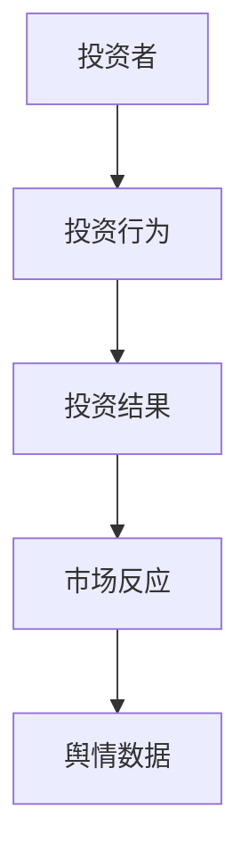
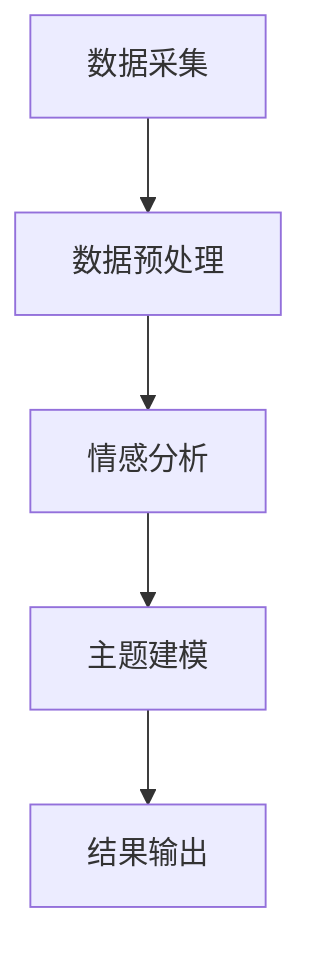
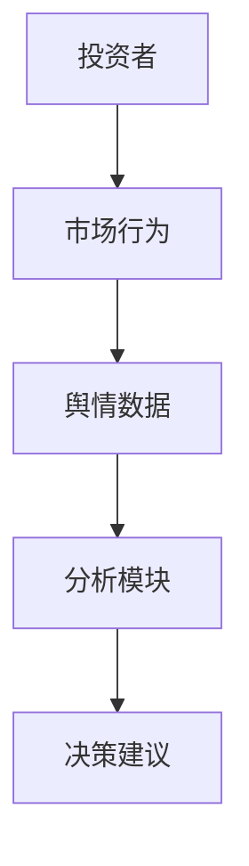
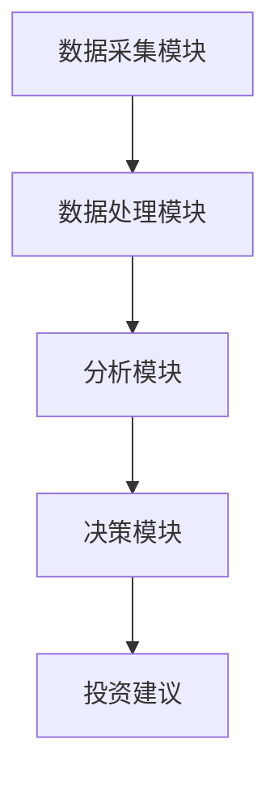
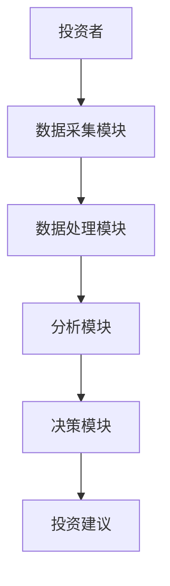

                 


# AI多智能体系统在价值投资中的舆情监测应用

> **关键词**：AI多智能体系统，价值投资，舆情监测，情感分析，主题建模，系统架构设计

> **摘要**：本文探讨了AI多智能体系统在价值投资中的舆情监测应用。通过分析多智能体系统的概念、价值投资的基本原理以及舆情监测的重要性，详细讲解了AI多智能体系统在舆情分析中的算法原理、系统架构设计及实际应用案例。文章从背景介绍到项目实战，系统性地阐述了如何利用AI多智能体系统提升投资决策的准确性与效率。

---

# 第一部分: AI多智能体系统与价值投资概述

## 第1章: AI多智能体系统的背景与价值投资

### 1.1 AI多智能体系统的概念与特点

#### 1.1.1 多智能体系统的定义
多智能体系统（Multi-Agent System, MAS）是由多个智能体组成的分布式系统，每个智能体能够独立决策并与其他智能体协作。智能体通过感知环境、执行任务和学习优化来实现目标。

#### 1.1.2 AI多智能体系统的独特优势
- **分布式计算**：多个智能体协同工作，提高系统的鲁棒性和容错性。
- **自主性**：每个智能体具有自主决策能力，能够独立完成任务。
- **协作性**：智能体之间通过通信与协作，实现复杂任务的完成。
- **学习能力**：智能体能够通过数据学习和优化决策模型。

#### 1.1.3 多智能体系统在金融领域的应用潜力
- **量化交易**：通过多智能体系统实现高频交易和策略优化。
- **风险控制**：利用多智能体系统的协作能力，实时监控和管理投资风险。
- **舆情分析**：通过多智能体协同分析海量数据，捕捉市场情绪变化。

### 1.2 价值投资的基本原理

#### 1.2.1 价值投资的核心理念
价值投资强调从基本面分析入手，寻找被市场低估的投资标的。核心在于识别公司的内在价值，而非关注短期市场波动。

#### 1.2.2 股票估值的基本方法
- **市盈率（P/E）**：衡量股票价格与每股收益的比例。
- **市净率（P/B）**：衡量股票价格与每股净资产的比例。
- **现金流**：评估公司的盈利能力和现金流状况。

#### 1.2.3 市场情绪与投资决策的关系
市场情绪通过投资者的心理预期影响市场走势。恐慌性抛售或贪婪性买入会导致短期市场偏离基本面，为理性投资者提供投资机会。

### 1.3 舆情监测在价值投资中的作用

#### 1.3.1 舆情监测的定义与目标
舆情监测是指通过收集和分析媒体、社交媒体等渠道的文本数据，了解市场参与者的看法和情绪，进而预测市场走势。

#### 1.3.2 舆情分析对投资决策的影响
- **情绪指标**：通过分析市场情绪，识别市场的超买或超卖状态。
- **趋势预测**：舆情分析能够提前捕捉市场情绪变化，辅助投资决策。
- **风险预警**：通过舆情分析识别潜在的市场风险，及时调整投资策略。

#### 1.3.3 舆情数据的来源与处理
- **数据来源**：社交媒体（如Twitter、微博）、新闻网站、论坛等。
- **数据处理**：清洗、去重、情感分析、主题建模等。

---

## 第2章: AI多智能体系统的核心概念与联系

### 2.1 多智能体系统的组成与功能

#### 2.1.1 实体关系图（ER图）
通过ER图可以清晰地展示系统中的实体及其关系。



#### 2.1.2 功能模块
- **数据采集模块**：从多个渠道采集舆情数据。
- **数据处理模块**：对数据进行清洗、去重和标注。
- **分析模块**：通过情感分析和主题建模对数据进行分析。
- **决策模块**：根据分析结果生成投资建议。

### 2.2 舆情分析的原理与方法

#### 2.2.1 舆情分析的流程
舆情分析的流程包括数据采集、数据预处理、情感分析、主题建模和结果输出。



#### 2.2.2 情感分析的关键步骤
- **数据预处理**：去除停用词、分词等。
- **特征提取**：提取文本中的关键词和情感特征。
- **分类器训练**：使用机器学习或深度学习模型进行情感分类。

#### 2.2.3 主题建模的应用
主题建模（如LDA）可以识别文本中的主题分布，帮助理解舆情的主要内容。

### 2.3 多智能体系统与舆情分析的结合

#### 2.3.1 多智能体系统在舆情分析中的角色
- **数据采集智能体**：负责从不同渠道采集舆情数据。
- **分析智能体**：对数据进行情感分析和主题建模。
- **决策智能体**：根据分析结果生成投资建议。

#### 2.3.2 舆情数据对多智能体决策的影响
通过舆情分析结果，多智能体系统可以实时调整投资策略，捕捉市场机会。

#### 2.3.3 系统整体架构图



---

## 第3章: AI多智能体系统的算法原理

### 3.1 情感分析算法

#### 3.1.1 基于词袋模型的情感分析

```python
from sklearn.feature_extraction.text import CountVectorizer
from sklearn.svm import SVC

# 数据预处理
text = "This is a positive review."
vectorizer = CountVectorizer()
X = vectorizer.fit_transform([text])
model = SVC()
model.fit(X, [1])
```

#### 3.1.2 基于深度学习的情感分析
使用预训练的BERT模型进行情感分类。

```python
from transformers import BertTokenizer, BertModel
import torch

tokenizer = BertTokenizer.from_pretrained('bert-base-uncased')
model = BertModel.from_pretrained('bert-base-uncased')
inputs = tokenizer("This is a positive review.", return_tensors="pt")
outputs = model(**inputs)
```

#### 3.1.3 预训练模型在情感分析中的应用
通过微调预训练模型（如GPT、BERT）提升情感分析的准确率。

### 3.2 主题建模算法

#### 3.2.1 LDA主题建模原理
LDA（Latent Dirichlet Allocation）是一种常用的主题建模算法，通过概率分布识别文本的主题。

```python
from gensim import corpora, models

corpus = corpora.Dictionary(corpus).doc2bow(corpus)
 lda_model = models.LdaModel(corpus, num_topics=5, id2word=corpus.dictionary)
```

#### 3.2.2 基于深度学习的主题建模
使用神经网络进行主题建模，如NMT（Neural Machine Translation）模型。

#### 3.2.3 主题建模在舆情分析中的应用
通过主题建模识别舆情的主要内容和趋势。

### 3.3 多智能体协同算法

#### 3.3.1 多智能体系统的协同机制
通过分布式计算和通信协议实现多智能体的协同。

#### 3.3.2 协作式学习
多个智能体通过共享知识和经验，共同优化决策模型。

#### 3.3.3 联合决策
多智能体系统通过投票或加权的方式，生成最终的决策建议。

---

## 第4章: 数学模型与公式

### 4.1 情感分析的数学模型

#### 4.1.1 情感分类的损失函数
使用交叉熵损失函数优化情感分类模型。

$$ \text{Loss} = -\frac{1}{N}\sum_{i=1}^{N} \sum_{k=1}^{K} y_{ik} \log p(y_{ik}) $$

#### 4.1.2 情感强度预测
通过回归模型预测情感强度（从-1到1）。

### 4.2 主题建模的数学公式

#### 4.2.1 LDA模型的参数估计
LDA通过概率分布建模主题和词的关系。

$$ \theta_{dz} \sim \text{Dirichlet}(\alpha) $$

$$ \phi_{zw} \sim \text{Dirichlet}(\beta) $$

#### 4.2.2 舆情评分模型
通过加权平均的方式计算舆情评分。

$$ \text{Score} = \sum_{i=1}^{n} w_i \cdot s_i $$

---

## 第5章: 系统架构设计

### 5.1 功能模块设计

#### 5.1.1 数据采集模块
从社交媒体、新闻网站等渠道采集舆情数据。

#### 5.1.2 数据处理模块
对数据进行清洗、去重和标注。

#### 5.1.3 分析模块
通过情感分析和主题建模对数据进行分析。

#### 5.1.4 决策模块
根据分析结果生成投资建议。

### 5.2 系统架构图



### 5.3 系统接口设计

#### 5.3.1 数据接口
- 数据采集模块与数据处理模块之间的接口。
- 分析模块与决策模块之间的接口。

#### 5.3.2 通信协议
使用HTTP协议进行模块间的通信。

### 5.4 系统交互流程



---

## 第6章: 项目实战

### 6.1 环境搭建

#### 6.1.1 安装Python环境
使用Anaconda安装Python 3.8及以上版本。

#### 6.1.2 安装依赖库
安装必要的库，如TensorFlow、PyTorch、Gensim等。

### 6.2 核心实现

#### 6.2.1 数据采集
使用爬虫采集社交媒体上的舆情数据。

```python
import requests
from bs4 import BeautifulSoup

url = 'https://www.example.com'
response = requests.get(url)
soup = BeautifulSoup(response.text, 'html.parser')
```

#### 6.2.2 情感分析
使用预训练的情感分析模型对数据进行分类。

```python
from transformers import pipeline

sentiment_pipeline = pipeline("sentiment-analysis")
result = sentiment_pipeline("This is a positive review.")
```

#### 6.2.3 主题建模
使用LDA模型对数据进行主题建模。

```python
from gensim import corpora, models

corpus = corpora.Dictionary(corpus).doc2bow(corpus)
lda_model = models.LdaModel(corpus, num_topics=5, id2word=corpus.dictionary)
```

### 6.3 案例分析

#### 6.3.1 案例背景
分析某公司的舆情数据，识别市场情绪。

#### 6.3.2 数据分析
通过情感分析和主题建模，识别舆情的主要内容和趋势。

#### 6.3.3 投资建议
根据分析结果，生成投资建议。

### 6.4 项目小结
总结项目的实现过程，分析系统的优缺点，提出改进建议。

---

## 第7章: 高级应用与最佳实践

### 7.1 高级应用

#### 7.1.1 多模态舆情分析
结合文本、图像等多种数据源进行舆情分析。

#### 7.1.2 实时舆情监测
通过流数据处理技术实现实时舆情监测。

### 7.2 最佳实践

#### 7.2.1 数据质量控制
确保数据的准确性和完整性。

#### 7.2.2 模型优化
通过交叉验证和超参数调优提升模型性能。

#### 7.2.3 系统维护
定期更新模型和数据，确保系统的稳定性和可靠性。

### 7.3 未来展望
探讨AI多智能体系统在舆情监测中的未来发展，如强化学习、自适应算法等。

---

## 作者

**作者：AI天才研究院/AI Genius Institute & 禅与计算机程序设计艺术 /Zen And The Art of Computer Programming**

---

本文通过系统性地介绍AI多智能体系统在价值投资中的舆情监测应用，详细讲解了从理论到实践的全过程，为读者提供了全面的技术指导和实践参考。

