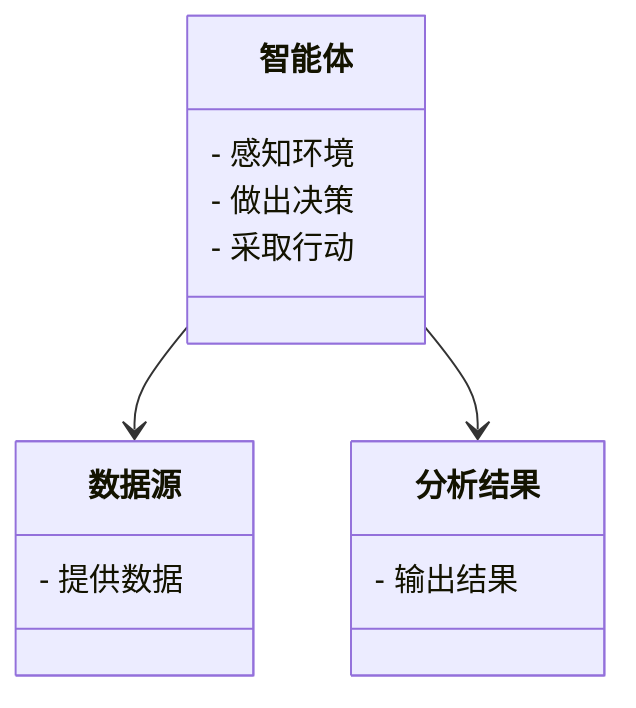
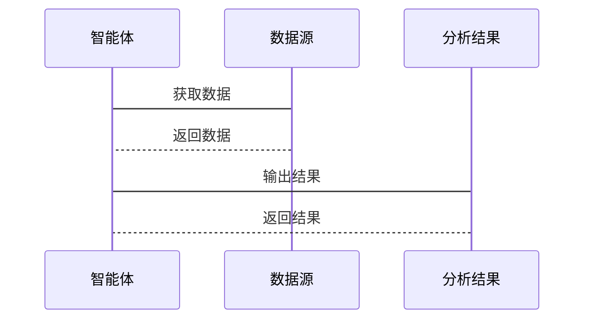

                 


# AI多智能体系统在识别价值陷阱中的作用

## 关键词：AI多智能体系统，价值识别，价值陷阱，多智能体协作，异常检测，系统架构设计，算法原理

## 摘要：  
本文深入探讨AI多智能体系统在识别价值陷阱中的作用。通过分析多智能体系统的定义、核心概念与算法原理，结合实际应用场景和项目实战，详细讲解了多智能体系统如何在复杂环境中高效识别和规避价值陷阱。文章还总结了最佳实践和未来发展方向，为读者提供全面的技术视角。

---

# 第一部分: AI多智能体系统与价值识别的背景

## 第1章: 多智能体系统的基本概念

### 1.1 多智能体系统的定义与特点

#### 1.1.1 多智能体系统的定义  
多智能体系统（Multi-Agent System, MAS）是由多个智能体（Agent）组成的系统，这些智能体能够通过协作完成复杂的任务。每个智能体都是一个独立的实体，具有感知环境、自主决策和行动的能力。

#### 1.1.2 多智能体系统的核心特点  
- **自主性**：智能体能够自主决策，无需外部干预。  
- **反应性**：智能体能够实时感知环境并做出响应。  
- **协作性**：智能体之间可以通过通信和协作完成共同目标。  
- **分布式智能**：智能体的决策和行动是分布式的，而非集中控制。  

#### 1.1.3 多智能体系统与单智能体系统的区别  
| 特性 | 单智能体系统 | 多智能体系统 |  
|------|--------------|--------------|  
| 控制方式 | 集中控制 | 分布式控制 |  
| 决策能力 | 单点决策 | 多点协作决策 |  
| 适应性 | 较低 | 较高 |  

### 1.2 价值识别的背景与意义

#### 1.2.1 价值识别的基本概念  
价值识别是指通过分析数据或信息，发现其中隐藏的价值或潜在风险。在商业领域，价值识别通常用于发现市场机会或规避风险。

#### 1.2.2 价值识别在商业中的应用  
- **投资决策**：通过分析企业数据，识别潜在的投资机会。  
- **风险管理**：识别可能的风险点，避免损失。  
- **市场分析**：分析市场趋势，发现新兴机会。  

#### 1.2.3 价值识别的挑战与机遇  
- **挑战**：数据复杂性高，信息不完整，难以识别潜在价值。  
- **机遇**：通过多智能体系统的协作，可以更高效地识别价值。  

### 1.3 多智能体系统在价值识别中的作用

#### 1.3.1 多智能体系统的优势  
- **协作能力强**：多个智能体可以协作完成复杂的任务。  
- **实时性高**：智能体可以实时感知环境并做出响应。  
- **可扩展性好**：系统可以根据需求扩展智能体数量。  

#### 1.3.2 多智能体系统在价值识别中的应用案例  
例如，在金融市场中，多个智能体可以分别负责分析不同的数据源，最终协作识别出潜在的投资机会。  

#### 1.3.3 多智能体系统与传统价值识别方法的对比  
| 方法 | 多智能体系统 | 传统方法 |  
|------|--------------|----------|  
| 效率 | 高 | 低 |  
| 可扩展性 | 高 | 低 |  
| 精准度 | 高 | 中 |  

## 第2章: 价值陷阱的定义与特征

### 2.1 价值陷阱的基本概念

#### 2.1.1 价值陷阱的定义  
价值陷阱是指表面上具有较高价值，但实际上存在潜在风险或无法实现的承诺。  

#### 2.1.2 价值陷阱的表现形式  
- **虚假信息**：通过虚假宣传吸引投资。  
- **隐藏风险**：表面上看起来安全，实则存在潜在风险。  
- **短期收益**：短期内看似收益高，长期不可持续。  

#### 2.1.3 价值陷阱的分类  
| 类型 | 特征 | 示例 |  
|------|------|------|  
| 财务型 | 数据造假 | 虚假财务报表 |  
| 市场型 | 市场操纵 | 操纵股价 |  
| 操作型 | 操作不当 | 管理层腐败 |  

### 2.2 价值陷阱的识别方法

#### 2.2.1 基于数据的识别方法  
通过分析数据，发现异常值或不一致的地方。  

#### 2.2.2 基于模型的识别方法  
使用数学模型预测潜在风险。  

#### 2.2.3 基于多智能体的识别方法  
多个智能体协作，从不同角度分析数据，识别潜在风险。  

### 2.3 多智能体系统在识别价值陷阱中的优势

#### 2.3.1 多智能体系统的协作能力  
多个智能体可以协作分析数据，发现潜在风险。  

#### 2.3.2 多智能体系统的实时性  
智能体可以实时感知环境，快速识别潜在风险。  

#### 2.3.3 多智能体系统的可扩展性  
系统可以根据需求扩展智能体数量，处理更大规模的数据。  

---

# 第二部分: 多智能体系统的核心概念与联系

## 第3章: 多智能体系统的原理与模型

### 3.1 多智能体系统的原理

#### 3.1.1 多智能体系统的组成  
- **智能体**：负责具体任务的实体。  
- **通信机制**：智能体之间通信的方式。  
- **协调机制**：智能体协作完成任务的方式。  

#### 3.1.2 多智能体系统的通信机制  
智能体之间可以通过消息传递或共享数据库进行通信。  

#### 3.1.3 多智能体系统的协调机制  
智能体可以通过协商或拍卖的方式分配任务。  

### 3.2 多智能体系统的模型

#### 3.2.1 基于图模型的多智能体系统  
使用图模型表示智能体之间的关系。  

#### 3.2.2 基于状态空间的多智能体系统  
通过状态空间表示智能体的决策过程。  

#### 3.2.3 基于行为模型的多智能体系统  
通过行为模型表示智能体的行动方式。  

### 3.3 多智能体系统的核心要素

#### 3.3.1 智能体的定义与属性  
- **定义**：智能体是一个能够感知环境并采取行动的实体。  
- **属性**：自主性、反应性、协作性。  

#### 3.3.2 智能体之间的关系  
- **协作关系**：智能体之间协作完成任务。  
- **竞争关系**：智能体之间竞争资源。  

#### 3.3.3 智能体的协作与竞争  
协作可以提高系统的效率，竞争可以促进系统的优化。  

## 第4章: 价值识别的核心概念与联系

### 4.1 价值识别的核心概念

#### 4.1.1 价值识别的定义  
通过分析数据或信息，发现其中隐藏的价值或潜在风险。  

#### 4.1.2 价值识别的核心要素  
- **数据**：分析的基础。  
- **算法**：分析的工具。  
- **智能体**：协作完成任务的实体。  

### 4.2 价值识别与多智能体系统的联系

#### 4.2.1 多智能体系统在价值识别中的作用  
- **数据采集**：智能体可以采集多源数据。  
- **数据分析**：智能体可以协作分析数据。  
- **结果输出**：智能体可以输出分析结果。  

#### 4.2.2 多智能体系统与价值识别的结合  
通过协作，多智能体系统可以更高效地识别价值。  

---

# 第三部分: 算法原理

## 第5章: 多智能体系统的算法原理

### 5.1 多智能体协作算法

#### 5.1.1 多智能体协作算法的定义  
多个智能体协作完成任务的算法。  

#### 5.1.2 多智能体协作算法的流程  
1. 智能体感知环境。  
2. 智能体做出决策。  
3. 智能体采取行动。  

#### 5.1.3 多智能体协作算法的数学模型  
$$ V = \sum_{i=1}^{n} v_i $$  
其中，\( V \) 是总价值，\( v_i \) 是每个智能体贡献的价值。  

### 5.2 价值评估算法

#### 5.2.1 价值评估算法的定义  
评估数据或信息的价值的算法。  

#### 5.2.2 价值评估算法的流程  
1. 数据采集。  
2. 数据清洗。  
3. 数据分析。  

#### 5.2.3 价值评估算法的数学模型  
$$ S = \sum_{j=1}^{m} s_j $$  
其中，\( S \) 是总评分，\( s_j \) 是每个指标的评分。  

### 5.3 异常检测算法

#### 5.3.1 异常检测算法的定义  
检测数据中异常值的算法。  

#### 5.3.2 异常检测算法的流程  
1. 数据采集。  
2. 数据预处理。  
3. 异常检测。  

#### 5.3.3 异常检测算法的数学模型  
$$ A = \sum_{k=1}^{p} a_k $$  
其中，\( A \) 是异常评分，\( a_k \) 是每个异常特征的评分。  

---

# 第四部分: 系统分析与架构设计

## 第6章: 系统分析与架构设计

### 6.1 问题场景介绍

#### 6.1.1 问题背景  
识别价值陷阱是商业中的一个重要任务。  

#### 6.1.2 问题描述  
通过多智能体系统识别数据中的潜在风险。  

#### 6.1.3 问题解决  
通过多智能体协作算法识别价值陷阱。  

### 6.2 项目介绍

#### 6.2.1 项目目标  
识别数据中的价值陷阱。  

#### 6.2.2 项目范围  
分析市场数据，识别潜在风险。  

#### 6.2.3 项目计划  
- 阶段一：需求分析。  
- 阶段二：系统设计。  
- 阶段三：系统实现。  

### 6.3 系统功能设计

#### 6.3.1 领域模型类图  


#### 6.3.2 系统架构设计  


### 6.4 系统接口设计

#### 6.4.1 系统接口  
- 数据采集接口：采集数据。  
- 数据分析接口：分析数据。  

#### 6.4.2 接口设计  
- 数据采集接口：`GET /data`  
- 数据分析接口：`POST /analyze`  

### 6.5 系统交互设计

#### 6.5.1 系统交互流程  


---

# 第五部分: 项目实战

## 第7章: 项目实战

### 7.1 环境安装

#### 7.1.1 环境需求  
- Python 3.8以上版本。  
- 安装库：`numpy`, `pandas`, `scikit-learn`。  

#### 7.1.2 安装步骤  
1. 安装Python。  
2. 安装所需的库。  

### 7.2 核心代码实现

#### 7.2.1 数据采集代码  
```python
import requests

def get_data():
    response = requests.get('https://example.com/data')
    return response.json()
```

#### 7.2.2 数据分析代码  
```python
import pandas as pd

def analyze_data(data):
    df = pd.DataFrame(data)
    return df.describe()
```

#### 7.2.3 异常检测代码  
```python
from sklearn.ensemble import IsolationForest

def detect_anomalies(data):
    model = IsolationForest()
    model.fit(data)
    return model.predict(data)
```

### 7.3 代码解读与分析

#### 7.3.1 数据采集代码解读  
上述代码通过`requests`库从指定URL获取数据。  

#### 7.3.2 数据分析代码解读  
上述代码使用`pandas`库对数据进行分析。  

#### 7.3.3 异常检测代码解读  
上述代码使用`IsolationForest`算法进行异常检测。  

### 7.4 实际案例分析

#### 7.4.1 案例背景  
假设我们有一个股票数据集，需要识别其中的价值陷阱。  

#### 7.4.2 案例分析  
通过上述代码，我们发现某只股票的数据存在异常，提示可能存在价值陷阱。  

#### 7.4.3 案例总结  
通过多智能体系统的协作，我们成功识别了潜在的价值陷阱。  

---

# 第六部分: 最佳实践与总结

## 第8章: 最佳实践与总结

### 8.1 最佳实践

#### 8.1.1 数据质量  
确保数据的准确性和完整性。  

#### 8.1.2 系统设计  
合理设计系统架构，确保系统的可扩展性和可维护性。  

#### 8.1.3 算法选择  
根据具体场景选择合适的算法。  

### 8.2 小结

#### 8.2.1 核心内容回顾  
通过多智能体系统的协作，我们可以更高效地识别价值陷阱。  

#### 8.2.2 注意事项  
- 确保系统的安全性和稳定性。  
- 定期更新系统和算法。  

### 8.3 未来发展方向

#### 8.3.1 算法优化  
研究更高效的算法。  

#### 8.3.2 系统扩展  
开发更强大的系统架构。  

#### 8.3.3 应用场景拓展  
探索更多应用场景。  

---

# 作者：AI天才研究院 & 禅与计算机程序设计艺术

---

以上是《AI多智能体系统在识别价值陷阱中的作用》的技术博客文章的完整目录和内容。希望对您有所帮助！

