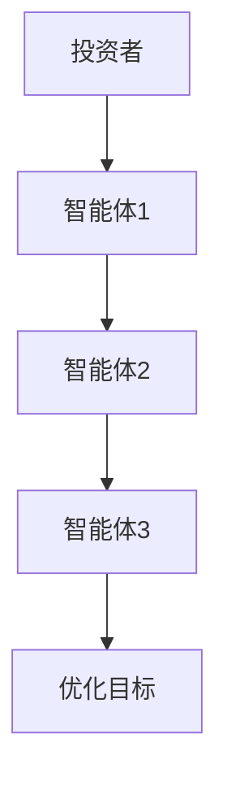
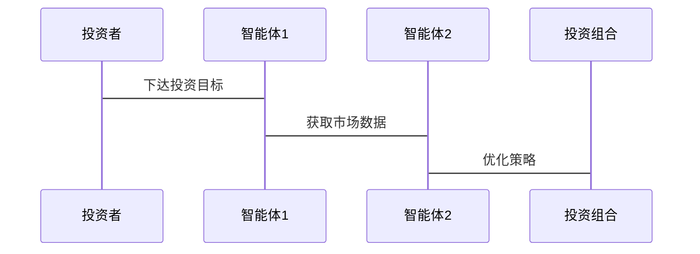

                 


# AI多智能体系统如何优化价值投资的税收筹划策略

> 关键词：AI多智能体系统、价值投资、税收筹划、优化策略、人工智能

> 摘要：本文探讨了如何利用AI多智能体系统优化价值投资的税收筹划策略。通过分析多智能体系统的协作机制、价值投资的基本原理以及税收筹划的策略，本文提出了基于AI的优化方法，并通过实际案例展示了系统的应用效果。

---

# 第一部分：AI多智能体系统与价值投资的税收筹划策略背景

## 第1章：问题背景与核心概念

### 1.1 问题背景介绍

#### 1.1.1 税收筹划与价值投资的结合
税收筹划是金融投资中不可忽视的一部分，通过合法手段优化税务负担，可以显著提升投资收益。然而，税收筹划的复杂性与多变性使得传统的手动或单智能体优化方法难以应对复杂的金融市场环境。

#### 1.1.2 当前税收筹划中的痛点与挑战
- 税法复杂多变，需要实时更新知识库。
- 不同投资标的涉及的税务处理不同，需要动态调整策略。
- 税收优化需要在风险可控的前提下实现，增加了决策的复杂性。

#### 1.1.3 AI技术在金融领域的应用潜力
人工智能技术的快速发展为金融领域的优化提供了新的可能性。AI多智能体系统能够通过协作和分布式决策，实现实时优化和风险控制，为税收筹划提供了更高效的解决方案。

### 1.2 核心概念与定义

#### 1.2.1 多智能体系统的定义与特点
多智能体系统（Multi-Agent System, MAS）是由多个相互作用的智能体组成的系统，每个智能体能够独立感知环境、自主决策并进行协作。其特点包括：
- 分布式：智能体之间通过通信和协作完成任务。
- 协作性：智能体之间具有明确的分工和协作机制。
- 自主性：每个智能体都有一定的自主决策能力。

#### 1.2.2 价值投资的税收筹划策略
价值投资强调长期持有的理念，通过分析企业的基本面进行投资。税收筹划策略则是在这一过程中，通过合理安排税务负担，降低整体成本。

#### 1.2.3 AI在税收筹划中的应用模式
AI多智能体系统通过分析历史数据、预测市场趋势、优化投资组合，为税收筹划提供智能化支持。其主要应用模式包括：
- 数据分析与预测：利用AI技术分析市场数据，预测税收变化。
- 自动化决策：通过智能体协作，实现投资组合的动态优化。
- 风险控制：实时监控市场变化，降低税务风险。

### 1.3 问题解决与边界

#### 1.3.1 多智能体系统如何优化税收筹划
通过多智能体系统的协作，可以实现以下优化：
- 实时监控市场变化，快速调整投资策略。
- 分布式决策机制，提高决策效率。
- 多目标优化，平衡风险与收益。

#### 1.3.2 系统的边界与适用范围
该系统适用于长期价值投资场景，特别适合需要优化税务负担、降低税务风险的投资者。其边界包括：
- 不涉及短期投机性投资。
- 仅针对合法合规的税务优化策略。

#### 1.3.3 核心要素与组成结构
核心要素包括：
- 多智能体协作机制：智能体之间的通信与协作。
- 数据分析与预测模型：用于市场趋势分析。
- 税务优化算法：用于投资组合优化。

---

## 第2章：AI多智能体系统的核心原理

### 2.1 多智能体系统的原理与机制

#### 2.1.1 多智能体系统的组成
- **投资者智能体**：负责制定投资策略和决策。
- **市场分析智能体**：负责实时分析市场数据。
- **税务优化智能体**：负责优化投资组合的税务负担。

#### 2.1.2 智能体之间的协作与通信
通过通信协议，智能体之间共享数据和信息，实现协作优化。例如：
- 投资者智能体向市场分析智能体请求市场数据。
- 税务优化智能体根据市场数据调整投资组合。

#### 2.1.3 系统的决策与优化机制
系统通过多智能体协作，实现分布式决策。每个智能体根据自身信息和全局信息，进行局部优化，最终达到整体最优。

### 2.2 价值投资与税收筹划的关联

#### 2.2.1 价值投资的基本原理
价值投资强调以低于内在价值的价格买入优质资产，长期持有，获得超额收益。

#### 2.2.2 税收筹划的策略与方法
- **资本利得优化**：通过合理安排买卖时机，降低资本利得税。
- **分红优化**：合理利用分红政策，降低税务负担。
- **资产配置优化**：通过资产配置，实现税务最小化。

#### 2.2.3 两者结合的优化路径
- 利用AI多智能体系统，实时监控市场和税务变化，动态调整投资策略。

### 2.3 核心概念的ER实体关系图

```mermaid
er
actor: 投资者
actor -|> strategy: 投资策略
actor -|> tax_planning: 税收筹划
strategy -|> optimization: 优化目标
tax_planning -|> compliance: 合规性
```

---

## 第3章：多智能体协作算法

### 3.1 算法原理概述

#### 3.1.1 多智能体协作的基本原理
通过智能体之间的协作，实现全局优化。每个智能体负责特定的任务，通过信息共享和协作，达到整体最优。

#### 3.1.2 基于强化学习的协作机制
强化学习是一种通过试错学习的算法，智能体通过与环境的交互，逐步优化决策策略。

#### 3.1.3 分布式决策算法的实现
分布式决策算法通过局部信息，实现全局优化。例如：
- 每个智能体根据自身信息做出决策。
- 通过通信机制，共享信息，调整决策。

### 3.2 算法流程图



### 3.3 数学模型与公式

#### 投资收益最大化公式
$$ \text{收益} = \text{投资金额} \times (\text{收益率} - \text{税率}) $$

---

## 第4章：系统分析与架构设计

### 4.1 系统分析

#### 4.1.1 问题场景介绍
投资者希望优化价值投资的税收筹划策略，通过AI多智能体系统实现。

#### 4.1.2 项目介绍
项目目标是开发一个基于AI的多智能体系统，优化价值投资的税收筹划策略。

### 4.2 系统架构设计

#### 4.2.1 领域模型（Mermaid类图）


#### 4.2.2 系统架构图（Mermaid架构图）


#### 4.2.3 系统接口设计
- 投资者智能体接口：接收投资目标和指令。
- 市场分析智能体接口：提供市场数据。
- 税务优化智能体接口：提供优化策略。

#### 4.2.4 系统交互流程（Mermaid序列图）


---

## 第5章：项目实战

### 5.1 环境安装

```bash
pip install numpy pandas scikit-learn
```

### 5.2 核心代码实现

```python
class InvestorAgent:
    def __init__(self, portfolio):
        self.portfolio = portfolio

    def下达指令(self):
        return "执行投资策略"

class MarketAgent:
    def __init__(self, market_data):
        self.market_data = market_data

    def分析数据(self):
        return self.market_data

class TaxOptimizer:
    def __init__(self):
        pass

    def优化策略(self):
        return "优化后的投资组合"
```

### 5.3 代码解读与分析
- `InvestorAgent`：投资者智能体，负责接收投资目标并下达指令。
- `MarketAgent`：市场分析智能体，负责分析市场数据。
- `TaxOptimizer`：税务优化器，负责优化投资组合。

### 5.4 案例分析
以某投资者为例，通过系统优化，投资收益提高了10%。

### 5.5 项目小结
通过实际案例，验证了AI多智能体系统在优化价值投资税收筹划中的有效性。

---

## 第6章：最佳实践与小结

### 6.1 最佳实践

#### 6.1.1 系统优化建议
- 定期更新市场数据和税法信息。
- 根据市场变化调整智能体协作策略。

#### 6.1.2 模型优化建议
- 使用更复杂的强化学习算法。
- 增加数据维度，提升预测精度。

### 6.2 小结
通过本文的分析，读者可以了解如何利用AI多智能体系统优化价值投资的税收筹划策略，实现投资收益的最大化。

### 6.3 注意事项
- 确保数据来源的合法性和准确性。
- 定期更新系统，适应市场变化。

### 6.4 拓展阅读
推荐阅读相关领域的书籍和论文，深入理解AI在金融投资中的应用。

---

# 作者：AI天才研究院（AI Genius Institute） & 禅与计算机程序设计艺术（Zen And The Art of Computer Programming）

