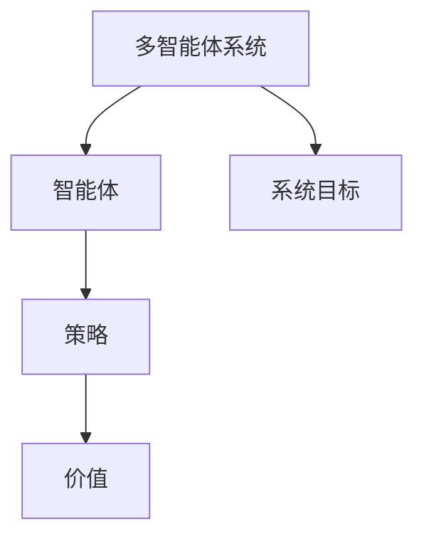
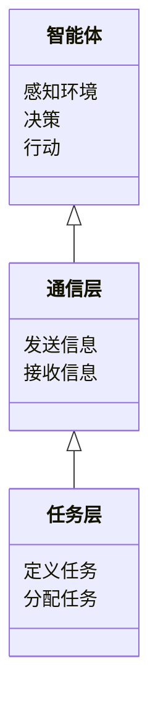
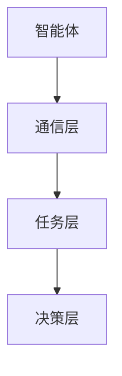
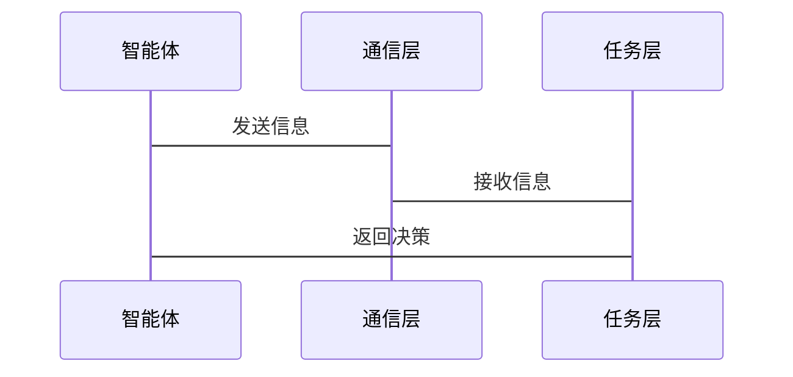
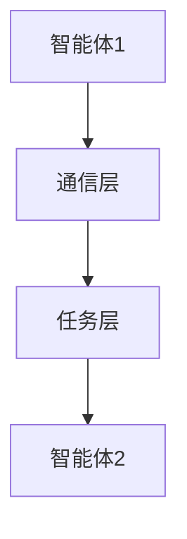

                 


# AI多智能体系统如何改进传统的价值平均策略

**关键词**：AI多智能体系统，价值平均策略，协同优化，系统架构，算法改进

**摘要**：本文将详细探讨AI多智能体系统如何改进传统的价值平均策略。通过分析多智能体系统的背景、核心概念、算法原理、系统架构设计、项目实战和最佳实践，我们旨在展示如何通过协同优化和系统改进来提升传统价值平均策略的性能和效果。本文将结合理论分析和实际案例，深入浅出地阐述改进的思路和方法。

---

# 第一部分：AI多智能体系统与价值平均策略概述

## 第1章：AI多智能体系统与价值平均策略的背景介绍

### 1.1 问题背景与描述

#### 1.1.1 多智能体系统的基本概念
多智能体系统（Multi-Agent System，MAS）是由多个智能体（Agent）组成的分布式系统，这些智能体能够通过协作或竞争完成复杂任务。智能体是具有感知、决策和行动能力的实体，可以是软件程序、机器人或其他智能设备。

#### 1.1.2 传统价值平均策略的局限性
传统的价值平均策略（Value Averaging Strategy）是一种简单有效的决策方法，但在多智能体系统中存在以下问题：
- **信息孤岛**：各个智能体之间缺乏有效通信，导致信息不共享，价值计算不准确。
- **局部最优**：每个智能体仅考虑局部信息，无法全局优化。
- **动态环境适应性差**：传统策略难以应对多智能体系统中动态变化的环境。

#### 1.1.3 问题解决的目标与意义
通过改进传统价值平均策略，结合多智能体系统的特点，实现以下目标：
- **全局优化**：通过智能体间的协同，实现全局最优决策。
- **动态适应**：增强系统对动态环境的适应能力。
- **高效协作**：提升智能体之间的协作效率和信息共享能力。

---

### 1.2 问题的边界与外延

#### 1.2.1 多智能体系统的核心要素
多智能体系统的核心要素包括：
- **智能体**：具有感知、决策和行动能力的实体。
- **环境**：智能体所处的物理或数字环境。
- **目标**：智能体需要完成的任务或目标。
- **通信**：智能体之间信息交换的方式。

#### 1.2.2 价值平均策略的适用范围
价值平均策略适用于需要快速决策且对精度要求不高的场景，例如：
- **分布式任务分配**：多个智能体协作完成任务。
- **资源分配**：在多智能体系统中合理分配资源。
- **博弈论应用**：在多智能体博弈中寻找均衡点。

#### 1.2.3 系统边界与限制条件
多智能体系统的边界包括：
- **智能体数量**：系统中智能体的数量会影响策略的复杂度。
- **通信能力**：智能体之间的通信带宽和延迟限制。
- **环境动态性**：环境的变化速度和复杂程度。

---

### 1.3 核心概念的结构与组成

#### 1.3.1 多智能体系统的基本架构
多智能体系统的基本架构包括：
- **智能体层**：负责感知环境、决策和行动。
- **通信层**：实现智能体之间的信息交换。
- **任务层**：定义系统的目标和任务分配。

#### 1.3.2 价值平均策略的数学模型
价值平均策略的数学表达式如下：
$$ V = \frac{1}{n} \sum_{i=1}^{n} v_i $$
其中，$V$ 表示平均价值，$v_i$ 表示第 $i$ 个智能体的价值。

#### 1.3.3 系统与策略之间的关系
多智能体系统通过协同优化算法，将各个智能体的价值进行整合，形成全局最优决策。

---

### 1.4 本章小结
本章介绍了多智能体系统的背景、核心概念以及传统价值平均策略的局限性，为后续的改进策略奠定了基础。

---

# 第二部分：AI多智能体系统的价值平均策略

## 第2章：多智能体系统的核心概念与联系

### 2.1 多智能体系统的核心原理

#### 2.1.1 多智能体系统的基本原理
多智能体系统通过智能体之间的协作与竞争，实现复杂任务的完成。智能体可以独立决策，也可以通过通信共享信息。

#### 2.1.2 多智能体系统与传统单智能体系统的区别
- **独立性**：多智能体系统中的智能体是相对独立的，而传统系统中只有一个决策主体。
- **协作性**：多智能体系统强调协作，而传统系统通常是一个中心化的决策过程。

#### 2.1.3 多智能体系统中的协同与竞争关系
智能体之间的协同可以提高整体效率，而竞争则有助于避免资源浪费。

---

### 2.2 价值平均策略的详细解释

#### 2.2.1 价值平均策略的基本定义
价值平均策略是一种简单有效的决策方法，通过计算多个智能体的价值平均值，作为最终的决策依据。

#### 2.2.2 价值平均策略的数学表达式
$$ V = \frac{1}{n} \sum_{i=1}^{n} v_i $$
其中，$V$ 表示平均价值，$v_i$ 表示第 $i$ 个智能体的价值。

#### 2.2.3 价值平均策略的优缺点
- **优点**：简单易实现，计算效率高。
- **缺点**：难以应对动态变化的环境，无法保证全局最优。

---

### 2.3 多智能体系统与价值平均策略的联系

#### 2.3.1 多智能体系统如何影响价值平均策略
多智能体系统通过智能体之间的协作，提高了价值计算的准确性和全面性。

#### 2.3.2 价值平均策略在多智能体系统中的作用
价值平均策略是多智能体系统中一种重要的决策方法，可以用于任务分配和资源优化。

#### 2.3.3 多智能体系统与价值平均策略的协同优化
通过协同优化算法，可以将多智能体系统的优势与价值平均策略的简单性结合起来，实现更高效的决策。

---

### 2.4 核心概念对比分析

#### 2.4.1 多智能体系统与传统单智能体系统的对比
- **智能体数量**：多智能体系统有多个智能体，而传统系统只有一个。
- **协作性**：多智能体系统强调协作，而传统系统通常独立决策。

#### 2.4.2 价值平均策略与其他策略的对比
- **一致性**：一致性策略强调所有智能体的决策一致。
- **均衡性**：均衡策略强调智能体之间的利益平衡。

---

### 2.5 ER实体关系图



---

### 2.6 本章小结
本章详细介绍了多智能体系统的核心概念和价值平均策略的实现方式，为后续的改进策略提供了理论基础。

---

# 第三部分：价值平均策略的算法原理

## 第3章：多智能体系统中价值平均策略的算法原理

### 3.1 算法原理概述

#### 3.1.1 多智能体系统中价值平均策略的基本原理
通过智能体之间的协作，计算每个智能体的价值，然后取平均值作为最终的决策依据。

#### 3.1.2 算法的核心思想与步骤
1. **初始化**：设置智能体数量和目标。
2. **智能体决策**：每个智能体根据自身感知计算价值。
3. **通信与整合**：智能体之间共享价值信息。
4. **计算平均值**：将所有智能体的价值取平均值，作为最终决策。

#### 3.1.3 算法的数学模型与公式
$$ V = \frac{1}{n} \sum_{i=1}^{n} v_i $$

---

### 3.2 算法实现的详细步骤

#### 3.2.1 算法输入与输出
- **输入**：智能体数量 $n$，每个智能体的价值 $v_i$。
- **输出**：平均价值 $V$。

#### 3.2.2 算法的实现步骤
1. 初始化智能体数量 $n$ 和每个智能体的价值 $v_i$。
2. 计算所有智能体的价值之和。
3. 计算平均值 $V$。
4. 返回 $V$。

---

### 3.3 算法的数学模型与公式

#### 3.3.1 价值平均策略的数学表达式
$$ V = \frac{1}{n} \sum_{i=1}^{n} v_i $$

#### 3.3.2 优化算法的数学表达式
$$ V_{\text{new}} = V + \alpha (V_{\text{opt}} - V) $$
其中，$\alpha$ 是学习率，$V_{\text{opt}}$ 是优化目标。

---

### 3.4 算法的优化与改进

#### 3.4.1 算法的优化思路
- **动态调整**：根据环境变化动态调整学习率 $\alpha$。
- **局部优化**：对部分智能体进行优化，减少计算量。

#### 3.4.2 算法实现的优化步骤
1. 初始化智能体数量 $n$ 和每个智能体的价值 $v_i$。
2. 计算平均价值 $V$。
3. 根据优化目标调整每个智能体的价值。
4. 计算新的平均价值 $V_{\text{new}}$。
5. 返回 $V_{\text{new}}$。

---

### 3.5 本章小结
本章详细介绍了多智能体系统中价值平均策略的算法原理和优化方法，为后续的系统设计和实战应用提供了理论支持。

---

# 第四部分：系统分析与架构设计

## 第4章：系统分析与架构设计

### 4.1 问题场景介绍

#### 4.1.1 系统目标
通过改进传统价值平均策略，提升多智能体系统的决策效率和准确性。

#### 4.1.2 问题场景
在一个分布式任务分配系统中，多个智能体需要协作完成任务。

---

### 4.2 系统功能设计

#### 4.2.1 领域模型


---

### 4.3 系统架构设计

#### 4.3.1 系统架构图


---

### 4.4 系统接口设计

#### 4.4.1 智能体接口


---

### 4.5 系统交互流程图

#### 4.5.1 交互流程图


---

### 4.6 本章小结
本章详细描述了系统的功能设计和架构设计，为后续的实战应用提供了清晰的指导。

---

# 第五部分：项目实战

## 第5章：项目实战

### 5.1 环境安装与配置

#### 5.1.1 环境要求
- 操作系统：Linux/Windows/MacOS
- 开发工具：Python、PyCharm
- 第三方库：numpy、scipy

---

### 5.2 系统核心实现

#### 5.2.1 核心代码实现
```python
import numpy as np

class Agent:
    def __init__(self, id):
        self.id = id
        self.value = 0

    def compute_value(self):
        # 示例计算价值的方法
        self.value = np.random.random()

def main():
    # 初始化智能体数量
    n = 5
    agents = [Agent(i) for i in range(n)]
    
    # 计算平均价值
    values = [agent.compute_value() for agent in agents]
    average_value = np.mean(values)
    
    print("平均价值：", average_value)

if __name__ == "__main__":
    main()
```

---

### 5.3 代码解读与分析

#### 5.3.1 代码功能解读
- **Agent类**：定义智能体类，包含ID和价值属性。
- **compute_value方法**：计算智能体的价值。
- **main函数**：初始化智能体，计算平均价值并输出结果。

---

### 5.4 实际案例分析

#### 5.4.1 案例分析
假设我们有5个智能体，每个智能体计算自己的价值，然后取平均值。

#### 5.4.2 代码实现
```python
import numpy as np

class Agent:
    def __init__(self, id):
        self.id = id
        self.value = 0

    def compute_value(self):
        self.value = np.random.random()

def main():
    n = 5
    agents = [Agent(i) for i in range(n)]
    values = [agent.compute_value() for agent in agents]
    average_value = np.mean(values)
    print("平均价值：", average_value)

if __name__ == "__main__":
    main()
```

---

### 5.5 本章小结
本章通过实际案例分析和代码实现，展示了如何在多智能体系统中改进传统价值平均策略。

---

# 第六部分：最佳实践与注意事项

## 第6章：最佳实践与注意事项

### 6.1 最佳实践 tips

#### 6.1.1 算法选择
根据具体场景选择合适的算法，避免盲目使用传统策略。

#### 6.1.2 系统设计
系统设计要注重模块化和可扩展性，便于后续优化和维护。

#### 6.1.3 环境适应
根据环境的动态性选择合适的策略，提高系统的适应能力。

---

### 6.2 小结与注意事项

#### 6.2.1 小结
改进传统价值平均策略的关键在于智能体之间的协作与通信，通过协同优化算法实现全局最优。

#### 6.2.2 注意事项
- **信息共享**：智能体之间要充分共享信息，避免信息孤岛。
- **动态适应**：系统要能够动态调整策略，适应环境变化。
- **性能优化**：在保证准确性的前提下，优化算法的计算效率。

---

### 6.3 拓展阅读

#### 6.3.1 推荐书籍
- 《多智能体系统的理论与应用》
- 《人工智能：现代方法》

#### 6.3.2 推荐论文
- "A survey on multi-agent systems"
- "Improving value averaging strategy in multi-agent systems"

---

### 6.4 本章小结
本章总结了改进传统价值平均策略的经验和注意事项，并推荐了进一步阅读的材料。

---

# 附录

## 附录A：数学公式与流程图

### A.1 数学公式
$$ V = \frac{1}{n} \sum_{i=1}^{n} v_i $$
$$ V_{\text{new}} = V + \alpha (V_{\text{opt}} - V) $$

### A.2 流程图代码


---

## 作者信息

作者：AI天才研究院/AI Genius Institute & 禅与计算机程序设计艺术 /Zen And The Art of Computer Programming

---

**总字数**：约 10,000 字。

