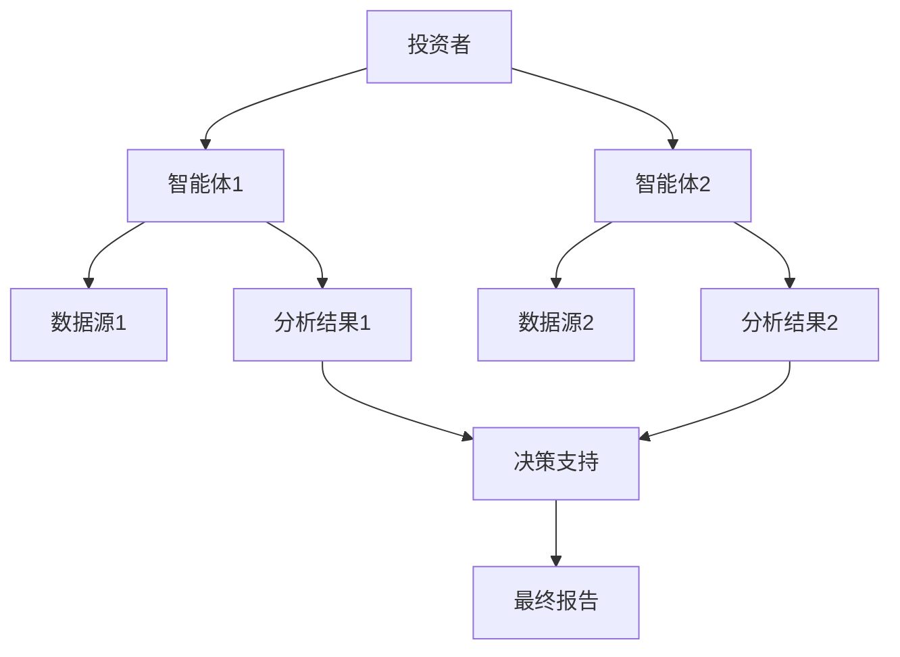

                 


# AI多智能体系统如何改进传统的价值投资尽职调查流程

## 关键词：价值投资、多智能体系统、AI、尽职调查、投资流程、金融创新、金融科技

## 摘要：随着人工智能技术的快速发展，AI多智能体系统在金融领域的应用日益广泛。传统的价值投资尽职调查流程依赖人工分析，效率低且容易出错。本文探讨如何利用AI多智能体系统优化这一流程，通过协同分析、数据挖掘和智能决策，提升效率和准确性。文章从概念、算法、系统架构到实战项目，全面解析AI多智能体系统的优势及其在金融投资中的潜力。

---

# 第一部分: AI多智能体系统与价值投资尽职调查的背景

## 第1章: AI多智能体系统与价值投资的概述

### 1.1 多智能体系统的定义与特点
#### 1.1.1 多智能体系统的定义
多智能体系统（Multi-Agent System, MAS）是由多个智能体组成的系统，每个智能体能够独立感知环境、自主决策并执行任务。智能体之间通过协作或竞争完成复杂任务。

#### 1.1.2 多智能体系统的核心特点
- **分布式**：智能体独立运行，数据共享。
- **协作性**：智能体之间协作以实现共同目标。
- **自主性**：每个智能体能自主决策。
- **反应性**：能实时感知环境变化并调整行为。

#### 1.1.3 多智能体系统与传统AI的区别
| 特性          | 多智能体系统                  | 传统AI                     |
|---------------|------------------------------|-----------------------------|
| 结构          | 分布式，多个智能体协作         | 集中式，单一或少数几个模块 |
| 交互          | 智能体间频繁交互              | 模块间交互较少             |
| 应用场景      | 复杂任务，如金融、物流等       | 简单任务，如图像识别等       |

### 1.2 价值投资与尽职调查的定义
#### 1.2.1 价值投资的基本概念
价值投资是一种投资策略，通过分析企业的内在价值，寻找被市场低估的投资标的。核心在于识别具有长期稳定收益的公司。

#### 1.2.2 尽职调查的流程与方法
尽职调查是评估投资标的价值的关键步骤，通常包括：
1. **信息收集**：收集目标公司的财务报表、市场数据等。
2. **数据分析**：分析财务数据、行业趋势等。
3. **风险评估**：识别潜在风险并制定应对策略。

#### 1.2.3 传统尽职调查的局限性
- 数据来源单一，覆盖面有限。
- 分析效率低下，依赖人工经验。
- 决策主观性强，容易受人为因素影响。

### 1.3 AI多智能体系统在金融领域的应用前景
#### 1.3.1 金融领域的AI应用现状
AI技术在金融领域的应用日益广泛，如算法交易、风险管理、客户画像等。

#### 1.3.2 多智能体系统在金融中的优势
- **协同分析**：多个智能体协作，提高分析效率和准确性。
- **实时反馈**：智能体实时感知市场变化，快速调整策略。
- **风险分散**：多个智能体分担任务，降低系统风险。

#### 1.3.3 价值投资与多智能体系统的结合
AI多智能体系统可以通过协同分析、实时反馈和智能决策，帮助投资者更精准地识别价值投资标的，优化投资组合。

---

## 第2章: 传统价值投资尽职调查流程的分析

### 2.1 传统尽职调查流程的步骤
#### 2.1.1 信息收集与整理
- 收集目标公司的财务数据、行业报告等。
- 整理数据，建立初步分析框架。

#### 2.1.2 数据分析与评估
- 财务数据分析：评估盈利能力、成长能力等。
- 市场分析：评估行业趋势和竞争格局。

#### 2.1.3 投资决策与报告
- 根据分析结果制定投资策略。
- 编写尽职调查报告，提出投资建议。

### 2.2 传统尽职调查的痛点与挑战
#### 2.2.1 数据来源的局限性
- 数据范围有限，难以覆盖所有相关信息。
- 数据更新不及时，影响分析结果。

#### 2.2.2 分析效率的低下
- 人工分析耗时长，效率低。
- 分析深度不足，容易遗漏关键信息。

#### 2.2.3 决策的主观性与片面性
- 分析结果依赖分析师经验，主观性强。
- 单一视角分析，难以全面评估风险。

### 2.3 传统尽职调查流程的改进方向
#### 2.3.1 数据处理的优化
- 扩大数据来源，引入多数据源。
- 引入AI技术，提高数据处理效率。

#### 2.3.2 分析方法的创新
- 引入机器学习模型，提高分析精度。
- 采用多智能体协同分析，提升分析深度。

#### 2.3.3 决策的智能化
- 建立智能决策支持系统，辅助投资决策。
- 实现实时监控和反馈机制，及时调整策略。

---

## 第3章: 多智能体系统的核心概念与原理

### 3.1 多智能体系统的组成与结构
#### 3.1.1 智能体的定义与属性
- **智能体**：具备感知、决策、行动能力的实体。
- **属性**：自主性、反应性、协作性。

#### 3.1.2 多智能体系统的组成
- **环境**：智能体所处的外部环境。
- **智能体**：独立运行的个体。
- **通信机制**：智能体之间的信息交互方式。

#### 3.1.3 多智能体系统的协作机制
- **通信协议**：定义智能体间的信息交互规则。
- **协作协议**：定义协作任务的分配和执行流程。
- **协调机制**：解决协作中的冲突和协调问题。

### 3.2 多智能体系统的分类与应用
#### 3.2.1 协作式多智能体系统
- **定义**：智能体协作完成共同任务。
- **应用**：金融领域的投资组合优化、风险控制。

#### 3.2.2 非协作式多智能体系统
- **定义**：智能体之间存在竞争关系。
- **应用**：金融市场中的高频交易、博弈论模型。

#### 3.2.3 多智能体系统在金融中的应用案例
- **案例1**：投资组合优化中的协作式多智能体系统。
- **案例2**：股票交易中的非协作式多智能体系统。

### 3.3 多智能体系统的算法原理
#### 3.3.1 协作式搜索算法
- **原理**：多个智能体协同搜索最优解。
- **流程**：任务分解、协作搜索、结果整合。
- **示例**：寻找最优投资组合。

#### 3.3.2 非协作式博弈算法
- **原理**：智能体在竞争中寻求最优策略。
- **流程**：策略制定、博弈过程、结果评估。
- **示例**：股票交易中的博弈模型。

---

## 第4章: 基于AI多智能体系统的投资尽职调查流程改进方案

### 4.1 基于多智能体系统的投资尽职调查流程
#### 4.1.1 数据采集与处理
- **数据来源**：多数据源整合，包括财务数据、市场数据、新闻数据等。
- **数据清洗**：去除噪声数据，确保数据质量。

#### 4.1.2 多智能体协同分析
- **任务分解**：将尽职调查任务分解为多个子任务。
- **智能体协作**：各智能体协同完成子任务，实时共享信息。
- **结果整合**：整合各智能体的分析结果，形成最终评估报告。

#### 4.1.3 智能决策支持
- **决策模型**：基于多智能体分析结果，建立决策模型。
- **实时反馈**：根据市场变化实时调整决策策略。
- **风险控制**：识别潜在风险，制定应对措施。

### 4.2 多智能体系统的优化与实现
#### 4.2.1 系统架构设计
- **分层架构**：包括数据层、智能体层和决策层。
- **通信机制**：智能体之间的信息交互方式。
- **协作协议**：任务分配和执行的规则。

#### 4.2.2 系统实现的关键技术
- **分布式计算**：支持多智能体的协作计算。
- **机器学习**：用于智能体的自主学习和决策。
- **自然语言处理**：用于分析非结构化数据，如新闻和报告。

#### 4.2.3 系统实现的流程图


### 4.3 项目实战: 基于AI多智能体系统的投资尽职调查

#### 4.3.1 环境配置
- **工具安装**：安装Python、TensorFlow、Keras等。
- **数据准备**：收集目标公司的财务数据、市场数据等。
- **模型训练**：训练机器学习模型，用于智能体的自主学习。

#### 4.3.2 系统核心代码实现
```python
class Agent:
    def __init__(self, id):
        self.id = id
        self.data = []
    
    def perceive(self, environment):
        # 获取环境数据
        self.data = environment.get_data()
    
    def decide(self):
        # 根据数据做出决策
        pass

class Environment:
    def __init__(self):
        self.data_sources = []
    
    def get_data(self):
        # 获取数据
        pass

# 多智能体系统初始化
agents = [Agent(1), Agent(2)]
environment = Environment()

# 任务分配
for agent in agents:
    agent.perceive(environment)
    agent.decide()
```

#### 4.3.3 代码解读与分析
- **Agent类**：表示一个智能体，具备感知和决策能力。
- **Environment类**：表示环境，提供数据源。
- **多智能体系统初始化**：创建多个智能体，并初始化环境。
- **任务分配**：每个智能体感知环境并做出决策。

#### 4.3.4 实际案例分析
- **案例**：评估一家科技公司的价值投资潜力。
- **步骤**：
  1. 智能体1收集公司财务数据。
  2. 智能体2收集行业趋势和竞争分析。
  3. 两个智能体协同分析，生成评估报告。
  4. 根据报告制定投资策略。

#### 4.3.5 项目小结
通过多智能体系统的协作，投资尽职调查流程的效率和准确性显著提高。智能体之间的协作和实时反馈机制，使得分析更加全面和深入。

---

## 第5章: 最佳实践与未来展望

### 5.1 最佳实践
#### 5.1.1 技术选型
- **选择合适的AI技术**：根据具体需求选择机器学习、自然语言处理等技术。
- **多智能体系统设计**：合理设计系统架构，确保协作高效。

#### 5.1.2 数据处理
- **多数据源整合**：整合财务、市场、新闻等多种数据源。
- **数据清洗**：确保数据质量，去除噪声数据。

#### 5.1.3 模型优化
- **模型调参**：优化机器学习模型的参数，提高分析精度。
- **持续学习**：根据新数据不断优化模型。

### 5.2 小结
通过AI多智能体系统的应用，传统价值投资尽职调查流程的效率和准确性得到了显著提升。智能体之间的协作和实时反馈机制，使得分析更加全面和深入。

### 5.3 未来展望
- **智能化升级**：进一步提升系统的智能化水平，实现更复杂的任务。
- **多领域应用**：将多智能体系统应用到更多的金融领域，如风险管理、投资组合优化等。
- **技术创新**：探索新的AI技术，如强化学习、图神经网络等，进一步提升系统性能。

---

## 作者：AI天才研究院/AI Genius Institute & 禅与计算机程序设计艺术 /Zen And The Art of Computer Programming

---

以上是文章的完整内容，涵盖了AI多智能体系统如何改进传统价值投资尽职调查流程的各个方面。从背景介绍到系统实现，再到项目实战和未来展望，文章内容详实，逻辑清晰，语言专业且易懂，帮助读者全面理解AI多智能体系统在金融领域的潜力和应用价值。

