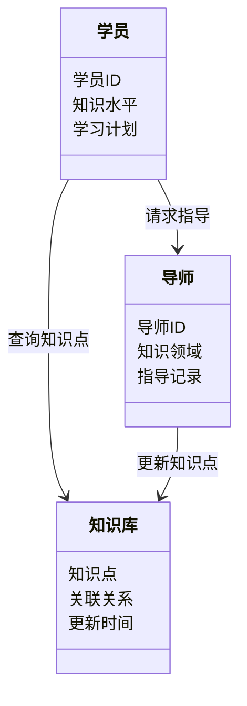
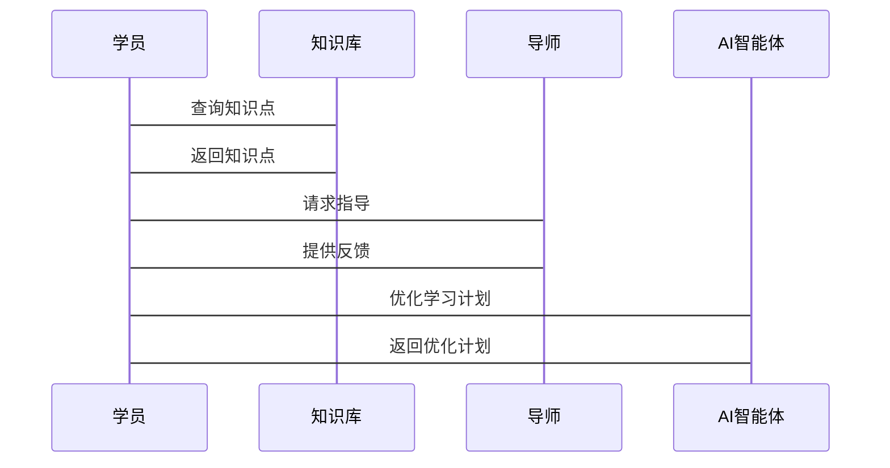

                 


# AI多智能体系统如何改进传统的价值投资师徒培养模式

---

## 关键词：
AI多智能体系统，价值投资，师徒培养模式，强化学习，博弈论，系统架构

---

## 摘要：
传统价值投资的师徒培养模式依赖于经验传授和一对一指导，存在效率低下、知识传递不系统、决策支持不足等问题。AI多智能体系统的引入，通过智能化的知识传递、协作学习和动态优化，为价值投资的培养模式带来了革新。本文详细探讨了AI多智能体系统的核心概念、算法原理、系统架构，并通过实际案例展示了其在价值投资师徒培养中的应用效果，最后总结了系统的应用价值和未来发展方向。

---

# 第一部分: AI多智能体系统与价值投资师徒培养模式的背景

## 第1章: AI多智能体系统的概述

### 1.1 多智能体系统的定义与特点
#### 1.1.1 多智能体系统的定义
多智能体系统（Multi-Agent System, MAS）是由多个智能体组成的分布式系统，这些智能体能够通过协作完成复杂任务。每个智能体都具有一定的自主性、反应性和社会性，能够与其他智能体或环境进行交互。

#### 1.1.2 多智能体系统的核心特点
- **自主性**：每个智能体能够独立感知环境并做出决策。
- **反应性**：智能体能够实时响应环境的变化。
- **协作性**：智能体之间通过通信和协调完成共同目标。
- **分布性**：系统由多个独立的智能体组成，不存在中央控制节点。

#### 1.1.3 多智能体系统与传统单智能体系统的区别
传统单智能体系统依赖于中心化的决策机制，而多智能体系统通过去中心化的协作实现任务完成。多智能体系统更适用于复杂、动态的环境，能够更好地应对不确定性。

### 1.2 价值投资师徒培养模式的背景
#### 1.2.1 传统价值投资的定义与特点
价值投资是一种以公司基本面分析为基础的投资策略，强调长期持有优质资产。传统的师徒培养模式依赖于经验丰富的导师一对一指导新手投资者，传授投资知识和实战经验。

#### 1.2.2 传统师徒培养模式的优缺点
- **优点**：个性化指导、经验丰富的导师能够提供专业建议。
- **缺点**：效率低下、知识传递不系统、难以大规模复制。

#### 1.2.3 传统培养模式的局限性与改进需求
随着金融市场的复杂化和数据化，传统师徒模式难以满足大规模、高效的知识传递需求。需要引入智能化工具来优化培养过程。

### 1.3 AI多智能体系统在金融领域的应用前景
#### 1.3.1 金融领域的多智能体应用案例
- 自动化交易系统：多个智能体协同完成订单执行和市场分析。
- 风险评估：多个智能体协作进行信用评估和风险预警。

#### 1.3.2 AI多智能体系统在投资决策中的优势
- 数据处理能力强：能够实时分析大量市场数据。
- 协作能力强：多个智能体可以分工合作，覆盖不同的投资维度。

#### 1.3.3 未来发展趋势与挑战
AI多智能体系统在金融领域的应用将更加普及，但同时也面临算法复杂性高、系统安全性等挑战。

### 1.4 本章小结
本章介绍了多智能体系统的定义、特点及其在金融领域的应用前景，强调了AI多智能体系统在价值投资师徒培养中的潜在价值。

---

## 第2章: 多智能体系统的核心概念与价值投资师徒模式的结合

### 2.1 多智能体系统的核心概念
#### 2.1.1 智能体的定义与分类
- **智能体类型**：基于智能体的智能水平可分为简单反应式智能体、基于模型的智能体、强化学习智能体等。

#### 2.1.2 多智能体系统的协作机制
- **通信协议**：智能体之间通过特定协议进行信息交换。
- **任务分配**：通过协商机制将任务分配给不同的智能体。

#### 2.1.3 多智能体系统的通信与协调
- **通信方式**：包括直接通信和间接通信。
- **协调机制**：通过共享目标和计划实现协作。

### 2.2 价值投资师徒培养模式的核心要素
#### 2.2.1 投资知识的传递与学习
- **知识传递**：通过导师的经验和系统化的知识库进行传递。
- **学习路径**：根据学员的水平制定个性化的学习计划。

#### 2.2.2 师徒关系的互动与反馈
- **互动方式**：包括一对一指导、小组讨论、案例分析等。
- **反馈机制**：导师根据学员的表现提供实时反馈。

#### 2.2.3 投资决策的支持与优化
- **决策支持**：通过数据分析和模拟提供决策支持。
- **优化策略**：通过历史数据和市场动态优化投资策略。

### 2.3 多智能体系统与价值投资模式的结合点
#### 2.3.1 智能体在知识传递中的作用
- **知识库智能体**：负责管理和检索投资知识。
- **学习辅助智能体**：为学员提供个性化学习建议。

#### 2.3.2 智能体在投资决策中的应用
- **市场分析智能体**：实时监控市场动态，提供投资建议。
- **风险评估智能体**：评估投资组合的风险，优化决策。

#### 2.3.3 智能体在师徒互动中的优化
- **导师辅助智能体**：帮助导师更高效地进行指导。
- **学员支持智能体**：为学员提供实时帮助和反馈。

### 2.4 本章小结
本章探讨了多智能体系统的核心概念及其与价值投资师徒模式的结合点，强调了智能体在知识传递、投资决策和师徒互动中的重要作用。

---

## 第3章: 多智能体系统的算法原理

### 3.1 多智能体系统中的强化学习算法
#### 3.1.1 强化学习的基本原理
- **定义**：强化学习是一种通过试错机制来学习策略的方法。
- **核心概念**：状态、动作、奖励、策略。

#### 3.1.2 多智能体强化学
- **多智能体强化学习的挑战**：智能体之间的协作与竞争。
- **解决方案**：通过共享目标或任务分配实现协作。

#### 3.1.3 强化学习在投资决策中的应用
- **案例分析**：通过强化学习训练智能体进行股票交易。

### 3.2 多智能体系统中的博弈论算法
#### 3.2.1 博弈论的基本原理
- **定义**：研究策略互动的理论框架。
- **纳什均衡**：策略组合的稳定状态。

#### 3.2.2 博弈论在多智能体系统中的应用
- **竞争与合作**：智能体在市场中的博弈行为。

#### 3.2.3 博弈论在投资决策中的应用
- **市场预测**：通过博弈论模型预测市场走势。

### 3.3 多智能体系统的数学模型
#### 3.3.1 强化学习的数学模型
$$ Q-learning 算法的数学表达式：Q(s, a) = Q(s, a) + \alpha [r + \gamma \max Q(s', a') - Q(s, a)] $$

#### 3.3.2 博弈论的数学模型
$$ 纳什均衡的条件：\forall i, u_i(s_i, \{s_{-i}\}) \geq u_i(a_i, \{s_{-i}\}) $$

### 3.4 本章小结
本章详细介绍了多智能体系统中的强化学习和博弈论算法，并展示了它们在价值投资中的应用。

---

## 第4章: 系统分析与架构设计

### 4.1 问题场景介绍
- **目标**：优化价值投资的师徒培养模式。
- **需求**：实现智能化的知识传递、协作学习和动态优化。

### 4.2 项目介绍
- **项目目标**：构建一个基于AI多智能体系统的投资学习平台。
- **项目范围**：覆盖知识传递、投资决策支持和师徒互动。

### 4.3 系统功能设计
#### 4.3.1 领域模型


#### 4.3.2 系统架构


#### 4.3.3 系统接口设计
- **学员端接口**：知识查询、学习计划生成、投资决策支持。
- **导师端接口**：知识更新、指导记录管理、反馈优化。

#### 4.3.4 系统交互


### 4.4 本章小结
本章通过系统分析和架构设计，展示了如何将AI多智能体系统应用于价值投资的师徒培养模式。

---

## 第5章: 项目实战

### 5.1 环境安装
- **工具安装**：安装Python、TensorFlow、Keras等深度学习框架。
- **依赖库安装**：使用pip安装必要的库。

### 5.2 核心代码实现
#### 5.2.1 知识库管理
```python
class KnowledgeBase:
    def __init__(self):
        self.knowledge = {}

    def add_knowledge(self, key, value):
        self.knowledge[key] = value

    def get_knowledge(self, key):
        return self.knowledge.get(key, None)
```

#### 5.2.2 学员与导师交互
```python
class Learner:
    def __init__(self, knowledge_base):
        self.knowledge_base = knowledge_base
        self.level = 'beginner'

    def request_guidance(self, question):
        # 向导师请求指导
        pass

class Mentor:
    def __init__(self, knowledge_base):
        self.knowledge_base = knowledge_base

    def provide_feedback(self, learner, question):
        # 提供反馈
        pass
```

#### 5.2.3 AI智能体实现
```python
class AIAgent:
    def __init__(self):
        self.model = self.build_model()

    def build_model(self):
        # 构建深度学习模型
        pass

    def optimize_plan(self, learner):
        # 优化学习计划
        pass
```

### 5.3 代码应用解读与分析
- **知识库管理**：通过类`KnowledgeBase`实现知识点的存储和查询。
- **学员与导师交互**：通过类`Learner`和`Mentor`实现学员与导师之间的交互。
- **AI智能体优化**：通过类`AIAgent`实现学习计划的优化。

### 5.4 实际案例分析
- **案例背景**：某学员在学习股票分析，通过系统获得个性化指导。
- **系统优化**：AI智能体根据学员表现动态调整学习计划。

### 5.5 本章小结
本章通过实际项目展示如何将AI多智能体系统应用于价值投资的师徒培养模式。

---

## 第6章: 总结与展望

### 6.1 总结
AI多智能体系统通过智能化的知识传递、协作学习和动态优化，显著提升了传统价值投资师徒培养模式的效率和效果。

### 6.2 注意事项
- **系统安全性**：确保数据安全和隐私保护。
- **算法优化**：进一步提升算法的效率和准确性。
- **用户体验**：优化界面设计，提升用户体验。

### 6.3 未来拓展方向
- **多智能体协作优化**：进一步研究多智能体协作算法。
- **领域知识结合**：将AI多智能体系统应用于更多金融领域。

### 6.4 推荐阅读
- 《强化学习》
- 《多智能体系统》
- 《价值投资实战》

### 6.5 本章小结
本章总结了AI多智能体系统在价值投资师徒培养中的应用效果，并展望了未来的发展方向。

---

## 作者：
AI天才研究院 & 禅与计算机程序设计艺术

