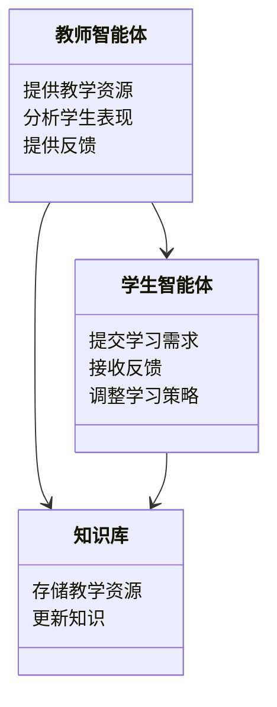

                 


# AI多智能体系统如何改进传统的价值投资师资培养模式

> **关键词**：AI多智能体系统、价值投资、师资培养、教育技术、协作学习  
> 
> **摘要**：本文探讨如何利用AI多智能体系统改进传统的价值投资师资培养模式。通过分析传统模式的局限性，结合AI多智能体系统的协作学习机制，提出了一种新的教育解决方案，旨在提升教学效率和学习效果。本文详细介绍了系统的原理、架构设计及实现方法，并通过实际案例展示了系统的应用效果。

---

## 第1章: AI多智能体系统的定义与核心概念

### 1.1 多智能体系统的定义与特点
#### 1.1.1 多智能体系统的定义
多智能体系统（Multi-Agent System, MAS）是由多个智能体（Agent）组成的复杂系统，这些智能体能够通过协作和通信完成特定任务。与传统的单一智能体系统不同，MAS强调分布式智能和协作性。

#### 1.1.2 多智能体系统的五大核心特点
1. **分布式性**：多个智能体协同工作，而非单一中心控制。
2. **协作性**：智能体之间通过协作完成共同目标。
3. **自主性**：每个智能体都能自主决策。
4. **反应性**：能够实时感知环境并做出响应。
5. **适应性**：能够根据环境变化调整策略。

#### 1.1.3 多智能体系统与传统AI的区别
传统的AI系统通常基于规则或预定义的逻辑进行推理，而多智能体系统通过多个智能体的协作实现复杂任务，具有更强的适应性和灵活性。

### 1.2 价值投资师资培养模式的现状与问题
#### 1.2.1 传统价值投资师资培养模式的定义
传统价值投资师资培养模式通常依赖于导师制、案例分析和课堂讲授，强调知识的单向传递。

#### 1.2.2 传统模式中的主要问题
1. **教学资源分散**：缺乏系统化的教学资源和工具。
2. **互动性不足**：学生与教师之间的互动有限，难以实现个性化的学习体验。
3. **评估方式单一**：主要依赖考试和作业，难以全面评估学生的实际能力。

#### 1.2.3 问题的边界与外延
本文主要关注价值投资领域的人才培养模式，不涉及其他领域的教学模式改进。

---

## 第2章: AI多智能体系统在教育领域的潜力

### 2.1 教育领域的AI多智能体系统应用现状
#### 2.1.1 当前主要应用场景
1. **智能辅导系统**：通过多智能体协作提供个性化的学习建议。
2. **虚拟教室**：支持师生和生生之间的实时协作与交流。
3. **知识图谱构建**：利用多智能体系统构建领域知识图谱，辅助教学。

#### 2.1.2 系统在教育中的优势
1. **个性化学习**：通过协作学习算法，系统能够根据学生特点提供个性化的学习路径。
2. **高效资源分配**：多智能体系统能够优化教学资源的分配，提升教学效率。
3. **实时反馈**：系统能够实时监测学生的学习状态并提供反馈。

#### 2.1.3 系统在教育中的挑战
1. **技术复杂性**：多智能体系统的实现需要较高的技术门槛。
2. **数据隐私**：学生数据的隐私保护是一个重要问题。
3. **系统稳定性**：多智能体系统的复杂性可能导致系统不稳定。

### 2.2 多智能体系统如何改进传统价值投资师资培养模式
#### 2.2.1 系统的核心目标
通过多智能体系统的协作学习机制，提升价值投资师资培养的效率和效果。

#### 2.2.2 系统的核心要素组成
1. **智能体设计**：设计符合教育需求的智能体。
2. **协作机制**：建立智能体之间的协作规则和通信协议。
3. **学习算法**：采用高效的协作学习算法，如Q-learning。

#### 2.2.3 系统的结构与功能
1. **输入模块**：接收学生的学习需求和反馈。
2. **协作模块**：智能体之间协作完成任务。
3. **输出模块**：根据协作结果输出个性化学习建议。

---

## 第3章: 多智能体系统的原理与机制

### 3.1 多智能体系统的核心原理
#### 3.1.1 多智能体系统的协作机制
协作机制是多智能体系统的核心，通过定义智能体之间的协作规则，确保系统能够高效完成任务。

#### 3.1.2 基于Q-learning的多智能体协作学习
Q-learning是一种常用的强化学习算法，通过智能体与环境的交互，逐步优化策略。

#### 3.1.3 系统的数学模型与公式
协作学习的数学模型如下：
$$ Q(s, a) = Q(s, a) + \alpha [r + \max_{a'} Q(s', a') - Q(s, a)] $$
其中，$s$ 是状态，$a$ 是动作，$r$ 是奖励，$\alpha$ 是学习率。

---

## 第4章: 价值投资师资培养模式的系统分析

### 4.1 问题场景介绍
#### 4.1.1 传统师资培养模式的不足
传统模式中，教师与学生之间的互动有限，难以满足个性化学习的需求。

#### 4.1.2 系统的目标与需求
系统的目标是通过多智能体协作，提供个性化的学习支持，提升教学效果。

### 4.2 系统功能设计
#### 4.2.1 领域模型设计（Mermaid类图）


#### 4.2.2 系统架构设计（Mermaid架构图）
```mermaid
archiecture
    客户端 <---> 服务端
    服务端 --> 数据库
    服务端 --> 智能体管理模块
```

---

## 第5章: AI多智能体系统的实现

### 5.1 环境安装与配置
#### 5.1.1 开发环境的选择
推荐使用Python和相关AI框架（如TensorFlow）进行开发。

#### 5.1.2 必要工具的安装
安装Python、TensorFlow、Keras等工具。

### 5.2 系统核心实现
#### 5.2.1 系统核心代码实现
```python
def q_learning(state, action):
    reward = evaluate(state, action)
    next_state = transition(state, action)
    max_q_next = max(q[next_state])
    q_current = q[state][action]
    q[state][action] = q_current + α * (reward + max_q_next - q_current)
```

#### 5.2.2 代码的功能解读与分析
上述代码实现了一个简单的Q-learning算法，用于更新智能体的策略。

### 5.3 项目案例分析
#### 5.3.1 实际案例
通过一个价值投资案例，展示系统如何协作学习并提供个性化建议。

---

## 第6章: 总结与展望

### 6.1 系统的优势与挑战
系统的优势包括个性化学习和高效资源分配，但技术复杂性和数据隐私是主要挑战。

### 6.2 未来的发展方向
未来可以进一步优化协作学习算法，并扩展系统的应用场景。

---

**作者**：AI天才研究院（AI Genius Institute） & 禅与计算机程序设计艺术（Zen And The Art of Computer Programming）

