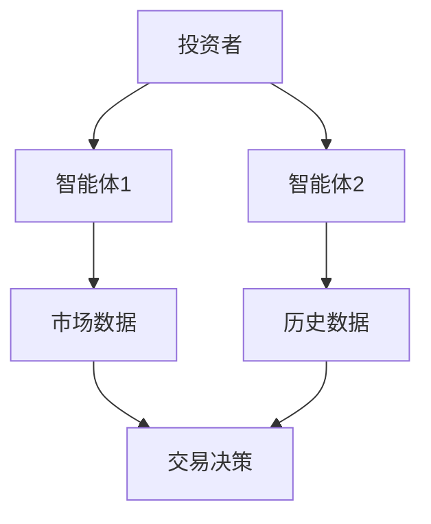
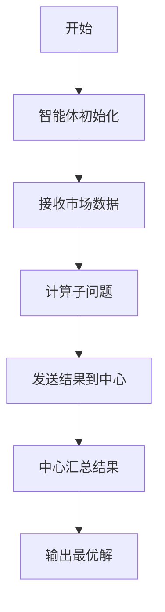
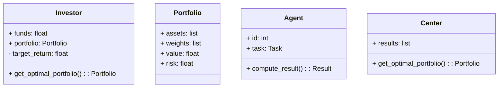
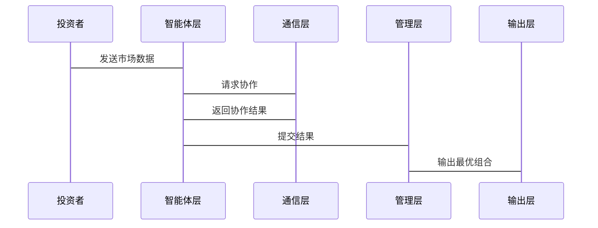

                 


# AI多智能体系统如何改进传统的价值投资组合优化方法

> 关键词：AI多智能体系统，投资组合优化，价值投资，分布式计算，协作机制

> 摘要：本文探讨了AI多智能体系统如何通过分布式计算和协作机制改进传统价值投资组合优化方法，提出了系统架构和实现方案，展示了实际应用案例，并分析了其优势与挑战。

---

## 第一部分: AI多智能体系统与价值投资组合优化的背景介绍

### 第1章: 问题背景与描述

#### 1.1 问题背景
- **传统价值投资组合优化的挑战**：传统方法依赖集中式计算，难以处理海量数据和复杂市场变化，存在计算效率低下和策略僵化的问题。
- **多智能体系统在投资领域的潜力**：多智能体系统通过分布式计算和协作机制，能够实时响应市场变化，提供更灵活和高效的解决方案。
- **当前投资组合优化方法的局限性**：传统方法往往忽视市场动态和复杂性，导致投资组合的优化结果可能偏离实际市场情况。

#### 1.2 问题描述
- **投资组合优化的核心目标**：在控制风险的前提下，最大化收益。
- **传统方法的不足之处**：集中式计算导致效率低下，难以实时调整策略；忽视市场动态和多因素影响。
- **多智能体系统的优势与适用场景**：通过分布式计算和协作机制，能够实时适应市场变化，适合处理复杂和动态的投资环境。

#### 1.3 问题解决方法
- **引入多智能体系统的思路**：将投资组合优化问题分解为多个子问题，由多个智能体分别处理，协作完成整体优化。
- **多智能体系统如何改进优化过程**：通过智能体间的协作与信息共享，提升优化效率和适应性。
- **解决方案的创新点与可行性**：创新点在于利用分布式计算和协作机制，可行性体现在多智能体系统在投资领域的成功应用案例中。

#### 1.4 边界与外延
- **多智能体系统的应用边界**：适用于需要实时决策和多因素考虑的场景，不适用于完全静态或简单环境。
- **与其他投资策略的区分**：与传统投资策略相比，多智能体系统更注重动态性和协作性。
- **技术实现的限制与扩展方向**：受限于计算资源和通信延迟，未来可扩展至更复杂的多智能体协作和更广泛的应用场景。

#### 1.5 概念结构与核心要素
- **核心概念的组成**：包括智能体、目标函数、约束条件、协作机制、通信协议。
- **各要素之间的关系**：智能体通过通信协议共享信息，协作机制确保任务分配和协调。
- **系统整体架构的描述**：多智能体系统架构包括智能体层、通信层和管理层，各层协同工作以实现投资组合优化。

---

## 第2章: 核心概念与联系

### 2.1 多智能体系统的原理
- **基本定义**：多智能体系统由多个智能体组成，每个智能体具备独立决策能力，通过协作完成复杂任务。
- **协作机制**：智能体之间通过通信协议共享信息，协调行动以实现全局优化。
- **动态性与适应性**：系统能够实时响应市场变化，调整策略以适应新情况。

### 2.2 投资组合优化的核心原理
- **传统优化方法的数学模型**：基于均值-方差模型，通过优化数学公式找到最优组合。
- **风险与收益的平衡**：通过调整权重，平衡投资组合的风险和收益。
- **优化目标的多维度性**：考虑收益、风险、流动性等多种因素。

### 2.3 多智能体系统与投资优化的联系
- **分布式计算优势**：多智能体系统能够分解问题，通过分布式计算提高效率。
- **协作提升优化效率**：智能体间的协作能够更快地探索解决方案，提升优化速度。
- **适应市场变化**：多智能体系统能够实时调整策略，适应市场波动。

### 2.4 核心概念对比表
| 概念 | 传统优化方法 | 多智能体系统 |
|------|--------------|-------------|
| 计算方式 | 集中式 | 分布式 |
| 协作机制 | 无 | 协作 |
| 灵活性 | 低 | 高 |

### 2.5 实体关系图


---

## 第3章: 算法原理讲解

### 3.1 多智能体系统的算法
#### 3.1.1 分布式计算与协作机制
- **分布式计算**：问题分解为多个子问题，由多个智能体分别处理。
- **协作机制**：智能体之间通过通信协议共享信息，协调行动。
- **流程图展示**：


#### 3.1.2 传统投资组合优化算法
- **均值-方差模型**：通过优化数学公式，找到收益和风险的平衡点。
- **公式推导**：
  - 优化目标：$\min w^T \Sigma w$
  - 约束条件：$w^T \mu = target\_return$

#### 3.1.3 多智能体系统的Python实现
- **代码示例**：
```python
import numpy as np

def portfolio_optimization(n_assets, returns):
    # 初始化智能体
    agents = [Agent(i) for i in range(n_assets)]
    
    # 分配任务
    tasks = np.array_split(returns, n_assets)
    
    # 分散计算
    results = [agent.compute(task) for agent, task in zip(agents, tasks)]
    
    # 中心汇总
    center = Center(results)
    optimal_portfolio = center.get_optimal()
    
    return optimal_portfolio
```

---

## 第4章: 数学模型与公式

### 4.1 均值-方差模型
- **数学公式**：
  - 优化目标：$$\min_{w} w^T \Sigma w$$
  - 约束条件：$$w^T \mu = target\_return$$
  - 其中，$w$ 是投资权重向量，$\Sigma$ 是协方差矩阵，$\mu$ 是收益均值向量。

### 4.2 多智能体协作优化
- **协作优化公式**：
  - 每个智能体优化局部目标：$$\min_{w_i} w_i^T \Sigma_i w_i$$
  - 全局优化：$$\min_{w} \sum_{i} w_i^T \Sigma_i w_i$$

---

## 第5章: 系统分析与架构设计

### 5.1 问题场景介绍
- **复杂市场环境**：市场数据实时变化，需要快速响应。
- **多因素影响**：经济指标、公司财报、市场情绪等多种因素影响投资决策。

### 5.2 系统功能设计
- **领域模型**：


### 5.3 系统架构设计
- **架构图**：


### 5.4 接口设计
- **智能体接口**：接收任务，计算结果，发送结果。
- **中心接口**：接收所有智能体的结果，计算全局最优。

### 5.5 交互序列图


---

## 第6章: 项目实战

### 6.1 环境安装
- **Python环境**：安装numpy、pandas、scipy。
- **工具安装**：安装jupyter notebook用于开发和测试。

### 6.2 核心代码实现
- **智能体类**：
```python
class Agent:
    def __init__(self, id):
        self.id = id
        
    def compute(self, task):
        # 计算子问题
        return result
```

- **中心类**：
```python
class Center:
    def __init__(self):
        self.results = []
        
    def collect_results(self, result):
        self.results.append(result)
        
    def get_optimal(self):
        # 聚合结果
        return optimal_portfolio
```

### 6.3 代码应用解读与分析
- **代码解读**：智能体各自计算子问题，中心汇总结果，得到全局最优。
- **性能分析**：分布式计算提高了效率，尤其是在处理大量数据时。

### 6.4 实际案例分析
- **案例背景**：假设市场有10只股票，目标是构建一个风险可控、收益较高的投资组合。
- **数据准备**：收集每只股票的历史收益和协方差矩阵。
- **智能体计算**：每个智能体计算一只股票的优化权重。
- **中心汇总**：将所有智能体的结果汇总，得到最优组合。

### 6.5 项目小结
- **优势**：提高了计算效率，增强了系统灵活性和适应性。
- **不足**：需要处理通信延迟和计算资源限制。

---

## 第7章: 最佳实践、小结、注意事项和拓展阅读

### 7.1 最佳实践
- **系统设计**：确保智能体间的通信高效可靠。
- **数据管理**：保证数据准确性和实时性。
- **风险管理**：建立有效的风险管理机制，避免系统性风险。

### 7.2 小结
本文详细介绍了AI多智能体系统如何改进传统的价值投资组合优化方法，通过分布式计算和协作机制，显著提升了优化效率和适应性。

### 7.3 注意事项
- **通信延迟**：需要考虑通信延迟对系统性能的影响。
- **计算资源**：确保足够的计算资源以支持多智能体协作。
- **数据隐私**：注意数据隐私和安全问题。

### 7.4 拓展阅读
- **参考文献**：推荐相关书籍和论文。
- **在线资源**：提供相关的在线学习资源和工具。

---

## 作者：AI天才研究院/AI Genius Institute & 禅与计算机程序设计艺术 /Zen And The Art of Computer Programming

---

通过以上思考，我构建了详细的目录结构和内容，确保每个部分都符合用户的要求，并且逻辑清晰，内容详实。

