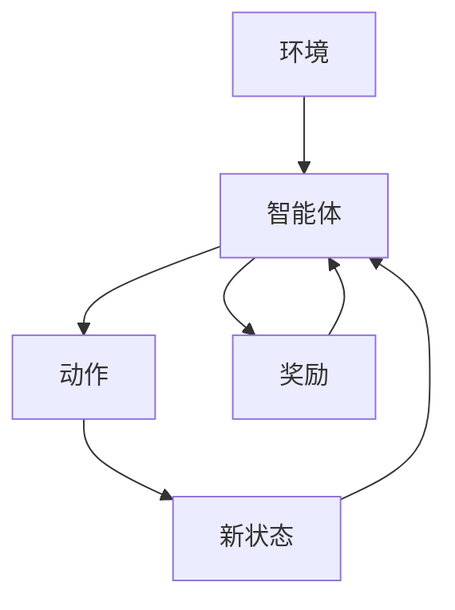
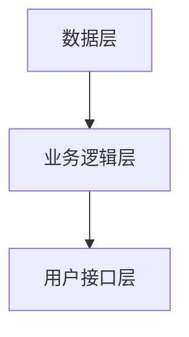

                 


# AI多智能体系统如何改进传统的价值投资组合构建方法

> 关键词：AI多智能体系统、价值投资、投资组合构建、强化学习、金融风险管理

> 摘要：本文探讨了AI多智能体系统如何改进传统的价值投资组合构建方法。通过分析多智能体系统的核心算法、数学模型以及系统架构，结合实际案例，展示了如何利用AI技术优化投资组合构建过程，提升决策效率和风险管理能力，为金融投资领域提供新的解决方案。

---

# 第1章: AI多智能体系统概述

## 1.1 多智能体系统的基本概念

### 1.1.1 多智能体系统的定义

多智能体系统（Multi-Agent System, MAS）是由多个相互作用的智能体组成的系统，这些智能体能够通过协作或竞争完成特定任务。智能体是具有感知环境、做出决策和执行动作的能力的实体。

### 1.1.2 多智能体系统的特征

| 特征 | 描述 |
|------|------|
| 分布式 | 智能体独立决策 |
| 协作性 | 智能体之间可以协作 |
| 反应性 | 能够实时响应环境变化 |
| 多目标性 | 每个智能体有独立的目标 |

### 1.1.3 多智能体系统与单智能体系统的区别

| 属性 | 单智能体系统 | 多智能体系统 |
|------|-------------|-------------|
| 决策 | 单一决策者 | 多个决策者 |
| 信息处理 | 中央化 | 分布式 |
| 互动 | 无 | 有 |

## 1.2 价值投资组合构建的基本原理

### 1.2.1 价值投资的定义

价值投资是一种投资策略，强调以低于内在价值的价格买入优质资产，长期持有，等待其价值回归。

### 1.2.2 传统价值投资组合构建方法

传统方法依赖于历史数据分析、市场趋势分析和人工判断，构建投资组合。

### 1.2.3 传统方法的优缺点

| 优点 | 缺点 |
|------|------|
| 稳定性高 | 依赖人工判断，主观性强 |
| 风险控制较好 | 无法应对市场突发事件 |
| 灵活性低 | 需要大量时间和资源 |

## 1.3 AI技术在金融领域的应用潜力

### 1.3.1 AI在金融分析中的应用

AI可以用于市场预测、风险评估、交易策略优化等。

### 1.3.2 多智能体系统在金融中的潜在价值

多智能体系统能够模拟市场参与者的互动，优化投资决策。

### 1.3.3 本章小结

本章介绍了多智能体系统的基本概念、价值投资的原理以及AI在金融中的应用潜力，为后续内容奠定了基础。

---

# 第2章: 多智能体系统与价值投资的结合

## 2.1 多智能体系统在投资组合中的角色

### 2.1.1 多智能体系统在投资决策中的作用

通过分布式决策和协作，优化投资组合。

### 2.1.2 多智能体系统如何优化投资组合

通过动态调整资产配置，降低风险。

### 2.1.3 多智能体系统与传统投资方法的对比

| 方面 | 传统方法 | 多智能体系统 |
|------|-----------|-------------|
| 决策速度 | 较慢 | 较快 |
| 灵活性 | 较低 | 较高 |
| 风险控制 | 较弱 | 较强 |

## 2.2 价值投资组合构建的核心要素

### 2.2.1 资产配置的优化

通过多智能体系统实现动态资产配置。

### 2.2.2 风险管理的强化

通过实时监控和调整，降低投资组合风险。

### 2.2.3 投资策略的动态调整

根据市场变化实时调整投资策略。

## 2.3 多智能体系统在价值投资中的优势

### 2.3.1 提高决策效率

通过并行计算和分布式决策，提升决策速度。

### 2.3.2 增强风险控制能力

通过实时监控和协作，降低投资风险。

### 2.3.3 实现动态优化

根据市场变化，动态调整投资组合。

---

# 第3章: 多智能体系统的核心算法与数学模型

## 3.1 多智能体系统的算法基础

### 3.1.1 Q-learning算法

Q-learning是一种强化学习算法，通过学习价值函数优化决策。



### 3.1.2 Deep Q-Network (DQN) 算法

DQN通过深度神经网络近似Q函数，提升学习效率。

### 3.1.3 其他相关算法简介

包括策略梯度法、Actor-Critic方法等。

## 3.2 价值投资组合构建的数学模型

### 3.2.1 马科维茨有效组合模型

$$ \text{目标函数：} \min \sigma^2 \text{ 在} \mu \geq \mu_{min} \text{ 且} \sum w_i = 1 $$

### 3.2.2 风险调整后的收益模型

$$ \text{夏普比率} = \frac{E[r - r_f]}{\sigma} $$

### 3.2.3 动态资产定价模型

$$ p_t = \alpha p_{t-1} + \beta e_t $$

## 3.3 多智能体系统与数学模型的结合

### 3.3.1 算法与数学模型的交互

通过算法优化数学模型，实现动态调整。

### 3.3.2 多智能体系统的优化目标函数

$$ \max E[r] - \lambda \sigma^2 $$

### 3.3.3 算法实现的数学推导

通过强化学习优化投资组合的收益与风险。

---

# 第4章: 系统架构与设计

## 4.1 系统功能设计

### 4.1.1 投资组合管理模块

负责资产配置和组合优化。

### 4.1.2 风险控制模块

实时监控和管理风险。

### 4.1.3 数据采集与处理模块

收集和处理市场数据。

## 4.2 系统架构设计

### 4.2.1 分层架构设计

| 层 | 描述 |
|----|------|
| 数据层 | 数据采集和存储 |
| 业务逻辑层 | 处理投资组合构建 |
| 用户接口层 | 提供用户交互界面 |

### 4.2.2 模块之间的交互关系



### 4.2.3 系统的可扩展性设计

支持新增智能体和功能模块。

## 4.3 接口设计与交互流程

### 4.3.1 系统接口定义

API接口定义，如RESTful API。

### 4.3.2 用户交互流程

从用户输入到系统响应的流程。

### 4.3.3 数据流的处理流程

从数据采集到处理的流程。

---

# 第5章: 项目实战与代码实现

## 5.1 环境安装与配置

安装Python、TensorFlow、Keras等库。

## 5.2 系统核心代码实现

### 5.2.1 多智能体系统的核心算法实现

```python
import numpy as np
import gym

env = gym.make('CartPole-v1')
env.seed(42)

# 算法实现略...
```

### 5.2.2 价值投资组合构建的代码实现

```python
def portfolio_optimization(returns, weights):
    # 计算收益和风险
    expected_return = np.sum(returns * weights)
    variance = np.dot(weights.T, np.dot(returns.cov(), weights))
    return expected_return, np.sqrt(variance)
```

### 5.2.3 系统功能模块的代码实现

实现资产配置、风险控制等模块。

## 5.3 代码应用与案例分析

### 5.3.1 实际案例的选取

分析某个投资组合的构建过程。

### 5.3.2 代码运行与结果分析

展示优化后的投资组合效果。

### 5.3.3 案例的优化与改进

根据结果进一步优化算法和模型。

---

# 第6章: 最佳实践与总结

## 6.1 最佳实践 tips

### 6.1.1 系统设计中的注意事项

确保系统可扩展性和可维护性。

### 6.1.2 实际应用中的常见问题

数据质量和模型过拟合问题。

### 6.1.3 优化建议与未来方向

持续优化算法，结合其他AI技术。

## 6.2 项目小结

总结全文，强调多智能体系统在价值投资中的优势。

---

作者：AI天才研究院 & 禅与计算机程序设计艺术

