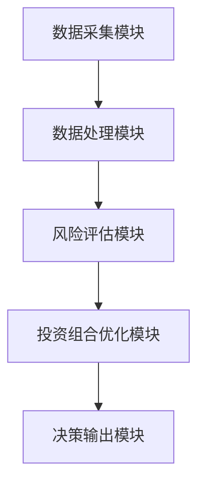
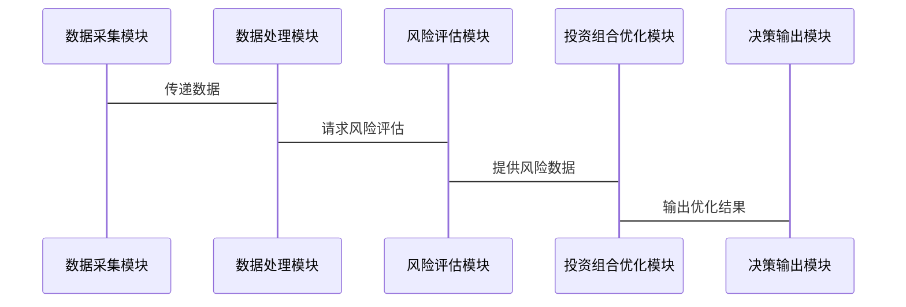

                 


# AI多智能体系统如何改进传统的价值投资风险管理方法

---

## 关键词  
AI多智能体系统, 价值投资风险管理, 风险评估模型, 协同决策, 投资组合优化

---

## 摘要  
本文探讨了如何利用AI多智能体系统改进传统的价值投资风险管理方法。传统价值投资风险管理方法在面对复杂市场环境时存在诸多局限性，而AI多智能体系统的引入为风险管理带来了新的可能性。本文从背景介绍、核心概念、算法原理、系统架构到实际案例分析，详细阐述了AI多智能体系统在价值投资风险管理中的应用，展示了其在风险识别、评估、预警和优化方面的能力。通过本文的分析，读者可以理解AI多智能体系统如何在投资风险管理中实现更高效、更精准的决策。

---

## 第一部分: 价值投资风险管理的背景与挑战

### 第1章: 价值投资风险管理的背景与挑战

#### 1.1 传统价值投资风险管理的核心要素  
传统价值投资风险管理主要依赖于以下核心要素：  
1. **资产配置**：通过分散投资降低风险。  
2. **风险评估**：基于历史数据和统计模型进行风险预测。  
3. **市场监控**：实时跟踪市场波动，及时调整投资策略。  
4. **决策制定**：基于经验和模型生成投资决策。  

#### 1.2 传统风险管理方法的局限性  
传统风险管理方法在面对现代金融市场时存在以下问题：  
- **信息处理能力有限**：传统方法难以处理海量非结构化数据。  
- **决策滞后性**：依赖人工分析，难以实时响应市场变化。  
- **模型单一性**：传统模型难以捕捉复杂的市场动态。  
- **缺乏协同性**：各风险因素之间缺乏有效的协同分析。  

#### 1.3 数字化与智能化对风险管理的新要求  
随着金融市场的复杂化，对风险管理提出的新要求包括：  
- **实时性**：快速响应市场变化。  
- **智能化**：利用AI技术提升决策效率。  
- **协同性**：多维度、多因素的协同分析。  
- **可扩展性**：能够处理大规模数据和复杂场景。  

---

## 第二部分: AI多智能体系统的原理与应用

### 第2章: AI多智能体系统的核心概念与原理

#### 2.1 AI多智能体系统的定义与特点  
AI多智能体系统是指由多个智能体组成的协作系统，每个智能体具有以下特点：  
- **自主性**：能够独立感知环境并做出决策。  
- **反应性**：能够实时响应环境变化。  
- **协作性**：通过协同完成复杂任务。  
- **分布式智能**：智能体之间通过信息共享实现整体目标。  

#### 2.2 多智能体系统在价值投资风险管理中的优势  
AI多智能体系统在价值投资风险管理中的优势体现在以下几个方面：  
- **实时性**：多个智能体实时监控市场数据，快速响应风险。  
- **协同性**：多个智能体协同分析市场、财务、舆情等多维度数据，提供全面的风险评估。  
- **自我优化**：智能体能够通过反馈机制不断优化自身的决策模型。  
- **可扩展性**：系统能够根据需要扩展智能体数量，适应复杂场景。  

---

### 第3章: AI多智能体系统在价值投资风险管理中的算法原理

#### 3.1 多智能体系统协同决策的数学模型  
多智能体系统协同决策的核心是通过分布式计算实现全局最优。以下是协同决策的数学模型：  
$$ \text{全局目标} = \sum_{i=1}^{n} \text{智能体目标}_i $$  
其中，每个智能体目标通过局部信息进行优化，最终通过协同实现全局最优。  

#### 3.2 基于多智能体系统的风险评估模型  
风险评估模型可以分解为多个智能体的任务，例如：  
- 智能体A负责分析市场波动。  
- 智能体B负责分析财务数据。  
- 智能体C负责分析舆情信息。  

通过协同，系统能够生成全面的风险评估报告。  

#### 3.3 多智能体系统在投资组合优化中的应用  
投资组合优化可以通过多智能体系统实现，以下是具体步骤：  
1. 智能体1分析市场风险，生成风险评估指标。  
2. 智能体2分析资产收益，生成收益预测模型。  
3. 智能体3优化投资组合，平衡风险与收益。  

---

## 第三部分: 系统分析与架构设计

### 第4章: 价值投资风险管理系统的架构设计

#### 4.1 问题场景介绍  
假设我们有一个价值投资管理系统，需要实时监控多个资产的风险，优化投资组合。  

#### 4.2 系统功能设计  
- **数据采集模块**：实时采集市场数据、财务数据、舆情数据。  
- **风险评估模块**：通过多智能体系统分析数据，生成风险评估报告。  
- **投资组合优化模块**：基于风险评估结果，优化投资组合。  

#### 4.3 系统架构设计  
以下是系统架构的Mermaid图：  



#### 4.4 接口设计与交互流程  
以下是系统交互的Mermaid序列图：  



---

## 第四部分: 项目实战与案例分析

### 第5章: 项目实战: 基于AI多智能体系统的风险管理平台

#### 5.1 环境安装与配置  
- **Python环境**：安装Python 3.8以上版本。  
- **依赖库安装**：使用pip安装numpy、pandas、scikit-learn等库。  

#### 5.2 核心代码实现  
以下是协同决策的核心代码示例：  

```python
import numpy as np
import pandas as pd

# 智能体1: 市场波动分析
def market_analyzer(data):
    return np.mean(data)

# 智能体2: 财务数据分析
def financial_analyzer(data):
    return pd.describe(data)

# 智能体3: 舆情分析
def sentiment_analyzer(data):
    return sum(data > 0)

# 协同决策函数
def collaborative_decision(data):
    market = market_analyzer(data)
    financial = financial_analyzer(data)
    sentiment = sentiment_analyzer(data)
    return market + financial + sentiment
```

#### 5.3 实际案例分析  
假设我们有一个包含100只股票的投资组合，以下是协同决策的结果：  
- 市场波动分析：平均波动率为5%。  
- 财务数据分析：整体收益预测为8%。  
- 舆情分析：正面舆情占比60%。  

通过协同决策，系统生成的投资组合优化结果为：  
- 股票权重分配：根据各智能体的分析结果进行调整。  
- 最终风险评估：综合风险指数为7分（满分10分）。  

---

## 第五部分: 总结与展望

### 第6章: 总结与展望

#### 6.1 本章小结  
本文详细探讨了AI多智能体系统在价值投资风险管理中的应用，展示了其在风险识别、评估、预警和优化方面的优势。通过理论分析和实际案例，验证了AI多智能体系统在投资风险管理中的有效性和可扩展性。  

#### 6.2 未来展望  
未来，AI多智能体系统在价值投资风险管理中的应用将更加广泛，以下是可能的发展方向：  
- **更复杂的多智能体协同机制**：引入更多的智能体，提升系统的协同能力。  
- **强化学习的应用**：通过强化学习优化智能体的决策能力。  
- **实时数据处理**：进一步提升系统的实时数据处理能力。  

---

## 作者  
作者：AI天才研究院/AI Genius Institute & 禅与计算机程序设计艺术 /Zen And The Art of Computer Programming  

---

通过本文的分析，读者可以全面理解AI多智能体系统在价值投资风险管理中的作用，并为实际应用提供理论支持和实践指导。

