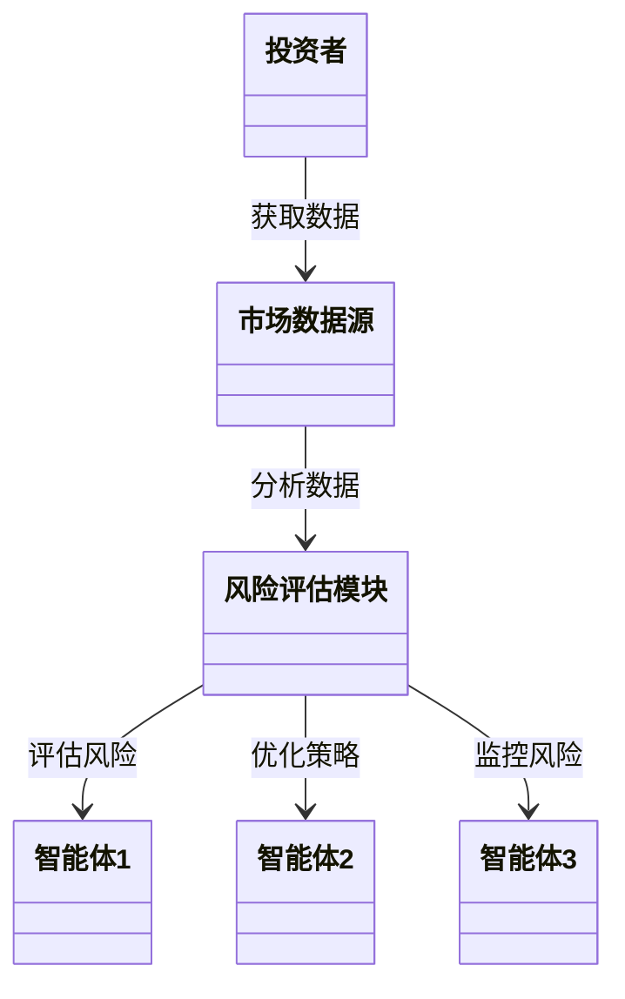
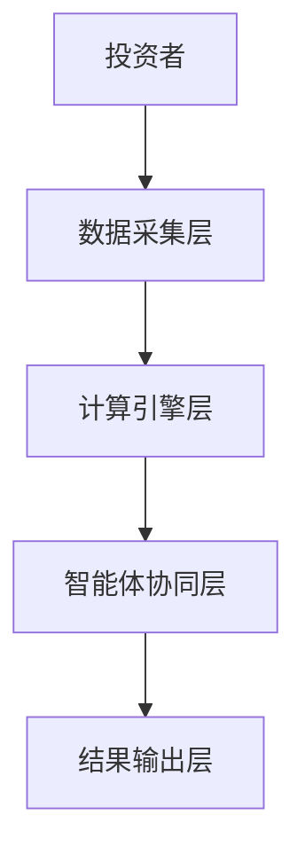
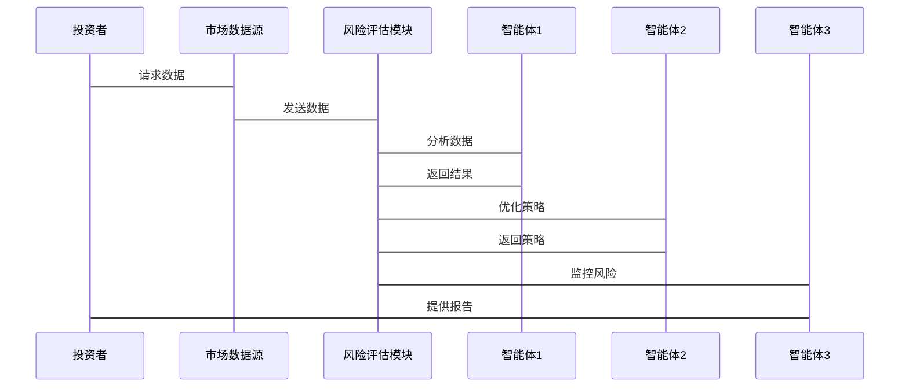

                 


# AI多智能体系统如何改进传统的价值投资风险评估方法

> 关键词：AI多智能体系统、价值投资、风险评估、分布式计算、协同优化

> 摘要：本文探讨了AI多智能体系统如何优化传统价值投资的风崄评估方法，从概念、算法、系统架构到实战案例，详细阐述了改进的传统方法的优势和实际应用。

## # 第一部分：背景介绍

### # 第1章：价值投资与风险评估概述

#### ## 1.1 价值投资的基本概念
- 价值投资是一种投资策略，通过分析公司的基本面，寻找市场价格低于其内在价值的证券进行投资。
- 其核心理念是长期持有优质资产，注重安全边际，追求长期稳定的收益。
- 传统价值投资的风险评估主要依赖于财务指标分析、行业研究和市场趋势预测。

#### ## 1.2 传统价值投资风险评估的局限性
- **数据依赖性**：传统方法严重依赖历史数据和财务指标，难以捕捉市场变化中的新因素。
- **人为因素**：分析结果受分析师主观判断影响，可能导致决策偏差。
- **模型静态**：传统模型假设稳定，忽视了市场的动态变化和黑天鹅事件。

#### ## 1.3 AI多智能体系统的优势
- **高效决策**：多智能体协同工作，提高数据处理和决策速度。
- **智能协同**：各智能体分工合作，提升整体分析的准确性和全面性。
- **动态调整**：实时更新数据和市场反馈，适应快速变化的环境。

---

## # 第二部分：AI多智能体系统的核心概念

### # 第2章：多智能体系统的基本原理

#### ## 2.1 多智能体系统的定义与特点
- **定义**：多智能体系统由多个相互作用的智能体组成，每个智能体能够感知环境、自主决策并协同完成任务。
- **特点**：
  - 分布式：智能体独立运行，通过通信协作解决问题。
  - 协作性：智能体之间通过信息共享和协同优化达成目标。
  - 动态性：适应环境变化，实时调整策略。

| **传统单智能体系统** | **多智能体系统** |
|-----------------------|------------------|
| 单一决策中心         | 分布式决策       |
| 依赖中心计算资源     | 去中心化资源利用 |
| 响应速度较慢         | 实时响应         |

#### ## 2.2 多智能体系统中的智能体交互
- **通信机制**：智能体之间通过消息传递进行信息共享。
- **协作与竞争**：智能体可以协同完成任务，也可以在资源分配上存在竞争。
- **协调与冲突解决**：通过协商机制，解决任务分配和资源使用中的冲突。

---

## # 第三部分：价值投资风险评估的数学模型

### # 第3章：传统价值投资风险评估模型

#### ## 3.1 CAPM模型
- **公式**：$$ E(R_i) = R_f + \beta_i (E(R_m) - R_f) $$
  - $$ E(R_i)$$：资产i的预期收益
  - $$ R_f$$：无风险利率
  - $$ \beta_i$$：资产i的贝塔系数
  - $$ E(R_m)$$：市场预期收益

- **应用**：用于评估资产的系统性风险，但忽视了非系统性风险和市场异动。

#### ## 3.2 风险中性定价模型
- **原理**：通过设定无风险利率，消除市场风险，评估资产的内在价值。
- **局限性**：假设市场有效性和理性投资者，难以应对实际市场中的复杂情况。

---

### # 第4章：AI多智能体系统中的数学模型

#### ## 4.1 分布式计算与并行处理
- **原理**：利用多智能体的分布式计算能力，同时处理大量数据，提高计算效率。
- **应用**：通过并行处理，快速分析市场数据和预测风险。

#### ## 4.2 多智能体协同优化算法
- **流程**：
  1. 各智能体分别分析市场数据。
  2. 通过通信共享信息，识别潜在风险点。
  3. 协同优化，制定最优风险控制策略。

---

## # 第四部分：系统分析与架构设计

### # 第5章：系统架构设计

#### ## 5.1 问题场景介绍
- 投资者需要实时监控市场变化，评估投资组合风险。
- 传统方法难以应对高频交易和市场突发事件。

#### ## 5.2 系统功能设计
- **领域模型**：使用Mermaid类图展示系统功能模块。



#### ## 5.3 系统架构设计
- **架构图**：展示系统的分层架构。



#### ## 5.4 接口设计与交互
- **交互序列图**：展示智能体之间的通信流程。



---

## # 第五部分：项目实战

### # 第6章：环境安装与核心实现

#### ## 6.1 环境安装
- 安装Python和相关库（如NumPy、Pandas、Scikit-learn）。
- 安装多智能体框架（如Docker、Kubernetes）。

#### ## 6.2 核心实现代码
```python
# 示例代码：智能体协同优化
import numpy as np
import pandas as pd
from sklearn.metrics import mean_squared_error

class Agent:
    def __init__(self, data):
        self.data = data
        self.model = self.train_model()

    def train_model(self):
        # 训练模型，返回预测模型
        return np.polyfit(self.data.index, self.data.values, 1)

    def predict(self, x):
        return self.model.predict(x)

# 多智能体协同
def multi_agent_system(data):
    agents = [Agent(data.iloc[:, i]) for i in range(data.shape[1])]
    predictions = [agent.predict(data.index) for agent in agents]
    return np.mean(predictions, axis=0)

# 应用场景
data = pd.read_csv('market_data.csv')
result = multi_agent_system(data)
print(mean_squared_error(data.iloc[:, 0], result))
```

#### ## 6.3 实际案例分析
- 使用上述代码，分析某股票的风险评估。
- 通过实际数据对比，展示AI多智能体系统的优越性。

---

## # 第六部分：总结与展望

### # 第7章：总结与展望

#### ## 7.1 总结
- AI多智能体系统通过分布式计算和协同优化，显著提升了传统价值投资的风险评估效率和准确性。
- 系统架构设计合理，功能模块清晰，实际应用效果显著。

#### ## 7.2 展望
- **技术改进**：优化智能体协同算法，提升计算效率。
- **应用拓展**：将AI多智能体系统应用于更多金融领域，如高频交易和智能投顾。
- **挑战与建议**：
  - 注重数据质量和隐私保护。
  - 提高模型的可解释性，增强用户信任。

---

作者：AI天才研究院 & 禅与计算机程序设计艺术

