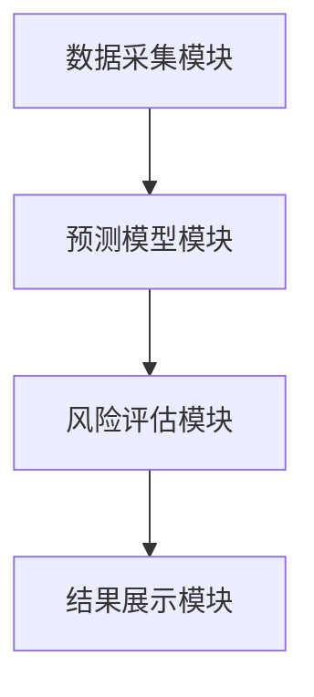
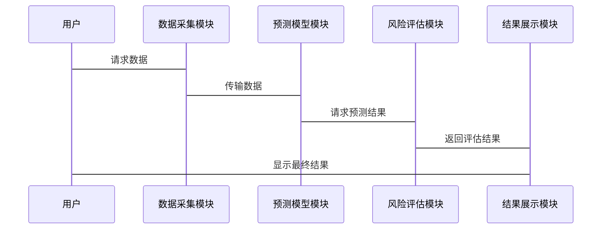

                 


# AI多智能体系统如何改进传统的折现现金流模型

## 关键词
AI多智能体系统, 折现现金流模型, 金融建模, 协作算法, 实时预测, 风险评估

## 摘要
传统的折现现金流模型在金融评估中面临数据依赖性高、模型假设简化和人工判断主观性强等局限性。本文探讨了如何通过引入AI多智能体系统来改进折现现金流模型，以提高模型的预测精度和实时性。文章从多智能体系统的定义、核心算法、协作机制等方面展开，详细阐述了AI多智能体系统在DCF模型中的应用，并通过实际案例展示了改进的效果。

---

# 第1章: 折现现金流模型概述

## 1.1 折现现金流模型的定义与原理

### 1.1.1 折现现金流模型的定义
折现现金流模型（Discounted Cash Flow，DCF）是一种用于评估投资项目或企业价值的金融工具。其核心思想是将未来预期的现金流折现到现值，以确定其当前的内在价值。

### 1.1.2 折现现金流模型的核心原理
DCF模型基于以下三个关键假设：
1. **时间价值**：资金的时间价值，即资金随时间的推移而变化。
2. **风险偏好**：投资者对风险的偏好会影响贴现率的选择。
3. **未来现金流预测**：模型依赖于对未来的现金流预测。

### 1.1.3 折现现金流模型的应用场景
DCF模型广泛应用于企业估值、项目可行性分析、并购评估等领域。

## 1.2 折现现金流模型的局限性

### 1.2.1 数据依赖性问题
DCF模型高度依赖于对未来现金流的预测，而这些预测往往受到市场波动、经济环境等外部因素的影响，具有较高的不确定性。

### 1.2.2 模型假设的简化性
传统的DCF模型通常假设企业的增长率为常数，这在实际中难以成立，尤其是在市场环境复杂多变的情况下。

### 1.2.3 人工判断的主观性
DCF模型的预测结果依赖于分析师的判断，不同分析师可能会得出不同的结论，导致结果的主观性较强。

---

# 第2章: 多智能体系统概述

## 2.1 多智能体系统的定义与特点

### 2.1.1 多智能体系统的定义
多智能体系统（Multi-Agent System，MAS）是由多个智能体（Agent）组成的分布式系统，这些智能体能够通过协作完成复杂的任务。

### 2.1.2 多智能体系统的特征
1. **分布式性**：智能体分布在不同的位置，各自独立运行。
2. **协作性**：智能体之间通过协作完成共同的目标。
3. **自主性**：每个智能体能够自主决策和行动。
4. **反应性**：智能体能够根据环境的变化实时调整行为。

### 2.1.3 多智能体系统的优势
1. **高效性**：多个智能体协同工作可以提高任务处理效率。
2. **适应性**：智能体能够根据环境变化动态调整策略。
3. **鲁棒性**：单个智能体的故障不会导致整个系统崩溃。

## 2.2 多智能体系统在金融领域的应用

### 2.2.1 金融领域的多智能体系统案例
例如，智能体可以用于实时市场数据监控、风险评估、交易决策等领域。

### 2.2.2 多智能体系统在金融分析中的潜力
多智能体系统可以用于复杂金融模型的构建、实时数据分析、多维度风险评估等。

### 2.2.3 多智能体系统的挑战与限制
1. **通信成本**：智能体之间的通信可能会增加系统的延迟和计算成本。
2. **协调复杂性**：多个智能体之间的协调需要复杂的算法支持。
3. **安全性**：多智能体系统的安全性问题需要重点关注。

---

# 第3章: AI多智能体系统的核心原理

## 3.1 多智能体系统的核心算法

### 3.1.1 分布式计算与协作算法
分布式计算算法用于实现智能体之间的协作，例如分布式优化算法、分布式共识算法等。

### 3.1.2 联合学习与知识共享
联合学习（Federated Learning）是一种在分布式系统中进行模型训练的方法，能够保护数据隐私的同时实现知识共享。

### 3.1.3 自适应优化算法
自适应优化算法能够根据环境的变化动态调整智能体的行为策略。

## 3.2 AI多智能体系统的通信机制

### 3.2.1 智能体之间的信息传递
智能体之间需要通过某种通信协议进行信息传递，例如使用消息队列或发布-订阅模式。

### 3.2.2 通信协议的设计
通信协议的设计需要考虑效率、可靠性和安全性，例如使用HTTP、WebSocket等协议。

### 3.2.3 通信效率的优化
通过优化通信协议和减少不必要的信息传输，可以提高通信效率。

---

# 第4章: 多智能体系统的协作机制

## 4.1 协作目标的设定

### 4.1.1 协作目标的定义
协作目标是多智能体系统需要共同完成的任务，例如预测未来的现金流。

### 4.1.2 协作目标的分解
将协作目标分解为多个子任务，分配给不同的智能体完成。

### 4.1.3 协作目标的动态调整
根据环境的变化动态调整协作目标，以适应新的情况。

## 4.2 协作规则的设计

### 4.2.1 协作规则的制定
制定明确的协作规则，例如智能体之间的任务分配规则。

### 4.2.2 协作规则的执行
通过算法实现协作规则的自动执行，例如使用分布式算法。

### 4.2.3 协作规则的优化
根据实际运行情况优化协作规则，以提高系统的效率和效果。

---

# 第5章: AI多智能体系统在折现现金流模型中的应用

## 5.1 数据采集与处理

### 5.1.1 数据来源与采集方式
多智能体系统可以从多个数据源采集市场数据，例如股票价格、财务报表等。

### 5.1.2 数据清洗与预处理
对采集到的数据进行清洗和预处理，以确保数据的质量和一致性。

### 5.1.3 数据共享与协作
智能体之间共享数据，以提高预测的准确性和全面性。

## 5.2 预测模型的优化

### 5.2.1 多智能体系统的预测能力
通过多智能体系统的协作，可以提高预测模型的准确性和实时性。

### 5.2.2 预测模型的优化策略
通过优化算法和参数调整，进一步提高预测模型的性能。

## 5.3 风险评估与管理

### 5.3.1 风险的识别与评估
多智能体系统可以实时监控市场变化，识别潜在的风险因素。

### 5.3.2 风险的动态管理
根据风险评估结果，动态调整投资策略，以降低风险。

---

# 第6章: 系统架构与实现

## 6.1 系统架构设计

### 6.1.1 系统功能模块
- 数据采集模块
- 预测模型模块
- 风险评估模块
- 结果展示模块

### 6.1.2 系统架构图


## 6.2 系统接口设计

### 6.2.1 接口定义
- 数据接口：定义数据的格式和传输方式。
- 模型接口：定义预测模型的输入和输出。

### 6.2.2 接口实现
使用RESTful API实现系统接口，例如使用Python的Flask框架。

## 6.3 系统交互设计

### 6.3.1 交互流程


---

# 第7章: 项目实战

## 7.1 环境安装

### 7.1.1 安装Python
安装Python 3.8及以上版本。

### 7.1.2 安装依赖库
安装numpy、pandas、scikit-learn等依赖库。

## 7.2 核心实现

### 7.2.1 数据采集模块
```python
import requests

def get_market_data(symbol):
    response = requests.get(f'https://api.example.com/{symbol}')
    return response.json()
```

### 7.2.2 预测模型模块
```python
from sklearn.linear_model import LinearRegression

def train_model(data):
    model = LinearRegression()
    model.fit(data[['price', 'volume']], data['future_cash_flow'])
    return model
```

### 7.2.3 风险评估模块
```python
def calculate_risk(model, data):
    predictions = model.predict(data[['price', 'volume']])
    risk = sum(abs(predictions - data['future_cash_flow'])) / len(predictions)
    return risk
```

## 7.3 实例分析

### 7.3.1 数据集选择
选择某上市公司的历史数据作为数据集。

### 7.3.2 模型训练
使用训练数据训练预测模型，并评估模型的准确性和风险。

### 7.3.3 结果分析
分析模型的预测结果，比较改进后的模型与传统模型的优劣。

---

# 第8章: 总结与展望

## 8.1 总结
本文探讨了如何通过AI多智能体系统改进传统的折现现金流模型，提出了多智能体系统的协作机制和实现方案，并通过实际案例验证了其有效性。

## 8.2 展望
未来的研究可以进一步优化多智能体系统的协作算法，探索更多应用场景，以进一步提升DCF模型的预测精度和实时性。

---

# 作者
作者：AI天才研究院/AI Genius Institute  
联系邮箱：contact@ai-genius.com  

---

通过本文的详细阐述，读者可以深入了解AI多智能体系统在折现现金流模型中的应用，掌握其核心原理和实现方法。

