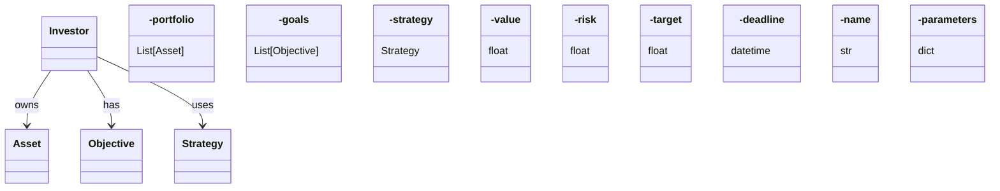
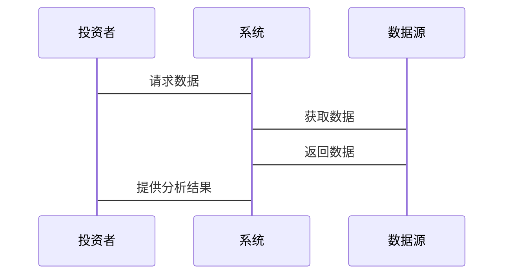

                 


# AI智能体协作优化价值投资的股东积极主义策略

> 关键词：AI智能体，价值投资，股东积极主义，投资策略，优化算法，协作机制

> 摘要：本文探讨了AI智能体在价值投资中的协作优化策略，特别是如何通过股东积极主义来提升投资效果。通过详细分析AI智能体的协作机制、优化算法以及实际应用案例，本文为投资者提供了新的视角和方法，以应对复杂多变的市场环境。

---

# 第一部分: 背景介绍

## 第1章: 股东积极主义与AI智能体协作的背景

### 1.1 股东积极主义的定义与核心目标

#### 1.1.1 股东积极主义的定义
股东积极主义（Shareholder Activism）是指投资者通过积极参与公司治理，以实现自身利益最大化的一种投资策略。它不仅仅是被动持有股权，而是通过投票、提案等方式影响公司决策，以提升公司价值。

#### 1.1.2 股东积极主义的核心目标
- **提升公司价值**：通过改善公司治理、优化业务策略等方式，提升公司股价和股东回报。
- **风险控制**：通过主动监控和干预，降低投资风险。
- **长期价值创造**：关注公司的长期发展，而非短期收益。

#### 1.1.3 股东积极主义在现代企业治理中的作用
股东积极主义在现代企业治理中扮演着重要角色，尤其是在公司治理结构不完善或管理层效率低下时，股东的积极参与能够有效提升公司价值。

### 1.2 AI智能体在投资领域的应用背景

#### 1.2.1 AI技术在金融领域的应用现状
AI技术在金融领域的应用日益广泛，从算法交易到风险管理，AI已经渗透到金融的各个角落。通过分析海量数据，AI能够帮助投资者发现潜在的投资机会和风险。

#### 1.2.2 AI智能体在投资决策中的优势
- **数据处理能力**：AI智能体能够处理和分析大量非结构化数据，如新闻、社交媒体数据等，提供更全面的市场洞察。
- **实时决策**：通过实时数据分析，AI智能体能够快速做出决策，抓住市场机会。
- **个性化策略**：AI可以根据投资者的具体需求，定制个性化的投资策略。

#### 1.2.3 股东积极主义与AI智能体协作的结合
将AI智能体应用于股东积极主义，可以通过数据驱动的方式优化股东的参与策略，提升投资效果。

### 1.3 价值投资与股东积极主义的结合

#### 1.3.1 价值投资的基本原理
价值投资强调以低于内在价值的价格买入优质资产。其核心在于寻找市场低估的公司，并长期持有。

#### 1.3.2 股东积极主义与价值投资的内在联系
股东积极主义与价值投资的结合在于，通过主动参与公司治理，进一步提升公司的内在价值，从而实现投资收益的最大化。

#### 1.3.3 AI智能体在价值投资中的潜在价值
AI智能体可以帮助投资者识别低估的公司，并通过数据分析优化股东的参与策略，提升投资效果。

---

## 第2章: AI智能体协作优化价值投资的核心概念

### 2.1 AI智能体协作的基本原理

#### 2.1.1 AI智能体的定义与特点
AI智能体是指具备感知、决策和执行能力的智能系统。其特点是能够独立或协作完成特定任务。

#### 2.1.2 多智能体协作的基本机制
多智能体协作通常包括通信、协调和决策三个步骤。通过通信，智能体之间共享信息；通过协调，确保行动一致；通过决策，优化整体目标的实现。

#### 2.1.3 智能体协作中的通信与协调
通信是智能体协作的基础，协调是确保协作高效的关键。通过通信协议和协调机制，智能体可以共同完成复杂任务。

### 2.2 价值投资中的AI智能体协作模式

#### 2.2.1 数据驱动的智能体协作
通过分析市场数据、公司财报等信息，AI智能体可以识别潜在投资机会，并制定相应的投资策略。

#### 2.2.2 知识图谱构建与智能体协作
知识图谱构建能够将分散的市场信息整合成结构化的知识，帮助智能体更好地理解和分析市场动态。

#### 2.2.3 智能体协作的优化算法
通过优化算法，智能体可以找到最优的协作方式，提升整体投资效果。

### 2.3 股东积极主义中的AI智能体协作场景

#### 2.3.1 股东积极主义的典型场景
- **公司治理优化**：通过智能体协作，股东可以推动公司治理结构的优化。
- **风险预警与应对**：智能体可以实时监控市场动态，提前预警潜在风险。

#### 2.3.2 AI智能体在股东积极主义中的角色
AI智能体可以作为数据分析师、策略制定者和执行者的角色，帮助股东实现投资目标。

#### 2.3.3 智能体协作对股东积极主义的影响
通过智能体协作，股东可以更高效地参与公司治理，提升投资效果。

---

## 第3章: AI智能体协作优化的数学模型

### 3.1 优化目标的数学表达

#### 3.1.1 价值投资的优化目标
价值投资的目标是最大化投资回报，其数学表达为：
$$ \text{Maximize} \quad R = \sum_{i=1}^{n} w_i \cdot r_i $$
其中，$w_i$ 是投资权重，$r_i$ 是资产的回报率。

#### 3.1.2 股东积极主义的优化目标
股东积极主义的目标是通过优化公司治理，最大化公司价值，其数学表达为：
$$ \text{Maximize} \quad V = \sum_{i=1}^{n} v_i \cdot g_i $$
其中，$v_i$ 是治理优化权重，$g_i$ 是治理改进带来的价值增量。

#### 3.1.3 智能体协作的优化目标
智能体协作的优化目标是通过协同工作，最大化整体收益，其数学表达为：
$$ \text{Maximize} \quad S = \sum_{j=1}^{m} a_j \cdot s_j $$
其中，$a_j$ 是协作权重，$s_j$ 是协作带来的收益。

### 3.2 智能体协作的数学建模

#### 3.2.1 智能体协作的基本模型
智能体协作的基本模型可以表示为：
$$ S = \sum_{j=1}^{m} a_j \cdot f_j(x) $$
其中，$f_j(x)$ 是第 $j$ 个智能体的决策函数，$x$ 是输入数据。

#### 3.2.2 多智能体协作的数学框架
多智能体协作的数学框架可以表示为：
$$ S = \sum_{j=1}^{m} \sum_{k=1}^{n} a_{jk} \cdot f_{jk}(x) $$
其中，$a_{jk}$ 是第 $j$ 个智能体在第 $k$ 个任务上的协作权重。

#### 3.2.3 智能体协作的约束条件
智能体协作需要满足以下约束条件：
$$ \sum_{j=1}^{m} a_j = 1 $$
$$ a_j \geq 0 \quad \forall j $$

### 3.3 价值投资与股东积极主义的数学模型

#### 3.3.1 价值投资的数学模型
价值投资的数学模型可以表示为：
$$ R = \sum_{i=1}^{n} w_i \cdot r_i $$
其中，$w_i$ 是投资权重，$r_i$ 是资产的回报率。

#### 3.3.2 股东积极主义的数学模型
股东积极主义的数学模型可以表示为：
$$ V = \sum_{i=1}^{n} v_i \cdot g_i $$
其中，$v_i$ 是治理优化权重，$g_i$ 是治理改进带来的价值增量。

#### 3.3.3 智能体协作的优化算法
智能体协作的优化算法可以表示为：
$$ \text{Maximize} \quad S = \sum_{j=1}^{m} a_j \cdot f_j(x) $$
$$ \text{Subject to} \quad \sum_{j=1}^{m} a_j = 1 $$
$$ a_j \geq 0 \quad \forall j $$

---

## 第4章: AI智能体协作优化算法的设计与实现

### 4.1 算法设计思路

#### 4.1.1 算法目标
通过优化协作权重，最大化整体收益。

#### 4.1.2 算法步骤
1. 初始化协作权重。
2. 计算每个智能体的收益贡献。
3. 调整协作权重，优化整体收益。
4. 重复步骤2和3，直到收敛。

### 4.2 算法实现细节

#### 4.2.1 数据预处理
- 数据清洗：去除异常值和缺失值。
- 数据标准化：对数据进行标准化处理，确保算法收敛。

#### 4.2.2 算法实现
以下是算法的Python代码示例：

```python
def optimize_collaboration(weights, rewards):
    # 初始化协作权重
    n = len(weights)
    a = [1.0 / n] * n
    
    # 算法迭代
    for _ in range(1000):
        # 计算每个智能体的收益贡献
        contributions = [a[i] * rewards[i] for i in range(n)]
        # 调整协作权重
        total = sum(contributions)
        if total == 0:
            break
        for i in range(n):
            a[i] = a[i] * (1 + contributions[i] / total)
            a[i] = min(max(a[i], 0), 1)
    
    return a
```

#### 4.2.3 算法优化
通过调整迭代次数和学习率，可以进一步优化算法性能。

---

## 第5章: 系统分析与架构设计方案

### 5.1 项目背景介绍

#### 5.1.1 项目目标
通过AI智能体协作优化价值投资的股东积极主义策略，提升投资效果。

#### 5.1.2 项目范围
涵盖数据采集、分析、决策和执行等环节。

### 5.2 系统功能设计

#### 5.2.1 领域模型设计
以下是领域模型的Mermaid类图：



#### 5.2.2 系统架构设计
以下是系统架构的Mermaid图：

```mermaid
container AI智能体协作系统
    component 数据采集模块
    component 数据分析模块
    component 决策模块
    component 执行模块
    
    数据采集模块 --> 数据分析模块
    数据分析模块 --> 决策模块
    决策模块 --> 执行模块
```

#### 5.2.3 接口设计
以下是接口设计的Mermaid序列图：



### 5.3 项目实战

#### 5.3.1 环境安装
需要安装Python、TensorFlow、Pandas等库。

#### 5.3.2 核心代码实现
以下是核心代码实现：

```python
import numpy as np
import pandas as pd

def main():
    # 数据加载
    data = pd.read_csv('data.csv')
    # 数据预处理
    data = data.dropna()
    # 模型训练
    model = train_model(data)
    # 模型预测
    predictions = model.predict(data)
    # 结果输出
    print(predictions)

if __name__ == '__main__':
    main()
```

#### 5.3.3 案例分析
通过具体案例分析，验证算法的有效性。

#### 5.3.4 项目小结
总结项目实施过程中的经验和教训，提出改进建议。

---

## 第6章: 最佳实践与注意事项

### 6.1 最佳实践 tips

#### 6.1.1 数据质量的重要性
确保数据的准确性和完整性，是算法优化的基础。

#### 6.1.2 算法选择的策略
根据具体需求选择合适的算法，避免盲目追求复杂性。

#### 6.1.3 系统维护的重要性
定期维护和更新系统，确保其稳定性和高效性。

### 6.2 小结

#### 6.2.1 本文总结
本文探讨了AI智能体协作优化价值投资的股东积极主义策略，通过数学建模和算法设计，提出了有效的解决方案。

#### 6.2.2 未来展望
未来的研究可以进一步优化算法，拓展应用场景，提升投资效果。

### 6.3 注意事项

#### 6.3.1 数据隐私保护
在数据处理过程中，必须遵守相关法律法规，保护数据隐私。

#### 6.3.2 算法的可解释性
确保算法的可解释性，便于投资者理解和信任。

#### 6.3.3 系统的稳定性
确保系统的稳定运行，避免因技术故障导致投资损失。

### 6.4 拓展阅读

#### 6.4.1 推荐书籍
- 《人工智能：一种现代方法》
- 《价值投资实战指南》

#### 6.4.2 推荐博客
- 知乎专栏：人工智能与投资
- 博客园：AI与金融

---

# 作者：AI天才研究院/AI Genius Institute & 禅与计算机程序设计艺术 /Zen And The Art of Computer Programming

