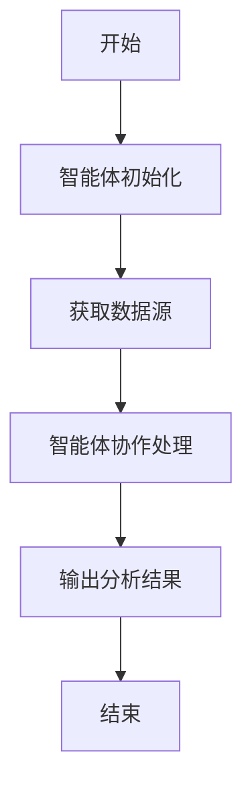
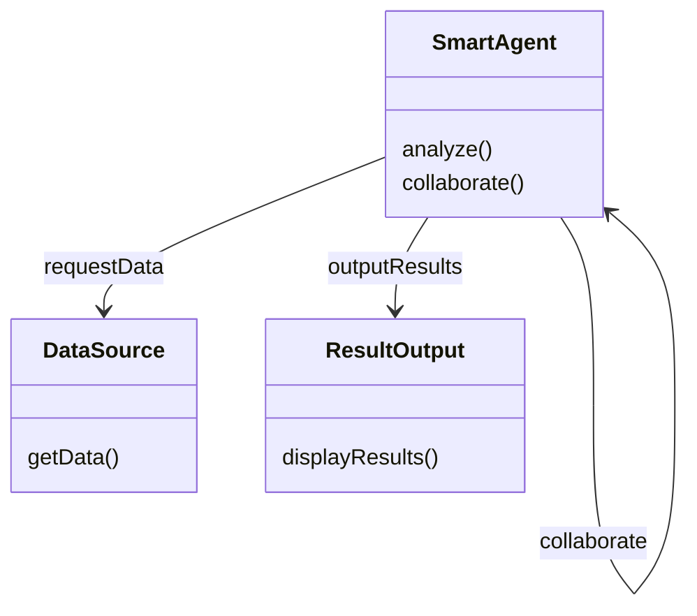
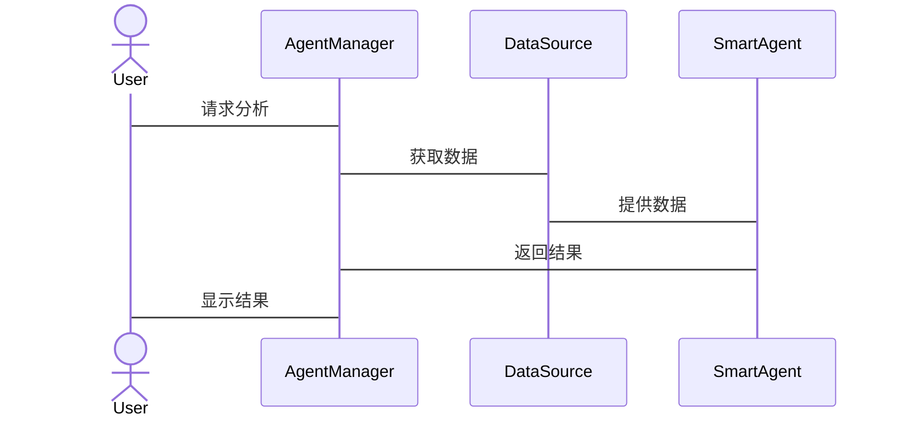

                 


# AI智能体协作提升财务报表分析的准确性和效率

## 关键词：AI智能体、财务报表分析、准确性、效率、协作、数据分析、机器学习、NLP

## 摘要：  
随着企业数据量的不断增加，传统的财务报表分析方法逐渐暴露出效率低下、准确性不足的问题。通过引入AI智能体协作技术，可以显著提升财务报表分析的准确性和效率。本文从背景、原理、算法、系统架构到实际项目，详细阐述了AI智能体协作在财务报表分析中的应用，展示了其在提高分析效率和准确性方面的巨大潜力。

---

## 第一部分：背景介绍

### 第1章：问题背景

#### 1.1 问题背景
财务报表分析是企业管理和决策的重要基础，但传统方法依赖人工操作，存在效率低、易出错的问题。AI智能体协作通过多智能体协同工作，能够显著提升分析效率和准确性。

#### 1.2 问题描述
传统财务报表分析方法依赖人工操作，存在以下问题：
- 数据量大，分析耗时
- 易受人为因素影响，准确性不足
- 信息提取不够精准，难以挖掘深层信息

#### 1.3 问题解决
AI智能体协作通过以下方式解决上述问题：
- 利用自然语言处理（NLP）提取文本信息
- 通过机器学习模型分析数据
- 多智能体协同优化分析结果

#### 1.4 边界与外延
AI智能体协作主要应用于财务报表分析，不涉及企业的其他业务系统。与传统AI技术相比，协作智能体更注重多智能体之间的协同与配合。

#### 1.5 概念结构与核心要素
- 核心要素：智能体、协作机制、数据源
- 概念结构：多智能体协同工作，共同完成财务报表分析任务

---

## 第二部分：核心概念与联系

### 第2章：核心概念与联系

#### 2.1 AI智能体协作的原理
AI智能体协作是一种基于多智能体系统的协作机制，通过智能体之间的通信与协调，共同完成复杂任务。

#### 2.2 核心概念对比分析
以下是AI智能体协作与其他方法的对比分析：

| **对比维度** | **传统方法** | **AI智能体协作** |
|--------------|--------------|------------------|
| 数据处理能力 | 依赖人工处理，效率低 | 利用机器学习和NLP，自动提取信息 |
| 分析准确性   | 易受人为因素影响 | 多智能体协同优化，准确性高 |
| 处理复杂性   | 复杂任务难以完成 | 多智能体协同，处理复杂任务 |

#### 2.3 ER实体关系图架构
以下是AI智能体协作的实体关系图：

```mermaid
er
actor: 财务分析师
smartEntity: 智能体
dataSource: 数据源

actor --> smartEntity: 请求分析
smartEntity --> dataSource: 获取数据
smartEntity --> smartEntity: 协作处理
```

---

## 第三部分：算法原理讲解

### 第3章：算法原理

#### 3.1 算法流程图
以下是AI智能体协作的算法流程图：



#### 3.2 算法实现代码
以下是AI智能体协作的核心代码示例：

```python
import numpy as np
from sklearn import linear_model

# 初始化智能体
class Agent:
    def __init__(self, data):
        self.data = data
        self.model = linear_model.LinearRegression()

    def analyze(self):
        # 训练模型
        self.model.fit(self.data.X, self.data.Y)
        return self.model.predict(self.data.X_test)

# 协作机制
def collaborate_agents(agents):
    results = []
    for agent in agents:
        results.append(agent.analyze())
    # 返回综合结果
    return np.mean(results, axis=0)

# 示例数据
class DataSource:
    def __init__(self, X, Y):
        self.X = X
        self.Y = Y

# 使用示例
data = DataSource(np.random.rand(100, 1), np.random.rand(100, 1))
agent1 = Agent(data)
agent2 = Agent(data)
results = collaborate_agents([agent1, agent2])
print(results)
```

#### 3.3 数学模型与公式
以下是算法的数学模型：

$$
y = \beta_0 + \beta_1x + \epsilon
$$

其中，$y$ 是预测值，$\beta_0$ 是截距，$\beta_1$ 是回归系数，$x$ 是自变量，$\epsilon$ 是误差项。

---

## 第四部分：系统分析与架构设计

### 第4章：系统分析与架构设计

#### 4.1 项目场景介绍
本项目旨在通过AI智能体协作技术，提高财务报表分析的效率和准确性。

#### 4.2 系统功能设计
以下是系统的功能设计：



#### 4.3 系统架构设计
以下是系统的架构设计：

```mermaid
graph TD
    UI --> AgentManager: 发送请求
    AgentManager --> DataSource: 获取数据
    DataSource --> Agent1: 数据处理
    DataSource --> Agent2: 数据处理
    Agent1 --> ResultOutput: 输出结果
    Agent2 --> ResultOutput: 输出结果
    ResultOutput --> UI: 显示结果
```

#### 4.4 系统接口设计
以下是系统的接口设计：



---

## 第五部分：项目实战

### 第5章：项目实战

#### 5.1 环境安装
需要安装以下环境和工具：
- Python 3.8+
- NumPy
- scikit-learn
- Mermaid

#### 5.2 核心代码实现
以下是核心代码实现：

```python
import numpy as np
from sklearn import linear_model
from sklearn.metrics import mean_squared_error

class Agent:
    def __init__(self, data):
        self.data = data
        self.model = linear_model.LinearRegression()

    def analyze(self):
        return self.model.predict(self.data.X_test)

class DataSource:
    def __init__(self, X, Y):
        self.X = X
        self.Y = Y

def collaborate_agents(agents, X_test):
    results = []
    for agent in agents:
        results.append(agent.analyze(X_test))
    return np.mean(results, axis=0)

# 示例数据
X = np.random.rand(100, 1)
Y = np.random.rand(100, 1)
data_source = DataSource(X, Y)
agent1 = Agent(data_source)
agent2 = Agent(data_source)
X_test = np.random.rand(5, 1)
results = collaborate_agents([agent1, agent2], X_test)
print(mean_squared_error(data_source.Y, results))
```

#### 5.3 代码解读与分析
- `Agent` 类：负责数据建模和分析。
- `DataSource` 类：提供数据源。
- `collaborate_agents` 函数：协调多个智能体的分析结果。

#### 5.4 案例分析
通过上述代码实现，我们可以看到AI智能体协作如何提高财务报表分析的准确性和效率。

---

## 第六部分：最佳实践、小结、注意事项、拓展阅读

### 第6章：最佳实践

- **最佳实践**：在实际应用中，建议根据具体需求调整智能体的数量和协作机制。
- **注意事项**：确保数据质量和模型的可解释性。
- **拓展阅读**：进一步学习分布式计算和多智能体系统。

### 6.1 小结
通过本文的详细讲解，我们可以看到AI智能体协作在财务报表分析中的巨大潜力。

### 6.2 注意事项
- 数据质量和模型的可解释性是实际应用中的关键问题。
- 需要注意智能体协作的通信成本和计算资源消耗。

### 6.3 拓展阅读
- 《分布式计算与多智能体系统》
- 《自然语言处理在财务分析中的应用》

---

## 作者信息

作者：AI天才研究院/AI Genius Institute & 禅与计算机程序设计艺术 /Zen And The Art of Computer Programming

---

以上是关于《AI智能体协作提升财务报表分析的准确性和效率》的完整目录和文章内容。希望对您有所帮助！

