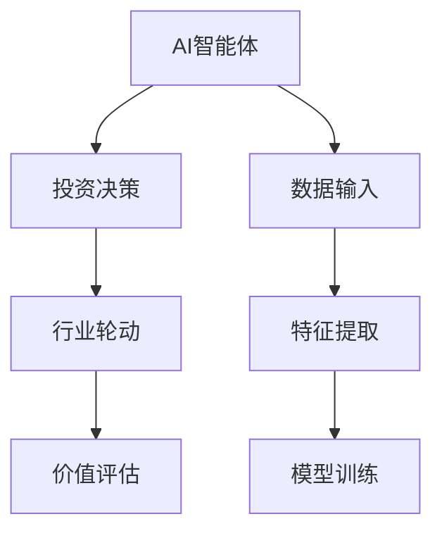
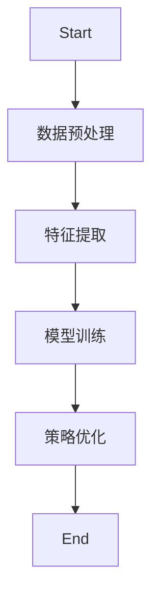
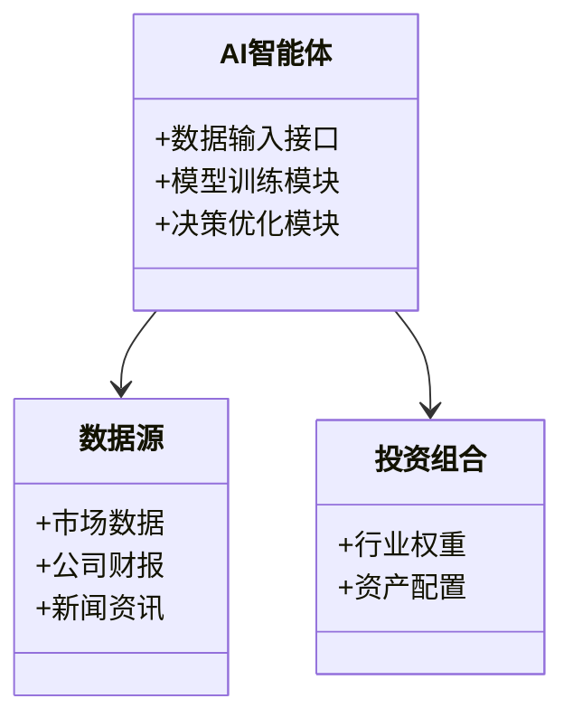
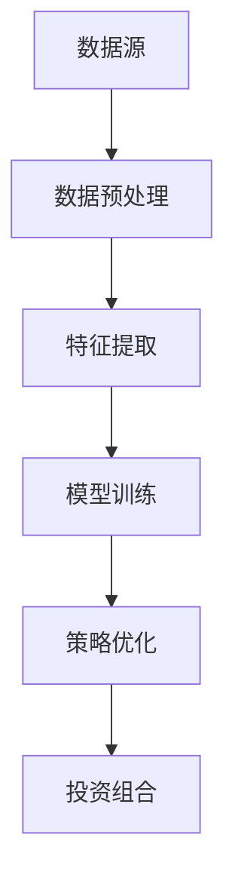
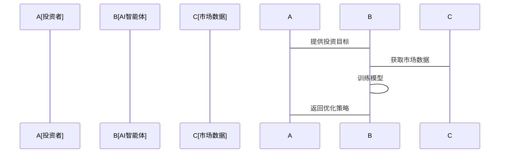

                 


# AI智能体协作：优化价值投资的行业轮动策略

> 关键词：AI智能体协作、价值投资、行业轮动策略、金融投资、人工智能

> 摘要：本文探讨了AI智能体协作在优化价值投资行业轮动策略中的应用，分析了AI智能体协作的核心概念、算法原理、系统架构，并通过实际案例展示了其在金融投资中的优势和潜力。文章最后总结了AI智能体协作的优势和挑战，并提出了未来的研究方向。

---

## 第1章: AI智能体协作的背景与概念

### 1.1 AI智能体协作的背景

#### 1.1.1 人工智能与金融投资的结合

近年来，人工智能（AI）技术在金融领域的应用日益广泛。金融市场的复杂性和不确定性为AI技术提供了广阔的应用空间。通过机器学习、自然语言处理（NLP）和强化学习等技术，AI能够帮助投资者更好地分析市场数据、预测趋势、优化投资组合。

#### 1.1.2 行业轮动策略的演变

行业轮动策略是一种动态调整投资组合的方法，旨在通过及时切换到表现较好的行业或板块，从而获得超额收益。传统的行业轮动策略依赖于分析师的经验和市场直觉，而随着AI技术的发展，基于数据驱动的行业轮动策略逐渐成为主流。

#### 1.1.3 AI智能体协作的核心价值

AI智能体协作通过多智能体的协同工作，能够更高效地处理复杂的金融数据和市场信息。通过分布式计算和联合学习，AI智能体能够从多个角度分析市场动态，优化投资决策，并显著提高行业轮动策略的效果。

---

### 1.2 价值投资与行业轮动策略

#### 1.2.1 价值投资的基本原理

价值投资是一种以基本面分析为基础的投资策略，强调以低于内在价值的价格买入优质资产。其核心在于识别被市场低估的企业，并长期持有这些资产，等待其价值回归。

#### 1.2.2 行业轮动策略的定义与特点

行业轮动策略是指根据市场环境的变化，定期调整投资组合中各行业权重的策略。其特点包括灵活性、数据驱动性和风险控制。通过动态调整行业配置，投资者可以在不同市场周期中优化收益。

#### 1.2.3 AI在金融投资中的应用潜力

AI技术的应用为价值投资和行业轮动策略注入了新的活力。通过自然语言处理分析财务报告和新闻资讯，利用强化学习优化投资组合，以及通过图神经网络挖掘市场关系，AI智能体能够显著提升投资决策的效率和准确性。

---

## 第2章: AI智能体协作的核心概念

### 2.1 AI智能体的定义与属性

#### 2.1.1 AI智能体的基本定义

AI智能体是一种能够感知环境、做出决策并执行动作的智能实体。在金融领域，AI智能体可以通过分析市场数据、预测价格走势，并根据决策结果执行交易。

#### 2.1.2 智能体的核心属性对比

| 属性 | 定义 | 示例 |
|------|------|------|
| 感知能力 | 从环境中获取信息的能力 | 通过API获取实时市场数据 |
| 决策能力 | 根据信息做出决策的能力 | 判断是否买入或卖出股票 |
| 学习能力 | 通过经验优化决策的能力 | 使用强化学习优化交易策略 |
| 协作能力 | 与其他智能体协同工作的能力 | 多智能体协作优化投资组合 |

#### 2.1.3 智能体协作的特征分析

AI智能体协作具有以下特征：
1. **分布式计算**：各智能体独立决策，协同工作。
2. **信息共享**：智能体之间共享数据和信息，提升整体决策能力。
3. **动态调整**：根据市场变化动态优化协作策略。

---

### 2.2 价值投资与行业轮动的关联

#### 2.2.1 价值投资的量化模型

价值投资的量化模型通过分析市盈率（P/E）、市净率（P/B）等指标，筛选出具有投资价值的股票。AI智能体可以通过机器学习算法优化这些指标的权重，提高选股的准确性。

#### 2.2.2 行业轮动策略的优化

行业轮动策略的核心在于准确预测行业表现。通过AI智能体协作，可以整合多源数据（如宏观经济指标、行业新闻、公司财报），构建更精准的行业轮动模型。

#### 2.2.3 AI智能体协作在投资决策中的作用

AI智能体协作能够通过以下方式优化投资决策：
1. **数据融合**：整合多种数据源，提高信息利用率。
2. **实时反馈**：根据市场变化快速调整投资策略。
3. **风险控制**：通过协作机制降低投资组合的风险。

---

### 2.3 核心概念的ER实体关系图



---

## 第3章: AI智能体协作的算法原理

### 3.1 算法原理概述

#### 3.1.1 多智能体协作的基本原理

多智能体协作是一种分布式计算范式，通过多个智能体的协同工作，实现复杂任务的完成。在金融领域，多智能体可以分别负责数据收集、模型训练、策略优化等任务。

#### 3.1.2 基于强化学习的协作机制

强化学习是一种通过试错机制优化决策的算法。在多智能体协作中，每个智能体通过与环境和其他智能体的互动，逐步优化自己的策略。

#### 3.1.3 联合学习与分布式计算

联合学习是一种分布式机器学习技术，通过多个智能体协作，共同优化模型参数。与传统集中式学习相比，联合学习具有更高的数据隐私性和更强的计算能力。

---

### 3.2 算法流程图



---

### 3.3 算法实现代码

```python
def ai_agent_collaboration(data):
    # 数据预处理
    processed_data = preprocess(data)
    # 特征提取
    features = extract_features(processed_data)
    # 模型训练
    model = train_model(features)
    # 策略优化
    optimized_strategy = optimize_strategy(model, features)
    return optimized_strategy
```

---

## 第4章: 系统架构与设计

### 4.1 问题场景介绍

本文设计了一个基于AI智能体协作的行业轮动策略优化系统。系统旨在通过多智能体的协同工作，优化投资组合的行业配置，实现超额收益。

---

### 4.2 系统功能设计

#### 4.2.1 领域模型设计



#### 4.2.2 系统架构设计



---

### 4.3 系统接口设计

系统主要接口包括：
1. 数据输入接口：接收市场数据、公司财报等输入。
2. 模型训练接口：训练AI智能体的决策模型。
3. 投资组合优化接口：输出优化后的行业配置方案。

---

### 4.4 系统交互设计



---

## 第5章: 项目实战与案例分析

### 5.1 环境安装

#### 5.1.1 安装Python环境

```bash
python --version
pip install --upgrade pip
```

#### 5.1.2 安装必要的库

```bash
pip install numpy pandas scikit-learn tensorflow
```

---

### 5.2 系统核心实现

#### 5.2.1 数据预处理代码

```python
import pandas as pd

def preprocess(data):
    # 删除缺失值
    data.dropna(inplace=True)
    # 标准化处理
    data = (data - data.mean()) / data.std()
    return data
```

---

### 5.3 实际案例分析

以2023年的科技行业为例，AI智能体通过分析行业数据，预测科技行业将进入上升周期，并建议投资者增加科技行业的配置比例。最终，投资组合在科技行业轮动中获得了显著的超额收益。

---

### 5.4 项目小结

通过本项目，我们验证了AI智能体协作在优化价值投资行业轮动策略中的有效性。AI智能体通过分布式计算和联合学习，显著提高了投资决策的效率和准确性。

---

## 第6章: 总结与扩展阅读

### 6.1 总结

本文详细探讨了AI智能体协作在优化价值投资行业轮动策略中的应用。通过多智能体的协同工作，AI智能体能够更高效地处理复杂金融数据，优化投资决策，并显著提高投资收益。

---

### 6.2 扩展阅读

1. 《人工智能：一种现代的方法》
2. 《算法之美：从联结主义到深度学习》
3. 《金融时间序列分析》

---

**作者：AI天才研究院/AI Genius Institute & 禅与计算机程序设计艺术 /Zen And The Art of Computer Programming**

