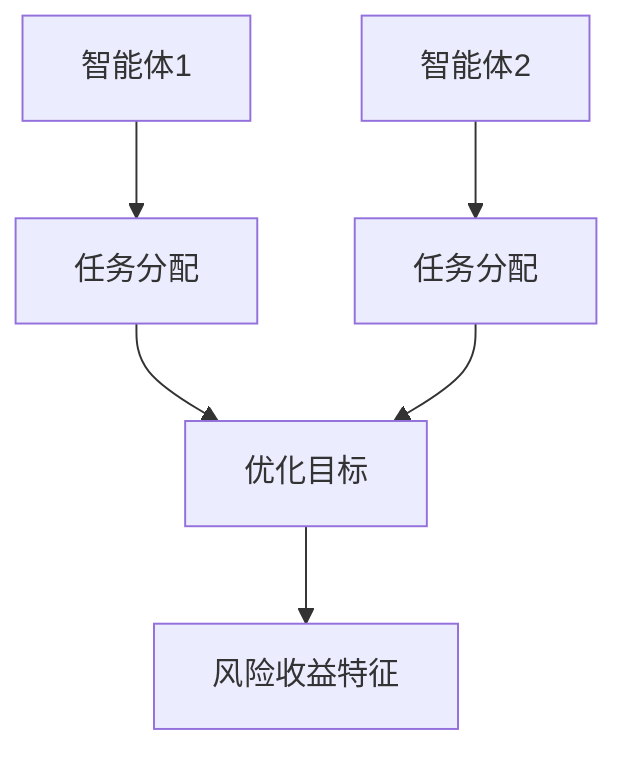
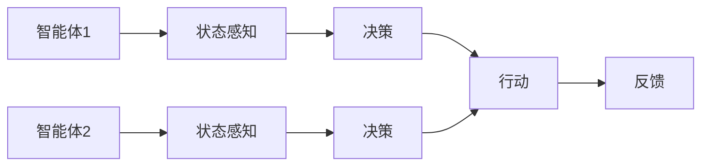
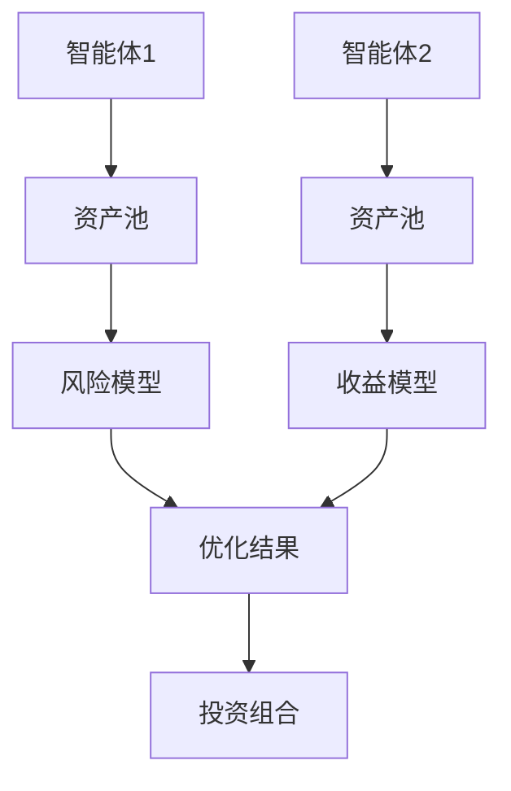
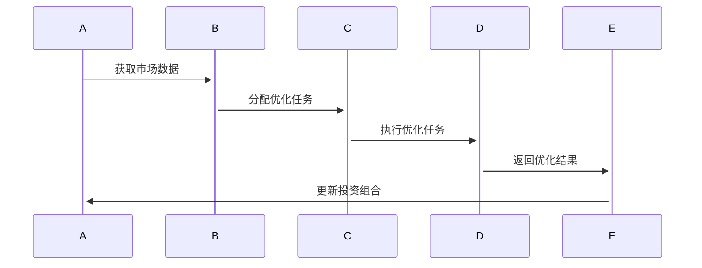

                 


# AI智能体协作：优化价值投资组合的风险收益特征

## 关键词：AI智能体协作，投资组合优化，风险收益特征，多智能体强化学习，分布式系统架构，量化投资

## 摘要：本文系统探讨AI智能体协作在优化投资组合风险收益特征中的应用，通过分析多智能体协作的核心概念、算法原理、系统架构，结合实际项目案例，深入解析如何通过AI技术提升投资组合优化的效率和精度。文章内容涵盖背景介绍、核心概念解析、算法实现、系统设计、项目实战以及优化与提升等多个方面，旨在为金融领域的技术实践者提供深度的技术指导。

---

# 第一部分: AI智能体协作与投资组合优化概述

## 第1章: AI智能体协作的背景与意义

### 1.1 问题背景

#### 1.1.1 传统投资组合优化的局限性
传统投资组合优化方法依赖于历史数据分析和统计模型，存在以下局限性：
- **假设简化**：假设市场数据服从正态分布，实际市场中存在“肥尾”现象。
- **静态优化**：传统方法通常基于静态数据，难以捕捉市场动态变化。
- **计算复杂性**：在多资产配置时，组合优化问题属于NP难问题，计算复杂度高。

#### 1.1.2 AI技术在金融领域的应用潜力
AI技术在金融领域的应用广泛，尤其是在投资组合优化方面：
- **非线性关系建模**：AI能够捕捉复杂的非线性关系，提升预测精度。
- **实时动态调整**：AI系统可以实时处理市场数据，进行动态优化。
- **数据驱动决策**：AI能够充分利用海量数据，发现传统方法难以察觉的模式。

#### 1.1.3 智能体协作在投资组合优化中的价值
智能体协作通过分布式计算和多目标优化，解决了传统方法的以下问题：
- **单一决策中心**：传统方法通常依赖单一决策中心，存在信息孤岛。
- **决策效率低下**：通过分布式协作，多个智能体可以并行处理数据，提升决策效率。
- **鲁棒性不足**：多个智能体协作可以实现冗余优化，增强系统的鲁棒性。

### 1.2 问题描述

#### 1.2.1 投资组合优化的核心目标
投资组合优化的核心目标是通过优化资产配置，在风险和收益之间找到最佳平衡点。

#### 1.2.2 风险收益特征的定义与测量
风险收益特征是衡量投资组合的重要指标，包括：
- **收益**：预期收益率。
- **风险**：标准差或VaR（Value at Risk）。
- **夏普比率**：衡量收益与风险的关系。

#### 1.2.3 智能体协作在优化中的具体问题
智能体协作在投资组合优化中的具体问题包括：
- **任务分配**：如何将优化任务分配给多个智能体。
- **协作机制**：如何设计高效的协作机制。
- **信息共享**：如何实现智能体之间的信息高效共享。

### 1.3 问题解决

#### 1.3.1 AI智能体协作的基本思路
AI智能体协作的基本思路包括：
- **任务分解**：将整体优化任务分解为多个子任务。
- **分布式优化**：多个智能体协同优化子任务。
- **结果整合**：整合各智能体的优化结果，得到全局最优解。

#### 1.3.2 多智能体协作的实现方法
多智能体协作的实现方法包括：
- **强化学习**：通过强化学习实现智能体的协作决策。
- **分布式计算**：利用分布式计算技术实现多智能体协作。
- **博弈论**：通过博弈论模型实现智能体之间的协作与竞争。

#### 1.3.3 投资组合优化的具体应用场景
投资组合优化的具体应用场景包括：
- **量化投资**：通过AI智能体协作优化量化投资策略。
- **风险管理**：通过智能体协作进行风险评估和管理。
- **动态再平衡**：根据市场变化动态调整投资组合。

### 1.4 边界与外延

#### 1.4.1 智能体协作的边界条件
智能体协作的边界条件包括：
- **计算资源限制**：受限于计算资源。
- **数据隐私**：需要考虑数据隐私和安全。
- **市场环境**：依赖于市场环境和监管政策。

#### 1.4.2 投资组合优化的适用范围
投资组合优化的适用范围包括：
- **机构投资者**：适用于大型机构投资者。
- **个人投资者**：适用于个人投资者的资产配置。
- **混合策略**：适用于混合投资策略。

#### 1.4.3 相关领域的扩展与联系
相关领域的扩展与联系包括：
- **金融科技**：与金融科技的发展密切相关。
- **分布式系统**：与分布式系统架构密切相关。
- **博弈论**：与博弈论模型密切相关。

### 1.5 概念结构与核心要素

#### 1.5.1 智能体协作的核心要素
智能体协作的核心要素包括：
- **智能体**：多个智能体协同工作。
- **任务分配**：任务的分解与分配。
- **协作机制**：协作规则和策略。
- **信息共享**：信息的传递与共享。
- **决策优化**：优化决策过程。

#### 1.5.2 投资组合优化的关键因素
投资组合优化的关键因素包括：
- **资产类别**：不同资产类别的配置。
- **风险偏好**：投资者的风险偏好。
- **市场预测**：市场预测的准确性。
- **优化目标**：收益最大化或风险最小化。

#### 1.5.3 风险收益特征的数学模型
风险收益特征的数学模型包括：
$$
\text{收益} = \sum_{i=1}^{n} w_i r_i
$$
$$
\text{风险} = \sqrt{\sum_{i=1}^{n} w_i^2 \sigma_i^2}
$$
其中，\( w_i \) 是资产 \( i \) 的权重，\( r_i \) 是资产 \( i \) 的预期收益率，\( \sigma_i \) 是资产 \( i \) 的标准差。

### 1.6 本章小结
本章介绍了AI智能体协作在投资组合优化中的背景与意义，分析了传统方法的局限性，提出了智能体协作的应用潜力，并详细阐述了问题背景、问题描述和问题解决的具体内容。

---

## 第2章: AI智能体协作的核心概念与联系

### 2.1 核心概念原理

#### 2.1.1 智能体的定义与特征
智能体（Agent）是指能够感知环境、做出决策并采取行动的实体。其主要特征包括：
- **自主性**：能够自主决策。
- **反应性**：能够实时感知环境并做出反应。
- **协作性**：能够与其他智能体协作完成任务。

#### 2.1.2 协作机制的基本原理
协作机制的基本原理包括：
- **任务分配**：根据智能体的能力分配任务。
- **信息共享**：智能体之间共享信息和知识。
- **协调与同步**：确保智能体之间的协调与同步。

#### 2.1.3 多智能体协作的实现方法
多智能体协作的实现方法包括：
- **强化学习**：通过强化学习实现智能体的协作决策。
- **分布式计算**：利用分布式计算技术实现多智能体协作。
- **博弈论**：通过博弈论模型实现智能体之间的协作与竞争。

### 2.2 概念属性特征对比

#### 2.2.1 智能体协作与单智能体的对比
| 特性         | 单智能体         | 多智能体协作     |
|--------------|------------------|------------------|
| 决策中心     | 单一决策中心     | 分布式决策中心   |
| 信息共享     | 无               | 信息共享         |
| 计算复杂性   | 较低             | 较高             |

#### 2.2.2 不同协作机制的特征分析
| 协作机制     | 基于强化学习的协作 | 基于分布式计算的协作 | 基于博弈论的协作 |
|--------------|--------------------|--------------------|------------------|
| 决策方式     | 强化学习           | 分布式计算         | 博弈论           |
| 优势         | 高效性             | 可扩展性           | 竞争与合作       |

#### 2.2.3 投资组合优化中的概念对比
| 概念         | 传统优化方法       | AI智能体协作优化   |
|--------------|--------------------|--------------------|
| 优化目标     | 收益最大化或风险最小化 | 综合优化收益与风险 |
| 优化方式     | 单点优化           | 分布式优化         |
| 计算复杂性   | 较高               | 较低               |

### 2.3 ER实体关系图



### 2.4 本章小结
本章详细分析了AI智能体协作的核心概念，对比了不同协作机制的特征，并通过ER实体关系图展示了智能体协作在投资组合优化中的关系结构。

---

## 第3章: 多智能体协作算法原理

### 3.1 算法原理概述

#### 3.1.1 多智能体协作的基本算法
多智能体协作的基本算法包括：
- **分布式强化学习**：多个智能体通过强化学习协同优化。
- **多智能体Q-learning**：基于Q-learning算法的多智能体协作。
- **协作与竞争网络**：通过协作与竞争机制实现智能体优化。

#### 3.1.2 基于强化学习的协作机制
基于强化学习的协作机制包括：
- **Q-learning算法**：通过Q值更新实现协作决策。
- **多智能体Q-learning**：多个智能体协同更新Q值。
- **策略网络**：通过策略网络实现协作决策。

#### 3.1.3 分布式协作算法的特点
分布式协作算法的特点包括：
- **分布式计算**：计算任务分布在多个智能体上。
- **局部决策**：每个智能体做出局部决策。
- **全局优化**：通过局部决策实现全局优化。

### 3.2 算法流程图



### 3.3 Python实现示例

```python
import numpy as np
import gym

class MultiAgentEnv(gym.Env):
    def __init__(self):
        super().__init__()
        self.n_agents = 2
        self.observation_space = gym.spaces.Tuple([gym.spaces.Box(-1, 1, shape=(1,)), gym.spaces.Box(-1, 1, shape=(1,)])
        self.action_space = gym.spaces.Tuple([gym.spaces.Discrete(3), gym.spaces.Discrete(3)])

    def step(self, action):
        # 处理动作
        state = np.random.randn(2)
        reward = np.mean(np.abs(action[0] - state[0])) + np.mean(np.abs(action[1] - state[1]))
        done = False
        info = {}
        return state, reward, done, info

    def reset(self):
        return np.random.randn(2)
```

### 3.4 本章小结
本章详细分析了多智能体协作算法的原理，通过流程图和Python代码示例展示了算法实现的具体步骤，并解释了数学模型和公式。

---

## 第4章: 投资组合优化的系统架构设计

### 4.1 问题场景介绍

#### 4.1.1 量化投资平台的构建
量化投资平台的构建需要考虑以下因素：
- **数据获取**：获取实时市场数据。
- **模型构建**：构建投资组合优化模型。
- **策略执行**：执行优化后的投资策略。

#### 4.1.2 投资组合优化的系统功能设计
投资组合优化的系统功能设计包括：
- **数据处理**：处理历史和实时数据。
- **模型优化**：优化投资组合的风险收益特征。
- **结果展示**：展示优化结果。

#### 4.1.3 系统架构的总体思路
系统架构的总体思路包括：
- **模块化设计**：将系统划分为多个模块。
- **分布式架构**：采用分布式架构实现多智能体协作。
- **高效通信**：实现智能体之间的高效通信。

### 4.2 系统功能设计

#### 4.2.1 领域模型设计
领域模型设计包括：
- **资产池**：定义可投资的资产池。
- **风险模型**：定义风险评估模型。
- **收益模型**：定义收益预测模型。

#### 4.2.2 系统架构设计



#### 4.2.3 系统接口设计
系统接口设计包括：
- **数据接口**：获取市场数据。
- **模型接口**：调用优化模型。
- **结果显示接口**：展示优化结果。

#### 4.2.4 系统交互设计



### 4.3 本章小结
本章详细分析了投资组合优化的系统架构设计，通过领域模型、系统架构和系统交互图展示了系统的整体结构。

---

## 第5章: 项目实战与优化提升

### 5.1 项目实战

#### 5.1.1 环境安装与配置
环境安装与配置包括：
- **Python环境**：安装Python 3.8及以上版本。
- **依赖库安装**：安装numpy、pandas、gym等库。
- **开发工具配置**：配置IDE和版本控制系统。

#### 5.1.2 核心代码实现

```python
import numpy as np
import gym

class InvestmentPortfolio:
    def __init__(self, assets):
        self.assets = assets
        self.n_assets = len(assets)

    def compute_return(self, weights):
        return np.sum(weights * self.assets['return'])

    def compute_risk(self, weights):
        return np.sqrt(np.sum(weights**2 * self.assets['variance']))

    def optimize_portfolio(self, risk_level):
        # 使用强化学习优化投资组合
        pass
```

#### 5.1.3 代码功能解读与分析
代码功能解读与分析包括：
- **数据处理**：读取和处理市场数据。
- **模型优化**：通过强化学习优化投资组合。
- **结果展示**：展示优化后的投资组合。

### 5.2 优化与提升

#### 5.2.1 算法优化
算法优化包括：
- **超参数调整**：调整算法的超参数。
- **模型改进**：改进模型结构。
- **优化策略**：优化任务分配和协作机制。

#### 5.2.2 系统优化
系统优化包括：
- **计算效率提升**：优化计算效率。
- **资源利用率提升**：提升资源利用率。
- **系统稳定性提升**：提升系统的稳定性。

#### 5.2.3 实际案例分析
实际案例分析包括：
- **案例1**：某机构投资组合优化案例。
- **案例2**：某个人投资组合优化案例。

### 5.3 本章小结
本章通过项目实战展示了AI智能体协作在投资组合优化中的具体应用，并分析了优化与提升的策略。

---

## 第6章: 总结与展望

### 6.1 总结
本文系统探讨了AI智能体协作在优化投资组合风险收益特征中的应用，分析了多智能体协作的核心概念、算法原理和系统架构设计，并通过项目实战展示了优化策略和具体应用。

### 6.2 展望
未来的研究方向包括：
- **更复杂的协作机制**：探索更复杂的协作机制。
- **高效计算方法**：探索高效的计算方法。
- **实际应用场景扩展**：扩展在更多实际场景中的应用。

---

## 作者：AI天才研究院/AI Genius Institute & 禅与计算机程序设计艺术 /Zen And The Art of Computer Programming

---

**本文是对AI智能体协作优化投资组合风险收益特征的系统性探讨，通过理论分析与实践案例结合，为金融领域的技术实践者提供了深度的技术指导。**

