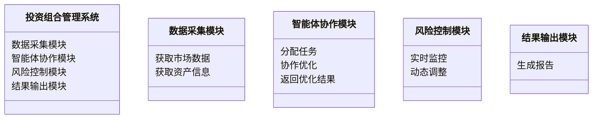
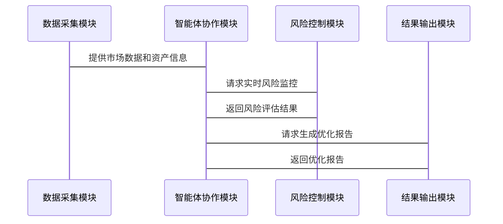

                 


# AI智能体协作：提升价值投资组合管理效率

> 关键词：AI智能体协作，投资组合管理，金融科技，强化学习，分布式系统

> 摘要：本文探讨了AI智能体协作在价值投资组合管理中的应用，分析了传统投资组合管理的局限性，并提出了基于AI智能体协作的优化方案。文章详细介绍了AI智能体协作的核心原理、数学模型、系统设计与实现，最后通过实际案例展示了如何利用AI技术提升投资组合管理的效率。

---

# 第1章: AI智能体协作与价值投资组合管理概述

## 1.1 AI智能体协作的基本概念

### 1.1.1 智能体的定义与特征

智能体（Agent）是指具有感知环境、自主决策和执行任务能力的实体。在AI领域，智能体可以是软件程序或物理设备，能够通过传感器获取信息，并通过执行器与环境交互。智能体的特征包括：

1. **自主性**：能够自主决策，无需外部干预。
2. **反应性**：能够实时感知环境并做出响应。
3. **协作性**：能够与其他智能体协同工作，完成复杂任务。
4. **学习性**：能够通过数据和经验不断优化自身行为。

### 1.1.2 多智能体协作的原理

多智能体协作是指多个智能体通过通信和协调，共同完成复杂任务的过程。其核心原理包括：

1. **通信机制**：智能体之间通过消息传递共享信息。
2. **协调机制**：通过协商或规则确保智能体之间目标一致。
3. **分布式决策**：每个智能体在局部信息下做出决策，全局目标通过局部决策的协同实现。

### 1.1.3 AI智能体协作在金融领域的应用前景

AI智能体协作在金融领域的应用前景广阔，特别是在投资组合管理、风险控制和交易策略优化等方面。通过多智能体协作，可以实现对市场复杂性的深度理解和高效决策。

## 1.2 价值投资组合管理的背景与挑战

### 1.2.1 投资组合管理的基本概念

投资组合管理是指通过优化资产配置，实现投资目标的过程。其核心目标是在风险可控的前提下，最大化投资收益。

### 1.2.2 传统投资组合管理的局限性

传统投资组合管理主要依赖于统计分析和经验判断，存在以下局限性：

1. **信息处理能力有限**：传统方法难以处理海量非结构化数据。
2. **决策滞后**：基于历史数据的分析难以及时捕捉市场变化。
3. **主观性较强**：依赖人工经验，存在主观判断误差。

### 1.2.3 价值投资组合管理的目标与策略

价值投资组合管理的目标是通过挖掘市场中的低估资产，实现长期稳定收益。其策略包括：

1. **基本面分析**：通过分析公司财务数据和行业趋势，识别具有投资价值的资产。
2. **风险控制**：通过分散投资和动态调整，降低投资组合的整体风险。

## 1.3 AI技术在投资组合管理中的应用现状

### 1.3.1 AI在金融分析中的应用

AI技术在金融分析中的应用包括：

1. **自然语言处理（NLP）**：用于分析新闻、财报等文本数据，挖掘市场情绪。
2. **时间序列分析**：用于预测市场走势和资产价格。
3. **图像识别**：用于分析金融市场图表，识别潜在交易机会。

### 1.3.2 AI智能体协作在投资组合优化中的优势

AI智能体协作在投资组合优化中的优势包括：

1. **高效决策**：通过多智能体协作，可以快速响应市场变化，优化资产配置。
2. **风险控制**：通过分布式决策和协作机制，降低单一智能体决策风险。
3. **全局优化**：通过智能体之间的协作，实现全局最优的投资组合。

### 1.3.3 当前存在的问题与挑战

当前AI智能体协作在投资组合管理中的应用还面临以下问题：

1. **技术挑战**：多智能体协作的算法复杂，实现难度较大。
2. **数据问题**：高质量的金融数据获取困难，影响模型的准确性。
3. **监管问题**：AI投资组合管理的透明性和可解释性尚未得到充分验证，面临监管障碍。

## 1.4 本章小结

本章介绍了AI智能体协作的基本概念和在金融领域的应用前景，分析了传统投资组合管理的局限性，并探讨了AI技术在投资组合管理中的应用现状及面临的挑战。

---

# 第2章: AI智能体协作的核心原理与数学模型

## 2.1 多智能体协作的基本原理

### 2.1.1 多智能体系统的定义与分类

多智能体系统（Multi-Agent System, MAS）是指由多个智能体组成的协作系统。根据智能体之间的协作方式，可以将MAS分为以下几类：

1. **分布式 MAS**：智能体之间通过分布式计算协同工作。
2. **集中式 MAS**：智能体之间通过中央协调器进行协作。
3. **混合式 MAS**：结合分布式和集中式的特点，形成混合式协作机制。

### 2.1.2 智能体之间的协作机制

智能体之间的协作机制包括：

1. **通信机制**：通过消息传递共享信息。
2. **协调机制**：通过协商或规则确保智能体之间目标一致。
3. **分布式决策机制**：每个智能体在局部信息下做出决策，全局目标通过局部决策的协同实现。

### 2.1.3 基于AI的协作算法概述

基于AI的协作算法主要包括：

1. **强化学习（Reinforcement Learning, RL）**：通过奖励机制优化智能体的决策行为。
2. **遗传算法（Genetic Algorithm, GA）**：通过模拟生物进化过程，优化智能体的行为策略。
3. **分布式优化算法**：通过分布式计算优化全局目标。

## 2.2 基于强化学习的智能体协作

### 2.2.1 强化学习的基本原理

强化学习是一种通过试错方式优化决策行为的算法。其基本原理包括：

1. **状态空间**：智能体所处的环境状态。
2. **动作空间**：智能体可以执行的动作。
3. **奖励函数**：智能体执行动作后获得的奖励或惩罚。
4. **策略**：智能体在给定状态下选择动作的策略。

### 2.2.2 多智能体强化学习的挑战

多智能体强化学习的挑战包括：

1. **协调问题**：智能体之间的动作需要协调一致，避免冲突。
2. **通信问题**：智能体之间需要通过某种方式共享信息，但信息量可能过大。
3. **计算复杂度**：多智能体协作的计算复杂度较高，实现难度较大。

### 2.2.3 在投资组合管理中的应用

在投资组合管理中，强化学习可以用于优化资产配置。例如，通过强化学习算法，智能体可以根据市场变化动态调整资产权重，实现风险收益的最佳平衡。

## 2.3 分布式AI智能体协作的实现方法

### 2.3.1 分布式系统的基本概念

分布式系统是指由多个计算节点组成的系统，每个节点独立运行，通过通信协议实现协同工作。

### 2.3.2 分布式AI智能体的通信与协调

分布式AI智能体的通信与协调可以通过以下方式实现：

1. **消息传递机制**：智能体之间通过消息传递共享信息。
2. **分布式计算框架**：使用分布式计算框架（如分布式计算框架）实现智能体之间的协作。
3. **共识算法**：通过共识算法确保智能体之间的决策一致。

### 2.3.3 分布式协作的优化策略

分布式协作的优化策略包括：

1. **局部优化**：每个智能体在局部范围内优化决策。
2. **全局优化**：通过智能体之间的协作，实现全局最优。
3. **动态调整**：根据市场变化动态调整协作策略。

## 2.4 本章小结

本章详细介绍了AI智能体协作的核心原理和数学模型，分析了强化学习和分布式协作的实现方法，并探讨了在投资组合管理中的应用。

---

# 第3章: 价值投资组合管理的数学模型与算法

## 3.1 投资组合管理的数学模型

### 3.1.1 投资组合优化的基本目标

投资组合优化的基本目标是在给定风险水平下，最大化预期收益；或者在给定收益水平下，最小化风险。

### 3.1.2 常见的投资组合优化模型

常见的投资组合优化模型包括：

1. **均值-方差模型**：以资产的期望收益和方差为优化目标。
2. **马科维茨有效前沿模型**：通过优化资产配置，找到风险收益的最佳平衡点。
3. **Black-Litterman模型**：结合市场观点和资产配置，优化投资组合。

### 3.1.3 风险-收益平衡的数学表达

风险-收益平衡的数学表达可以表示为：

$$
\text{风险} = \sqrt{\mathbf{w}^T \mathbf{C} \mathbf{w}}
$$

$$
\text{收益} = \mathbf{w}^T \mathbf{m}
$$

其中，$\mathbf{w}$ 是资产权重向量，$\mathbf{C}$ 是资产之间的协方差矩阵，$\mathbf{m}$ 是资产的期望收益向量。

## 3.2 基于AI的优化算法

### 3.2.1 强化学习在投资组合优化中的应用

强化学习可以用于投资组合优化，通过不断试错，找到最优的资产配置策略。例如，可以使用强化学习算法，根据市场变化动态调整资产权重。

### 3.2.2 遗传算法在投资组合优化中的应用

遗传算法可以通过模拟生物进化过程，优化资产配置。例如，可以将资产配置作为基因，通过交叉和变异操作，找到最优的资产组合。

### 3.2.3 其他优化算法的比较与选择

其他优化算法包括模拟退火算法、粒子群优化算法等。在选择算法时，需要考虑计算效率、优化目标和实际应用场景。

## 3.3 投资组合优化的数学公式

### 3.3.1 均值-方差优化模型

均值-方差优化模型的目标是最小化投资组合的方差，同时满足收益约束。数学公式为：

$$
\min_{\mathbf{w}} \mathbf{w}^T \mathbf{C} \mathbf{w}
$$

$$
\text{subject to } \mathbf{w}^T \mathbf{m} = \mu
$$

### 3.3.2 马科维茨有效前沿的数学推导

马科维茨有效前沿的数学推导可以通过拉格朗日乘数法实现。具体步骤如下：

1. **构建拉格朗日函数**：
$$
\mathcal{L} = \mathbf{w}^T \mathbf{C} \mathbf{w} - \lambda (\mathbf{w}^T \mathbf{m} - \mu)
$$

2. **求解最优权重**：
$$
\mathbf{w}^* = \frac{\lambda (\mathbf{C}^{-1} \mathbf{m})}{\mathbf{m}^T \mathbf{C}^{-1} \mathbf{m}}
$$

### 3.3.3 基于强化学习的投资组合优化公式

基于强化学习的投资组合优化公式可以表示为：

$$
R = \sum_{t=1}^T r_t(\mathbf{w}_t)
$$

其中，$R$ 是总奖励，$r_t(\mathbf{w}_t)$ 是第 $t$ 步的奖励，$\mathbf{w}_t$ 是第 $t$ 步的资产权重。

## 3.4 本章小结

本章详细介绍了投资组合管理的数学模型和基于AI的优化算法，分析了不同算法的优缺点，并探讨了在实际应用中的注意事项。

---

# 第4章: 投资组合管理系统的系统设计

## 4.1 系统需求分析

### 4.1.1 系统的功能需求

系统需要实现以下功能：

1. **数据采集**：获取市场数据和资产信息。
2. **智能体协作**：通过多智能体协作优化资产配置。
3. **风险控制**：实时监控投资组合风险，动态调整资产权重。
4. **结果输出**：生成投资组合优化报告和风险评估报告。

### 4.1.2 系统的性能需求

系统需要满足以下性能要求：

1. **实时性**：能够实时处理市场数据，快速响应市场变化。
2. **可扩展性**：能够支持大规模数据处理和多智能体协作。
3. **可解释性**：能够清晰解释投资组合优化的过程和结果。

### 4.1.3 系统的边界与外延

系统的边界包括：

1. **输入边界**：市场数据和资产信息。
2. **输出边界**：投资组合优化报告和风险评估报告。
3. **外部依赖**：数据源和计算资源。

## 4.2 系统架构设计

### 4.2.1 系统架构的总体设计

系统架构可以分为以下几个部分：

1. **数据采集模块**：负责获取市场数据和资产信息。
2. **智能体协作模块**：通过多智能体协作优化资产配置。
3. **风险控制模块**：实时监控投资组合风险，动态调整资产权重。
4. **结果输出模块**：生成投资组合优化报告和风险评估报告。

### 4.2.2 系统功能模块设计

系统功能模块设计可以参考以下类图：



### 4.2.3 系统交互流程

系统交互流程可以参考以下序列图：



## 4.3 系统接口设计

### 4.3.1 系统接口的定义

系统接口的定义包括：

1. **数据接口**：用于数据采集模块与智能体协作模块之间的数据传输。
2. **协作接口**：用于智能体协作模块与风险控制模块之间的协作优化。
3. **输出接口**：用于智能体协作模块与结果输出模块之间的报告生成。

### 4.3.2 接口的实现方式

接口的实现方式包括：

1. **API接口**：通过RESTful API实现模块之间的通信。
2. **消息队列**：通过消息队列实现模块之间的异步通信。

### 4.3.3 接口的设计原则

接口的设计原则包括：

1. **简洁性**：接口设计应尽量简洁，避免复杂性。
2. **可扩展性**：接口设计应具有良好的扩展性，便于后续功能的添加。
3. **可维护性**：接口设计应具有良好的可维护性，便于后续功能的优化和维护。

## 4.4 本章小结

本章详细介绍了投资组合管理系统的系统设计，包括系统需求分析、架构设计和接口设计，并通过类图和序列图展示了系统的整体结构和交互流程。

---

# 第5章: 项目实战

## 5.1 项目背景

### 5.1.1 项目目标

项目目标是通过多智能体协作优化投资组合，实现风险收益的最佳平衡。

### 5.1.2 项目需求

项目需求包括：

1. **数据采集**：获取市场数据和资产信息。
2. **智能体协作**：通过多智能体协作优化资产配置。
3. **风险控制**：实时监控投资组合风险，动态调整资产权重。
4. **结果输出**：生成投资组合优化报告和风险评估报告。

### 5.1.3 项目技术选型

项目技术选型包括：

1. **编程语言**：Python
2. **框架与工具**：TensorFlow、Keras、Pandas、NumPy
3. **数据源**：Yahoo Finance API

## 5.2 项目环境安装

### 5.2.1 安装Python环境

安装Python环境的步骤如下：

1. 下载并安装Python 3.9.0及以上版本。
2. 安装pip：

   ```bash
   python -m pip install --upgrade pip
   ```

### 5.2.2 安装依赖库

安装依赖库的步骤如下：

1. 安装TensorFlow：

   ```bash
   pip install tensorflow
   ```

2. 安装Pandas和NumPy：

   ```bash
   pip install pandas numpy
   ```

3. 安装Yahoo Finance API：

   ```bash
   pip install yfinance
   ```

## 5.3 项目核心实现

### 5.3.1 数据采集模块

数据采集模块的实现代码如下：

```python
import pandas as pd
import numpy as np
import yfinance as yf

def get_market_data(tickers, start_date, end_date):
    data = yf.download(tickers, start=start_date, end=end_date)
    return data.dropna()
```

### 5.3.2 智能体协作模块

智能体协作模块的实现代码如下：

```python
import numpy as np

class Agent:
    def __init__(self, initial_weights):
        self.weights = initial_weights
        self.reward = 0

    def update_weights(self, new_weights):
        self.weights = new_weights

    def get_reward(self):
        return self.reward

def collaborate_agents(agents, market_data):
    # 智能体协作逻辑
    pass
```

### 5.3.3 风险控制模块

风险控制模块的实现代码如下：

```python
import numpy as np

def calculate_variance(weights, covariance_matrix):
    return np.sqrt(weights.T @ covariance_matrix @ weights)

def risk_control(weights, covariance_matrix, threshold=0.05):
    variance = calculate_variance(weights, covariance_matrix)
    if variance < threshold:
        return True
    else:
        return False
```

### 5.3.4 结果输出模块

结果输出模块的实现代码如下：

```python
import pandas as pd

def generate_report(weights, returns):
    report = pd.DataFrame({
        '资产': weights.index,
        '权重': weights.values,
        '预期收益': returns.dot(weights)
    })
    return report
```

## 5.4 项目实现步骤

### 5.4.1 环境安装

按照上述步骤安装Python环境和依赖库。

### 5.4.2 数据采集

使用Yahoo Finance API获取市场数据和资产信息。

### 5.4.3 智能体协作

通过智能体协作模块，优化资产配置。

### 5.4.4 风险控制

实时监控投资组合风险，动态调整资产权重。

### 5.4.5 结果输出

生成投资组合优化报告和风险评估报告。

## 5.5 项目实战案例分析

### 5.5.1 数据获取与预处理

假设我们选择5只股票作为投资组合，使用Yahoo Finance API获取它们的市场数据。

```python
tickers = ['AAPL', 'MSFT', 'GOOGL', 'AMZN', 'NFLX']
start_date = '2020-01-01'
end_date = '2023-01-01'

market_data = get_market_data(tickers, start_date, end_date)
```

### 5.5.2 智能体协作优化

通过多智能体协作，优化资产配置。例如，使用强化学习算法，动态调整资产权重。

### 5.5.3 风险控制

实时监控投资组合的风险，动态调整资产权重，确保风险在可控范围内。

### 5.5.4 结果输出

生成投资组合优化报告和风险评估报告，展示优化后的资产配置和预期收益。

## 5.6 本章小结

本章通过一个实际案例，详细介绍了投资组合管理系统的实现过程，包括环境安装、核心模块实现、数据采集、智能体协作、风险控制和结果输出。

---

# 第6章: 总结与展望

## 6.1 总结

本文详细探讨了AI智能体协作在价值投资组合管理中的应用，分析了传统投资组合管理的局限性，并提出了基于AI智能体协作的优化方案。通过理论分析和实际案例，展示了如何利用AI技术提升投资组合管理的效率。

## 6.2 最佳实践 tips

1. **数据质量**：确保数据的准确性和完整性，选择可靠的金融数据源。
2. **算法选择**：根据实际需求选择合适的算法，如强化学习和遗传算法。
3. **系统设计**：注重系统的可扩展性和可维护性，便于后续优化和维护。
4. **风险管理**：实时监控投资组合风险，动态调整资产权重，确保风险在可控范围内。

## 6.3 未来展望

未来，随着AI技术的不断发展，投资组合管理将更加智能化和自动化。以下是未来的发展方向：

1. **智能体协作的进一步优化**：通过改进协作算法，提高投资组合优化的效率和准确性。
2. **多模态数据的融合**：利用多模态数据（如文本、图像等），提升投资组合管理的智能化水平。
3. **可解释性增强**：提高AI决策的透明性和可解释性，便于投资者理解和信任。
4. **个性化投资服务**：根据投资者的个性化需求，提供定制化的投资组合管理服务。

## 6.4 本章小结

本章总结了全文的主要内容，并提出了未来的发展方向和最佳实践 tips。

---

# 作者信息

作者：AI天才研究院/AI Genius Institute & 禅与计算机程序设计艺术/Zen And The Art of Computer Programming

---

**[END]**

