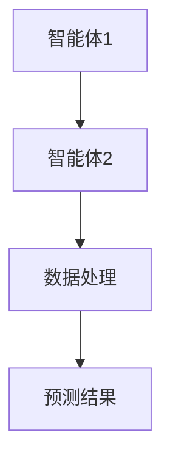
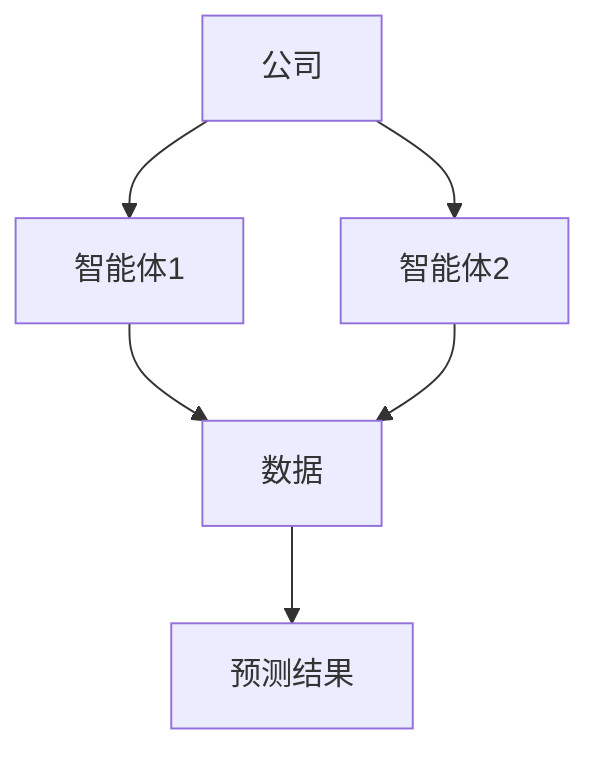
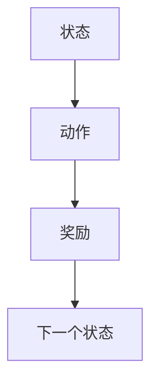
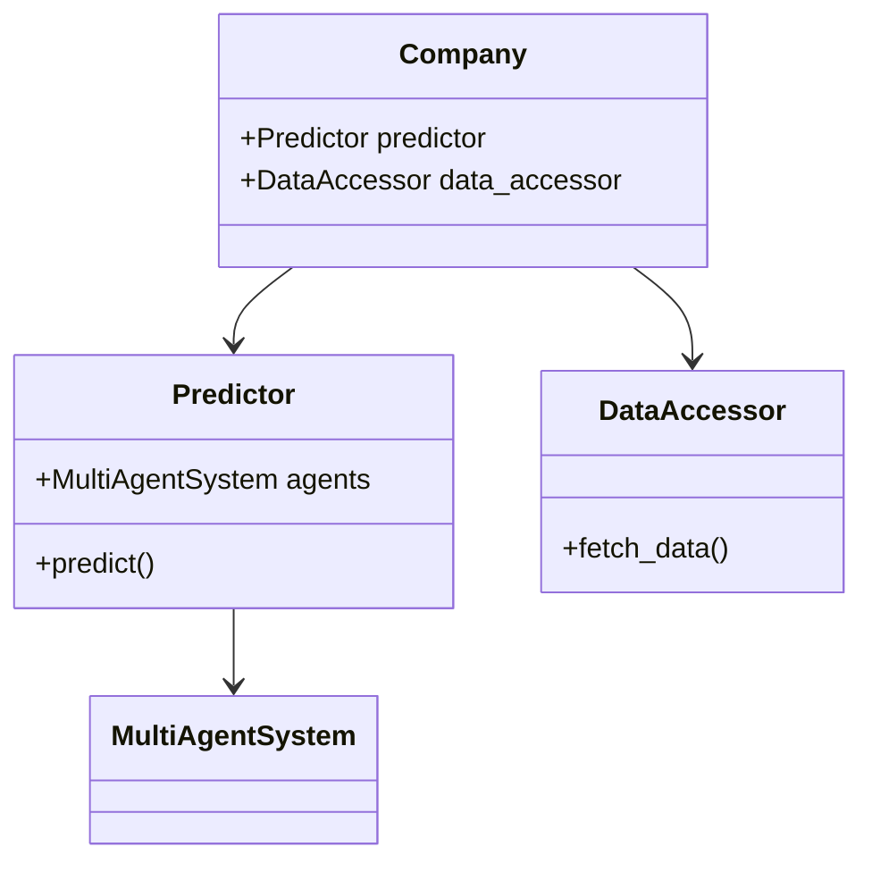
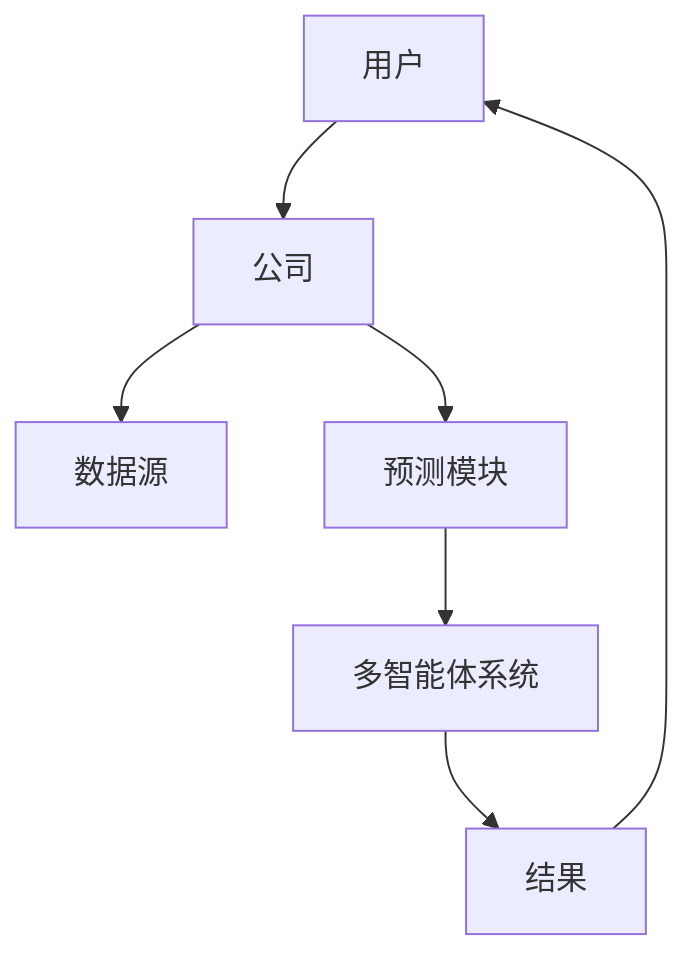
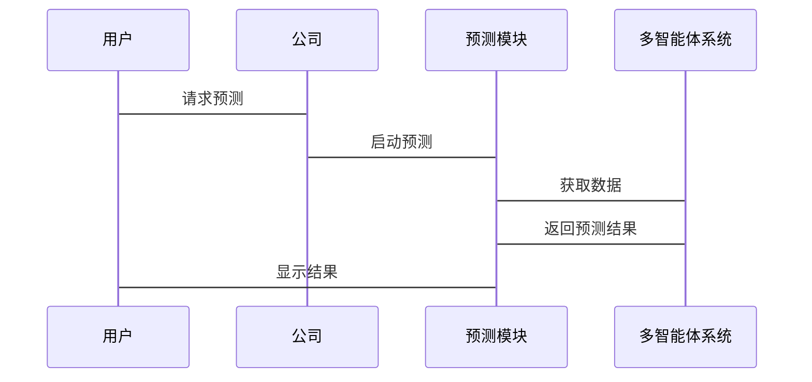

                 


# AI智能体协作：提升对公司未来盈利能力的预测

## 关键词：AI智能体、协作预测、机器学习、盈利能力、预测模型

## 摘要：  
本文详细探讨了如何通过AI智能体协作来提升对公司未来盈利能力的预测能力。文章从背景、核心概念、算法原理、系统架构到项目实战，全面分析了AI智能体协作的优势和实现方法，帮助企业在复杂市场环境中做出更精准的决策。

---

## 第1章: 背景介绍

### 1.1 问题背景  
预测公司未来盈利能力是企业战略决策的核心问题之一。传统预测方法依赖单一模型，存在数据稀疏性和模型局限性，难以捕捉多维度市场动态。AI智能体协作通过多智能体的协同，提供更全面的预测能力。

### 1.2 问题描述  
AI智能体协作涉及多个智能体共同分析市场、财务和运营数据，构建复杂的预测模型。其核心在于智能体之间的高效协作和信息共享，以提高预测的准确性和鲁棒性。

### 1.3 问题解决  
AI智能体协作通过分布式计算和多智能体强化学习，克服了传统方法的不足，实现了对市场变化的实时响应和精准预测。

### 1.4 边界与外延  
预测范围界定在公司内部数据和外部市场数据，协作边界限于智能体之间的信息共享，扩展到其他领域如供应链管理。

### 1.5 核心要素组成  
包括数据驱动的智能体、协作机制和预测模型优化，确保预测的准确性和实时性。

---

## 第2章: 核心概念与联系

### 2.1 AI智能体协作的原理  
多智能体系统通过分布式协作，利用强化学习优化预测模型。Mermaid图展示协作流程：



### 2.2 概念属性特征对比  
| 智能体类型 | 协作方式 | 评价指标 |
|------------|-----------|-----------|
| 单智能体    | 并行协作  | 预测精度 |
| 多智能体    | 串行协作  | 鲁棒性   |

### 2.3 ER实体关系图  
展示公司、智能体和数据的关系：



---

## 第3章: 算法原理讲解

### 3.1 多智能体强化学习算法  
原理：通过多个智能体协同学习，优化预测模型。流程图：



### 3.2 算法实现  
代码示例：

```python
def multi_agent_reinforcement_learning(env):
    agents = [Agent() for _ in range(num_agents)]
    while not done:
        actions = [agent.act(state) for agent in agents]
        next_state, reward, done, _ = env.step(actions)
        for i in range(num_agents):
            agents[i].learn(state, actions[i], reward, next_state)
        state = next_state
```

### 3.3 数学模型  
优化目标函数：

$$ \max_{\theta} \sum_{i=1}^{n} \text{ Reward}_i $$

---

## 第4章: 系统分析与架构设计方案

### 4.1 问题场景介绍  
系统需处理多源数据，构建分布式预测模型，支持实时协作。

### 4.2 系统功能设计  
类图展示领域模型：



### 4.3 系统架构设计  
架构图展示系统结构：



### 4.4 接口与交互设计  
序列图展示协作过程：



---

## 第5章: 项目实战

### 5.1 环境安装  
安装Python和相关库，如TensorFlow和Keras。

### 5.2 核心代码实现  
实现多智能体系统的预测模块：

```python
import numpy as np
from tensorflow.keras import layers

class Agent:
    def __init__(self, input_dim):
        self.model = self.build_model(input_dim)
    
    def build_model(self, input_dim):
        model = keras.Sequential()
        model.add(layers.Dense(64, activation='relu', input_dim=input_dim))
        model.add(layers.Dense(1, activation='sigmoid'))
        return model
```

### 5.3 案例分析  
通过实际案例展示预测结果，分析模型的准确性和鲁棒性。

### 5.4 项目小结  
总结项目成果，强调AI智能体协作的优势和实际应用价值。

---

## 第6章: 最佳实践、小结、注意事项、拓展阅读

### 6.1 最佳实践 tips  
- 数据预处理是关键。
- 定期更新模型以适应市场变化。
- 保持智能体间的高效通信。

### 6.2 小结  
AI智能体协作通过多智能体系统，显著提升了预测的准确性和实时性，为企业提供了有力的支持。

### 6.3 注意事项  
- 数据隐私和安全问题需重视。
- 智能体协作需考虑计算资源限制。
- 模型调优需结合业务需求。

### 6.4 拓展阅读  
推荐相关书籍和论文，深入学习AI智能体协作和预测模型优化。

---

## 作者：AI天才研究院 & 禅与计算机程序设计艺术

