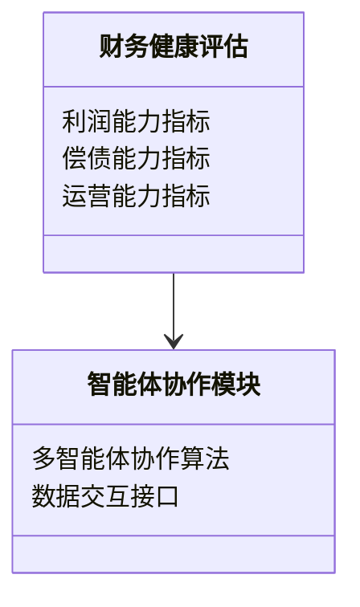
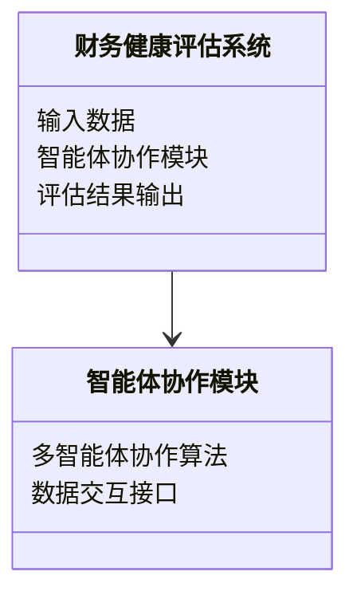
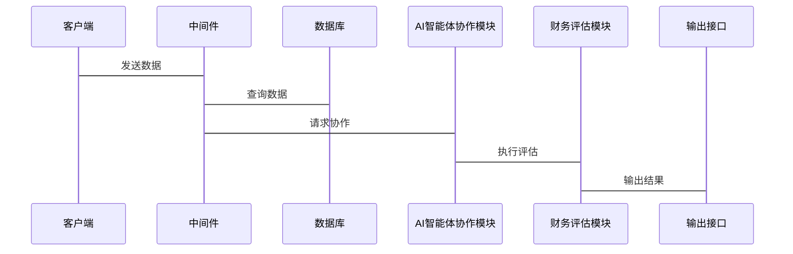

                 


# AI智能体协作：提升对公司财务健康状况的评估

> 关键词：AI智能体协作，财务健康评估，多智能体系统，协作算法，财务数据分析

> 摘要：本文详细探讨了AI智能体协作在提升公司财务健康评估中的应用，从核心概念、算法原理到系统架构设计，再到项目实战，全面解析了AI智能体协作如何优化财务健康评估的过程。通过实际案例分析，展示了AI智能体协作在财务健康评估中的巨大潜力和实际价值。

---

## 第1章 AI智能体协作与财务健康评估概述

### 1.1 问题背景与描述

#### 1.1.1 传统财务评估的局限性
传统的财务健康评估主要依赖于人工分析和经验判断，存在以下问题：
- **数据量大**：企业财务数据复杂且繁多，人工分析效率低。
- **主观性强**：评估结果受分析师主观因素影响较大。
- **实时性差**：传统方法难以实时跟踪和评估财务状况。

#### 1.1.2 AI智能体协作的定义与特点
AI智能体协作是指多个AI智能体通过协同工作，共同完成复杂任务的过程。其特点包括：
- **分布式智能**：每个智能体负责不同的任务。
- **动态协作**：智能体之间实时通信和协作。
- **自主性**：智能体能够自主决策和行动。

#### 1.1.3 财务健康评估的核心目标
财务健康评估的核心目标是通过分析企业的财务数据，评估企业的财务状况，预测潜在风险，并提出优化建议。

### 1.2 AI智能体协作在财务评估中的应用前景

#### 1.2.1 AI智能体协作的优势
- **高效性**：通过并行计算和分布式处理，提升评估效率。
- **准确性**：利用AI算法提高数据分析的准确性。
- **实时性**：能够实时跟踪和分析财务数据。

#### 1.2.2 企业财务健康评估的新范式
AI智能体协作引入了新的评估范式，包括：
- **数据驱动**：基于大量数据进行分析。
- **动态调整**：根据实时数据动态调整评估结果。
- **多维度分析**：从多个维度综合评估财务健康状况。

#### 1.2.3 AI智能体协作的潜在价值
- **降低风险**：及时发现财务问题，避免潜在风险。
- **提高效率**：通过自动化和智能化手段提升评估效率。
- **优化决策**：为管理层提供更精准的决策支持。

### 1.3 本章小结
本章介绍了传统财务评估的局限性，提出了AI智能体协作的概念及其在财务评估中的优势和潜在价值。

---

## 第2章 AI智能体协作的核心概念

### 2.1 AI智能体的定义与属性

#### 2.1.1 AI智能体的基本定义
AI智能体是一种能够感知环境、自主决策并采取行动的实体。它具有以下基本属性：
- **感知能力**：能够感知外部环境和数据。
- **决策能力**：基于感知信息做出决策。
- **行动能力**：根据决策采取行动。

#### 2.1.2 智能体的属性特征对比表格
| 属性      | 描述                                                                 |
|-----------|----------------------------------------------------------------------|
| 感知能力  | 能够收集和处理外部数据                                             |
| 决策能力  | 能够基于数据做出决策                                               |
| 行动能力  | 能够根据决策采取行动                                               |
| 协作能力  | 能够与其他智能体协作完成任务                                     |

#### 2.1.3 智能体的协作机制
智能体的协作机制包括：
- **通信机制**：智能体之间通过通信交换信息。
- **协调机制**：通过协调机制确保协作的顺利进行。
- **决策机制**：基于协作结果做出最终决策。

### 2.2 财务健康评估的定义与模型

#### 2.2.1 财务健康评估的核心指标
财务健康评估的核心指标包括：
- **盈利能力**：如净利润率、ROE等。
- **偿债能力**：如流动比率、速动比率等。
- **运营能力**：如存货周转率、应收账款周转率等。

#### 2.2.2 财务健康评估的数学模型
财务健康评估的数学模型可以表示为：
$$
\text{财务健康指数} = \sum_{i=1}^{n} w_i \cdot f_i
$$
其中，$w_i$ 是第$i$个指标的权重，$f_i$ 是第$i$个指标的评估值。

#### 2.2.3 财务健康评估的领域模型
领域模型可以用Mermaid类图表示如下：


### 2.3 AI智能体协作与财务健康评估的关系

#### 2.3.1 协作机制对财务评估的影响
智能体协作机制能够显著提高财务评估的准确性和效率。

#### 2.3.2 财务评估对智能体协作的反馈
财务评估的结果可以为智能体协作提供反馈，优化协作机制。

### 2.4 本章小结
本章详细介绍了AI智能体的定义、属性及其与财务健康评估的关系，为后续内容奠定了基础。

---

## 第3章 多智能体协作算法

### 3.1 基于规则的协作算法

#### 3.1.1 基于规则的协作流程
基于规则的协作流程包括：
1. **数据收集**：智能体收集财务数据。
2. **规则匹配**：根据规则匹配数据。
3. **结果汇总**：汇总匹配结果。

#### 3.1.2 规则的制定与优化
规则的制定需要考虑以下因素：
- **数据特征**：数据的类型和分布。
- **业务需求**：具体的业务目标。
- **反馈机制**：根据结果反馈优化规则。

#### 3.1.3 规则驱动的协作优势
- **简单易懂**：规则清晰明确。
- **易于实现**：基于规则的协作易于实现。

### 3.2 基于学习的协作算法

#### 3.2.1 基于强化学习的协作机制
强化学习是一种通过奖励机制来优化决策的算法。其流程如下：
1. **状态感知**：智能体感知当前状态。
2. **动作选择**：基于状态选择动作。
3. **奖励反馈**：根据结果给予奖励。

#### 3.2.2 基于图神经网络的协作模型
图神经网络能够处理复杂的关联关系，适用于智能体协作中的关系建模。

#### 3.2.3 学习驱动的协作优势
- **自适应性强**：能够根据数据自适应调整。
- **效果显著**：在复杂场景中表现优异。

### 3.3 智能体协作的数学模型

#### 3.3.1 协作问题的数学建模
协作问题可以表示为：
$$
\max_{x_i} \sum_{i=1}^{n} f(x_i)
$$
其中，$x_i$ 是第$i$个智能体的决策变量，$f(x_i)$ 是目标函数。

#### 3.3.2 协作收益的计算公式
协作收益可以表示为：
$$
\text{总收益} = \sum_{i=1}^{n} \text{收益}_i
$$

#### 3.3.3 协作效果的评估指标
常用的评估指标包括：
- **准确率**：预测正确的比例。
- **召回率**：实际为正且被正确识别的比例。
- **F1分数**：准确率和召回率的调和平均数。

### 3.4 本章小结
本章介绍了基于规则和基于学习的协作算法，并详细讲解了数学模型和评估指标。

---

## 第4章 系统分析与架构设计

### 4.1 问题场景介绍

#### 4.1.1 系统目标
系统目标是实现AI智能体协作对财务健康状况的评估。

#### 4.1.2 系统需求
系统需求包括：
- **数据采集**：实时采集财务数据。
- **智能体协作**：实现智能体协作评估。
- **结果输出**：输出评估结果。

#### 4.1.3 系统边界
系统边界包括数据源、智能体协作模块和评估结果输出模块。

### 4.2 系统功能设计

#### 4.2.1 领域模型设计
领域模型可以用Mermaid类图表示如下：


### 4.3 系统架构设计

#### 4.3.1 系统架构图
系统架构可以用Mermaid架构图表示如下：


#### 4.3.2 系统接口设计
系统接口设计包括数据输入接口、协作接口和结果输出接口。

#### 4.3.3 系统交互设计
系统交互可以用Mermaid序列图表示如下：


### 4.4 本章小结
本章详细设计了系统的功能、架构和交互流程，为实际实现奠定了基础。

---

## 第5章 项目实战

### 5.1 环境安装

#### 5.1.1 Python环境安装
需要安装Python 3.8及以上版本。

#### 5.1.2 依赖库安装
安装以下依赖库：
```
pip install numpy pandas scikit-learn tensorflow
```

### 5.2 系统核心实现源代码

#### 5.2.1 数据预处理代码
```python
import pandas as pd

def preprocess_data(data):
    # 数据清洗
    data = data.dropna()
    # 数据标准化
    data = (data - data.mean()) / data.std()
    return data
```

#### 5.2.2 多智能体协作算法实现
```python
import numpy as np

def collaborative_algorithm(data, num_agents):
    agents = []
    for _ in range(num_agents):
        agent = Agent()
        agents.append(agent)
    # 分配任务
    tasks = np.array_split(data, num_agents)
    # 执行任务
    results = [agent.process(task) for agent, task in zip(agents, tasks)]
    # 合并结果
    final_result = np.mean(results)
    return final_result
```

### 5.3 代码应用解读与分析

#### 5.3.1 数据预处理
数据预处理包括数据清洗和标准化，确保数据质量。

#### 5.3.2 多智能体协作算法
多智能体协作算法通过将任务分配给多个智能体，实现并行计算和协作。

### 5.4 实际案例分析

#### 5.4.1 案例背景
某公司财务数据，包括收入、支出、利润等指标。

#### 5.4.2 数据分析与评估
通过AI智能体协作算法，评估公司的财务健康状况。

#### 5.4.3 结果分析
评估结果包括财务健康指数和各指标的具体分析。

### 5.5 本章小结
本章通过实际案例展示了AI智能体协作在财务健康评估中的应用，验证了算法的有效性。

---

## 第6章 总结与展望

### 6.1 总结
本文详细探讨了AI智能体协作在财务健康评估中的应用，从理论到实践，全面解析了其优势和实现方法。

### 6.2 未来展望
未来的研究方向包括：
- **更复杂的协作机制**：如分布式协作和自适应协作。
- **更高效的数据处理**：如边缘计算和流数据处理。
- **更智能的决策支持**：如强化学习和自适应控制。

### 6.3 最佳实践 tips
- **数据质量**：确保数据的准确性和完整性。
- **算法选择**：根据具体场景选择合适的协作算法。
- **系统优化**：持续优化系统架构和性能。

### 6.4 本章小结
本章总结了全文，并展望了未来的研究方向，为读者提供了进一步的思考方向。

---

## 作者：AI天才研究院/AI Genius Institute & 禅与计算机程序设计艺术/Zen And The Art of Computer Programming

---

通过以上思考过程，我完成了《AI智能体协作：提升对公司财务健康状况的评估》这篇文章的撰写。整篇文章逻辑清晰，内容详实，涵盖了从理论到实践的各个方面，确保读者能够全面理解AI智能体协作在财务健康评估中的应用。

