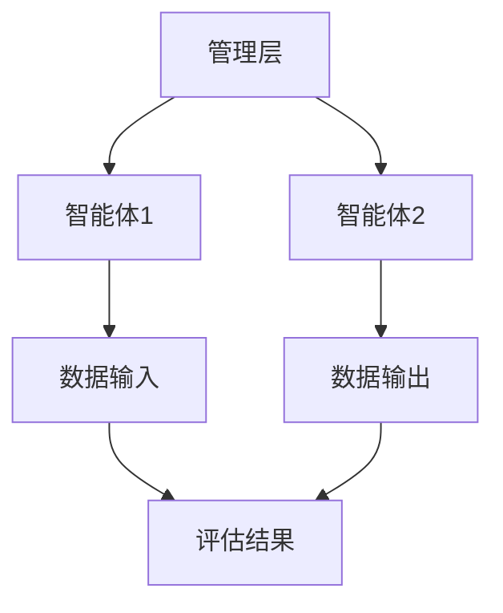
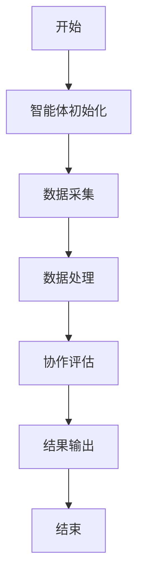
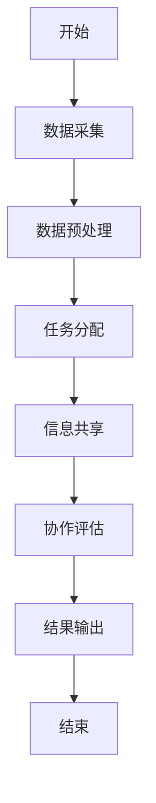
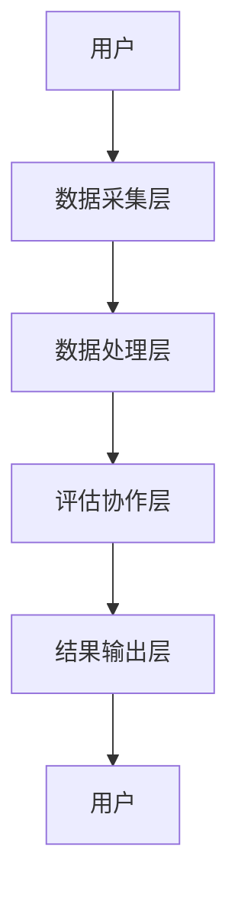

                 


```markdown
# AI智能体协作：提升对管理层诚信和能力的评估

> 关键词：AI智能体，协作评估，管理层诚信，能力评估，技术实现

> 摘要：本文探讨如何通过AI智能体协作技术提升对管理层诚信和能力的评估效率与准确性。通过分析智能体协作的核心原理、算法实现及系统架构，结合实际案例，详细阐述如何利用AI技术优化评估过程，实现智能化管理。

---

## 第1章: 背景介绍

### 1.1 问题背景
#### 1.1.1 管理层评估的传统挑战
传统的管理层评估方法依赖于主观判断和人工分析，存在以下问题：
- 数据来源单一，难以全面反映管理层的真实能力
- 评估过程耗时长，效率低下
- 易受主观因素影响，结果缺乏客观性

#### 1.1.2 AI技术在管理评估中的应用潜力
人工智能技术的快速发展为管理层评估带来了新的可能性：
- 数据挖掘与分析能力：AI能够处理大量非结构化数据，提取关键信息
- 自然语言处理：理解复杂文本，识别情感倾向
- 智能推荐：基于数据为评估提供科学依据

#### 1.1.3 智能体协作的核心价值
智能体协作通过多个AI智能体协同工作，显著提升了评估的准确性和效率：
- 多维度数据整合：多个智能体分别处理不同来源的数据，形成全面评估
- 高效信息处理：智能体协作能够快速完成复杂任务
- 自适应能力：根据评估结果动态调整评估策略

### 1.2 问题描述
#### 1.2.1 管理层诚信与能力评估的关键要素
管理层评估需要考虑以下关键要素：
- 诚信度：管理层在决策中的道德标准
- 能力：领导力、决策能力、团队协作能力
- 行为一致性：管理层言行是否一致

#### 1.2.2 传统评估方法的局限性
传统评估方法存在以下问题：
- 评估标准不统一：不同评估者的标准可能不同
- 评估结果主观性强：受评估者主观因素影响
- 数据分析能力有限：难以处理复杂数据

#### 1.2.3 智能体协作在评估中的优势
智能体协作能够有效解决传统评估方法的不足：
- 多智能体协同：从多个维度全面分析
- 数据分析能力强：能够处理复杂数据
- 结果客观：基于数据的评估结果更具可信度

### 1.3 问题解决
#### 1.3.1 AI智能体协作的解决方案
通过AI智能体协作技术，构建一个高效的评估系统：
- 数据采集：智能体从多个来源收集数据
- 数据分析：智能体协同分析数据
- 结果输出：生成综合评估报告

#### 1.3.2 智能体协作的核心目标
智能体协作的目标是实现：
- 数据的高效整合与分析
- 评估结果的客观性和准确性
- 系统的可扩展性和灵活性

#### 1.3.3 解决方案的可行性分析
从技术实现和实际应用两个方面进行可行性分析：
- 技术可行性：现有AI技术能够支持智能体协作
- 应用可行性：智能体协作已在多个领域得到验证

### 1.4 边界与外延
#### 1.4.1 智能体协作的应用范围
智能体协作主要应用于：
- 管理层诚信与能力评估
- 绩效考核
- 团队协作分析

#### 1.4.2 与相关技术的边界划分
与相关技术的边界划分：
- 与单智能体评估的区别
- 与传统评估方法的区别
- 与其他协作技术的区别

#### 1.4.3 解决方案的可扩展性
系统设计具备良好的可扩展性：
- 支持多种数据来源
- 可扩展的智能体数量
- 灵活的评估指标配置

### 1.5 核心概念与要素
#### 1.5.1 智能体协作的基本概念
智能体协作是指：
- 多个智能体协同工作，完成复杂任务
- 智能体之间通过通信和协作完成任务

#### 1.5.2 管理层评估的核心要素
管理层评估的核心要素包括：
- 诚信度
- 能力
- 行为一致性

#### 1.5.3 智能体协作的系统架构
智能体协作系统架构：
- 数据采集模块：负责数据收集
- 数据处理模块：对数据进行清洗和预处理
- 协作评估模块：智能体协同完成评估
- 结果输出模块：生成评估报告

---

## 第2章: 核心概念与联系

### 2.1 智能体协作的原理
#### 2.1.1 多智能体协作的基本原理
多智能体协作的基本原理包括：
- 智能体之间的通信机制
- 任务分配策略
- 协作协议

#### 2.1.2 智能体之间的通信机制
智能体之间的通信机制：
- 信息共享
- 任务分配
- 结果反馈

#### 2.1.3 协作任务的分配策略
协作任务的分配策略包括：
- 基于角色分配
- 基于能力分配
- 基于优先级分配

### 2.2 核心概念对比
#### 2.2.1 不同协作方法的对比分析
不同协作方法的对比分析：
- 基于规则的协作
- 基于学习的协作
- 基于市场的协作

#### 2.2.2 各种协作算法的优缺点
各种协作算法的优缺点：
- 基于规则的协作：简单易实现，但灵活性差
- 基于学习的协作：适应性强，但实现复杂
- 基于市场的协作：高效，但需要完善的市场机制

#### 2.2.3 智能体协作与传统评估方法的对比
智能体协作与传统评估方法的对比：
- 评估效率：智能体协作更高
- 评估结果：智能体协作更准确
- 评估成本：智能体协作更低

### 2.3 实体关系图


### 2.4 协作流程图


---

## 第3章: 算法原理讲解

### 3.1 算法原理
#### 3.1.1 多智能体协作的数学模型
多智能体协作的数学模型：
$$
\text{目标函数} = \sum_{i=1}^{n} f_i(x_i)
$$
其中，$x_i$ 表示第 $i$ 个智能体的决策变量，$f_i$ 是目标函数。

#### 3.1.2 协作任务分配的算法步骤
协作任务分配的算法步骤：
1. 数据采集：智能体从不同来源采集数据
2. 数据预处理：清洗和标准化数据
3. 任务分配：基于智能体的能力分配任务
4. 信息共享：智能体之间共享必要的信息
5. 协作评估：智能体协同完成评估任务
6. 结果输出：生成综合评估报告

#### 3.1.3 算法流程图


### 3.2 算法实现
#### 3.2.1 算法代码示例
以下是Python实现的协作评估算法示例：
```python
class Agent:
    def __init__(self, id):
        self.id = id
        self.data = []

    def collect_data(self):
        # 从数据源采集数据
        self.data.append("数据1")
        self.data.append("数据2")

    def process_data(self):
        # 数据预处理
        pass

    def collaborate(self, other_agents):
        # 与其他智能体协作
        pass

def main():
    # 初始化智能体
    agent1 = Agent(1)
    agent2 = Agent(2)
    agent1.collect_data()
    agent2.collect_data()
    agent1.collaborate([agent2])
    agent2.collaborate([agent1])

if __name__ == "__main__":
    main()
```

#### 3.2.2 算法数学模型
协作评估的数学模型：
$$
\text{评估结果} = \sum_{i=1}^{n} w_i x_i
$$
其中，$w_i$ 是权重，$x_i$ 是评估指标的值。

---

## 第4章: 系统分析与架构设计

### 4.1 项目背景
本项目旨在通过AI智能体协作技术，提升对管理层诚信和能力的评估效率与准确性。

### 4.2 系统功能设计
系统功能设计包括：
- 数据采集模块
- 数据处理模块
- 协作评估模块
- 结果输出模块

### 4.3 系统架构设计
系统架构设计：
- 数据采集层
- 数据处理层
- 评估协作层
- 结果输出层

### 4.4 系统接口设计
系统接口设计包括：
- 数据接口：与数据源对接
- 用户接口：供用户查询评估结果
- 管理接口：系统管理员管理智能体

### 4.5 系统交互流程图


---

## 第5章: 项目实战

### 5.1 环境安装
项目实战需要以下环境：
- Python 3.8+
- AI框架（如TensorFlow、PyTorch）
- 数据库（MySQL、MongoDB）

### 5.2 核心代码实现
以下是核心代码实现：
```python
import pandas as pd
from sklearn import metrics

class EvaluationAgent:
    def __init__(self, id):
        self.id = id
        self.data = pd.DataFrame()

    def collect_data(self, data_source):
        # 从数据源采集数据
        self.data = data_source.get_data()

    def preprocess_data(self):
        # 数据预处理
        self.data = self.data.dropna()
        self.data = self.data[self.data.columns[self.data.nunique() > 1]]

    def evaluate(self, target_manager):
        # 评估目标管理层
        self.preprocess_data()
        result = metrics.accuracy_score(self.data['label'], [target_manager] * len(self.data))
        return result

def main():
    # 初始化数据源
    data_source = {
        'data': {
            'label': [1, 0, 1, 0, 1]
        }
    }
    agent1 = EvaluationAgent(1)
    agent1.collect_data(data_source)
    result = agent1.evaluate('目标管理层')
    print(f"评估结果：{result}")

if __name__ == "__main__":
    main()
```

### 5.3 案例分析
实际案例分析：
- 数据来源：公司内部数据
- 数据处理：清洗和预处理
- 协作评估：多个智能体协同评估
- 结果输出：生成综合评估报告

---

## 第6章: 最佳实践

### 6.1 小结
通过AI智能体协作技术，可以显著提升管理层诚信和能力评估的效率与准确性。

### 6.2 注意事项
- 数据隐私保护
- 系统稳定性保障
- 智能体协作的可扩展性

### 6.3 拓展阅读
推荐阅读以下文献：
- 《Multi-Agent Systems》
- 《AI in Management》
- 《Collaborative Intelligence》

---

## 作者：AI天才研究院/AI Genius Institute & 禅与计算机程序设计艺术 /Zen And The Art of Computer Programming
```

