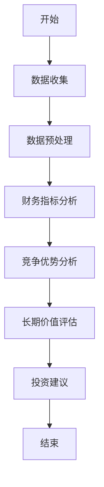
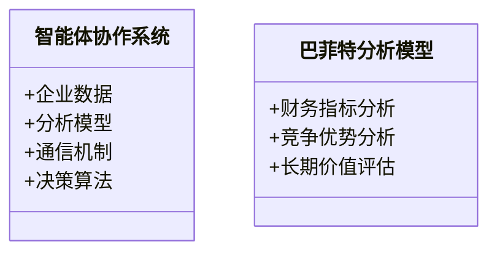

                 


# AI智能体协作：提升巴菲特的企业分析方法

> 关键词：AI智能体协作、巴菲特分析方法、企业分析、投资策略、算法优化

> 摘要：本文探讨了如何利用AI智能体协作技术优化巴菲特的经典企业分析方法。通过分解分析流程、优化算法和系统设计，展示了AI技术在投资分析中的潜力，为投资者提供了更高效、更准确的决策支持工具。

---

## 第1章：AI智能体协作与巴菲特分析方法的背景介绍

### 1.1 AI智能体协作的基本概念

#### 1.1.1 什么是AI智能体
AI智能体是能够感知环境、采取行动以实现特定目标的实体。它们可以是软件程序、机器人或其他形式的智能系统，具备自主决策和学习能力。

#### 1.1.2 AI智能体协作的定义与特点
AI智能体协作是指多个智能体共同工作，通过信息共享和任务分配，协同完成复杂任务。其特点包括模块化、分布式、高效率和自我优化。

#### 1.1.3 AI智能体协作的核心要素
- **任务分解**：将复杂任务分解为多个子任务，每个子任务由一个智能体负责。
- **通信机制**：智能体之间通过特定协议交换信息，确保协同工作。
- **协调机制**：通过算法实现任务分配和进度跟踪，确保整体目标的实现。

### 1.2 巴菲特企业分析方法概述

#### 1.2.1 巴菲特投资理念的核心思想
巴菲特的投资理念基于长期价值投资，注重企业的财务健康、竞争优势和管理团队。他强调企业内在价值和安全边际。

#### 1.2.2 巴菲特企业分析方法的主要步骤
1. **财务指标分析**：评估企业的盈利能力、成长能力和财务健康状况。
2. **竞争优势分析**：识别企业的护城河，如成本优势、品牌影响力等。
3. **长期价值评估**：预测企业的未来价值，判断其投资潜力。

#### 1.2.3 巴菲特分析方法的局限性
- **数据依赖性**：高度依赖财务数据，可能忽略非财务因素。
- **主观判断**：分析过程涉及大量主观判断，可能受分析师经验影响。
- **效率问题**：手动分析耗时，难以处理大量数据。

### 1.3 AI智能体协作与巴菲特分析方法的结合

#### 1.3.1 结合的背景与意义
随着企业数据的爆炸式增长，传统的分析方法已难以应对复杂多变的市场环境。AI智能体协作技术的引入，为提升分析效率和准确性提供了可能。

#### 1.3.2 结合的目标与价值
- **提高分析效率**：通过智能体协作快速处理大量数据，缩短分析周期。
- **增强分析深度**：利用AI技术挖掘数据中的潜在信息，提供更深入的见解。
- **优化投资决策**：基于智能分析结果，提供更精准的投资建议。

#### 1.3.3 结合的实现路径
- **任务分解**：将企业分析流程分解为多个子任务，每个子任务由一个AI智能体负责。
- **数据共享**：智能体之间共享数据和分析结果，确保整体分析的连贯性。
- **协同优化**：通过算法优化智能体之间的协作，提升整体分析效果。

---

## 第2章：AI智能体协作的核心概念与联系

### 2.1 AI智能体协作的核心原理

#### 2.1.1 多智能体协作的基本原理
多智能体协作通过任务分解和角色分配，使每个智能体专注于特定任务，协同完成整体目标。通信机制和协调算法确保智能体之间的有效协作。

#### 2.1.2 AI智能体协作的通信机制
智能体之间通过消息传递、共享数据库或事件驱动的方式进行通信，确保信息同步和任务协调。

#### 2.1.3 智能体协作的决策过程
基于接收到的信息和预设的规则，智能体做出决策，调整自己的行动以支持整体目标的实现。

### 2.2 巴菲特分析方法的结构化模型

#### 2.2.1 企业财务指标分析模型
包括盈利能力、成长能力、财务健康状况等指标，通过量化分析评估企业的财务状况。

#### 2.2.2 企业竞争优势分析模型
识别企业的竞争优势，如成本优势、品牌影响力、技术壁垒等，评估企业在市场中的竞争力。

#### 2.2.3 企业长期价值评估模型
基于财务指标和竞争优势，预测企业的未来价值，判断其投资潜力。

### 2.3 AI智能体协作与巴菲特分析方法的实体关系图

```mermaid
er
  actor 智能体协作系统
  actor 巴菲特分析模型
  actor 企业数据
  actor 投资决策者
  relation -> 智能体协作系统: 收集企业数据
  relation -> 巴菲特分析模型: 分析企业数据
  relation -> 投资决策者: 提供投资建议
```

---

## 第3章：AI智能体协作的算法原理

### 3.1 多智能体协作算法

#### 3.1.1 分布式协作算法
通过任务分配和资源协调，实现智能体之间的分布式协作，提高系统的并行处理能力。

#### 3.1.2 联合学习算法
多个智能体共享模型参数，通过联合学习提升整体的分析能力，减少数据孤岛问题。

#### 3.1.3 跨智能体通信协议
定义智能体之间的通信规则和数据格式，确保协作过程中的信息准确传递。

### 3.2 巴菲特分析方法的优化算法

#### 3.2.1 企业数据预处理算法
通过数据清洗和特征提取，提升数据质量，为后续分析提供可靠的基础。

#### 3.2.2 财务指标优化算法
基于机器学习算法，优化财务指标分析模型，提高分析结果的准确性。

#### 3.2.3 竞争优势评估算法
利用自然语言处理技术，分析企业报告和市场新闻，识别企业的竞争优势。

### 3.3 算法流程图



---

## 第4章：系统分析与架构设计方案

### 4.1 系统功能设计

#### 4.1.1 领域模型


#### 4.1.2 系统架构设计


#### 4.1.3 接口设计
定义智能体之间的接口规范，确保协作过程中的数据交换和通信顺畅。

#### 4.1.4 交互流程
```mermaid
sequence
    投资者 -> 智能体协作系统: 提交企业分析请求
    智能体协作系统 -> 数据采集智能体: 收集企业数据
    数据采集智能体 -> 数据处理智能体: 传递数据
    数据处理智能体 -> 财务分析智能体: 分析财务指标
    财务分析智能体 -> 竞争优势分析智能体: 分析竞争优势
    优势分析智能体 -> 长期价值评估智能体: 评估长期价值
    长期价值评估智能体 -> 智能体协作系统: 返回结果
    智能体协作系统 -> 投资者: 提供投资建议
```

---

## 第5章：项目实战

### 5.1 环境安装

#### 5.1.1 安装Python和必要的库
```bash
pip install numpy pandas scikit-learn transformers
```

#### 5.1.2 安装其他工具
```bash
pip install jupyter matplotlib
```

### 5.2 核心代码实现

#### 5.2.1 数据采集智能体
```python
import requests

def fetch_data(company):
    url = f"https://api.example.com/company_data/{company}"
    response = requests.get(url)
    return response.json()
```

#### 5.2.2 数据处理智能体
```python
import pandas as pd

def preprocess_data(data):
    df = pd.DataFrame(data)
    df.dropna(inplace=True)
    return df
```

#### 5.2.3 财务分析智能体
```python
from sklearn import linear_model

def analyze_financials(data):
    model = linear_model.LinearRegression()
    model.fit(data[['revenue', 'profit']], data['valuation'])
    return model.predict(data[['revenue', 'profit']])
```

### 5.3 案例分析与解读

#### 5.3.1 案例选择
选择一家典型企业，如苹果公司，作为分析对象。

#### 5.3.2 数据分析与结果解读
通过智能体协作系统进行分析，生成财务指标分析、竞争优势评估和长期价值预测。

---

## 第6章：总结与展望

### 6.1 总结
本文详细探讨了如何利用AI智能体协作技术优化巴菲特的企业分析方法，展示了其在投资分析中的潜力和优势。

### 6.2 展望
未来，随着AI技术的发展，智能体协作将在投资分析中发挥更大的作用，推动投资决策的智能化和高效化。

---

## 第7章：最佳实践与小结

### 7.1 最佳实践
- **模块化设计**：确保系统模块化，便于维护和扩展。
- **数据安全**：重视数据隐私，确保系统安全。
- **持续优化**：定期更新算法和模型，提升分析精度。

### 7.2 小结
AI智能体协作与巴菲特分析方法的结合，不仅提升了分析效率，还增强了分析深度，为投资者提供了更有力的决策支持。

---

## 作者

作者：AI天才研究院 & 禅与计算机程序设计艺术

--- 

希望这篇文章能够为读者提供清晰的思路和实用的指导，帮助他们理解AI智能体协作如何提升巴菲特的企业分析方法。

