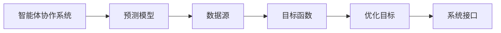
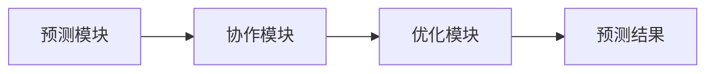
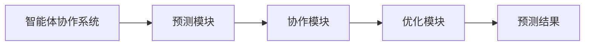
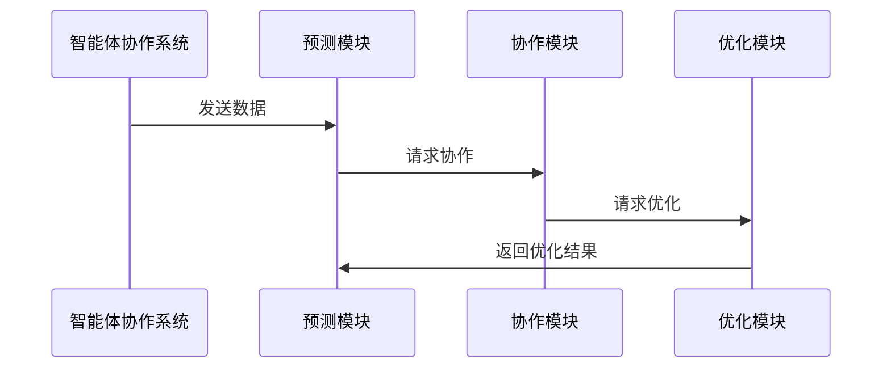

                 


# AI智能体协作：提升长期价值预测的准确性

## 关键词：AI智能体协作，长期价值预测，智能体算法，系统架构，价值预测模型

## 摘要：本文探讨了AI智能体协作在提升长期价值预测准确性中的应用，分析了智能体协作的核心概念、算法原理、系统架构，并通过实际案例展示了如何通过智能体协作优化价值预测模型，实现更准确的长期预测。

---

## 第一部分：AI智能体协作概述

### 第1章：AI智能体协作概述

#### 1.1 智能体协作的基本概念

##### 1.1.1 智能体的定义与特征
智能体（Agent）是指能够感知环境、自主决策并执行任务的实体。智能体具备以下特征：
1. **自主性**：无需外部干预，自主完成任务。
2. **反应性**：能够实时感知环境并做出反应。
3. **协作性**：与其他智能体或系统协同工作，共同完成目标。

##### 1.1.2 智能体协作的定义与分类
智能体协作是指多个智能体通过共享信息、分工合作，共同完成复杂任务的过程。根据协作方式，可将智能体协作分为以下几类：
1. **基于任务的协作**：智能体根据任务分工，各自完成特定任务。
2. **基于知识的协作**：智能体通过共享知识和信息，共同优化决策。
3. **基于目标的协作**：智能体围绕共同目标，协调行动。

##### 1.1.3 协作智能体的典型应用场景
协作智能体广泛应用于多个领域，如：
- **金融领域**：智能体协作进行市场预测、风险评估。
- **医疗领域**：协作智能体用于诊断辅助、治疗方案优化。
- **交通领域**：智能体协作用于交通调度、自动驾驶。

#### 1.2 长期价值预测的背景与挑战

##### 1.2.1 价值预测的核心问题
价值预测是指通过分析历史数据和当前市场情况，预测未来某个时间点的价值。长期价值预测面临以下核心问题：
1. **数据稀疏性**：长期数据可能存在缺失或不完整的情况。
2. **不确定性**：市场环境复杂多变，预测结果存在不确定性。
3. **模型过拟合**：传统模型可能因数据分布变化导致预测误差增大。

##### 1.2.2 长期预测的难点与复杂性
长期预测的难点主要体现在：
1. **数据依赖性**：长期预测依赖于历史数据的准确性和完整性。
2. **模型鲁棒性**：模型需要具备较强的鲁棒性，以应对数据波动和突变。
3. **计算复杂性**：长期预测涉及大量数据和复杂计算，对计算资源要求较高。

##### 1.2.3 AI智能体协作在价值预测中的作用
AI智能体协作能够通过以下方式提升长期价值预测的准确性：
1. **分布式计算**：多个智能体协同计算，提高计算效率。
2. **知识共享**：智能体共享知识和信息，优化预测模型。
3. **动态调整**：智能体根据实时数据动态调整预测策略。

#### 1.3 本章小结
本章介绍了AI智能体协作的基本概念和其在长期价值预测中的重要性，指出了智能体协作的优势和应用场景。

---

## 第二部分：智能体协作的核心概念与联系

### 第2章：智能体协作的核心概念

#### 2.1 智能体协作的关键属性

##### 2.1.1 协作性
协作性是智能体协作的核心属性，体现在以下方面：
- **任务分配**：智能体根据自身能力和任务需求，自动分配任务。
- **信息共享**：智能体之间共享信息，避免信息孤岛。

##### 2.1.2 智能性
智能性是指智能体具备自主决策和问题解决的能力，主要体现在：
- **自适应性**：智能体能够根据环境变化调整行为。
- **学习能力**：智能体能够通过经验改进预测模型。

##### 2.1.3 动态性
动态性是指智能体协作过程中，环境和任务需求不断变化。智能体需要具备动态调整协作策略的能力。

#### 2.2 智能体协作的实体关系分析

##### 2.2.1 实体关系图（ER图）
以下是智能体协作的ER图：

```mermaid
er
  actor 智能体协作系统
  actor 预测模型
  actor 数据源
  actor 目标函数
  actor 约束条件
  actor 优化目标
  actor 系统接口
```

##### 2.2.2 协作流程分析
协作流程如下：



#### 2.3 智能体协作的核心要素对比表

| 对比维度 | 协作智能体 | 传统算法 |
|----------|------------|-----------|
| 可扩展性 | 高          | 较低       |
| 知识共享 | 高          | 低         |
| 并行计算 | 高          | 低         |
| 灵活性    | 高          | 较低       |

#### 2.4 本章小结
本章详细分析了智能体协作的关键属性、实体关系及核心要素，为后续章节的算法设计奠定了基础。

---

## 第三部分：长期价值预测的数学模型与算法原理

### 第3章：长期价值预测的数学模型

#### 3.1 预测模型的构建与优化

##### 3.1.1 时间序列分析模型
时间序列分析模型通过分析历史数据的时序特征，预测未来值。常用模型包括：
1. **ARIMA模型**：适用于线性时间序列数据。
2. **LSTM模型**：适用于非线性时间序列数据。

##### 3.1.2 基于回归的预测模型
回归模型通过建立自变量与因变量之间的关系，预测未来值。常用模型包括：
1. **线性回归模型**：适用于线性关系。
2. **非线性回归模型**：适用于非线性关系。

##### 3.1.3 贝叶斯网络模型
贝叶斯网络模型通过概率推理，预测未来值。其优势在于能够处理不确定性问题。

#### 3.2 协作智能体的算法原理

##### 3.2.1 基于博弈论的协作算法
博弈论算法通过模拟多个智能体之间的博弈过程，找到最优策略。例如，纳什均衡理论在协作决策中的应用。

##### 3.2.2 分布式计算与并行优化
分布式计算通过将任务分解到多个智能体，实现并行计算，提高计算效率。

##### 3.2.3 联合学习（Federated Learning）
联合学习是指多个智能体在不共享数据的前提下，通过交换模型参数，共同优化预测模型。

#### 3.3 数学公式与模型实现

##### 3.3.1 时间序列预测公式
$$
y_{t} = a \cdot y_{t-1} + b \cdot x_{t} + c
$$

##### 3.3.2 协作智能体联合优化公式
$$
\theta^{(i+1)} = \theta^{(i)} + \alpha \cdot \nabla L_{i}
$$

#### 3.4 本章小结
本章介绍了长期价值预测的数学模型和协作智能体的算法原理，为后续章节的系统设计提供了理论基础。

---

## 第四部分：智能体协作的系统架构与设计

### 第4章：智能体协作的系统架构

#### 4.1 系统功能设计

##### 4.1.1 预测模块
预测模块负责接收输入数据，运行预测模型，输出预测结果。

##### 4.1.2 协作模块
协作模块负责协调多个智能体的协作，实现任务分配和信息共享。

##### 4.1.3 优化模块
优化模块负责根据预测结果，动态调整协作策略，优化预测模型。

#### 4.2 系统架构设计

##### 4.2.1 系统功能模块
系统功能模块如下：



##### 4.2.2 系统架构图
系统架构图如下：



##### 4.2.3 系统接口设计
系统接口设计需要考虑以下几点：
1. **数据接口**：定义数据输入和输出格式。
2. **算法接口**：定义算法调用接口。
3. **通信接口**：定义智能体之间的通信协议。

##### 4.2.4 系统交互序列图
系统交互序列图如下：



#### 4.3 本章小结
本章详细设计了智能体协作系统的架构，为实际应用提供了参考。

---

## 第五部分：项目实战

### 第5章：项目实战

#### 5.1 环境安装与配置

##### 5.1.1 安装Python环境
需要安装Python 3.8以上版本，并安装以下库：
```bash
pip install numpy pandas scikit-learn tensorflow
```

##### 5.1.2 安装协作智能体框架
安装协作智能体框架，例如：
```bash
pip install multi-agent-system
```

#### 5.2 核心代码实现

##### 5.2.1 预测模块实现
预测模块代码如下：
```python
import numpy as np
from sklearn.linear_model import LinearRegression

def predict_value(data):
    model = LinearRegression()
    model.fit(data[['t-1']], data['y'])
    return model.predict(data[['t']])
```

##### 5.2.2 协作模块实现
协作模块代码如下：
```python
import multi_agent_system as mas

def collaborate_agents(data):
    agent = mas.Agent('Predictor')
    agent.receive_data(data)
    agent.collaborate()
    return agent.results
```

##### 5.2.3 优化模块实现
优化模块代码如下：
```python
import tensorflow as tf

def optimize_model(data):
    model = tf.keras.Sequential([
        tf.keras.layers.Dense(64, activation='relu'),
        tf.keras.layers.Dense(1)
    ])
    model.compile(optimizer='adam', loss='mean_squared_error')
    model.fit(data['x'], data['y'], epochs=100)
    return model
```

#### 5.3 案例分析与结果解读

##### 5.3.1 数据准备
准备长期价值预测数据，例如股票价格数据。

##### 5.3.2 代码运行
运行上述代码，观察预测结果和优化效果。

##### 5.3.3 结果分析
分析预测结果与实际值的差异，评估模型的准确性。

#### 5.4 项目总结
本项目通过协作智能体实现了长期价值预测，验证了智能体协作的有效性。

---

## 第六部分：总结与展望

### 第6章：总结与展望

#### 6.1 本章总结
本文详细探讨了AI智能体协作在长期价值预测中的应用，分析了智能体协作的核心概念、算法原理和系统架构，并通过实际案例展示了协作智能体的优势。

#### 6.2 最佳实践 tips
1. **数据预处理**：确保数据的完整性和准确性。
2. **模型优化**：定期更新模型，适应数据变化。
3. **系统维护**：及时修复系统漏洞，确保协作顺利进行。

#### 6.3 未来展望
未来，随着AI技术的发展，智能体协作将在更多领域得到应用，长期价值预测的准确性将进一步提升。

---

## 作者：AI天才研究院

---

# 结语
本文通过系统化的分析和实践，展示了AI智能体协作在提升长期价值预测准确性中的巨大潜力。希望本文能为相关领域的研究者和实践者提供有价值的参考和启发。

